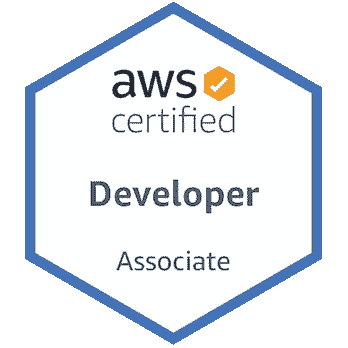

# 如何成为 AWS 云开发者认证

> 原文：<https://betterprogramming.pub/how-to-become-aws-cloud-developer-certified-7318a67f7085>

## 我是如何在只有很少 AWS 经验的情况下在短短六周内获得认证的

在 [Unsplash](https://unsplash.com/s/photos/amazon?utm_source=unsplash&utm_medium=referral&utm_content=creditCopyText) 上由 [Daniel Eledut](https://unsplash.com/@pixtolero2?utm_source=unsplash&utm_medium=referral&utm_content=creditCopyText) 拍摄的照片。

如果你点击了这篇文章的链接，你很可能正在考虑参加 AWS 云开发者认证考试。如果你还没想好，现在是你想好的时候了！

我最近刚刚通过了我的 AWS 云开发者认证，说实话，还不算太差。有了适当的准备和学习工具，你将毫无问题地获得认证。

在开始准备这次考试之前，我很少接触 AWS。六周后，我获得了认证。

为了准备这次考试，我查阅了无数的资料，我告诉你哪些有用，哪些没用，这才公平。

一些资源将是免费的，而另一些则需要付费。我通常是免费资源的忠实拥护者，但是在这个领域，你需要为你得到的东西付费。每一分钱都是值得的。如果没有付费资源，该认证可能需要几个月才能获得。

你很幸运找到了这篇文章，因为它将改变你的生活！

# 目标

帮助您通过 AWS 云开发人员认证考试。

图片来自 [AWS](https://aws.amazon.com/certification/) 。

# 目录

*   [为什么你应该获得认证](#dd1f)
*   [资源](#3dd3)
*   [我的考试小技巧](#5de8)
*   [采取行动](#5838)

# 你为什么要获得认证

我认为这是一个难以置信的学习机会，事实证明也确实如此。在这六个星期里，我对作为一名 IT 界的开发人员应该知道的一切有了一个全面的了解。

所有内容都涉及基础设施、架构、开发、部署、监控、无服务器计算、安全性、最佳实践等。关于你能从这个认证中得到什么，这个清单还在继续。

对于 IT 界的几乎所有服务，AWS 都有自己的版本。举个例子，由于 AWS 提供的标准队列服务(SQS ),我能够理解 Kafka 是如何工作的。

如果学习的刺激对你来说还不够，AWS 认证助理和专业人员的平均工资远远超过 10 万美元。当然，认证不等于能力，但这肯定是一个好的开始。

# 资源

我尝试了很多学习资源。一对夫妇被证明是非常有价值的。我会按照有用的顺序把它们列出来。

## ACloudGuru

你可以在 Udemy 上购买该课程作为[课程，也可以通过 ACloudGuru 学习门户网站购买。我在 Udemy 上花 13 美元买的。等着它打折吧——你不会想花 150 美元的。](https://www.udemy.com/course/aws-certified-developer-associate/)

对我来说，一个 CloudGuru 是一个完美的起点。他们会进行讲座和动手实验，这些内容丰富，会让你保持兴趣。

他们也尽力保持他们的内容是最新的。由于自动气象站的格局在不断变化，寻找当前的资源可能是一个挑战。课程最后的“学生反馈”部分是必不可少的。

在我学习这门课程的过程中，有一个方法很管用，那就是先看部分摘要，然后再看所有的讲座。这种技巧有助于你专注于每堂课最关键的部分。

ACloudGuru 课程带来了社区。这是最好的资产之一。他们有一个论坛，人们在那里谈论他们的考试经历。如果不是这样，我永远也不会发现教程道场。

这里有一个[论坛帖子的例子](https://acloud.guru/forums/aws-cda-2018/discussion/-LjuLWkfOkhaljvz2AKS/successfully_passed_the_aws_de)，很有帮助。一定要确保你阅读的是最新的帖子！

## 教程道场

[这个资源](https://portal.tutorialsdojo.com/courses/aws-certified-developer-associate-practice-exams/)，和一个 CloudGuru 一起，会让你完成一半的路程。如果你已经有了 AWS 的经验，光是这个资源就足以让你做好准备。

Tutorials Dojo 提供了大约 260 个练习题，这些练习题明确地集中在与本次考试相关的主题上。

包裹大约 15 美元，这是我花过的最值的 15 美元。

Tutorials Dojo 不仅为您提供了大量的问题，还提供了令人难以置信的详细解释，说明为什么每个答案都是这个样子。

此外，它们还提供了相关 AWS 文档和备忘单的链接，有助于进一步解释这些概念。

## AWS 认证开发者官方学习指南

这个学习指南在我准备的早期阶段特别有帮助。它帮助我从概念上理解了许多核心服务。

这种资源的真正价值是内容的可消化性。它的写作方式提供了极好的技术深度和最小的模糊性。AWS 文档和白皮书有时可能有点难以理解。这份学习指南提供了一个抽象层，没有遗漏任何细节。

然而，我要说的是，自 2018 年出版以来，这本学习指南中的一些复习问题已经有点过时了。但是没有所谓的浪费知识。知道这些真好。有时，了解历史背景会对当前的思想和方法有更深的理解。

我可以通过我在工作中订阅的 O'Reilly Learning 免费得到这个。如果你没有这个，在亚马逊上是 33 美元。如果你不想花这笔钱，不用担心。没有它你仍然可以成功。

此外，O'Reilly 学习门户网站通过 Pearson 提供了一个很好的实践考试。我强烈建议去看看。

## AWS 文档和白皮书

如果你曾经对某个特定的主题或概念感到困惑，最好的方法是从源头上消除这种困惑。

AWS 文档和白皮书是您可以找到的最新资源。我之前列出的所有材料都直接来自这里。

我发现“最佳实践”部分是最有用的。

[这个](https://docs.aws.amazon.com/lambda/latest/dg/best-practices.html)，对于 Lambda 来说，负责考试上的两道题。幸运的是，我在考试前通读了这篇文档！

永远警惕你从其他来源读到的任何 API 调用或限制。由于 AWS 总是在变化，这些值也会变化。2016 年推荐的一个 API 调用现在可能被弃用。极限也是如此。AWS Lambda 函数过去的最大执行时间是 5 分钟，现在是 15 分钟。

文档是获得这类内容的最新信息的最佳地方。

## AWS 材料

我支付了模拟考试的费用，这主要是为了确保我学习了正确的内容。20 个问题 20 美元。值得吗？也许不是，但它给了我安排考试所需的信心。

您在练习考试中看到的问题与教程 Dojo 包中的问题非常相似。

同样，他们也不会告诉你哪些问题你做错了。他们只是给你每个部分的百分比(类似于他们如何呈现真实考试的结果)。

这个资源对我也很有帮助:[考试准备:AWS 认证开发人员—助理](https://www.aws.training/Details/Curriculum?id=19185)。它从不同的角度介绍了 AWS 核心服务以及类似于您在考试中可能会看到的练习题。

我不会说这些资源中的任何一个是在考试中取得好成绩的“必要条件”，但是看到对内容的不同观点总是好的。这直接来自考试的创造者。

# 我的考试技巧

学习，学习，学习你的核心服务！

我建议学习所有关于 IAM、Lambda、API Gateway、S3、DynamoDB、SNS & SQS、Step Functions、ECS、SAM、Kinesis、X-Ray、CloudFormation、CloudFront、CloudWatch、EC2 以及每一个 CI/CD 工具的知识。您的大部分问题将围绕这些服务(注意对无服务器服务的强调)。

确保你所学的是最新的。我怎么强调都不为过。我花了很多时间学习与 2018 版考试相关的概念。直到买了教程 Dojo 练习考试，我才意识到我在学习无关的内容。所以要小心你所花的时间！

情景类型的问题很大。这将测试您对特定服务或服务集合以及它们如何协同工作的全面了解。这更多的是一种应用理解，所以死记硬背在这里帮不了你。

了解你的 API。许多问题来自于“我使用哪个 API 来做这件事？”格式。这要么来自多年的经验，要么来自对 API 文档的研究。如果你不能马上认识他们，就很难做出有根据的猜测。

这就是我敦促你尽可能多地获得实践经验的原因。虽然我自己没有使用过这个资源，但是我听说 Qwiklabs 在这方面很棒。

了解所有关于 CloudWatch 的知识，以及如何将其用于您的内部应用程序。

安全性在这次考试中也发挥了重要作用。了解 IAM、Cognito、STS、VPCs、子网、安全组、网络 ACL 等。在这次考试中取得好成绩是必不可少的。

# 采取行动

现在怎么办？你[报名](https://aws.amazon.com/certification/)并通过考试！

考试费用是 150 美元，你现在可以选择在自己家里参加考试。确保你去洗手间之前，因为他们不允许你离开你的工作超过两个小时。

祝你好运！如果您有任何问题、意见或顾虑，请随时留下您的回复，我会尽快回复您。