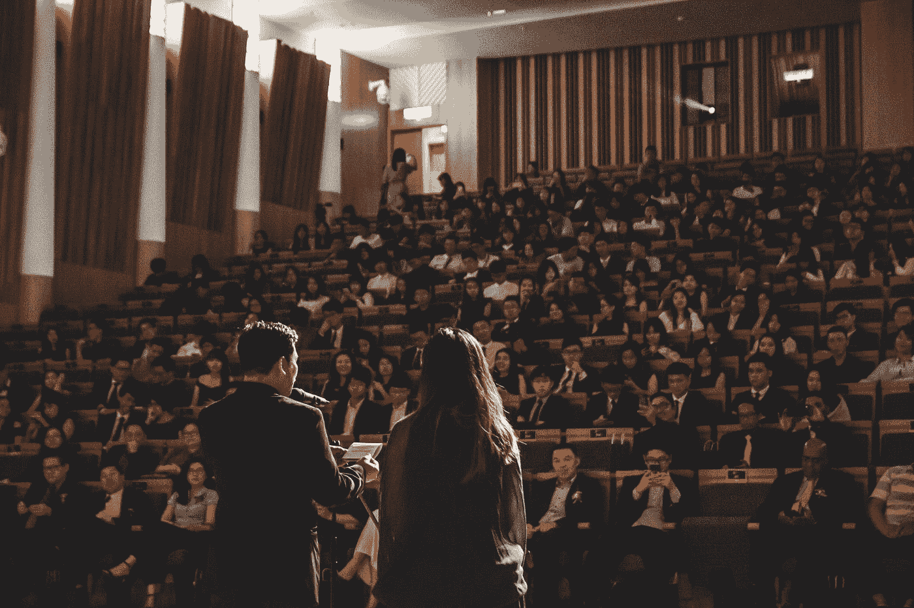

# 一位讨厌公开演讲的工程师如何让自己变得更自在

> 原文：<https://betterprogramming.pub/how-to-become-more-comfortable-speaking-publicly-from-an-engineer-who-hated-it-ea525e73ecfa>

## 开始成为一名成功的公众演说家的 5 个技巧

在 [Unsplash](https://unsplash.com?utm_source=medium&utm_medium=referral) 上[万圣业](https://unsplash.com/@wansan_99?utm_source=medium&utm_medium=referral)拍摄的照片

如果你和我一样——一想到要向观众展示就手心出汗——我希望本文中的建议能有所帮助。

使用下面的建议，我成功地从避免公开演讲(甚至在我必须演讲的日子里打电话请病假)到能够定期向 30 多人演讲。

# 为什么公开演讲对你的职业生涯很重要？

根据你的愿望，你可能需要定期向观众做报告。以我作为一名工程师的经验来看，你几乎可以升到高级职位，然后你就会在职业生涯中碰上一堵墙而无法展示自己。我想更上一层楼，升到工程师，但我缺乏公开演讲能力，这阻碍了我。

你升到高年级的速度也会受到影响。我真的相信，如果我在职业生涯中早点学会如何表达，我会更快升到高年级。因此，我的第一条建议是尽可能早地开始，这样当展示成为必要时，你已经适应了。

缺乏公开演讲最终会阻碍你的原因很简单:能见度。无论对错，获得认可的最佳方式之一就是展示——无论是展示你的想法和建议，还是展示你所做的一些工作，这对你的晋升和职业发展都是非常有价值的。

那么，如何开始公众演讲呢？

# 远程呈现

在世界进入疫情时代之前，大多数人都在办公室工作，因此需要亲自出席。如果你一开始就不喜欢演讲，或者在这方面经验有限，站在众人面前的额外压力会让整个经历变得更糟。

随着向弹性工作制的转变，即使你开始回到办公室，当你需要展示一些东西的时候，也可以考虑在家工作——我向你保证，这比面对面工作压力要小得多。

首先，你甚至可以隐藏与会者，只让你的幻灯片出现在屏幕上，从本质上来说，这就像你没有真正向任何人演示一样。当你感觉更舒服时，让与会者在屏幕上可见，这样你就可以习惯人们在你演讲时看着你。

请记住，如果你选择亲自演示，在远程演示后，你将需要做出调整，例如提高你的声音。然而，在熟悉了远程演示之后，当面演示会容易得多，因为远程演示会增加你演示的信心。

# 从小处着手

对于生活中的大多数冒险来说，从小处着手是明智的建议，但在公众演讲中尤其有价值。最初，我考虑在全技术论坛上演讲(我公司有 50 多人参加),但我无法让自己这么做，纯粹是因为害怕和担心我的演讲会很糟糕。

相反，我开始向我的团队介绍，这是一群我相对比较了解的人，我在这里很自在。你可以从非常小的事情开始，比如在你团队的细化会上出示门票。这可能不是人们想到公开演讲时会想到的，但这是一个很好的起点。还有其他好的候选人可以介绍给你的团队，例如，你做过的有趣的工作，拉请求等。

# 专注于你熟悉的话题

这一条很好地延续了上一条建议——专注于你非常熟悉的话题会减轻你对演讲的担忧。你经常需要提出一个想法或建议，这是一项需要学习的重要技能，但我建议从你非常熟悉的话题开始，因为与与会者的互动较少。

提升你的团队成员是一个很好的方法，当你变得更加自信时，再提升你团队之外的同事。简单地选择一个你很熟悉的话题，其他人会有兴趣听到更多，并提出来。

这也是开始与与会者互动的好方法——他们可能会有问题，但会是你非常熟悉的话题，所以不应该太令人生畏！

# 利用演讲者笔记

直到最近，我才了解到[演讲者注释](https://support.google.com/docs/answer/1696787?hl=en-GB&co=GENIE.Platform%3DDesktop)，特别是你可以在单独的屏幕上保留注释的同时向观众展示幻灯片。

这意味着你可以把你想说的写在演讲者的笔记上，并且在你演讲的时候几乎照原样阅读。首先，它可能看起来有点机械，所以试着用它们作为要点的指南，但是最初只是阅读你的演讲者笔记是完全合理的，直到你更适应处理笔记中的指针。

# 多向自己展示

在我向观众展示任何东西之前，我会向自己展示很多次。就像听起来那样，你把幻灯片放在屏幕上，假装你正在演示。

在开始的几次运行中，我会在每张幻灯片后调整我的演讲者笔记，我发现在一周内练习 3-5 次是正确的。我发现，在第三或第四遍的时候，我确切地知道我想说什么，演讲进行得很流畅，我不会笨嘴拙舌。

# 摘要

这些是我开始成为一名更好的公众演说家的最佳建议。单靠这些建议不会在一夜之间奏效，你仍然需要练习，这需要一些时间。然而，他们真的帮助了我，我希望他们也能帮助你！

> 希望扩展您的技术知识，但不确定阅读什么？我办了一份免费的时事通讯，提供两周一次的技术书籍推荐，包括我从书中获得的关键信息。感兴趣吗？在这里报名吧！