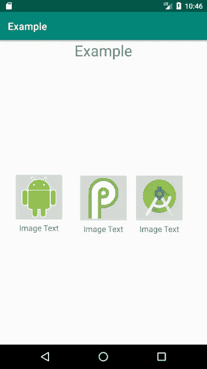
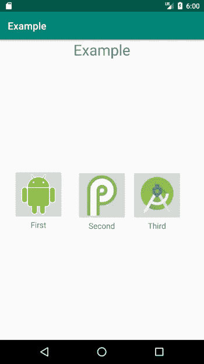

# 如何在 Android 中绑定数据

> 原文：<https://betterprogramming.pub/how-to-bind-data-in-android-bbb1e180a928>

## 如果做得好，让你的 Android 应用对数据绑定更加敏感

照片由 [Robert Bye](https://unsplash.com/@robertbye?utm_source=medium&utm_medium=referral) 在 [Unsplash](https://unsplash.com?utm_source=medium&utm_medium=referral) 上拍摄

数据绑定是一种技术，当您想要将信息片段(您的数据)粘合到一些可视用户输入元素时使用。在这个过程中，每当输入更新时，其背后的数据也会更新。这远不是一个新概念，有太多的框架已经将这一点融入到它们的设计中(AngularJS/React/Vue)。在本文中，我们关注的不是前端框架，而是移动环境。谷歌在 Android 中引入了[数据绑定库](https://developer.android.com/topic/libraries/data-binding)，它是 [Android Jetpack](https://developer.android.com/jetpack) 的一部分。

如果你对 Jetpack 库套件不熟悉，可能是因为 [Google 已经宣布](https://developer.android.com/topic/libraries/support-library)它将停止开发其支持库，转而支持 AndroidX 库(这是支持库的新版本)。

我知道有很多文章解释了如何使用适配器来使用数据绑定，但是这篇文章不会关注这个问题。相反，我将展示一种最基本、最简单的数据绑定方法，它可以通过减少您必须编写的代码量来节省您的时间。

# 为什么要使用数据绑定？

如果您还没有被说服，让我们花几分钟时间通过展示一个例子来解释使用数据绑定的好处。假设您有一个带有三个自定义按钮的菜单，其中每个按钮都是一个布局。

我们的布局

生成所有这些内容的一种方法是使用四种不同的 XML 布局:一种用于主布局，一种用于三个按钮。

您需要这样做，因为每个按钮会将用户引导到应用程序的不同部分，因此需要不同的文本和不同的图像。

按钮的布局

当然，这并没有太多的代码重复，因为我们只处理三种布局。但是如果你仔细想想，处理这些代码是非常浪费时间的。如果您考虑一个具有更复杂布局的应用程序，一个可能展示产品及其图像的应用程序，这可能会导致大量乏味的代码复制。

通过数据绑定，我们将设法只创建一个供所有按钮使用的 XML 布局。

# 我们从哪里开始？

我们需要让我们的项目支持数据绑定，为此，我们需要在应用程序的`build.gradle`文件中添加`dataBinding`元素:

build.gradle

在同步我们的项目之后，我们将创建我们的数据类，我们将用它来绑定布局。

ButtonData.kt

请注意，在我们的`ButtonData`类中有两个字段:

*   `buttonText` —这是将显示在我们图像下方的文本。
*   `buttonImageSrc` —这负责按钮的图像。

如果我们想要更多的数据，我们只需在数据类中添加更多的字段。

# 实际绑定

接下来，我们需要在布局中声明一个变量属性，以便可以使用它。这个变量将绑定到我们创建的数据类。为此，我们需要做两件事:

*   将我们的根布局元素包装在布局标签中。
*   添加一个包含变量声明的数据标签(`buttonData`)。

activity_main.xml

注意，我们可以将模式从先前的主布局中移除，因为它被移动到了根布局标记中。此外，我们添加的变量直接绑定到我们的数据类。

在我们的`MainActivity`文件中，我们需要添加代码来处理绑定:

主活动. kt

每次在布局内部创建变量时，都会自动为该布局生成一个绑定类。在我们的例子中，我们的布局被称为`activity_main`，因此绑定类将被命名为`ActivityMainBinding`。

约定始终是布局的名称，并在末尾添加了绑定。

因为我们在布局中将`buttonData`声明为我们的变量，所以它被附加到绑定对象上，我们可以为它分配一个`ButtonData`类的新实例。

完成所有这些之后，我们终于可以在布局中使用刚刚绑定的数据了。

使用绑定变量 buttonData

结果是:

很顺利，是吧？

# 等一下…

我们有三个按钮，而我们的数据类只能用于一个按钮，那么我们如何解决这个问题呢？

我们需要创建一个新的数据类`ButtonData`，来保存一个`ButtonData`对象的列表。

ButtonsData.kt

我们必须覆盖`get`方法，因为当我们在布局中使用它时需要识别它。

然后，我们需要更改`activity_main.xml`中的引用:

我们更改了变量名和类以匹配 ButtonsData

我们必须为新的数据类创建一个新的绑定:

主活动. kt

我们创建了三个`ButtonData`类的实例。然后我们实例化一个`ButtonsData`对象，并将其附加到我们的绑定对象。

最后，我们现在可以在布局中正确使用我们的数据类了:

一个元素的用法示例

非常管用

## 资源

*   https://github.com/TomerPacific/LaundrySymbols

感谢阅读！