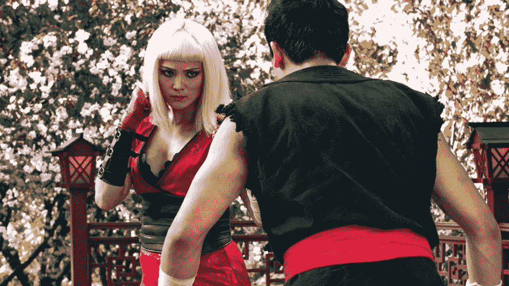
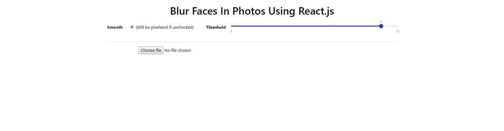
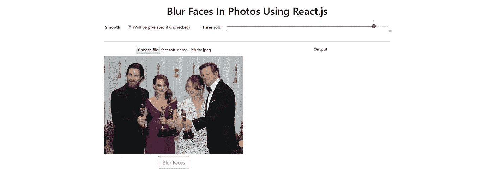
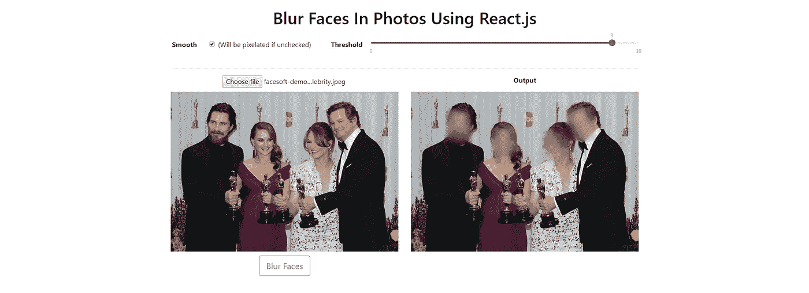
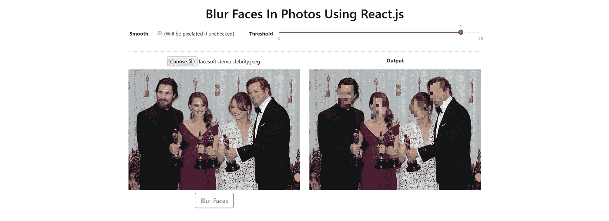

# 如何使用 React 模糊照片中的人脸

> 原文：<https://betterprogramming.pub/how-to-blur-faces-in-photos-using-react-7186c4784d22>

## 一步一步的教程给你的用户一些隐私



```
Repo: [https://github.com/shango44/blur-faces-using-react](https://github.com/shango44/blur-faces-using-react)
```

模糊图像/视频中的人脸的行为被称为人脸编辑，这在 GDPR/隐私时代非常重要。本教程应该很容易理解，因为它使用了 create-react-app 并解释/注释了代码。

让我们直入主题吧！

# 1.设置

## 创建 React 应用

```
npx create-react-app blur-faces
```

我们将使用 create-react-app 来生成 react 项目。

## 安装依赖项

```
cd blur-facesnpm install bootstrap reactstrap react-input-range canvas facesoft 
--save
```

*   Reactstrap: React Bootstrap 4 组件
*   反应输入范围:范围滑块
*   Canvas:节点 JS 的 Canvas 实现
*   Facesoft:人脸检测 API

## 清楚的

删除 src 文件夹中的文件“app.test.js”、“logo.svg”和“serviceWorker.js”。

修改以下文件:

**index.js** —导入引导程序&移除服务人员

```
import React from 'react';
import ReactDOM from 'react-dom';
import 'bootstrap/dist/css/bootstrap.min.css';
import './index.css';
import App from './App';ReactDOM.render(<App />, document.getElementById('root'));
```

**App.css** —删除一些类

```
.App {
  text-align: center;
}.App-header {
  background-color: #ffffff;
  flex-direction: column;
  align-items: center;
  justify-content: center;
  font-size: calc(10px + 2vmin);
  color: #000;
  padding: 20px 0px;
}
```

**App.js** —默认 React 组件

```
import React,  { Component } from 'react';
import './App.css';export default class App extends Component {
  render() {
    return (
      <div className="App">
      </div>
    )
  }
}
```

# 2.App.js 设置

这个文件是我们控制模糊系统的状态和渲染组件的地方。

## 导入依赖项

将以下代码添加到导入中。

```
import Facesoft from 'facesoft';
import { Container, Row, Col, Button, Input, Label } from 'reactstrap';
import InputRange from 'react-input-range';
import 'react-input-range/lib/css/index.css';
```

## 构造器

```
constructor(props) {
  super(props);

  this.state = {
    threshold: 9,
    image: {},
    data: [],
    smooth: true,
  } this.facesoft = new Facesoft("INSERT_API_KEY");
}
```

在我们州:

*   阈值:控制模糊(0 =无| 10 =完全模糊)
*   图像:存储上传的图像 URI，宽度和高度
*   数据:存储面部检测 API 数据
*   平滑:如果为假，那么我们将像素化而不是模糊

[点击此处免费获取人脸检测 API 密匙](https://facesoft.io/signup.html) (API 密匙登录后可在仪表盘中找到)。

## 提供；给予

```
render() {
  const { image, threshold, data, smooth } = this.state

  return (
    <div className="App">
      <header className="App-header">
        <h1>Blur Faces In Photos Using React.js</h1>
      </header><Container>
        <Row className="justify-content-md-center">
          <Col md="1">
            <strong>Smooth</strong>
          </Col>
          <Col md="3">
            <Label>
              <Input
                type="checkbox"
                id="cb-4"
                checked={smooth}
                onChange={e => this.setState(
                  { smooth: e.target.checked }
                )}
              />
              (Will be pixelated if unchecked)
            </Label>
          </Col>
          <Col md="1">
            <strong>Threshold</strong>
          </Col>
          <Col md="7">
            <InputRange
              step={0.25}
              maxValue={10}
              minValue={0}
              value={threshold}
              onChange={threshold => this.setState({ threshold })}
            />
           </Col>
           <Col md="12" style={{paddingTop: 20}}>
             <hr></hr>
           </Col>
         </Row>
         <Row>
           <Col md="6">
             <div className="uploaded-image">
               <input
                 type="file"
                 accept="image/x-png,image/gif,image/jpeg"
               />
               {
                  image.hasOwnProperty("uri") &&
                    
               }
             </div>
             {
               image.hasOwnProperty("uri") &&
                 <Button 
                   outline
                   color="primary" 
                   size="lg" 
                 >
                   Blur Faces
                 </Button>
             }
           </Col>
           <Col md="6"></Col>
         </Row>
       </Container>
     </div>
   )
}
```

上面的代码将为良好的 UI 添加输入和文本，如果您执行“npm start ”,现在应该会看到下面的内容。



# 3.App.js 函数

现在，我们要添加两个函数。一个用于更改和设置图像上传，一个用于检测和检索上传照片中的人脸。

## 处理变更

在构造函数后添加此更改事件。接下来我们将把它分配给我们的文件输入，这样我们就可以检索图像了。

```
handleChange(event) {
  if(event.target.files.length < 1) return

  const scope = this;
  const uri = URL.createObjectURL(event.target.files[0]);
  const img = new Image();
  img.src = uri;
  img.onload = () => {
    scope.setState({
      image: {
        uri,
        width: img.width,
        height: img.height
      }
    })
  }
}
```

在我们的输入中，让我们将 handle change 事件分配给 onChange。

```
<input
  onChange={this.handleChange} // ADD THIS
  type="file"
  accept="image/x-png,image/gif,image/jpeg"
/>
```

## 手柄点击

在这个函数中，我们将使用 [Facesoft API](https://facesoft.io) 从文件输入中传递图像 URI 来获得面轴和尺寸，这样我们就可以操作它。

```
handleClick(event) {
  this.facesoft.detectFromURL(this.state.image.uri)
    .then(result => this.setState({data: result}))
    .catch(error => console.log(error))
}
```

我们将把句柄点击功能分配给模糊面孔按钮的 onClick 方法。

```
<Button 
  onClick={this.handleClick} // ADD THIS
  outline 
  color="primary" 
  size="lg"
>
  Blur Faces
</Button>
```

## 有约束力的

在我们开始实际的模糊机制之前，让我们绑定函数，这样我们就可以访问我们的 API 和 setState。添加到构造函数中。

```
this.handleChange = this.handleChange.bind(this);
this.handleClick = this.handleClick.bind(this);
```

# 4.模糊！

我们在这一步要做的是创建另一个文件，我们将 App.js 中的状态传递给它，这样我们就可以模糊照片中的人脸，然后返回一个画布。

## blurFaces.js

在 src 文件夹中，创建一个名为 blurFaces.js 的新文件，并添加以下代码。

```
import React, { Component } from 'react';
import { createCanvas, loadImage } from 'canvas';export default class BlurFaces extends Component {
  componentDidUpdate(prevProps) {
  }

  render() {
    const { width, height } = this.props.image;

    return (
      <div>
        <p><strong>Output</strong></p>
        <canvas
          ref="canvas"
          width={width}
          height={height}
          style={{maxWidth: "100%", maxHeight: "auto"}}
        />
      </div>
    )
  }BlurFaces.defaultProps = {
  image: {
    uri: "",
    width: 0,
    height: 0
  },
  threshold: 0,
  data: [],
  smooth: true
}
```

上面的代码导入了 createCanvas 和 loadImage，这是必要的，因为我们的模糊/像素化技术将涉及使用多个隐藏画布。

在渲染时，我们返回一个画布，我们已经引用了我们的画布，所以我们可以在 componentDidUpdate 中访问它，这是添加模糊代码的地方。默认的道具在那里，所以错误不会发生。

## 获取面孔方法

由于来自面部检测 API 的数据返回基于左上和右下的面部坐标，我们可以将它映射到 x，y，宽度和高度，这样以后事情就容易多了。将下面的代码添加到类中。

```
getFaces(data) {
  return data.map(face => ({
    x: face.upperLeft.x,
    y: face.upperLeft.y,
    w: face.lowerRight.x - face.upperLeft.x,
    h: face.lowerRight.y - face.upperLeft.y
  }))
}
```

## 组件已更新

让我们转到 componentDidUpdate，开始创建变量和语句。这些语句用于检测是否不存在人脸检测数据，以及用户是否没有点击模糊按钮。

```
componentDidUpdate(prevProps) {
  const { image, threshold, data, smooth } = this.props; // If no data
  if(data.length < 1) return; // Output Canvas and Context
  const outputCanvas = this.refs.canvas;
  const outputCtx = outputCanvas.getContext('2d'); // Hidden Canvas and Context
  const hiddenCanvas = createCanvas(image.width, image.height);
  const hiddenCtx = hiddenCanvas.getContext('2d');

  // If data, threshold and smooth is the same then clear and return     (user has not clicked blur) if(
    JSON.stringify(prevProps.data) === JSON.stringify(data) &&     
    prevProps.threshold === threshold && 
    prevProps.smooth === smooth
  ) {
    outputCtx.clearRect(0,0, image.width, image.height);
    return;
  }
  // NEXT CODE WILL BE ADDED HERE
}
```

## 加载图像

我们将使用 loadImage 方法并传入我们的图像 URI 来访问上传的照片。

```
// Load Image
loadImage(image.uri).then((newImage) => {
  // NEXT CODE WILL BE ADDED HERE}).catch(err => {
  console.log(err)
})
```

## 虚化

步骤:

1.  创建一个根据阈值模糊的完整图像的画布
2.  使用 API 数据中的坐标从模糊图像中提取人脸
3.  创建一个空白画布，并添加模糊的面孔
4.  创建一个新的画布，并绘制模糊的面部画布，以应用羽化技术
5.  清除可见的画布并在上面绘制上传的图像
6.  在可见的画布上绘制模糊的羽化的脸

我们将有一个 if 语句来检测 smooth 复选框是否被选中。然后，我们将初始化两个画布来创建模糊图像的反转遮罩(用于羽化)。我们还会将全局复合操作更改到目的地来创建羽化(参见 [globalCompositeOperation](https://developer.mozilla.org/en-US/docs/Web/API/CanvasRenderingContext2D/globalCompositeOperation) )。

```
if(smooth){
  // New canvases for applying blurring and feathering (canvases for inverted mask of blurred images) const imaskCanvas = createCanvas(image.width, image.height);
  const imaskCtx = imaskCanvas.getContext('2d');
  const imaskCanvas2 = createCanvas(image.width, image.height);
  const imaskCtx2 = imaskCanvas2.getContext('2d'); // Set global composite operation to destination in
  imaskCtx.globalCompositeOperation = "destination-in"; // NEXT CODE WILL BE ADDED HERE
}
```

## 在空白画布上绘制模糊的面孔

在这里，我们将利用两个画布——一个用于上传图像，但根据阈值进行了模糊处理，另一个是空白画布，我们在其中添加了模糊的人脸。

对于每个循环，我们将修改阈值，因为宽度小的面部数据在像素量高的情况下不会很好地模糊，而宽度越大，需要的模糊量就越多。

此外，当把图像数据放到空白画布上时，由于羽化，我们修改了轴和尺寸。

```
this.getFaces(data).forEach((face, i) => {
  // Determine the blur amount by width of face
  let blurAmount = threshold if(face.w >= 300) blurAmount = threshold*2.5
  else if(face.w <= 30) blurAmount = threshold*0.25 // Add blur filter  
  hiddenCtx.filter = `blur(${blurAmount}px)`; // Draw original image to hidden canvas
  hiddenCtx.drawImage(newImage, 0, 0, image.width, image.height); // Add blurred faces to blank canvas
  imaskCtx.putImageData(hiddenCtx.getImageData(
    face.x-10, 
    face.y-10, 
    face.w+20, 
    face.h+20), 
    face.x-10, 
    face.y-10
  ) 
})// NEXT CODE WILL BE ADDED HERE
```

## 创建羽化，然后显示到可视画布上

通过使用阴影模糊，然后在一个新的画布上绘制模糊的脸，并重复这个过程，它创建羽化。

```
 // Draw blurred faces onto 2nd inverted mask canvas
  imaskCtx2.drawImage(imaskCanvas, 0, 0);
  imaskCtx2.shadowColor = "black"; // Required for feathering
  imaskCtx2.shadowBlur = 30;
  imaskCtx2.globalCompositeOperation = "destination-in"; // Feathering
  imaskCtx2.shadowBlur = 20;
  imaskCtx2.drawImage(imaskCanvas,0,0);
  imaskCtx2.shadowBlur = 10;
  imaskCtx2.drawImage(imaskCanvas,0,0); // Clear visible canvas then draw original image to it and then add the blurred images
  outputCtx.clearRect(0,0, image.width, image.height);
  outputCtx.drawImage(newImage, 0, 0);
  outputCtx.drawImage(imaskCanvas2, 0, 0);
} // NEXT CODE WILL BE ADDED HERE
```

## 像素分解

1.  对隐藏的画布应用像素化样式。
2.  禁用隐藏画布上下文的平滑。
3.  通过阈值计算缩放的宽度和高度(较高的阈值=较小的宽度/高度)。
4.  用缩放的宽度和高度将上传的图像绘制到隐藏的画布上。
5.  拉伸缩放后的图像以匹配实际的图像宽度和高度。
6.  清除可见的画布并在上面绘制上传的图像。
7.  对于每个循环，从像素化画布中提取面，并将其绘制在可见画布的顶部。

让我们从改变样式和修改上下文选项开始。

```
else {
  hiddenCanvas.style.cssText = 'image-rendering: optimizeSpeed;' +
  'image-rendering: -moz-crisp-edges;' + // FireFox
  'image-rendering: -o-crisp-edges;' +  // Opera
  'image-rendering: -webkit-crisp-edges;' + // Chrome
  'image-rendering: crisp-edges;' + // Chrome
  'image-rendering: -webkit-optimize-contrast;' + // Safari
  'image-rendering: pixelated; ' + // Future browsers
  '-ms-interpolation-mode: nearest-neighbor;'; // IE // Use nearest-neighbor scaling when images are resized instead of the resizing algorithm to create blur hiddenCtx.webkitImageSmoothingEnabled = false;
  hiddenCtx.mozImageSmoothingEnabled = false;
  hiddenCtx.msImageSmoothingEnabled = false;
  hiddenCtx.imageSmoothingEnabled = false; // NEXT CODE WILL BE ADDED HERE
}
```

现在是时候创建上传图像的像素化版本，并将其绘制到我们隐藏的画布上。

```
// We'll be pixelating the image by threshold
let percent = 0;// Set threshold to 9.8 if it's 10 so the blurred faces aren't rendered white
threshold === 10 ?
  percent = 1 - (9.8 / 10):
  percent = 1 - (threshold / 10);// Calculate the scaled dimensions
const scaledWidth = image.width * percent;
const scaledHeight = image.height * percent;// Render image smaller
hiddenCtx.drawImage(newImage, 0, 0, scaledWidth, scaledHeight);// Stretch the smaller image onto larger context
hiddenCtx.drawImage(hiddenCanvas, 0, 0, scaledWidth, scaledHeight, 0, 0, image.width, image.height);// NEXT CODE WILL BE ADDED HERE
```

最后要做的事情是清除可见的画布，并在其上绘制原始图像，然后在其上绘制像素化的面孔。

```
 // Clear visible canvas and draw original image to it
  outputCtx.clearRect(0,0, image.width, image.height);
  outputCtx.drawImage(newImage, 0, 0); // Draw pixelated faces to canvas
  this.getFaces(data).forEach(face =>  
    outputCtx.putImageData(
      hiddenCtx.getImageData(
        face.x, 
        face.y, 
        face.w, 
        face.h
      ), 
      face.x, 
      face.y
    )
  )
}
```

## 我们差不多完成了

最后要做的是返回 App.js，导入“blurFaces.js”并将其添加到状态中的渲染传递中。

```
import BlurFaces from './blurFaces';
```

在我们的“App.js”渲染中的最后一列()；在其中添加代码。

```
<BlurFaces
  image={image}
  threshold={threshold}
  data={data}
  smooth={smooth}
/>
```

## **让我们来测试一下**

上传图像:



点按“模糊面孔”:



取消选中平滑:



您可以右键单击模糊/像素化的图像来保存它，或者您可以创建一个导出功能。

享受把这个融入你的下一个项目的乐趣，做伟大的事情！

如果你喜欢这个，看看我的使用 HTML & JS 的[人脸验证教程](https://medium.com/better-programming/how-to-set-up-face-verification-the-easy-way-using-html5-javascript-5301235e495f)