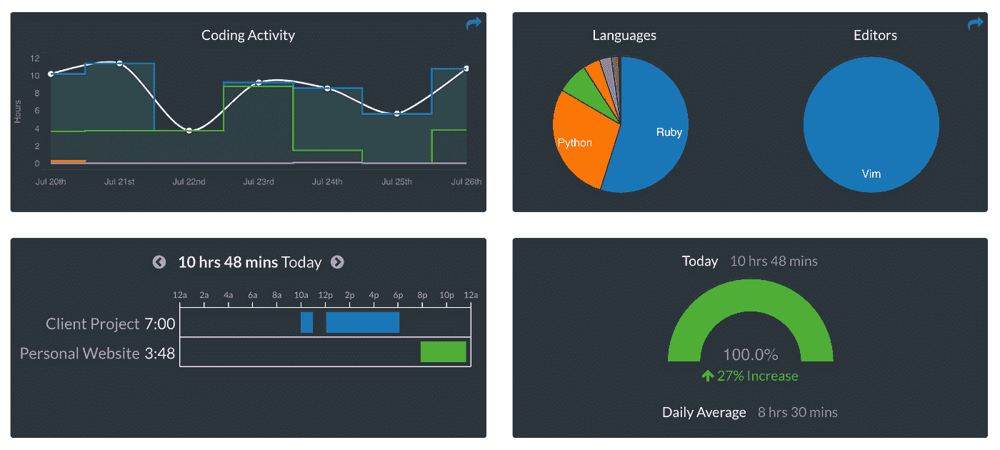

# 如何提高你的编码和打字速度

> 原文：<https://betterprogramming.pub/how-to-boost-up-your-coding-typing-speed-e5c035a6eb3d>

## 为什么你应该投资于你的打字速度和熟练程度

图片来源:[https://www.ratatype.com/learn/](https://www.ratatype.com/learn/)

# 提高你的编码速度

你可能想要构建一个非常好的项目，如果你想比平常更快地完成它，你可能想要提高你的编码速度。

## 写代码之前先思考一下

在开始写代码之前，预先考虑你想要解决或完成什么可能是你能做的最重要的事情。慢慢来，试着理解你需要构建什么，你想在代码中实现的关键点是什么。

写任何代码之前先思考会让你犯更少的错误。当您确切地理解问题是什么时，您可以在编码时花更少的时间考虑接下来的步骤。

阿尔伯特·爱因斯坦有一句名言:

> “如果我有一个小时来解决一个问题，我会花 55 分钟思考问题，花 5 分钟思考解决方案。”

# 提高你的打字速度

提高你的打字速度对提高你的编码速度有很大的影响。如果你习惯了电脑的键盘，你可以用得更快。练习对于习惯你的键盘非常重要。

有一些练习应用程序你可以用来尝试提高你的键盘技能，例如，【keybr.com】的[。你可以通过那个网站应用一些实践。完成它们，看看你打字速度的进步。](https://www.keybr.com/)

有一些图表可以帮助你在某些领域使用所有的手指。这可能很难在开始时应用，但迟早你会比以前写得更快。

## 习惯您的 IDE

试着理解你最喜欢的 IDE 的快捷方式。那会大大提高你的打字速度。

下面是一些流行的 IDE 快捷方式列表。试着经常使用它们来提高你的打字速度。

*   [VSCode 快捷键](https://code.visualstudio.com/docs/getstarted/keybindings)
*   [Vim 快捷键](https://vim.rtorr.com/)
*   [网络风暴快捷方式](https://www.jetbrains.com/help/webstorm/mastering-keyboard-shortcuts.html)
*   [崇高的快捷方式](https://www.shortcutfoo.com/app/dojos/sublime-text-3-win/cheatsheet)
*   [原子快捷方式](https://atom.io/packages/atom-shortcuts)
*   [括号快捷键](https://github.com/adobe/brackets/wiki/Brackets-Shortcuts)

如果您觉得需要更改您习惯的默认快捷键，您可以查看您的 IDE 设置，并根据需要进行更改。不要害怕改变它们，因为键绑定只是为了帮助你。

## 将编程作为一种爱好

毫无疑问，提高编码速度的最重要的事情之一就是越来越多的练习。

有一件事你可以做，它肯定会以一种有趣而又好的方式提高你的打字和编码速度:找到你想构建的辅助项目，并尝试自己制作它们。当你练习的时候，搜索你想要的并构建你的应用程序。

将编程作为一种爱好也可以提高你的代码知识。如果你对你想写的东西有更多的经验，这些练习会帮助你思考问题。

在空闲时间练习还能让你在问题出现之前就发现可能的错误和解决问题的方法。

## 解决编码挑战

解决编码挑战可能有助于你更快地编程。这些挑战中的一些需要特定的时间来执行你的程序。

不要忘记:如果你的代码运行得更快，你就可以更快地测试它，这有助于你构建更健壮的应用程序。

编码挑战也教授新的算法以及如何在应用中使用它们。当你扩展关于算法的知识时，你肯定会减少思考你需要什么或者如何构建代码的时间。

您可以在下面找到一些在线编码挑战。

*   [TopCoder](https://www.topcoder.com/challenges/?pageIndex=1)
*   [科德比特](https://www.coderbyte.com/)
*   [项目欧拉](https://projecteuler.net/)
*   [黑客排名](https://www.hackerrank.com/domains)
*   [厨师长](https://www.codechef.com/)
*   [练习 io](https://exercism.io/)
*   [代码大战](https://www.codewars.com/)
*   [LeetCode](https://leetcode.com/)
*   [SPOJ](http://www.spoj.com/)
*   [编码名称](https://www.codingame.com/)

## 阅读开源项目代码

阅读开源项目肯定会帮助你理解这些库背后的东西，并使你能够像项目维护者一样使用相同的方法。

尝试理解他们试图通过编程实现的目标，并尝试在日常编程技能中使用。

您可以从搜索以前使用过的库或希望在下一个项目中使用的库开始。找到项目源代码，并尝试理解它们是如何工作的。

你可以查看 GitHub 趋势项目，开始四处看看。如果您想要改进其中的一个，您可能想要为这个库创建一个 pull 请求。相信我，许多开发人员喜欢别人看到他们的代码并加以改进。

*   [Github 趋势项目](https://github.com/trending)

## 监控你的进度

你可以通过追踪你的时间来监控你的进度。有一些很棒的应用程序你可以使用，或者你可以自己写。

有一个流行的编码过程跟踪应用叫做 [Wakatime](https://wakatime.com/) ，

跟踪你的进展将帮助你了解你最有效的工作方式。通过将你的过程按时间段划分，并为这些项目设定一些目标，你可以很容易地保持跟踪。这肯定会让你对自己的编码习惯更有信心。

图片来源: [Wakatime](https://github.com/marketplace/wakatime)

*如果你觉得这篇文章很有帮助，你* [***可以通过使用我的推荐链接注册一个***](https://medium.com/@melihyumak) **[***中级会员来访问类似的***](https://melihyumak.medium.com/membership) *。***

***跟我上*** [**推特**](https://twitter.com/hadnazzar)

在 Youtube[上订阅更多内容](https://www.youtube.com/c/TechnologyandSoftware?sub_confirmation=1)

# 编码快乐！

梅利赫