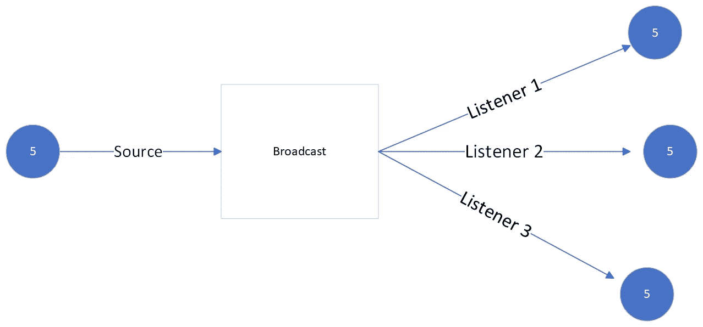

# 如何用 Golang 向多个听众广播频道

> 原文：<https://betterprogramming.pub/how-to-broadcast-messages-in-go-using-channels-b68f42bdf32e>

## 在 GO 中，一个通道不能同时向几个监听器发送数据。了解如何用可靠的模式实现这一点


保罗·艾纳汉德在 [Unsplash](https://unsplash.com/photos/Dy6a8sLrVl4?utm_source=unsplash&utm_medium=referral&utm_content=creditCopyText) 上的照片

通道是 Golang 中并发编程的关键组件。它们提供了一种清晰的方式来在不同的围棋程序之间进行交流。

它们的工作是同步和允许发送者和接收者之间的通信。一种常见的模式是使用它们在发送者和接收者之间执行一对一的通信。

在某些情况下，我们可能希望将消息从一个通道传递给多个侦听器。这种行为通常被称为**广播。**



广播示例。作者图片

但是，在 Go 中，同一数据只能从一个通道中读取一次。在这种特殊情况下，这种行为是一种限制。

我们可以通过下面的例子看到这一点，其中两个 Go 例程监听同一个通道:

```
Listener 2: 1 
Listener 1: 2
```

由于运行时调度程序的随机性，我们无法预测上面代码的准确输出，它可能会给出:

```
Listener 2: 1 
Listener 2: 2
```

其中只有一个听众收到了消息。

# **播音原理**

因此，为了能够向多个侦听器发送相同的信息，我们有两个主要选项:

*   多次向源通道写信，确保每个侦听器都收到了消息。
*   只写入源通道一次，读取数据，然后复制数据，分别写入每个侦听器。

在本文中，我们采用了第二种方案来实现频道广播。

# **解决方案**

为简单起见，我们将认为所有通道都是整数类型。我们可以从使用以下方法定义接口开始:

```
type BroadcastServer interface {
  Subscribe() <-chan int
  CancelSubscription(<-chan int)
}
```

*   第一种方法将负责创建订阅源的新频道。
*   第二个方法将处理取消由前一个方法打开的订阅。

我们可以创建实现该接口的具体类型，并在工厂函数中实例化它(这意味着我们在内部创建结构，而不公开创建细节)。

混凝土类型`broadcastServer`内部有四个通道:

```
type broadcastServer struct {
  source <-chan int
  listeners []chan int
  addListener chan chan int
  removeListener chan (<-chan int)
}
```

*   来源:其他频道将要收听的数据源。
*   监听器:使用频道切片来接收广播消息
*   `addListerner`:将用于向`listeners`切片添加新通道的通道
*   `removeListener`:将用于从`listeners` 切片中移除项目的辅助通道。

`NewBroadcastServer`函数将负责创建广播服务器实例。它将处理适当取消的上下文和将要广播的源频道作为输入。

# **发球方法**

与广播业务逻辑相关的所有细节都在`serve`方法中运行。

总共，它将负责处理四项任务:

*   添加新的侦听器
*   移除监听器
*   从源广播数据
*   适当的清理。

for-select 结构有四种情况:

1.  等待上下文取消。
2.  通过将监听器追加到`listeners`片来添加新的监听器
3.  删除侦听器。假设切片中的顺序不重要，我们用切片的最后一个元素替换要移除的侦听器。然后，最后一个元素也被删除。
4.  处理广播逻辑。首先，它检查源代码是否仍然是开放的。然后，为了避免被未准备好接收的信道阻塞。我们还有另一个`for-select`语句，它一直监听上下文取消。

此外，有一个函数使用一个`defer`语句来执行清理任务，当我们不再需要运行广播服务时关闭所有的监听器。

# **工作示例**

让我们把它们放在一起，测试我们的广播服务器。

作为我们的数据源，我们将使用一个范围通道，它发送一个从 0 到值 **n.** 的整数流

在主功能中:

```
Listener 1: 1/10 
Listener 2: 1/10 
Listener 1: 2/10 
Listener 3: 1/10 
Listener 3: 2/10 
Listener 1: 3/10 
...Listener 1: 9/10 
Listener 1: 10/10 
Listener 2: 9/10 
Listener 2: 10/10 
Listener 3: 10/10
```

最后，每个侦听器都会收到一个从 0 到 9 的整数流(上面显示了 1 到 10，因为我们正在打印 **i+1** )

就在最后的`wg.Wait()`之前，我们可以从切片中移除一个监听器，并看到它将不再接收广播消息:

```
broadcaster.CancelSubscription(listener1)
```

因此:

```
Listener 3: 1/10 
Listener 3: 2/10 
Listener 2: 1/10 
Listener 2: 2/10 
Listener 2: 3/10 
Listener 3: 3/10 
Listener 3: 4/10 
Listener 2: 4/10 
Listener 2: 5/10 
Listener 3: 5/10 
Listener 3: 6/10 
Listener 3: 7/10 
Listener 2: 6/10 
Listener 2: 7/10 
Listener 3: 8/10 
Listener 3: 9/10 
Listener 2: 8/10 
Listener 2: 9/10 
Listener 2: 10/10 
Listener 3: 10/10
```

第一个侦听器不再接收任何数据，因为它已从广播服务器中删除并关闭。

# **结论和关键要点**

以下是本文总结的要点:

*   在 Golang 中，我们只能从一个频道读取一次相同的数据，默认情况下，它不会广播消息。
*   广播服务器作为客户端-服务器通信的本地版本工作，它处理不同的请求，例如:从收听者切片中添加或删除频道。
*   这种行为是通过使用一个带有正常关闭选项的`for-select`结构实现的，允许我们在不再需要广播的情况下关闭侦听器。
*   这种模式只通过两种方法公开一个公共接口:`Subscribe`和`CancelSubscription` **。**我们可以创建不同的广播公司来处理其他类型的商业逻辑。