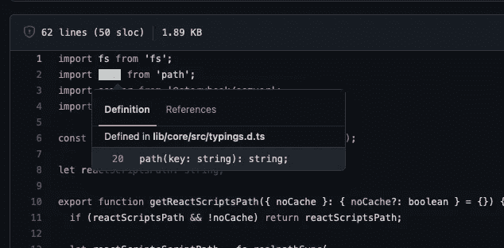
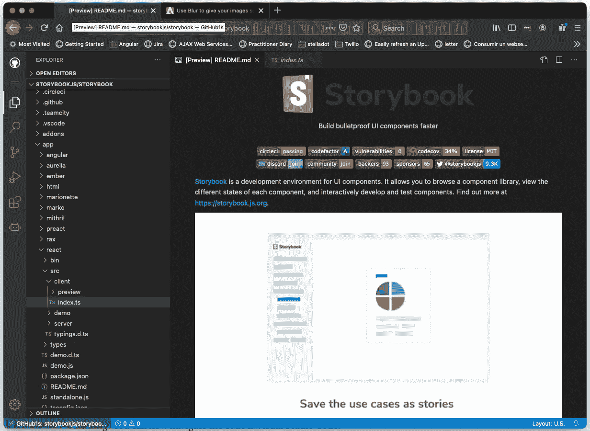
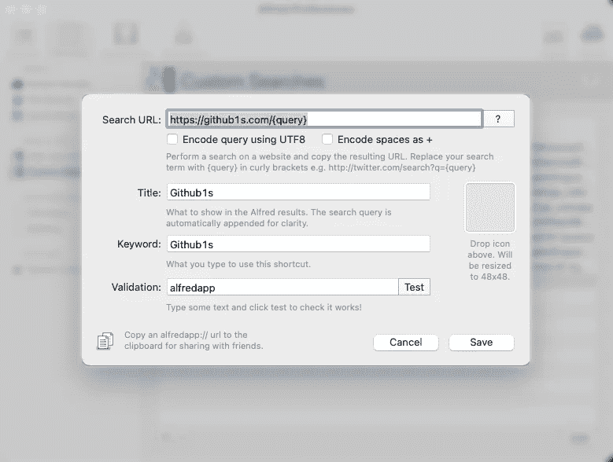

# 如何用 VSCode 即时浏览 GitHub Repos

> 原文：<https://betterprogramming.pub/how-to-browse-github-repos-instantly-with-vscode-de7055480de8>

## 使用 Visual Studio 代码编辑器在一秒钟内阅读 GitHub 代码

照片由[潘卡杰·帕特尔](https://unsplash.com/@pankajpatel?utm_source=medium&utm_medium=referral)在 [Unsplash](https://unsplash.com?utm_source=medium&utm_medium=referral) 上拍摄

在 GitHub 中浏览项目是任何软件开发人员的日常任务。GitHub 很清楚这一点，并不断尝试通过一些新功能来改善网络体验。以下是最受欢迎的例子:

*   管理 GitHub 上的文件
*   GitHub 上的导航代码
*   创建新文件
*   将文件添加到存储库中
*   将文件移动到新位置
*   编辑存储库中的文件
*   编辑其他用户存储库中的文件
*   跟踪文件中的更改
*   删除存储库中的文件
*   重命名文件
*   获取文件的永久链接

这些功能非常酷，非常有用。然而，90%的时候我们只想浏览代码。

这就是 GitHub 构建导航代码功能的原因。它是如何工作的？它在内部使用`tree-sitter`。这是一个解析器生成器工具和一个增量解析库，用于生成语法树，允许您在文件之间导航。点击此处查看关于保姆的更多信息。

导航代码功能的使用示例

将鼠标悬停在变量上可以深入了解代码，并提供指向文件源代码的链接。这使得在同一个项目的文件之间导航变得容易。尽管很有帮助，但这还不够。它仍处于早期阶段，工具远非完美。

这意味着，您经常会下载一份回购协议，然后在您最喜欢的集成开发环境(IDE)中打开它。有些存储库比其他的更重，不得不下载源代码肯定感觉不对。

如果有其他方法呢？一种不需要下载任何存储库，并且仍然能够在一个有能力的 IDE 中浏览代码的方法？

# Github1s 前来救援

Github1s 是最近创建的。代表用 Visual Studio 代码编辑器读取 GitHub 代码一秒钟。它是做什么的？它允许您使用 Visual Studio 代码浏览 GitHub repo。

它是如何工作的？非常简单:只需将`1s`添加到 GitHub 域中。例如，如果您正在浏览 GitHub repo:

`[https://github.com/storybookjs/storybook](https://github.com/storybookjs/storybook)`

加上`1s`就变成了:

`[https://github**1s**.com/storybookjs/storybook](https://github1s.com/storybookjs/storybook)`

它适用于任何回购，你可以试试例子一[这里](https://github1s.com/storybookjs/storybook)。

让我们看看结果:

太神奇了！现在，您可以使用 Visual Studio 代码导航代码。但是请注意，您将无法更改文件、使用插件、调试代码或推送代码——它只是一个供您浏览代码的只读工具。

# 它是如何工作的？

Github1s 的灵感来自于 Code Server 项目，它允许你在任何机器上运行 VS 代码，并在浏览器中访问它。这怎么可能呢？是因为可以为浏览器构建 VS 代码。Github1s 基于 [VS 代码 1.52.1](https://github.com/microsoft/vscode/tree/1.52.1) 。

这个项目越来越受欢迎。13.4k 的星星。

它是如何更深入地工作的？让我们来看看他们的详细解释:

> “由于 VS 代码非常强大和灵活的可扩展性，我们可以使用 [FileSystemProvider API](https://code.visualstudio.com/api/references/vscode-api#FileSystemProvider) 轻松实现提供自定义文件 IO 能力的 VS 代码扩展。有一个名为 [vscode-web-playground](https://github.com/microsoft/vscode-web-playground) 的官方演示展示了它的使用方法。
> 
> 另一方面，GitHub 提供了强大的 [REST API](https://docs.github.com/en/rest) ，可以用于各种任务，当然包括读取目录和文件。
> 
> 根据以上，很明显，GitHub1s 的核心概念是使用 GitHub REST API 实现一个 VS 代码扩展(包括 FileSystemProvider)。
> 
> ….
> 
> GitHub1s 是一个纯静态的 web app(因为真的不需要后端服务吧？).所以我们现在只需要把它部署在 [GitHub Pages](https://pages.github.com/) (这个库的`*gh-pages*`分支)上，而且是免费的。GitHub1s 的服务可能是可靠的(GitHub 非常可靠),因为没有人需要支付虚拟主机费用。"
> 
> —github.com/conwnet/github1s

从描述中可以看出，这是可靠的，因为他们只使用静态页面消费 GitHub 的端点。但是，当您使用他们的 API 时，请记住这一点:

对于未经认证的请求，GitHub 的速率限制允许每小时最多 60 个请求。

对于使用身份验证的 API 请求，每小时最多可以发出 5，000 个请求。

# 自动化流程

有几个工具可以用来自动化您的日常任务。我的首选是阿尔弗雷德·T2。这是一个用于 macOS 的生产力应用程序，通过热键、关键字和文本扩展来提高您的效率。

我们可以很容易地创建一个命令，这样它就可以为我们打开 Github1s。让我们看看如何创建快捷方式:

*   打开阿尔弗雷德
*   搜索**偏好**
*   转到**自定义搜索**选项卡
*   点击`+`按钮
*   添加**别名+名称+网址**

作者阿尔弗雷德截图

现在您可以使用您的 Alfred 别名来访问 github1s 的功能了！

作者截图

# 结论

GitHub 将试图在未来填补这一生产力缺口。它可能会继续增强其导航代码功能，或者可能会包含自己的 IDE。谁知道呢？未来总是令人兴奋的。

在我们等待更好的内部替代方案时，我们可以使用 GitHub1s。它简单、可靠，使用起来非常直观。与必须在本地下载代码相比，这是一个巨大的进步。对我来说，一旦尝试了，就再也回不到以前的做事方式了。

我希望您发现该工具很有用，它将成为您的日常伴侣。

干杯！