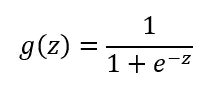
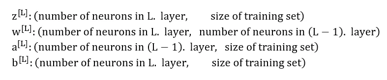
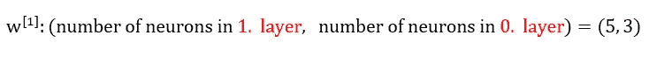
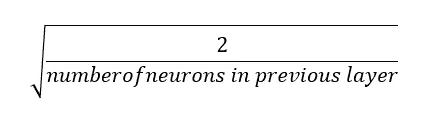
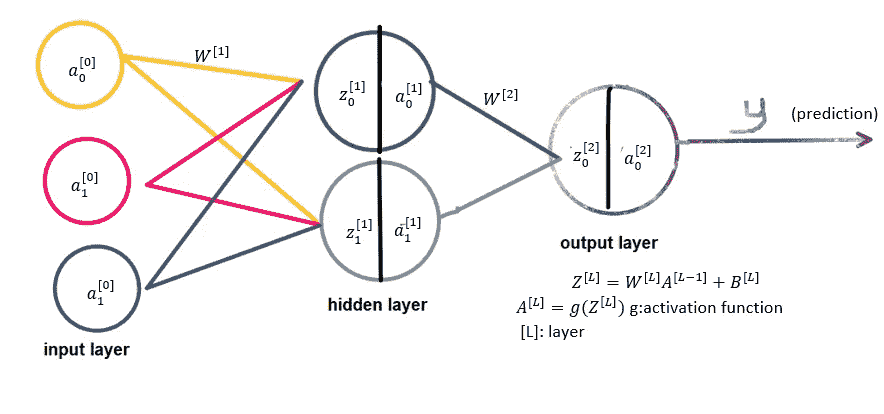
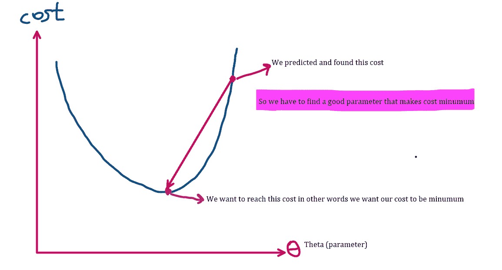
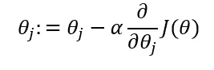
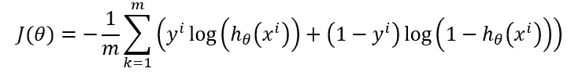
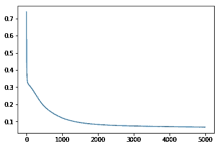

# 使用 Python 从头开始构建第二层神经网络

> 原文：<https://betterprogramming.pub/how-to-build-2-layer-neural-network-from-scratch-in-python-4dd44a13ebba>

## 关于建立人工智能网络的深入教程


由 [Unsplash](https://unsplash.com?utm_source=medium&utm_medium=referral) 上的 [Clarisse Croset](https://unsplash.com/@herfrenchness?utm_source=medium&utm_medium=referral) 拍摄的照片

AI 粉丝你好！我很兴奋能和你分享如何建立一个有隐藏层的神经网络！跟随我们，让我们开始吧！

# 导入库

本教程唯一需要的库是 NumPy。

```
*import* numpy *as* np
```

# 激活功能

在隐藏层，我们将使用 tanh 激活函数，在输出层，我将使用 sigmoid 函数。很容易找到关于 sigmoid 函数和 tanh 函数图的信息。我不想用解释来烦你，所以我只是实现它。



乙状结肠函数。下面给出了这个函数的代码。

```
*def* sigmoid(*x*):
    *return* (1 / (1 + np.exp(-*x*)))
```

# 设置参数

什么是参数和超参数？参数是权重和偏差。超参数在学习开始前影响参数和。一开始完全正确地设置超参数不是一件容易的事，您需要修补和调整您的值。学习率、迭代次数和正则化率等等都可以被认为是超参数。

想知道如何设置矩阵的大小？答案就在下面！



这一切意味着什么？例如:
(第 0 层所以 L = 0)输入层神经元数= 3
(第 1 层所以 L = 1)隐藏层神经元数= 5
(第 2 层所以 L = 2)输出层神经元数= 1



我希望这一切都有意义！让我们设置参数:

我们定义 W1、b1、W2 和 b2。如果你一开始就把你的偏见设为零，那也没什么坏处。但是，初始化权重时要非常小心。**千万不要**一开始就把权重设为零。到底为什么？好吧，如果你这样做了，那么在 Z = Wx + b 中，Z 永远是零。如果您正在构建一个多层神经网络，每一层中的神经元将表现为只有一个神经元。那么一开始我们如何初始化权重呢？我用**和*初始化他。***



公式

```
# Python implementation
np.random.randn(output_size, *hidden_size*)***np.sqrt(2/*hidden_size*)**
```

你不必用 ***贺初始化，*** 你也可以用这个:

```
np.random.randn(output_size, *hidden_size*)***0.01**
```

我建议在初始化参数时，不要将权重设置为零或很大的数字。

# **正向传播**



正向传播

上图应该能让你很好地理解什么是前向传播。Python 中的实现是:

为什么我们要存储{'Z1': Z1，' Z2': Z2，' A1': A1，' y': y}？因为我们将在反向传播时使用它们。

# 价值函数

我们只是观察正向传播，并得到一个预测( **y** )。我们用成本函数来计算。下图解释了:



更新参数

我们更新我们的参数，并找到最佳参数，使我们的最低可能成本。我不打算深究导数，但请注意，在上面的图表中，如果你在抛物线的右侧，导数(斜率)将为正，因此参数将减少并向左移动，接近返回最小成本的参数。在左侧，斜率将是负的，因此参数朝着我们想要的值增加。让我们看看我们将使用的成本函数:



价值函数

成本函数的 Python 代码:

# 反向传播

我们已经找到了成本，现在让我们回去，找到我们的权重和偏差的导数。在以后的文章中，我计划向您展示如何一步一步地推导它们。

`def backPropagation(*X*, *Y*, *params*, *cache*)`中的`params`和`cache`是什么？当我们使用前向传播时，我们存储值以便在后向传播时使用。Params 是参数(权重和偏差)。

# 更新参数

现在我们有了导数，我们可以使用下面的等式:


在该等式中，alpha (α)是学习率超参数。我们需要在学习开始前将其设置为某个值。学习率右边的项是导数。我们知道α和导数，让我们更新我们的参数。

# 关于循环的一切

我们需要运行许多迭代来找到返回最小成本的参数。让我们循环吧！

`Hidden_size` 表示隐藏层中神经元的数量。它看起来像一个超参数。因为你在学习开始前就设定好了！*`return params, cost_`*告诉我们什么。`params` 是我们找到的最佳参数，`cost_`只是我们每集估算的成本。**

# **让我们试试我们的代码！**

**使用 [**sklearn**](https://scikit-learn.org/stable/) 创建数据集。**

```
***import* sklearn.datasets
X, Y = sklearn.datasets.make_moons(n_samples=500, noise=.2)
X, Y = X.T, Y.reshape(1, Y.shape[0])**
```

**`X` 输入，`Y` 实际输出。**

```
**params, cost_ = fit(X, Y, 0.3, 5, 5000)**
```

**我把学习率设为 0.3，隐层神经元数设为 5，迭代次数设为 5000。**

**随意尝试不同的价值观。**

**让我们画一张图，展示成本函数如何随着每集而变化:**

```
***import* matplotlib.pyplot *as* plt
plt.plot(cost_)**
```

****

**答对了。我们做到了！**

> **first _ cost = 0.7383781203733911
> last _ cost = 0.063875631**

**完整代码:**

**感谢您的阅读！我希望这个教程是有帮助的！**