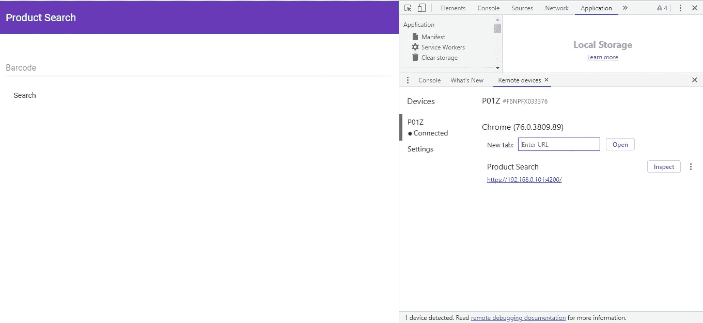
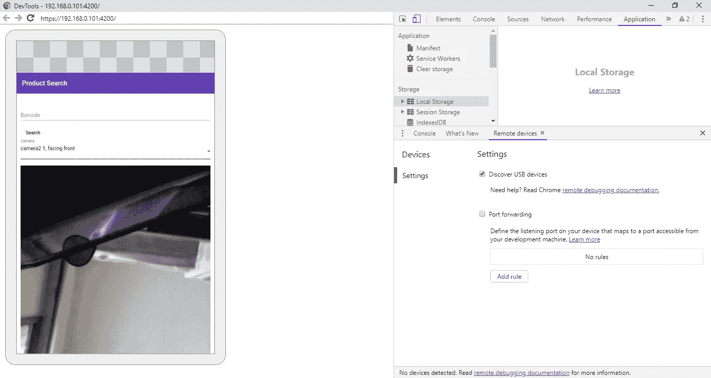
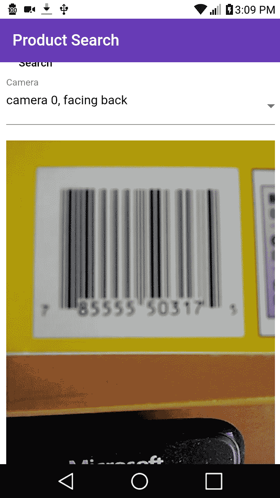
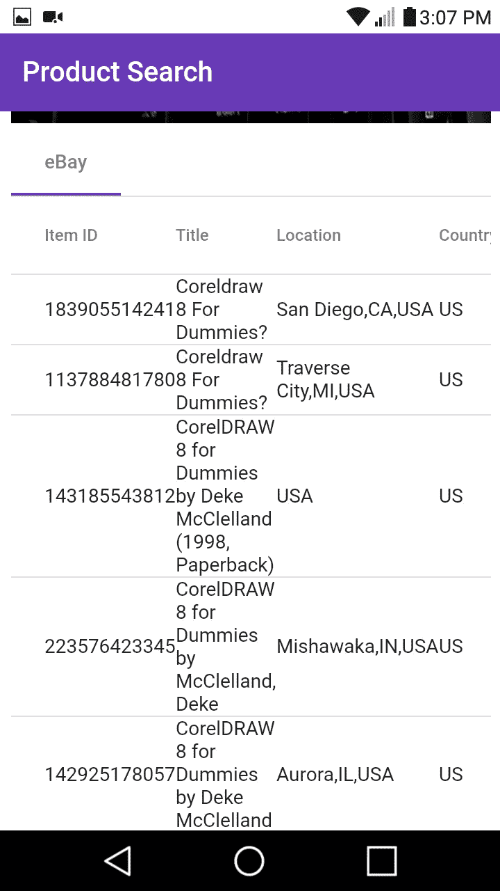

# 如何建立一个从易贝获取价格的条形码扫描仪应用程序

> 原文：<https://betterprogramming.pub/how-to-build-a-bar-code-scanner-app-that-gets-prices-from-ebay-8228fe26c029>

## 我们将构建一个 PHP 应用程序来查询易贝 API，然后我们将构建一个 web 应用程序来获取条形码并将其发送到我们的 API


[david pl](https://unsplash.com/@d_dandelion?utm_source=unsplash&utm_medium=referral&utm_content=creditCopyText) 在 [Unsplash](https://unsplash.com/search/photos/barcode?utm_source=unsplash&utm_medium=referral&utm_content=creditCopyText) 上拍摄的照片

易贝有一个免费的 API 来访问他们的列表数据，HTML 有一个摄像头 API 来通过网页从摄像头获取图像。这意味着我们可以创建应用程序，从您的 web 应用程序中扫描条形码，获取代码，并将其发送到易贝 API 进行查询。

在这个故事中，我们将构建一个 PHP 应用程序来查询易贝 API，然后我们将构建一个 web 应用程序来获取条形码并将其发送到我们的 API。后端很简单。这只是一个通过 ISBN 代码从易贝 API 获取数据的脚本。为后端应用程序创建一个文件夹，并放入以下内容:

```
<?php
use Symfony\Component\HttpFoundation\Request;
use Symfony\Component\HttpFoundation\Response;
use GuzzleHttp\Client;$ebay = $app['controllers_factory'];
$ebayAppId = $_ENV['EBAY_APP_ID'];
$client = new Client([    
    'base_uri' => '[http://svcs.ebay.com'](http://svcs.ebay.com')    
]);$ebay->get('/find-by-code/{code}/{page}', function ($code, $page) use ($app, $client, $ebayAppId) {  
    if (strlen($code) == 10 || strlen($code) == 13){
        $type = 'ISBN';
    }
    else if (strlen($code) == 12){
        $type = 'UPC';
    }
    else{
        return $app->json(['error' => 'invalid code'], 400);
    } if (!is_int(intval($page)) || $page <= 0){
        return $app->json(['error' => 'invalid page'], 400);
    }$response = $client->request('GET', "/services/search/FindingService/v1?OPERATION-NAME=findItemsByProduct&SERVICE-VERSION=1.0.0&SECURITY-APPNAME=$ebayAppId&RESPONSE-DATA-FORMAT=JSON&REST-PAYLOAD&paginationInput.entriesPerPage=10&productId.[@type](http://twitter.com/type)=$type&productId=$code&paginationInput.pageNumber=$page");    
    return $app->json(json_decode($response->getBody(), true));
});return $ebay;
```

我们称之为`ebay.php`。 `function ($code, $page) use ($app, $client, $ebayAppId)`部分允许路由访问外部变量，因为回调与外部变量在不同的范围内。

然后在`index.php`，我们把

```
<?php
require_once 'vendor/autoload.php';$app = new Silex\Application();
$dotenv = new Dotenv\Dotenv('.');
$dotenv->load();
$app->register(new JDesrosiers\Silex\Provider\CorsServiceProvider(), [
    "cors.allowOrigin" => "*",
]);$app['debug']= true;$app->get('/hello/{name}', function($name) use($app) {
    return 'Hello '.$app->escape($name);
});$app->mount('/ebay', include 'ebay.php');
$app["cors-enabled"]($app);
$app->run();
```

这样我们就可以进入我们的路线。

在`composer.json`中，我们把

```
{
    "require": {
        "silex/silex": "^2.0",
        "vlucas/phpdotenv": "^2.4",
        "jdesrosiers/silex-cors-provider": "~1.0",
        "guzzlehttp/guzzle": "~6.0"
    }
}
```

因此，如果安装了 Composer，我们可以运行`composer install`来安装我们的依赖项。

既然我们已经完成了后端。我们可以做前端。该应用程序将建立有角度的。我们用 Angular CLI 搭建了这个应用。我们运行`ng new frontend`来搭建应用程序。

与我们的典型应用程序唯一不同的是，HTTPS 需要访问相机，所以我们必须为我们的开发服务器生成我们自己的 HTTPS 证书。我们应该把`server.crt`和`server.key`文件和前端 app 文件放在同一个文件夹里。

我们的`angular.json`的`serve`部分应该有:

```
"serve": {
  "builder": "[@angular](http://twitter.com/angular)-devkit/build-angular:dev-server",
  "options": {
    "browserTarget": "frontend:build",
    "sslKey": "server.key",
    "sslCert": "server.cert"
  },
  "configurations": {
    "production": {
      "browserTarget": "frontend:build:production"
    },
    "mobile": {
      "browserTarget": "frontend:build:mobile"
    }
  }
},
```

在哪里

```
"sslKey": "server.key",
"sslCert": "server.cert"
```

应该引用您的证书路径。

然后，为了运行 Angular CLI 开发服务器，我们运行:

```
ng serve --ssl
```

当你进入 [https://localhost:4200，](https://localhost:4200,)你会在大多数浏览器中看到一个不安全的连接错误。单击继续继续。

如果你的摄像头在你的安卓设备上，我们可以远程调试。在 Chrome 中，按 F12 打开控制台，点击右上角带有三个垂直圆点的菜单。然后点击远程设备，将你的 Android 设备连接到你的电脑上，根据[指令](https://developers.google.com/web/tools/chrome-devtools/remote-debugging/)启用远程调试。

你不跑`ng serve --ssl`，而是跑`ng serve --ssl --host 0.0.0.0`

完成所有这些操作后，您应该会看到以下内容:



一旦应用程序构建完成。

我们安装了一个库，通过运行以下命令来访问设备的摄像头和我们的 flux store:

```
npm i @zxing/ngx-scanner @ngrx/store @angular/material @angular/cdk
```

在`app.module.ts`中，我们把:

```
import { BrowserModule } from '[@angular/platform-browser](http://twitter.com/angular/platform-browser)';
import { NgModule } from '[@angular/core](http://twitter.com/angular/core)';
import { ZXingScannerModule } from '[@zxing/ngx-scanner](http://twitter.com/zxing/ngx-scanner)';
import { BrowserAnimationsModule } from '[@angular/platform-browser](http://twitter.com/angular/platform-browser)/animations';
import { MatToolbarModule } from '[@angular/material](http://twitter.com/angular/material)/toolbar';
import { MatInputModule } from '[@angular/material](http://twitter.com/angular/material)/input';
import { MatButtonModule } from '[@angular/material](http://twitter.com/angular/material)/button';
import { MatTabsModule } from '[@angular/material](http://twitter.com/angular/material)/tabs';
import { MatCardModule } from '[@angular/material](http://twitter.com/angular/material)/card';
import { HttpClientModule } from '[@angular/common](http://twitter.com/angular/common)/http';
import { MatPaginatorModule } from '[@angular/material](http://twitter.com/angular/material)/paginator';
import { MatTableModule } from '[@angular/material](http://twitter.com/angular/material)/table';
import { MatSelectModule } from '[@angular/material](http://twitter.com/angular/material)/select';import { AppRoutingModule } from './app-routing.module';
import { AppComponent } from './app.component';
import { HomePageComponent } from './home-page/home-page.component';
import { StoreModule } from '[@ngrx/store](http://twitter.com/ngrx/store)';
import { barCodeReducer } from './bar-code-reducer';
import { FormsModule } from '[@angular/forms](http://twitter.com/angular/forms)';
import { EbayTabComponent } from './ebay-tab/ebay-tab.component';[@NgModule](http://twitter.com/NgModule)({
  declarations: [
    AppComponent,
    HomePageComponent,
    EbayTabComponent
  ],
  imports: [
    BrowserModule,
    AppRoutingModule,
    ZXingScannerModule,
    BrowserAnimationsModule,
    MatButtonModule,
    MatToolbarModule,
    MatInputModule,
    MatTabsModule,
    StoreModule.forRoot({ barCode: barCodeReducer }),
    FormsModule,
    MatCardModule,
    HttpClientModule,
    MatPaginatorModule,
    MatTableModule,
    MatSelectModule
  ],
  providers: [],
  bootstrap: [AppComponent]
})
export class AppModule { }
```

这包括了角材料成分和我们的通量储备。

现在，我们必须为我们的数据建立一个集中的存储。我们创建一个名为`bar-code-reducer.ts`的文件，并添加以下内容:

```
export const SET_BARCODE = 'SET_BARCODE';export function barCodeReducer(state: string = '', action) {
    switch (action.type) {
        case SET_BARCODE:
            return action.payload;
        default:
            return state;
    }
}
```

现在，我们可以添加前端组件了。我们运行:

```
ng g component ebayTab
ng g component homePage
```

这将添加显示我们的条形码扫描仪的页面和显示我们的易贝数据的部分。

接下来，我们创建一个服务，通过运行以下命令来创建 HTTP 请求:

```
ng g service productSearch
```

在那之后，我们应该有`produce-search.service.ts`。我们把以下内容放在那里:

```
import { Injectable } from '[@angular/core](http://twitter.com/angular/core)';
import { HttpClient } from '[@angular/common](http://twitter.com/angular/common)/http';
import { environment } from 'src/environments/environment';[@Injectable](http://twitter.com/Injectable)({
  providedIn: 'root'
})
export class ProductSearchService { constructor(
    private http: HttpClient
  ) { } searchProduct(barcode: string, currentPage: number) {
    return this.http.get(`${environment.apiUrl}/ebay/find-by-code/${barcode}/${currentPage}`)
  }
}
```

在`ebay-tab.component.ts`中，我们输入:

```
import { Component, OnInit } from '[@angular/core](http://twitter.com/angular/core)';
import { Store, select } from '[@ngrx/store](http://twitter.com/ngrx/store)';
import { Observable } from 'rxjs';
import { ProductSearchService } from '../product-search.service';
import { ConstantPool } from '[@angular/compiler](http://twitter.com/angular/compiler)';[@Component](http://twitter.com/Component)({
  selector: 'app-ebay-tab',
  templateUrl: './ebay-tab.component.html',
  styleUrls: ['./ebay-tab.component.css']
})
export class EbayTabComponent implements OnInit {barcode$: Observable<string>;
  barcodeValue: string;
  products: any[] = [];
  totalPages: number = 0;
  totalEntries: number = 0;
  entriesPerPage: number = 0;
  currentPage: number = 1;
  displayedColumns: string[] = [
    'itemId',
    'title',
    'location',
    'country',
    'shippingServiceCost',
    'currentPrice',
    'convertedCurrentPrice',
    'bestOfferEnabled',
    'buyItNowAvailable',
    'listingType'
  ];constructor(
    private store: Store<any>,
    private productSearchService: ProductSearchService
  ) {
    this.barcode$ = store.pipe(select('barCode'))
    this.barcode$.subscribe(barcode => {
      this.barcodeValue = barcode;
      this.products = [];
      this.searchProduct(this.barcodeValue, this.currentPage);
    }, err => {})
  }ngOnInit() {
  }searchProduct(barcodeValue, currentPage) {
    this.productSearchService.searchProduct(barcodeValue, currentPage)
      .subscribe((res: any) => {
        try {
          this.products = res.findItemsByProductResponse[0].searchResult[0].item as any[];          
          this.products = this.products.map(p => {
            let shippingServiceCost = p.shippingInfo[0].shippingServiceCost;
            let sellingStatus = p.sellingStatus;
            return {
              itemId: p.itemId,
              title: p.title,
              country: p.country,
              location: p.location,
              shippingServiceCost: Array.isArray(shippingServiceCost) ? `${shippingServiceCost[0]['__value__']} ${shippingServiceCost[0]['[@currencyId](http://twitter.com/currencyId)']}` : '',
              currentPrice: Array.isArray(sellingStatus) ? `${sellingStatus[0].currentPrice[0]['__value__']} ${sellingStatus[0].currentPrice[0]['[@currencyId](http://twitter.com/currencyId)']}` : '',
              convertedCurrentPrice: Array.isArray(sellingStatus) ? `${sellingStatus[0].convertedCurrentPrice[0]['__value__']} ${sellingStatus[0].convertedCurrentPrice[0]['[@currencyId](http://twitter.com/currencyId)']}` : '',
              bestOfferEnabled: p.listingInfo[0].bestOfferEnabled[0],
              buyItNowAvailable: p.listingInfo[0].buyItNowAvailable[0],
              listingType: p.listingInfo[0].listingType[0]
            }
          })
          this.totalPages = res.findItemsByProductResponse[0].paginationOutput[0].totalPages[0];
          this.totalEntries = res.findItemsByProductResponse[0].paginationOutput[0].totalEntries[0];
          this.entriesPerPage = res.findItemsByProductResponse[0].paginationOutput[0].entriesPerPage[0];
        }
        catch (ex) {
          this.products = [];
        }
      }, err => {
        this.products = [];
      })
  }getProducts(event) {
    this.currentPage = event.pageIndex + 1;
    this.searchProduct(this.barcodeValue, this.currentPage);
  }
}
```

在`ebay-tab.component.html`中，我们有:

```
<div *ngIf='products.length > 0'>
  <table mat-table [dataSource]="products" class="mat-elevation-z8">
    <ng-container matColumnDef="itemId">
      <th mat-header-cell *matHeaderCellDef> Item ID </th>
      <td mat-cell *matCellDef="let element"> {{element.itemId}} </td>
    </ng-container><ng-container matColumnDef="title">
      <th mat-header-cell *matHeaderCellDef> Title </th>
      <td mat-cell *matCellDef="let element"> {{element.title}} </td>
    </ng-container><ng-container matColumnDef="location">
      <th mat-header-cell *matHeaderCellDef> Location </th>
      <td mat-cell *matCellDef="let element"> {{element.location}} </td>
    </ng-container><ng-container matColumnDef="country">
      <th mat-header-cell *matHeaderCellDef> Country </th>
      <td mat-cell *matCellDef="let element"> {{element.country}} </td>
    </ng-container><ng-container matColumnDef="shippingServiceCost">
      <th mat-header-cell *matHeaderCellDef> Shipping Cost </th>
      <td mat-cell *matCellDef="let element"> {{element.shippingServiceCost}} </td>
    </ng-container><ng-container matColumnDef="currentPrice">
      <th mat-header-cell *matHeaderCellDef> Current Price </th>
      <td mat-cell *matCellDef="let element"> {{element.currentPrice}} </td>
    </ng-container><ng-container matColumnDef="convertedCurrentPrice">
      <th mat-header-cell *matHeaderCellDef> Converted Current Price </th>
      <td mat-cell *matCellDef="let element"> {{element.convertedCurrentPrice}} </td>
    </ng-container><ng-container matColumnDef="bestOfferEnabled">
      <th mat-header-cell *matHeaderCellDef> Best Offer Enabled </th>
      <td mat-cell *matCellDef="let element"> {{element.bestOfferEnabled}} </td>
    </ng-container><ng-container matColumnDef="buyItNowAvailable">
      <th mat-header-cell *matHeaderCellDef> Buy It Now </th>
      <td mat-cell *matCellDef="let element"> {{element.buyItNowAvailable}} </td>
    </ng-container><ng-container matColumnDef="listingType">
      <th mat-header-cell *matHeaderCellDef> Listing Type </th>
      <td mat-cell *matCellDef="let element"> {{element.listingType}} </td>
    </ng-container><tr mat-header-row *matHeaderRowDef="displayedColumns"></tr>
    <tr mat-row *matRowDef="let row; columns: displayedColumns;"></tr>
  </table><mat-paginator [length]="totalEntries" [pageSize]="entriesPerPage" (page)='getProducts($event)'>
  </mat-paginator>
</div>
<div *ngIf='products.length == 0' class="center">
  <h1>No Results</h1>
</div>
```

在`home-page.component.ts`中，我们放入:

```
import { Component, OnInit, ViewChild } from '[@angular/core](http://twitter.com/angular/core)';
import { Store } from '[@ngrx/store](http://twitter.com/ngrx/store)';
import { Observable } from 'rxjs';
import { SET_BARCODE } from '../bar-code-reducer';
import { NgForm } from '[@angular/forms](http://twitter.com/angular/forms)';
import { BarcodeFormat } from '[@zxing/library](http://twitter.com/zxing/library)';
import { ZXingScannerComponent } from '[@zxing/ngx-scanner](http://twitter.com/zxing/ngx-scanner)';[@Component](http://twitter.com/Component)({
  selector: 'app-home-page',
  templateUrl: './home-page.component.html',
  styleUrls: ['./home-page.component.css']
})
export class HomePageComponent implements OnInit { barcodeValue: number;
  webCamAvailable: boolean = true;
  barcode$: Observable<string>;
  searching: boolean = false;
  allowedFormats = [
    BarcodeFormat.QR_CODE,
    BarcodeFormat.EAN_13,
    BarcodeFormat.CODE_128,
    BarcodeFormat.DATA_MATRIX,
    BarcodeFormat.UPC_A,
    BarcodeFormat.UPC_E,
    BarcodeFormat.UPC_EAN_EXTENSION,
    BarcodeFormat.CODABAR,
    BarcodeFormat.CODE_39,
    BarcodeFormat.CODE_93
  ];
  hasCameras = false;
  hasPermission: boolean;
  qrResultString: string; availableDevices: MediaDeviceInfo[];
  selectedDevice: MediaDeviceInfo;
  [@ViewChild](http://twitter.com/ViewChild)('scanner')
  scanner: ZXingScannerComponent; constructor(
    private store: Store<any>
  ) { } ngOnInit() {
    this.scanner.camerasFound.subscribe((devices: MediaDeviceInfo[]) => {
      this.hasCameras = true;
      this.availableDevices = devices;});this.scanner.permissionResponse.subscribe((answer: boolean) => {
      this.hasPermission = answer;
    });
  } onValueChanges(result) {
    this.barcodeValue = result.codeResult.code;
    this.searching = true;
    this.store.dispatch({ type: SET_BARCODE, payload: this.barcodeValue });
  } searchProduct(barCodeForm: NgForm) {
    this.searching = false;
    if (barCodeForm.invalid) {
      return;
    }
    this.searching = true;
    this.store.dispatch({ type: SET_BARCODE, payload: this.barcodeValue });
  } scanSuccessHandler(event) {
    console.log(event);
    this.barcodeValue = event;
    this.store.dispatch({ type: SET_BARCODE, payload: this.barcodeValue });
  } onDeviceSelectChange(selectedValue: string) {
    this.selectedDevice = this.scanner.getDeviceById(selectedValue);
  } scanErrorHandler(event) {
    console.log(event);
  } scanFailureHandler(event) {
    console.log(event);
  } scanCompleteHandler(event) {
    console.log(event);
    this.barcodeValue = event.text;
    this.store.dispatch({ type: SET_BARCODE, payload: this.barcodeValue });
  }
}
```

除了扫描，还可以手动输入条形码。如果有相机，您应该会看到一个预览框。扫描后，我们获得条形码值，并将其传播到我们通过 flux store 创建的`ebay-tab`组件。

