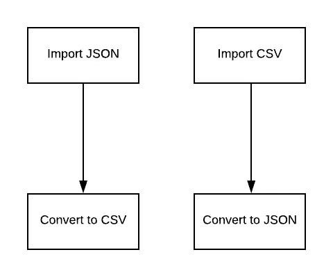
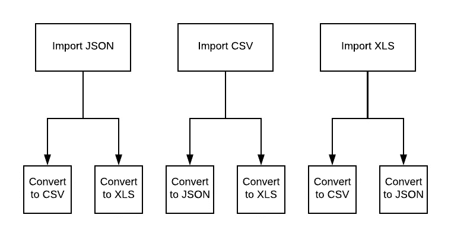
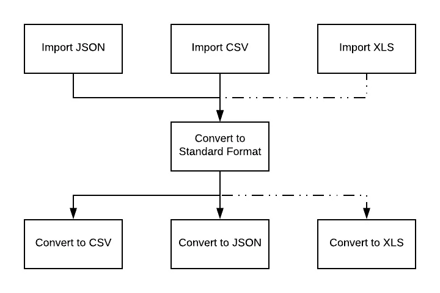
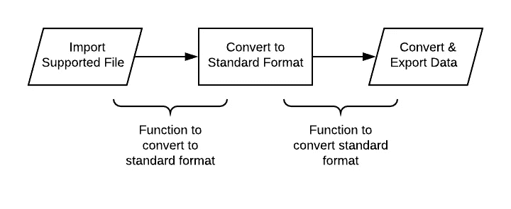

# 如何用 Python 构建更好的命令行 JSON/CSV 转换器

> 原文：<https://betterprogramming.pub/how-to-build-a-better-command-line-json-csv-converter-in-python-6022bce375a5>

## 关于我改进的 Python 命令行 JSON/CSV 转换器的分步教程


在之前的一篇文章中，我与你分享了我构建的一个[命令行 CSV/JSON 转换器](https://medium.com/better-programming/how-to-build-a-command-line-json-csv-converter-in-python-204d74563456)。那个剧本是出于需要而写的——它当然符合要求，但在很大程度上是功能多于形式的例子。我决定重新构建转换器，这样我可以更容易地添加文件类型。在这样做的同时，我还优化了旧转换器的一些部分——结果是一个更快、更灵活的工具。一路上，我也学到了一些经验。

# 原件的问题

最初的脚本假设只涉及两种文件类型(CSV/JSON)。如果一个被导入，那么它将被转换为第二个，反之亦然。



但是当我们添加第三种文件类型时会发生什么呢？



每种附加的文件类型都需要一个函数来完成导入，然后为每种支持的文件类型创建新的转换函数。决定转换器的标准数据类型对于可伸缩性是必要的。



现在，每当一个新的文件类型被添加到转换器，只需要做两个功能——转换到标准格式和从标准格式转换。



# 骷髅

根据上面给出的设计决策，我们创建了一个带有必要的导入/导出函数和注释的框架来概述执行。

```
import os
import csv
import json
import xlsxwriter
from collections import OrderedDict
import math

def main():
    # supported file types
    # prompt user for file name
    # attempt to import based on file name
    # prompt user for export file name
    # export data

################################
# IMPORT FUNCTIONS
################################

def importJSON(f):
    pass

def importCSV(f):
    pass

################################
# EXPORT FUNCTIONS
################################

def exportJSON(data,filename):
    pass

def exportCSV(data,filename):
    pass

#----------

if __name__ == "__main__":
    main()
```

下面是充实的`main()`函数:

```
def main():
    # supported file types
    supported_file_types = (
        "json",
        "csv"
    )

    # prompt user for file name
    while True:
        filename = input(f"Enter a file to load ({','.join(supported_file_types)}): ").strip()
        if os.path.isfile(filename) == False:
            print(">> Error, file does not exist")
        elif os.path.basename(filename).split(".")[1].lower() not in supported_file_types:
            print(">> Error, file type is not supported.")
        else:
            break

    # attempt to import based on file name
    print("Attempting to load file...")
    try:
        f = open(filename)
        file_type = os.path.basename(filename).split(".")[1].lower()

        if file_type == "json":
            imported_data = importJSON(f)
        elif file_type == "csv":
            imported_data = importCSV(f)

        if imported_data is False:
            raise Exception(">> Error, could not load file, exiting...")
    except Exception as e:
        print(e)
    else:
        print(f">> File loaded, {len(imported_data)} records imported...")

    # prompt user for export file name
    while True:
        export_filename = input(f"Enter the output file name ({','.join(supported_file_types)}): ").strip().lower()
        if os.path.basename(export_filename).split(".")[1].lower() not in supported_file_types:
            print(">> Error, file type is not supported.")
        elif os.path.isfile(export_filename) == True:
            print(">> Error, file already exists")
        else:
            converted_file_type = os.path.basename(export_filename).split(".")[1].lower()
            break

    # export data
    if converted_file_type == "json":
        data_size = exportJSON(imported_data, export_filename)
    elif converted_file_type == "csv":
        data_size = exportCSV(imported_data, export_filename)

    if data_size > 1000000:
        print(f">> Records exported to: {export_filename} <{math.floor(data_size/1000)/10} MB>")
    elif data_size > 0:
        print(f">> Records exported to: {export_filename} <{math.floor(data_size/10)/10} KB>")
    else:
        print(">> Error, no file exported...")
```

为了将来的计划，我添加了一个元组来保存支持的文件类型，以便于验证。我选择使用 [f-string 文字来转置变量](https://medium.com/better-programming/four-ways-to-print-variables-in-strings-28b346998d22)，因为没有太多的插入，并且扫描代码时字符串仍然容易读取。

# 导入 CSV 和 JSON 文件

导入功能相对简单，除了一些小的性能调整外，与原始转换器没有什么变化。

```
def importJSON(f):
    try:
        data = json.load(f,object_pairs_hook=OrderedDict)
        if isinstance(data,OrderedDict):
            data = [data]
        return data
    except Exception as e:
        print(e)
        return False

def importCSV(f):
    try:
        data = list(csv.reader(f))
        keys = data[0]
        converted = []

        for line in data[1:]:
            obj = OrderedDict()
            for key in keys:
                if len(line[key]) > 0:
                    obj[key] = line[key]
                else:
                    obj[key] = None
            converted.append(obj)

        return converted
    except Exception as e:
        print(e)
        return False
```

当导入 CSV 时，我选择直接遍历列表，而不是使用`for i in range(len(data))`。此外，我选择使用切片符号来删除第一个索引。当导入 JSON 时，OrderedDicts 用于在我们希望以相同的文件格式导入和导出时保留键-值对的排列，有效地创建一个相同的副本。

# 导出 CSV 和 JSON 文件

因为这种转换的标准格式是 JSON，所以导出 JSON 非常直接。按照这个转换器的设计，当导出 CSV 时，第一步是从 JSON 转换。

```
def exportJSON(data,filename):
    try:
        with open(filename, 'w') as outfile:
            json.dump(data, outfile,indent=2)
        return os.path.getsize(filename)
    except Exception as e:
        print(e)
        return False

def exportCSV(data,filename):
    try:
        keys = set([
            cell
            for line in data
            for cell in line
        ])

        # map data in each row to key index
        converted = []
        converted.append(keys)

        for line in data:
            row = []
            for key in keys:
                if key in line:
                    if isinstance(line[key],(list,OrderedDict,dict)):
                        continue # skip nested data structures
                    else:
                        row.append(line[key])
                else:
                    row.append(None)
            converted.append(row)

        with open(filename, 'w') as outfile:
            writer = csv.writer(outfile)
            writer.writerows(converted)
        return os.path.getsize(filename)
    except Exception as e:
        print(e)
        return False
```

我喜欢在使用`json.dump()`时设置缩进值，以避免长时间的单行转储，这会降低一些编辑器的速度，比如 Atom。CSV 导出使用[列表理解](https://medium.com/better-programming/python-list-comprehension-by-example-9ce679aca41f)，而不是嵌套的 for 循环，以获得良好的性能和 pythonic 式的改进。

# 结论

我很高兴与社区分享这一点。这是持续改进和初学者优化的一个很好的例子。我计划在不久的将来为这个转换器添加 XLS/XLSX 支持，以及 XML。访问[库](https://github.com/jhsu98/data-converter)查看最终结果，并了解该工具的最新添加内容。请随意使用和贡献它，或分叉它，使它成为你自己的。

*储存库:*[*https://github.com/jhsu98/data-converter*](https://github.com/jhsu98/data-converter)