# 如何用 React 和 Recharts 构建比特币美元成本平均图

> 原文：<https://betterprogramming.pub/how-to-build-a-bitcoin-dca-chart-with-react-and-recharts-d29523b5427c>

## 制作图表来了解你的金融投资

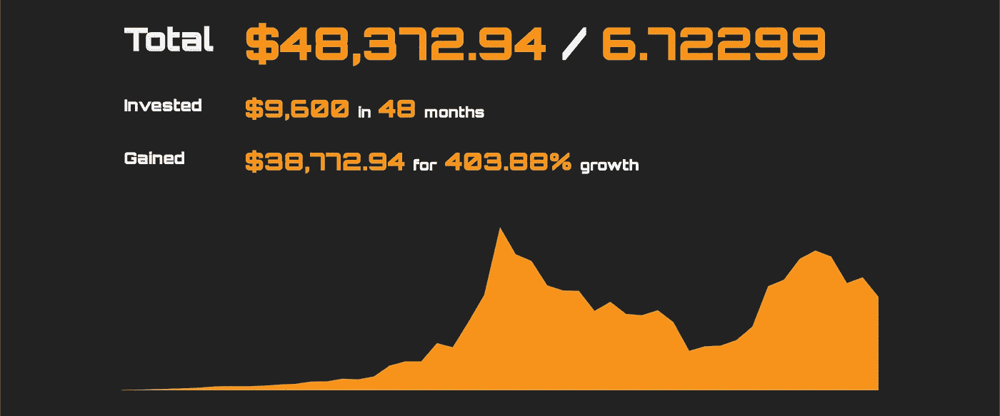

编者按:这篇文章不打算作为财务建议。这篇文章仅用于教育目的。更好的编程、它的员工和它的所有者不对你的投资决策负责。

[Recharts](http://recharts.org/en-US) 是一个图表库，它提供了一组声明性的 React 组件，用于使用 [D3](https://d3js.org/) 构建图表。十种高度可定制的图表类型与帮助器组件一起提供。

在本教程中，我们将构建几个[面积图](http://recharts.org/en-US/api/AreaChart)来显示特定历史时间段内[美元成本平均化](https://www.investopedia.com/terms/d/dollarcostaveraging.asp)比特币时的投资组合价值、累计硬币总数和投资总额。

访问该项目的 [GitHub](https://github.com/codypearce/crypto-dca) 了解更多信息。

# 部分

*   绘制平均美元成本图
*   入门指南
*   使用 [CoinGecko 的](https://www.coingecko.com/en) API 的历史价格
*   获取数据
*   计算总数
*   构建图表数组
*   再 charts 面积图
*   重新 charts 工具提示
*   充电点
*   重新绘制 Y 轴和 X 轴
*   多区域充电
*   响应充电
*   结论

# 绘制平均美元成本图

美元成本平均法(DCA)是一种投资策略，在这种策略下，投资者定期购买相同金额的资产，以降低短期波动性。

例如，每个月向特定股票或加密货币投资 200 美元，这意味着当股价低时，你将购买更多股票，当价格高时，你将购买更少股票。阅读 DCA 上的 [Investopedia 文章](https://www.investopedia.com/terms/d/dollarcostaveraging.asp)了解更多信息。

绘制一个比特币 DCA 账户的价值随时间变化的图表需要我们计算一段时间内每个间隔的总账户价值。

例如，如果间隔是一个月，时间段是两年，那么我们需要计算 24 次总帐户值。要计算特定时间间隔内的总价值，我们需要用购买时的硬币价格乘以到该时间点为止累积的硬币总数。

到那时为止累积的硬币总数可以通过将投资金额除以在每个时间间隔购买时硬币的价格来计算。

让我们用一个例子来说明这一点，假设我们计划从 2016 年 1 月到 2016 年 5 月每个月购买价值 200 美元的比特币。

第一个月的硬币数量很容易计算，只需将投资金额(200)除以 2016 年 1 月 1 日的硬币价格(434.33 美元)。

总价值同样简单，只需将目前硬币的数量乘以当前硬币的价格，第一个月的价格应等于投入的金额(200)。

```
// amountToInvest / coinPrice
200 / 434.33  ~= .46 // Amount of Coin for the first month// amountOfCoin * coinPrice
.46 * 434.33 ~= 200  // Total Value
```

计算第二个月的硬币数量略有不同。

首先，与上个月类似，将投资金额除以当月硬币价格(371.04)。然后，将该值与上个月的硬币金额(. 46)相加。

```
// amountToInvest / coinPrice
200 / 371.04  ~= .54 // Amount of Coin bought in the second month// amountOfCoin for second month + amountOfCoin for first month
.54 + .46 = 1 // Total Accumulated Amount of Coin so far
```

为了计算第二个月的总值，我们将硬币的累计总量乘以当前的硬币价格。

```
// Total Accumulated Amount of Coin * coinPrice
1 * 371.04 = 371.04
```

将这一过程扩展到其余月份，会生成如下表格:

月币价格总投资额币总价值的数量。53860 . 48868886861

计算这些值的代码可能如下所示。

`numOfDays`是时间段的总天数。在这种情况下，2016 年 1 月到 2016 年 5 月之间有 121 天。

`freqInDays`是买入的时间间隔，本例中为 30 天。

`priceArr`是一个包含历史比特币价格和日期的对象数组。

`amountToInvest`是每个时间段将投资的美元金额，在本例中为 200。

`coinAmount`是到目前为止积累的硬币总量。

`totalInvested`是到目前为止投入的总金额。

`total`是投资组合的美元总价值。

这四个值，`TotalInvested`、`CoinAmount`、`CoinPrice`和`Total`是我们想要绘制的随时间变化的图表。

`freqInDays`、`amountToInvest`和`numOfDays`将由用户提供，而历史比特币价格`priceArr`将由 CoinGecko 的 API 提供。

# 入门指南

初始化一个新的 [Create React App](https://reactjs.org/docs/create-a-new-react-app.html) 项目。

```
npx create-react-app bitcoin-dca
cd bitcoin-dca
npm start
```

转到`src/App.js`并删除启动代码。

最后，转到`src/App.css`并如下更新样式。

# coin gecko API 的历史价格

CoinGecko 的 API 提供没有 API 密钥的免费加密数据。`/coins/{id}/market_chart/range`端点给出了特定硬币在特定范围内的历史市场数据，这正是我们所需要的。

`id`参数指的是硬币的 ID，在本例中就是`bitcoin`。`vs_currency`参数决定比特币价格将以何种货币发送。

`from`和`to`参数表示要获取的价格的时间段，必须作为 UNIX 时间戳提供。

比如[https://API . coin gecko . com/API/v3/coins/比特币/market_chart/range？vs _ currency = USD&from = 1392577232&to = 1422577232](https://api.coingecko.com/api/v3/coins/bitcoin/market_chart/range?vs_currency=usd&from=1392577232&to=1422577232)获取`02/16/2014`到`01/30/2015`之间每天的比特币美元价格。

# 获取数据

首先，我们在`App.js`的顶部设置静态值`startDate`、`endDate`、`freqInDays`、`amountToInvest`。理想情况下，我们将构建一个表单来从用户那里获取这些值，但是现在我们将在这里静态地定义它们。

接下来，构建一个传入`startDate`和`endDate`的基本异步函数，从 CoinGecko 的 API 获取数据，最后将数据放入 state。

为了保存数据和不同的状态，我们需要在组件状态中定义`coinData`、`isLoading`和`error`。

为了将`startDate`和`endDate`参数作为人类可读的日期传递，我们将使用 [Day.js](https://github.com/iamkun/dayjs) 库将人类可读的日期转换为 UNIX 时间戳。导入`dayjs`并应用其`advancedformat`扩展。

```
...
import dayjs from "dayjs";
import advancedFormat from "dayjs/plugin/advancedFormat";
dayjs.extend(advancedFormat);
...
```

接下来，使用`dayjs`的`format`方法从`getCoinData`函数中将日期转换成 UNIX 时间戳。

接下来，如上所述构建 URL，获取数据，并用`setCoinData`更新组件的状态。

现在我们可以用组件顶部提供的日期在`useEffect`钩子中调用这个函数。

```
...
useEffect(() => {
  getCoinData(startDate, endDate);
}, []);
...
```

我们需要处理四种 UI 状态:`noData`、`loading`、`error`和`data`。在`useEffect`钩子下添加一些条件，如下图所示。

从`const data = await coinResponse.json()`返回的数据应该是我们提供的两个日期之间的 UNIX 时间戳和价格的数组。

这正是我们计算总值和创建图表所需要的。

# 计算总数

我们的目标是使用`coinData.prices`数组计算以下值:

*   BTC 硬币总量— `totalCoinAmount`
*   美元总值— `endTotal`
*   美元投资总额— `totalInvested`
*   以美元计算的收入— `numberGained`
*   收益百分比— `percentGained`

从上面的*图形美元成本平均*部分，这里的大部分逻辑应该是熟悉的。

`numberGained`就是以美元计算的总价值减去`totalInvested`。`percentGained`是`totalInvested`增长到`endTotal`的百分比。创建如下所示的文件`src/Totals`。

为了显示这些值，创建另一个带有简单样式的组件`src/Totaljs`。

如果你运行上面的计算，你会发现大部分的数值都有很多小数位。创建一个实用函数，`./src/round.js`，将数字四舍五入，使它们看起来更好。

```
export default function round(num, digit) {
  return +(Math.round(num + "e+" + digit) + "e-" + digit);
}
```

将`round`和`Total`组件导入到`Totals`组件中。

接下来，创建几个`Total`组件，同时将描述传入`title`属性，将实际值传入`value`属性。我们也可以使用`round`函数格式化这些值。

最后，将`Totals`导入`App.js`，用`Totals`组件替换“数据”状态。

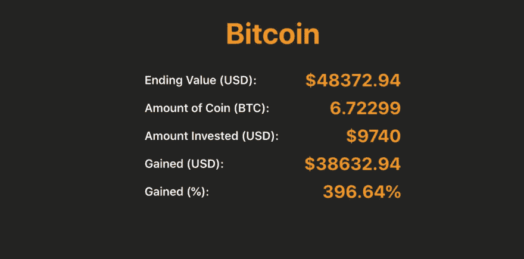

# 构建图表数组

从上面的*图形美元成本平均*部分，下面的代码应该非常熟悉，请查看该部分以了解该代码如何工作。

一个不同之处是，我们希望再次使用`dayjs`以人类可读的方式存储日期。新建一个`./src/Graph.js`文件，如下图:

这将创建一个对象数组`dataArr`，如下所示:

```
[
  {TotalInvested: 200, CoinAmount: .46, CoinPrice: 460, Total: 200, date: '1/1/2016'},
  {TotalInvested: 400, CoinAmount: 1, CoinPrice: 380, Total: 200, date: '1/5/2016'},
  ...
]
```

# 再 chart 面积图

我们终于准备好开始创建图表了。Recharts `<AreaChart>`和`<Area>`组件可以以多种方式定制，但首先，我们将创建一个非常基本的图表，并以此为基础进行构建。

`<AreaChart>`组件是一个包装组件，它接受`data`属性中的图表数据，并将该数据提供给其子组件。

在我们的例子中，我们需要将上面创建的`dataArr`数组传递到`data`属性中。为了显示图表，我们还需要提供一个高度和宽度属性，在本例中，将高度设置为 250，宽度设置为 700。

`<Area>`组件是在图形上实际显示数据的组件。`dataKey`道具将选择`dataArr`对象中每个对象的关键点，作为数据显示在图形上。

记住从上面看，`dataArr`中的每个对象看起来都像这样:

让我们显示`Total`值，因此将`dataKey`属性设置为“总计”。`<Area>`组件接受许多其他的道具来定制我们想要的图形。现在，让我们来设计一下`stroke`、`fillOpacity`和`fill`的样式。

将`Graph`组件添加到`App.js`中，以查看我们在上面构建的面积图。

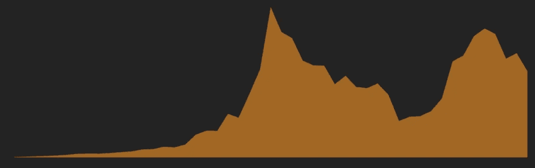

`<Area>`组件的形状也可通过`type`支柱改变。例如，将`step`传递给类型 prop。

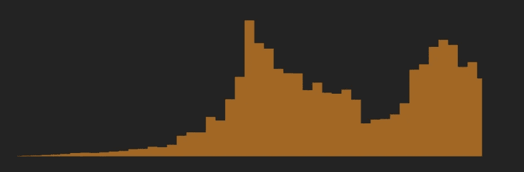

现在试着传入`natural`。

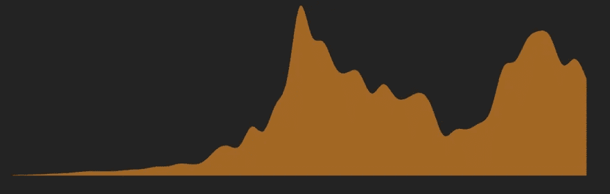

# 重新 charts 工具提示

上面的图表是一个好的开始，但是没有办法看到图表上的单个值。

我们可以使用 Recharts' `tooltip`在图表上显示每个区间的总值。我们也可以用`contentStyle`和`labelStyle`道具来修改工具提示的样式。

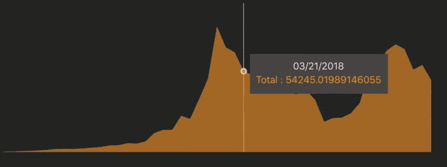

您会注意到的一个问题是工具提示上的总值有一串数字。我们可以使用`formatter` prop 格式化这个数字，它采用一个回调函数，以一种格式返回数据。

引入我们在上面构建的舍入实用函数，`./src/round.js`，将值舍入到两位。另外，在数值前添加一个`$`字符，表示单位为美元。

```
<Tooltip
  contentStyle={styles.tooltipWrapper}
  labelStyle={styles.tooltip}
  formatter={value => `$${round(value, 2)}`}
/>
```

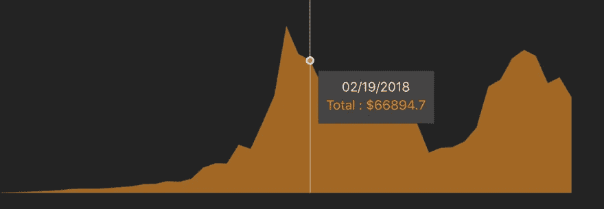

# 充电点

`<Area>`组件上的`dot`支柱将在图表上的每个独立点添加点。

我们可以传入`true`以默认样式显示点，传入一个样式对象以我们想要的方式显示点，或者传入一个定制的点元素。现在，添加一个简单的样式对象。

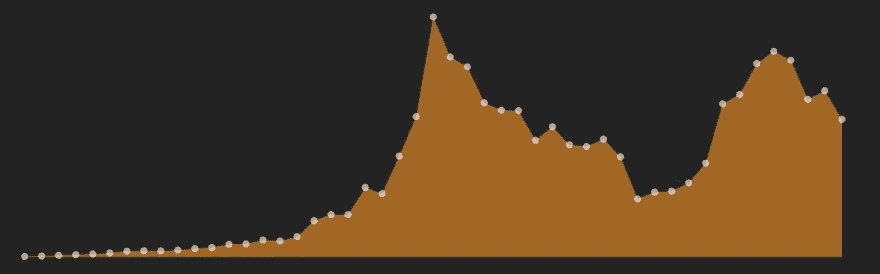

我们也可以使用`activeDot`道具编辑鼠标悬停时的点。


# 重新绘制 Y 轴和 X 轴

使用`<YAxis>`和`<XAxis>`组件，我们可以显示 Y 轴和 X 轴，以提供关于数值范围的更多信息。

`<XAxis>`组件默认以升序显示点数。

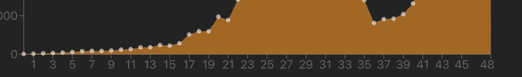

但是我们想在 X 轴上显示日期本身。为此，用字符串“日期”将`dataKey`属性添加到`<XAxis>`属性。

对于`XAxis`和`YAxis`组件有大量的道具和定制，从定制标签到定制缩放、刻度和事件处理程序。然而，我们现在要保持简单。

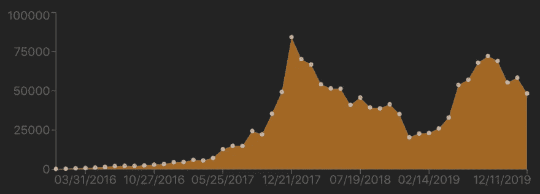

# 多区域充电

使用 Recharts，我们可以在同一个图表中添加多个区域，以便在同一个时间线上显示相关数据。

在我们的例子中，我们希望在同一个图表中显示`CoinAmount`、`TotalInvested`和`CoinPrice`以及`Total`，以查看所有数据之间的关系。我们需要给每个新的`Area`一个不同的颜色来区分它们，同时降低不透明度，这样我们就可以看到图表重叠。

在`AreaChart`中创建其余的`Area`组件，使用`dataKey`为每组数据创建一个组件。

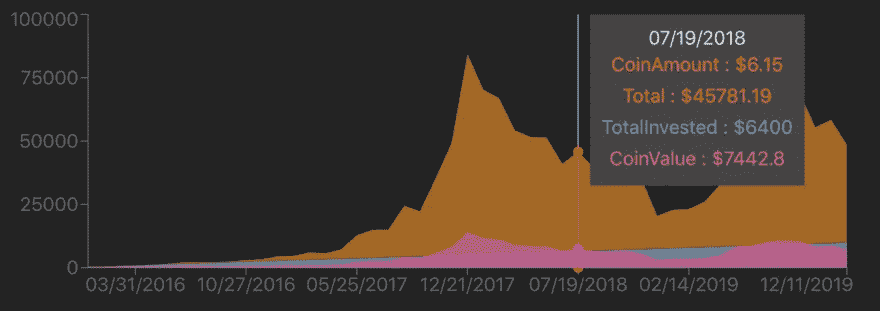

这个图表的一个问题是`CoinAmount`不是用美元而是用比特币来衡量的，所以在同一个图表上显示`CoinAmount`有些误导。

但是，我们可以创建两个`YAxis`组件，一个在右边，一个在左边，来解决这个问题。目前，我们已经在左侧有了映射到美元的`YAxis`，所以我们需要在右侧有第二个映射到 BTC 的`YAxis`。

添加第二个`YAxis`组件，其中`yAxisId`属性设置为“右”,而“方向”属性设置为“右”。`yAxisId`道具将允许我们将`Area`映射到正确的`YAxis`比例。

```
<YAxis yAxisId="right" orientation="right" />
```

通过向`<Area>`组件提供`yAxisId`道具，更新每个`<Area>`以映射到正确的`yAxisId`值。

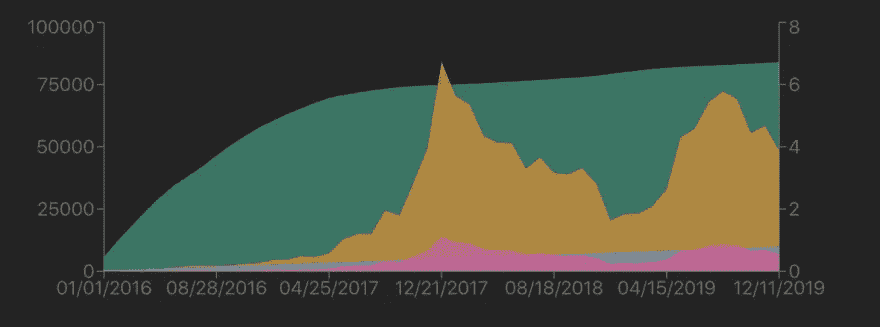

你可以对充值进行更多的定制，查看[充值文档](http://recharts.org/en-US/)了解更多。

# 响应充电

因为图表的高度和宽度是静态定义的，所以图表不会自动调整大小以适应较小的屏幕。然而，使用 Recharts 使图表具有响应性却出奇地容易。

将`<AreaChart>`组件包在`<ResponsiveContainer>`中，去掉`<AreaChart>`的高度和宽度，给`<ResponsiveContainer>`组件一个新的高度。


# 结论

我们可以做很多其他的事情来使这个项目变得更好。例如，添加用户输入，更好的加载和错误消息，易于共享的按钮，以及易于链接到特定图形的 URL。

如果你对如何添加这些额外的功能感兴趣，请查看 GitHub 对 [crypto-dca](https://github.com/codypearce/crypto-dca) 的报告。

Recharts 使得用 React 和 D3 创建图表变得非常容易，同时提供了大量的定制。

虽然 Recharts 的特性比一个项目所能涵盖的要多，但我希望这些例子能帮助你开始。