# 如何用 Node.js、MongoDB 和 Fastify 构建超快的 GraphQL API

> 原文：<https://betterprogramming.pub/how-to-build-a-blazing-fast-graphql-api-with-node-js-mongodb-and-fastify-77fd5acd2998>

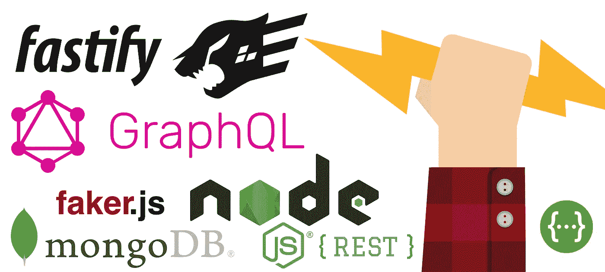

图片来源:[由 Dooder](https://www.freepik.com/free-vector/hand-with-a-pencil-with-lightning-shape_901992.htm) 设计

本教程是系列教程的第 2 部分，旨在帮助您部署一个全功能的全栈应用程序。

*   第 1 部分:如何用 Node.js、MongoDB、Fastify 和 Swagger 构建超快的 REST APIs
*   **第 2 部分:如何用 GraphQL、Node.js、MongoDB 和 Fastify(你在这里。)**
*   第 3 部分:用 GraphQL API 耦合 Vue.js
*   第 4 部分:部署一个 **GraphQL API** 和 **Vue.js** 前端应用程序

该系列的第一部分可以在[这里](https://medium.freecodecamp.org/how-to-build-blazing-fast-rest-apis-with-node-js-mongodb-fastify-and-swagger-114e062db0c9)找到，应用程序的源代码可以在[这里](https://github.com/siegfriedgrimbeek/fastify-graphql-api)找到。

在这一部分中，我们将重温第 1 部分中的模型、控制器和路线，然后将 [GraphQL](https://graphql.org/) 集成到应用程序中。作为奖励，我们还将使用 [Faker.js](https://github.com/marak/Faker.js/) 来创建一些假数据并植入数据库。

# 介绍

GraphQL 是一种 API 查询语言，也是一种用现有数据完成这些查询的运行时语言。

每个 GraphQL 查询都经历三个阶段:查询被解析、验证和执行。

GraphQL 为您的 API 中的数据提供了完整且易于理解的描述，使客户能够准确地询问他们需要什么，使 API 更容易随时间发展，并支持强大的开发工具。

[https://www . howtographql . com/basics/1-graph QL-is-the-better-rest/](https://www.howtographql.com/basics/1-graphql-is-the-better-rest/)

# 先决条件

如果您已经完成了本系列的第一部分，那么您应该能够快速掌握初级/中级 JavaScript、Node.js 和 Fastify。JS，还有 MongoDB(猫鼬)。

为了跟上进度，你需要完成本系列的第 1 部分，或者从 GitHub 获取代码——尽管我强烈建议至少浏览一下第 1 部分。

# 我们开始吧

通过打开您的终端**、**导航到您的项目目录，并**、**执行下面的每一行代码，克隆第 1 部分的 repo(如果您遵循了第 1 部分，请跳过这一步，继续您自己的代码):

```
git clone [https://github.com/siegfriedgrimbeek/fastify-api.git](https://github.com/siegfriedgrimbeek/fastify-api.git)
cd fastify-api
```

现在我们有了代码库的副本，我们将通过运行下面的代码来更新我们的包和`package.json`文件:

```
sudo npm i -g npm-check-updates
ncu -u
npm install
```

首先，我们全局安装 [npm](https://docs.npmjs.com/about-npm/) 包`[npm-check-updates](https://www.npmjs.com/package/npm-check-updates)` **，**，然后我们使用这个包用最新的包版本自动更新我们的`package.json`文件。然后，我们通过运行`npm install`来安装/更新所有的 npm 模块。

这样做是为了确保每个完成教程的人都使用相同的包版本。

# 重构我们的服务器并启动应用程序


和所有软件解决方案一样，随着解决方案的增长，开发人员经常需要重新访问和[重构代码。](https://en.wikipedia.org/wiki/Code_refactoring)

在`src`目录中，我们将创建一个名为`server.js`的新文件:

```
cd src
touch server.js
```

将以下代码添加到`server.js`文件中:

server.js

我们现在已经将启动服务器的逻辑提取到了`server.js`文件中，允许我们在整个项目中重用这些代码。

接下来，我们需要更新`src`目录中的`index.js`文件:

索引. js

一旦我们设置并配置了 GraphQL **，我们将再次访问`index.js`文件。**

通过在终端中运行以下代码，启动 Fastify 服务器:

```
npm start
```

请注意，目前没有默认路由设置。导航到 [http://localhost:3000/](http://localhost:3000/) 将导致服务器返回 404 错误，这是正确的。

# 启动 MongoDB 并更新模型


让我们扩展现有的模型，将服务和所有者也包括进来。下图展示了各系列之间的关系:

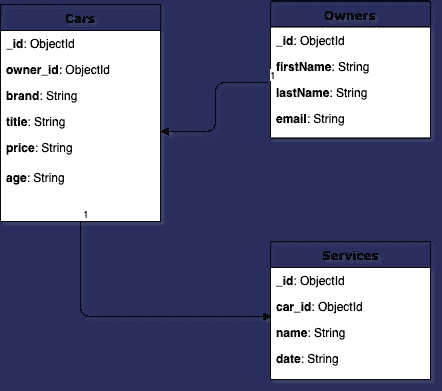

数据模型

*   一辆车可以有一个主人
*   一个车主可以拥有多辆汽车
*   一辆车可以有多种服务

重新访问`models`目录下的`Car.js`文件，更新如下:

汽车. js

在`models`目录下新建两个文件，`Owner.js` 和`Service.js`，分别在文件中添加以下代码:

`Owner.js`

Owner.js

`Service.js`

服务网

上述代码中没有使用新概念。我们刚刚创建了标准的[mongose 模式](https://mongoosejs.com/docs/guide.html)，与`Car.js`模型一样。

# 重新访问汽车控制器并创建附加控制器

`carController.js`文件有一些细微的变化。因此，导航到`controllers`目录，并按如下方式更新您的文件:

汽车控制器. js

在`controllers`目录下新建两个文件`serviceController.js`和`ownerController.js`，分别在文件中添加以下代码:

`serviceController.js`

服务控制器..射流研究…

`ownerController.js`

ownerController.js

控制器的最大变化是我们如何获得参数:

```
const id = req.params === undefined ? req.id : req.params.id
const updateData = req.params === undefined ? req : req.params
```

上面的代码称为一个 [*条件(三元)运算符*](https://developer.mozilla.org/en-US/docs/Web/JavaScript/Reference/Operators/Conditional_Operator) ，用作下面 if 语句的简写:

```
let idif (req.params === undefined) {id = req.id} else {id = req.params.id}
```

我们使用三元运算符来适应来自 REST API 和 GraphQL API 的请求，因为它们的实现略有不同。

# 是时候在数据库中植入一些假数据了


在`src`目录中，让我们通过运行以下代码创建一个新的目录和文件:

```
mkdir helpers
touch seed.js
```

将以下代码添加到`seed.js`文件中:

种子. js

让我们来分解堆积如山的代码:

首先，我们导入两个外部库——[faker . js](https://github.com/marak/Faker.js/)、，用于生成假数据，以及 [Boom](https://github.com/hapijs/boom) ，用于抛出 HTTP 友好的错误对象。

然后我们导入`server.js`文件——这将启动我们服务器的一个实例，允许我们与**模型**进行交互。

然后我们用假数据声明两个数组，`cars`和`serviceGarages`。

然后我们导入`models`并声明三个函数(`generateOwnerData`、`generateCarData`和`generateServiceData`)，每个函数分别返回一个包含所有者、汽车和服务数据的对象数组。

一旦 Fastify.js 实例准备就绪，我们使用[mongose](https://mongoosejs.com/docs/api.html#model_Model.insertMany)`[insertMany()](https://mongoosejs.com/docs/api.html#model_Model.insertMany)`[函数](https://mongoosejs.com/docs/api.html#model_Model.insertMany)将生成的数组插入数据库。然后，该函数返回包含原始对象数据和每个记录的`ids`的对象数组。

我们使用 [JavaScript map](https://developer.mozilla.org/en-US/docs/Web/JavaScript/Reference/Global_Objects/Array/map) 函数为车主和汽车数组创建一个`ids`数组。我们使用`ownersIDs`数组生成汽车数据，使用`carsIds`数组生成服务数据。它们被传递给各自的函数，然后从中随机选择值。

最后，我们需要安装 Faker.js 包，并将种子任务添加到我们的`package.json`文件中。

我们可以通过导航到根目录并运行以下代码来添加 Faker.js 包:

```
npm i faker -D
```

然后，我们将以下内容添加到`package.json`文件中:

```
..."scripts": {..."seed": "node ./src/helpers/seed.js"},...
```

就是这样。现在，我们可以使用以下代码从项目根目录运行我们的播种脚本:

```
npm run seed
```

如果您正在使用 [MongoDB Compass](https://www.mongodb.com/products/compass) (您应该这样做)，您将会看到数据库中的数据:

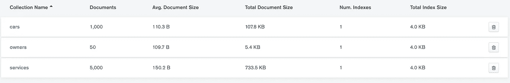

在 MongoDB Compass 中查看“mycargarage”数据库

# GraphQL 安装、设置和测试

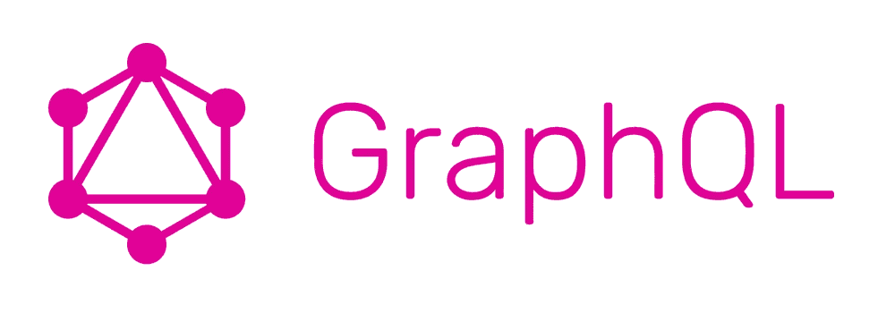

让我们从导航到根目录并运行以下代码开始:

```
npm i fastify-gql graphql
```

上面安装了 GraphQL 和 Fastify 准系统 GraphQL 适配器。

导航到`src`目录，并运行以下代码:

```
mkdir schema
cd shema
touch index.js
```

导航到`src`目录，用以下内容更新`index.js`文件:

```
// Import Server
const fastify = require('./server.js')// Import external dependancies
const gql = require('fastify-gql')// Import GraphQL Schema
const schema = require('./schema')// Register Fastify GraphQL
fastify.register(gql, {
   schema,
   graphiql: true
})... end here// Import Routes
const routes = require('./routes')
```

使用上面的代码，我们需要 Fastify GraphQL 适配器，因此导入模式并向 Fastify 注册 GraphQL 适配器。

我们注册模式并启用 GraphQL，这是一个用于探索 graph QL 的浏览器内 [IDE](https://en.wikipedia.org/wiki/Integrated_development_environment) 。

导航到`schema`目录，打开`index.js`文件。添加以下样板代码:

索引. js

让我们浏览一下上面的代码:

我们需要主 GraphQL 包，并使用 [JavaScript 析构](https://developer.mozilla.org/en-US/docs/Web/JavaScript/Reference/Operators/Destructuring_assignment)来获得必要的 GraphQL 函数(`GraphQLSchema`、`GraphQLObjectType`、`GraphQLString`、`GraphQLInt`、`GraphQLID`、`GraphQLList`和`GraphQLNonNull`)。

我们导入我们的三个`controllers` ( `carController`、`ownerController`和`serviceController`)。

我们声明了`carType`、`ownerType`和`serviceType`、 [GraphQL 对象类型](https://graphql.org/graphql-js/object-types/)、**、**，它们是接受一个对象作为参数的函数，带有一个`name`和一个`fields`键。

这些函数用于定义我们的 GraphQL 模式，类似于前面定义的 Mongoose 模型。

这些字段可以返回采用参数的特定类型和方法。

然后我们声明`RootQuery`，它也是一个 GraphQL 对象类型，可以在每个 GraphQL 服务器的顶层找到。它代表了 GraphQL API 的所有可能的入口点。

然后我们声明我们的`Mutations`，用来改变数据。尽管可以实现任何查询来更改数据，但导致更改的操作应该通过变异显式发送。

最后，我们导出`GraphQLSchema`。

既然我们已经设置了模板，我们可以开始填充对象类型、根查询和突变。

注意，有[mongose-to-graph QL](https://github.com/sarkistlt/mongoose-schema-to-graphql)模式生成器可用，但是出于教程的目的，我们将手动创建模式。

让我们按如下方式更新`carType`对象类型:

carType 对象类型

让我们更深入地研究 GraphQL 函数，从 GraphQL 中的[标量](https://softwareengineering.stackexchange.com/questions/238033/what-does-it-mean-when-data-is-scalar)类型开始:

GraphQL 自带了一组默认的标量类型:

*   `Int`:有符号 32 位整数。`GraphQLInt`
*   `Float`:有符号双精度浮点值。`GraphQLFloat`
*   `String`:UTF‐8 字符序列。`GraphQLString`
*   `Boolean` : `true`或者`false`。`GraphQLBoolean`
*   `ID`:ID 标量类型代表一个唯一的标识符，通常用于重新提取一个对象或作为缓存的键。ID 类型以与字符串相同的方式序列化；但是，将其定义为`ID`意味着它不适合人类阅读。`GraphQLID`

`owner`和`service`字段是有趣的地方。这些字段没有像其他字段一样被定义为标量类型——相反，它们的`type`引用了我们已经创建并且尚未填充的`ownerType`和`serviceType`。

我们传递给`owner`和`service`字段的第二个参数是[解析器](https://graphql.org/learn/execution/)函数。

解析函数或方法是解析模式中类型或字段的值的函数。

解析器也可以是异步的。它们可以解析来自另一个 REST API、数据库、缓存、常量等的值。根据 GraphQL 的文档:

> 您可以将 GraphQL 查询中的每个字段视为返回下一个类型的前一个类型的函数或方法。事实上，这正是 GraphQL 的工作方式。每种类型上的每个字段都由 GraphQL 服务器开发人员提供的一个名为*解析器*的函数支持。当一个字段被执行时，相应的*解析器*被调用以产生下一个值。
> 
> 如果一个字段产生一个标量值，如字符串或数字，则执行完成。但是，如果一个字段产生一个对象值，那么查询将包含适用于该对象的另一个字段选择。这一直持续到达到标量值。GraphQL 查询总是以标量值结束。

为了创建不同类型之间的关系，我们将`_id`和`owner_id`值传递给各自的控制器函数。

所以本质上，我们需要车主的详细信息和汽车的详细信息:

```
return await userController.getSingleOwner({ id: parent.owner_id })
```

以及与汽车相关的所有服务的详细信息:

```
return await serviceController.getCarsServices({ id: parent._id })
```

为了从 GraphQL 中返回一个列表或数组，我们使用了`GraphQLList`。[这里的](https://graphqlmastery.com/blog/graphql-list-how-to-use-arrays-in-graphql-schema)是一个很好的关于在 GraphQL 模式中使用数组的深入教程，但是无论哪种方式，都很简单。每当我们需要一个数组时，我们都会使用`GraphQLList`函数。

让我们用下面的代码更新`ownerType`和`serviceType`:

`ownerType`

ownerType 对象类型

`serviceType`

serviceType 对象类型

以上两种对象类型与`carType`非常相似。您可以注意到不同对象类型及其关系之间的模式。

我们现在可以用下面的代码填充`RootQuery`根:

rootQuery 对象类型

上面的代码中没有新概念，但是请记住，`RootQuery`查询是 GraphQL API **上所有查询的入口点。**从上面可以看出，我们可以直接运行以下查询:

*   把所有的车都开来
*   买一辆车
*   获得单一所有者
*   获得单一服务

让我们打开 GraphiQL 用户界面，构建一些查询:[http://localhost:3000/GraphiQL . html](http://localhost:3000/graphiql.html)

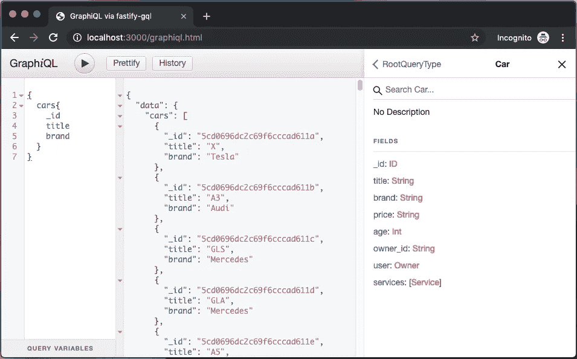

查询在左边输入，结果在中间，文档浏览器在右边。

documentation explorer 可用于探索整个图形，直至标量级别。这在构建查询时非常有用。

用于构建查询的语言类似于 JSON。这张[小抄](https://devhints.io/graphql)是很好的参考。

下面的例子演示了为什么 GraphQL 如此牛逼 **:**


图形集成开发环境

在上面的例子中，我们使用了`cars`根查询来显示所有汽车、车主及其服务的列表。

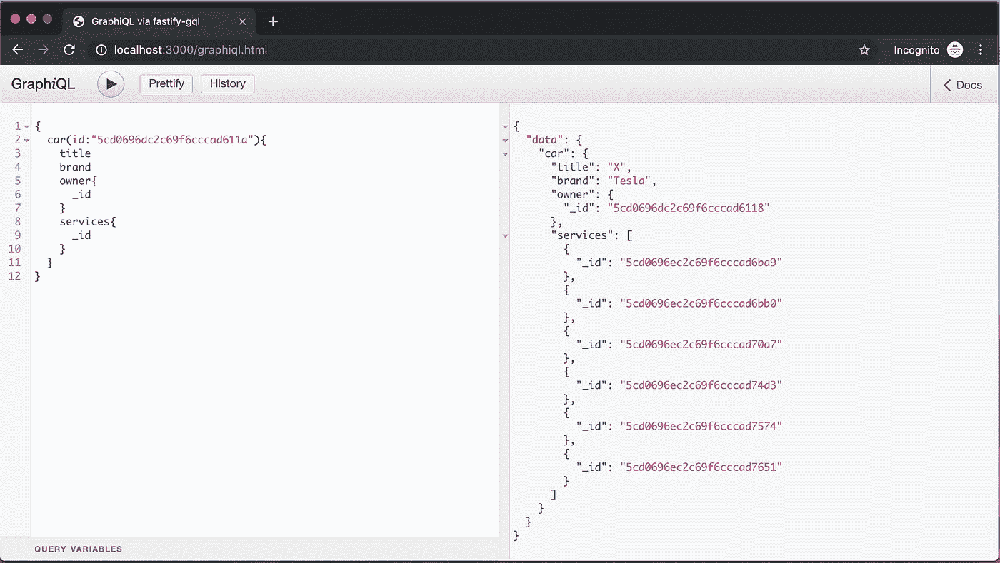

获取单个汽车-汽车根查询

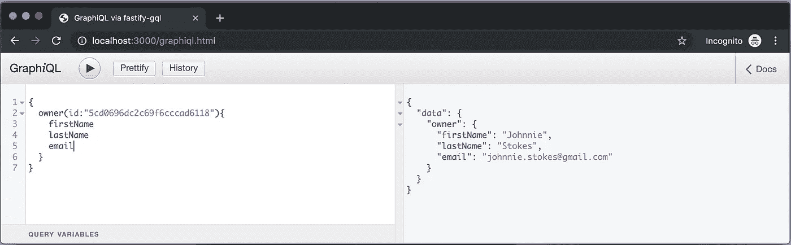

获取单个所有者-所有者根查询

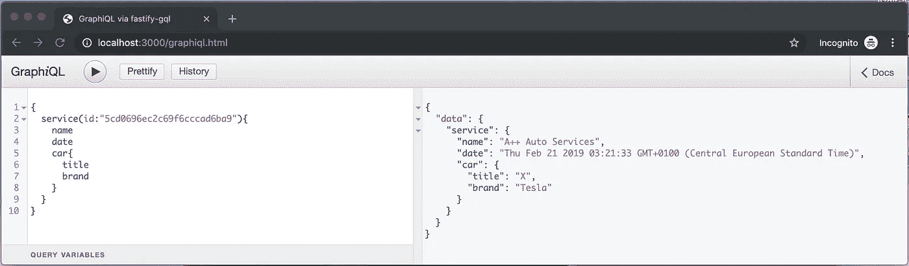

获取单个服务—服务根查询

我们还有最后一个话题要谈，那就是`mutations`。让我们用下面的代码更新`mutations`:

突变

像以前一样，我们声明我们的对象类型并指定名称和字段。

变异由类型、参数和异步解析函数组成。resolve 函数将参数传递给控制器，控制器返回变异的结果。

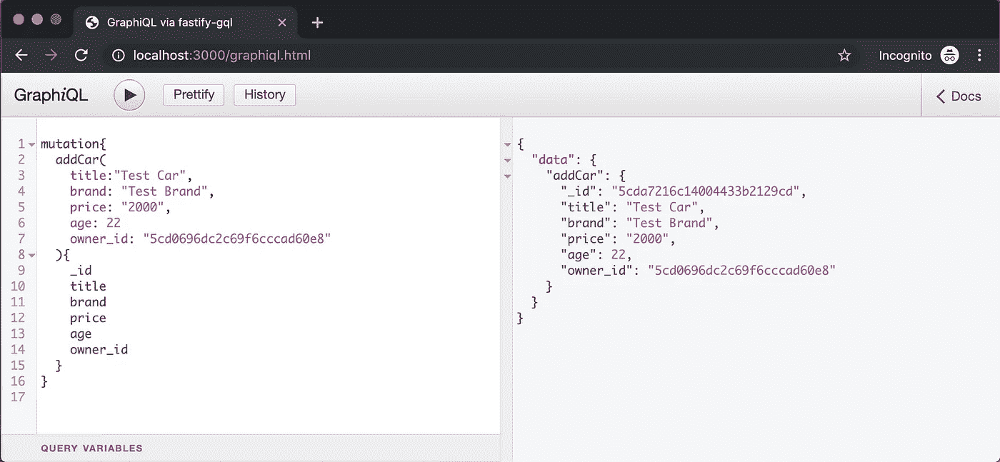

addCar 突变

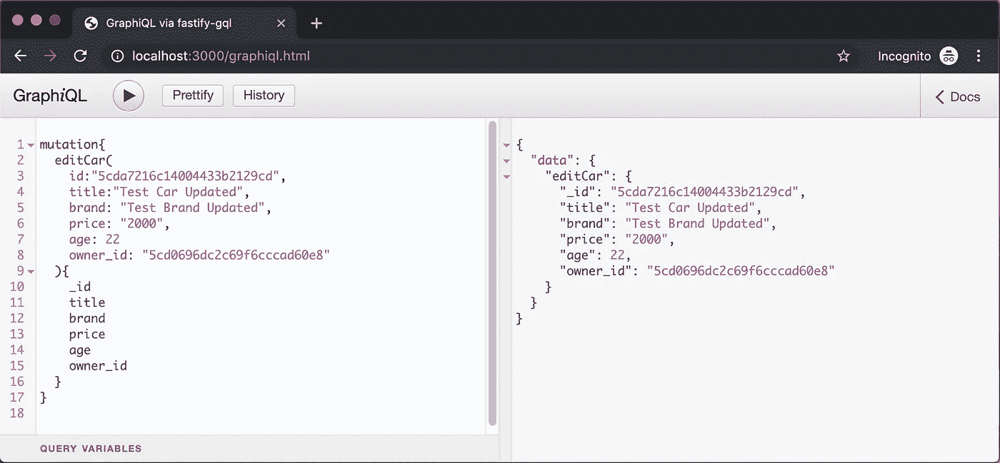

编辑车突变

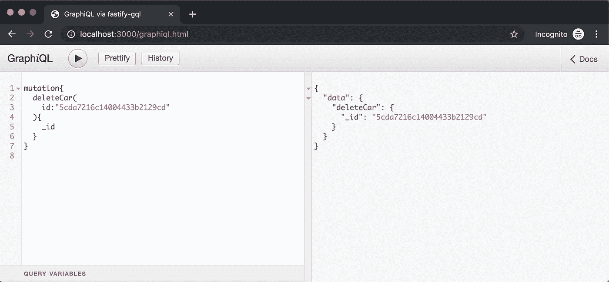

删除汽车突变

现在，您已经编写了一个全功能的 REST API 和一个全功能的 GraphQL API。

没有规则规定一个人应该独占 REST 或者独占 GraphQL。在某些项目中，最好的解决方案可能是两者的混合。这实际上是根据项目来决定的。

你可以从 GitHub [这里](https://github.com/siegfriedgrimbeek/fastify-graphql-api)下载源代码。

# 下一步是什么？

在下一个教程中，我们将使用一个 Vue.js 前端作为单页应用程序来使用我们的 GraphQL API。