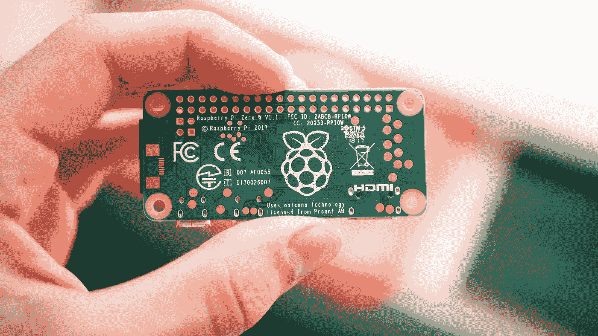
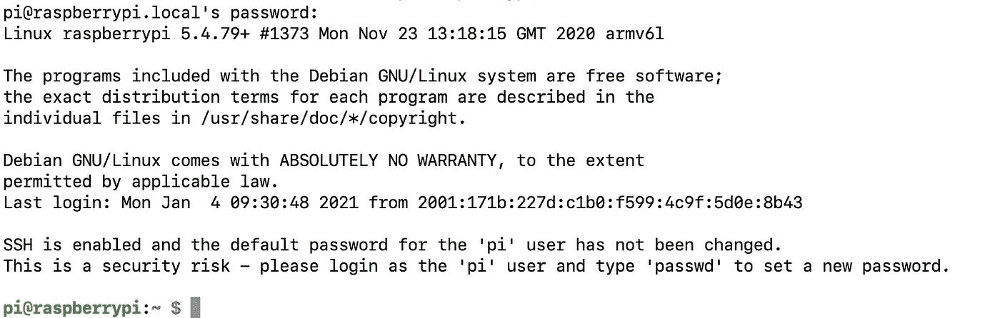
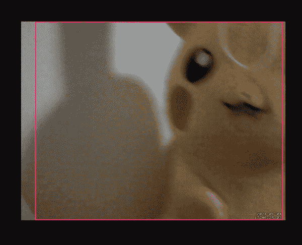
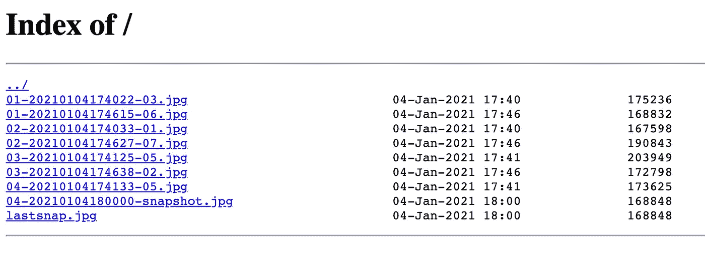

# 如何构建一个便宜的基于树莓 Pi 的 Baby/PetCam

> 原文：<https://betterprogramming.pub/how-to-build-a-cheap-raspberry-pi-based-baby-petcam-9a2964a6acbc>

## 使用 Raspberry Pi Zero W、廉价的 USB 网络摄像头和 Docker 创建您自己的远程监控摄像机



哈里森·布罗德本特在 [Unsplash](https://unsplash.com?utm_source=medium&utm_medium=referral) 上的照片

*在您开始学习本教程之前，请确保您已经习惯了使用 Linux 终端。*

无论您是想在离家的短途旅行中照看您的动物，还是想在房子的一个单独区域监视您的宝宝，或者只是想办法在您离家时捕捉可疑的动作，监控系统通常都是不错的选择。

然而，即使这些现在很普遍，我个人仍然发现它们有时是不够的。为什么？嗯:

*   一个好的监控系统的价格可能超过 100 美元，例如谷歌的 Nest Cam。
*   廉价手机通常针对特定功能进行了优化，这意味着您不会拥有完整的功能包，因此会影响到运动检测、远程访问、视频录制等功能。
*   而且主要是，现成的监控系统除了监控之外不能再用于其他用途。它们就是为这个目的而制造的，所以如果明天你不再需要那个监控系统，你将会发现又一个科技产品只是坐在那里积灰。

这就是为什么对于简单的，有时是短期的监视情况，我更喜欢重用我的树莓派。

毕竟我已经有了。因为它基本上是一台计算机，所以我倾向于将它多样化，用作编程试验台、媒体中心、游戏控制台——当然，还有监视系统！

# 要求

对于本教程，您需要以下内容:

*   **树莓派 Zero W:** 如果在你的国家有，你可以从[官方卖家](https://www.raspberrypi.org/products/raspberry-pi-zero-w/)买到低至 10 美元的。否则，您可以从 Amazon 订购整个开发包(更贵)。
*   **32GB microSD 卡:**可以捆绑购买，和上面的树莓 Pi Zero W 一起购买，也可以单独购买。或者，你甚至可以使用家里现有的一个。只要确保它至少有 32GB 的磁盘空间，因为我们将在磁盘上保存图片和视频。
*   **微型 USB 转 USB 适配器:**这个也可以和树莓 Pi Zero W 一起捆绑购买，也可以单独购买。
*   **5.1V 充电器(micro USB):** 如果你不买上面的捆绑包，我相信你可以找到一个老的坐在家里，来自一个旧的智能手机。如果没有，你可以很容易地在网上得到一个。
*   **USB 网络摄像头:**我用的是一个很烂的，它能工作。所以你可以自由选择，只要是即插即用的 USB 摄像头。

你还需要一台电脑和网络连接。

让我们开始吧。

# 安装监控系统

## **安装树莓 Pi 操作系统**

这一步必须在你的个人电脑上完成(Windows、macOS 或 Ubuntu)。

按照以下说明安装 Raspberry Pi 操作系统:[https://www.raspberrypi.org/software/](https://www.raspberrypi.org/software/)

注意:我推荐使用 Raspberry Pi OS Lite，因为我们并不真正需要图形环境。

在弹出 microSD 卡之前，请确保:

1.  **启用 SSH** —导航到挂载的 microSD 卡目录，创建一个名为`ssh`的文件。
2.  **设置无线互联网连接** —导航至已安装的 microSD 卡目录，创建一个名为`wpa_supplicant.conf`的文件，包含以下内容(确保用正确的信息替换`YOUR_WIFI_SSID`和`YOUR_WIFI_PASSWORD`):

```
country=US
ctrl_interface=DIR=/var/run/wpa_supplicant GROUP=netdev
update_config=1

network={
ssid="YOUR_WIFI_SSID"
scan_ssid=1
psk="YOUR_WIFI_PASSWORD"
key_mgmt=WPA-PSK
}
```

只有这样你才能弹出 microSD 卡。

## 登录您的树莓派

拿着 microSD 卡，插入树莓 Pi，用 5.1V micro USB 充电器给它上电。

如果您的`wpa_supplicant.conf`是正确的，您应该很快就会看到一个新设备出现在您的本地网络中。

从终端，您可以运行(在基于 UNIX 的机器上):

```
arp -a
# the new IP for the raspberrypi should be listed here
```

默认情况下，Raspberry Pi OS 将主机名设为`raspberrypi`，默认登录用户设为`pi`(默认用户密码为`raspberry`)。再次从终端，我们可以 SSH 到 Raspberry Pi(如果在 Windows 上，尝试使用 PuTTY):

```
ssh pi@raspberrypi.local
```

您将被要求输入“pi@raspberrypi.local”的密码:“键入`raspberry`并按回车键。然后，您应该登录并看到 Raspberry Pi 操作系统控制台提示，如下所示:



## 安装必备组件

码头工人

对于本教程，我运行的是 Raspbian GNU/Linux 10 (buster)。您可以通过运行以下命令来检查您的操作系统版本:

```
cat /etc/os-release
```

我们的监控系统将利用已打包为 Docker 映像的现有软件。这使得该系统更加便携、灵活和易于设置。所以我们先安装 [Docker](https://www.docker.com/) :

```
# Download Docker's convenience script
curl -fsSL https://get.docker.com -o get-docker.sh
# Install Docker (this can take several minutes)
sudo sh get-docker.sh
```

完成后，通过运行以下命令确认 Docker 安装正确:

```
sudo docker run hello-world
```

如果成功，那么将您的`pi`用户添加到“docker”组:

```
# this is not mandatory. It only takes effect after you re-login, 
# and what it basically does is that it suppresses the need to use 
# "sudo" on every docker command
sudo usermod -aG docker pi
```

**动作**

在 https://github.com/Motion-Project/motion[有一个非常酷的基于视频的运动探测器](https://github.com/Motion-Project/motion)。

这是很容易配置，它与各种类型的视频源，包括 USB 视频设备。

首先，让我们插上 USB 网络摄像头(如果需要，使用微型 USB 转 USB 适配器)。要确认您的网络摄像头连接正确，请运行:

```
lsusb -t
```

您应该找到类似于(但很可能不等于)的东西

```
/: Bus 01.Port 1: Dev 1, Class=root_hub, Driver=dwc_otg/1p, 480M|__ Port 1: Dev 2, If 0, Class=Hub, Driver=hub/4p, 480M|__ Port 2: Dev 3, If 0, Class=Video, Driver=uvcvideo, 480M|__ Port 2: Dev 3, If 1, Class=Video, Driver=uvcvideo, 480M|__ Port 2: Dev 3, If 2, Class=Audio, Driver=snd-usb-audio, 480M|__ Port 2: Dev 3, If 3, Class=Audio, Driver=snd-usb-audio, 480M
```

另外，您现在应该有一个名为`/dev/video0`的文件(通过运行`ls /dev/video0`来确认)。

出于本教程的考虑，我已经为您构建了一个 armv6 Docker 映像，带有一个启用密码的 motion 服务器。所以你需要做的就是:

```
docker run --device /dev/video0 -d \
  -p 8081:8081 -p 8080:8080 \
  -v /home/pi/Documents/:/home/pi/Documents/ \
  --restart unless-stopped --name motion \
  ccordeiro/motion
```

现在，从你的电脑浏览器，导航到`http://raspberrypi.local:8081`，使用用户名`admin`和密码`admin`，你会发现运动流正在工作。



此外，当有运动时，会拍摄快照，您会在`/home/pi/Documents/motion`的树莓 Pi 中找到它。要检查这些，只需运行:

```
ls /home/pi/Documents/motion
```

此外，在`http://raspberrypi.local:8080`，使用相同的用户名和密码，你会发现运动的控制面板，这对于手动操作来说很方便，无需重启服务器。

最后，你可能想要[自己配置动作](https://motion-project.github.io/motion_config.html)。这些配置放在`/etc/motion/motion.conf` *的文件中。因此，如果你想改变用户名和密码、端口、目标目录等。，只需在上面的命令中添加一个新的 Docker bind mount，带有您的个人配置文件:`-v <full_path_to_your_conf_file>:/etc/motion/motion.conf`。*

**目录列表**

因为默认情况下，所有的运动快照都保存在`/home/pi/Documents/`中，所以我们需要一种方法来方便地访问它们。如果每次我们想检查当天早些时候的一些东西时，我们都必须手动将这些图片从树莓派复制到我们的电脑上，这将非常麻烦。

因此，为了更容易地访问图像，我们可以简单地用 [nginx](https://www.nginx.com/) 建立一个目录列表。

只需通过执行以下操作来创建一个 nginx 配置文件:

为了保持一致，让我们使用与 Motion 服务器相同的用户名和密码来保护这个网页。为此，创建以下文件:

```
cat > .htpasswd <<EOF
admin:{PLAIN}admin
EOF
```

我们现在需要做的就是用这些配置启动一个 nginx 服务器(让我们在端口 80 上运行它):

```
docker run -p 80:80 -d \
  -v $(pwd)/nginx.conf:/etc/nginx/nginx.conf \
  -v $(pwd)/.htpasswd:/etc/nginx/.htpasswd \
  -v /home/pi/Documents/motion:/home/pi/Documents/motion \
  --restart unless-stopped --name motion-snapshots \
  nginx
```

然后，再次在你的电脑浏览器上，导航到`http://raspberrypi.local`(这次没有端口，但用户名`admin`和密码`admin`相同)，你会看到所有已经被 Motion 服务器拍摄的图片。



**ngrok**

最后，我们需要通过 web 远程访问 motion 服务器。否则，只有当我们和 Raspberry Pi 在同一个本地网络上时，它才有用，在大多数情况下，这违背了监控系统的目的。

嗯，**理想情况下，我们应该使用 VPN 客户端**，但由于我们希望保持这个项目的低预算，我们可以将我们的远程连接功能外包给免费层 [ngrok](https://ngrok.com/) ，所以请确保您在[https://dashboard.ngrok.com/signup](https://dashboard.ngrok.com/signup)创建了您的免费帐户。

从[https://dashboard.ngrok.com/get-started/setup](https://dashboard.ngrok.com/get-started/setup)，你会发现第二步。，其中定义了您的个人身份验证令牌。**记下来**！

现在我们需要让 ngrok 为我们隧道三件事:

*   运动视频流
*   运动快照目录列表
*   一个我们可以用来远程 SSH 的 TCP 通道，以防我们需要从远处修复某些东西

让我们将这些条件写入 ngrok 配置文件(确保您**替换** `**<your_auth_token>**`):

现在我们终于可以启动另一个容器了，使用与其他容器相同的重启策略，它接受这个配置文件并启动 ngrok 服务:

```
docker run -d --net host \
  -v /home/pi/ngrok.yml:/root/ngrok.yml \
  --restart unless-stopped --name ngrok \
  ccordeiro/ngrok
```

就是这样！

转到[https://dashboard.ngrok.com/status/tunnels](https://dashboard.ngrok.com/status/tunnels)，您会发现上面配置中定义的每个隧道的每个单独的公共端点。

**重要提示:**这些 Ngrok 端点是公开的，这意味着任何人都可以访问它们(这就是为什么我们为所有服务设置了用户名和密码)。**我强烈建议**你更改我们在本教程中使用的虚拟`admin:admin`凭证，以及你的树莓派默认`pi:raspberry`登录凭证！

**注意:**由于这是一个免费的 ngrok 账户，如果超时或者你的树莓派重启，ngrok 会重新加载并更新所有的端点。如果在某一点，你的一个端点停止工作，确保你检查[https://dashboard.ngrok.com/status/tunnels](https://dashboard.ngrok.com/status/tunnels)的变化。

# 微调

作为一个额外的提示，到目前为止，您已经了解我们已经配置了 Motion 服务器，以便在检测到移动时将快照保存到磁盘。

对于本教程，我们将这些图片直接保存在磁盘上(Raspberry Pi microSD 卡)，这不是一个很好的做法，因为磁盘可能会很快填满，导致整个系统停止运行。

这里的解决方案(我将完全留给你)是给你的 Raspberry Pi 添加外部存储。你可以简单的挂载一个网盘，甚至使用云存储端点，而不是`/home/pi/Documents`。这样你就不会危及本地磁盘空间。

或者，你可以采用穷人的解决方案，简单地在你的树莓 Pi 上安排一个 cronjob，定期清理`/home/pi/Documents`。使用 cron like(键入`crontab -e`并粘贴)很容易做到这一点:

```
# Delete all images, everyday at 3 am
0 3 * * * rm -f /home/pi/Documents/motion/*jpg
```

我希望你喜欢这个教程。有些事情可以简化(如使用 VPN 而不是 ngrok)，但为了让它负担得起，这可能是你能拥有的最小、最轻、最可配置的基于运动的监控系统之一，只需几美元！