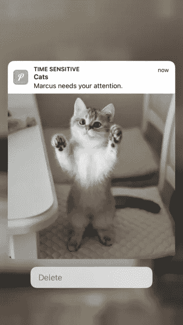

# 如何用情感分析构建 Chrome 扩展

> 原文：<https://betterprogramming.pub/how-to-build-a-chrome-extension-with-sentiment-analysis-89b7e19560b1>

## 伤心时送猫 chrome 分机

[腾雅特](https://unsplash.com/@tengyart?utm_source=medium&utm_medium=referral)在 [Unsplash](https://unsplash.com?utm_source=medium&utm_medium=referral) 上的照片

不久前，我看到有人做了一个项目，在你难过的时候给你发猫的照片。我想，哇，这正是我生活中需要的。

# 灵感

最初的项目利用面部识别来确定你是悲伤还是快乐。如果你在使用笔记本电脑时感到悲伤，它会给你发送一个带有可爱猫咪图像的电话通知。

 [## GitHub-Healey codes/if-sad-send-cat:🐱一个程序，发送猫到我的手机，当我在…

### 我的博客帖子:当我难过时，我的电脑会给我发送猫。如果你在电脑前难过，这个项目会发送一个…

github.com](https://github.com/healeycodes/if-sad-send-cat) 

如果我们使用一个名为 [ML5js](https://ml5js.org/) 的库，我们可以很容易地将面部识别集成到 chrome 扩展应用程序中。

然而，从我构建带有面部识别的 Chrome 扩展的经验来看，该应用程序将耗尽您计算机上的大部分 CPU。

此外，用户将不得不保持他们的网络摄像头的所有时间，它的工作。没人希望如此。

# 这个计划

我们将对用户输入的文本进行情感分析，而不是使用面部识别。

为你的心情想象语法。

# 第一步。找到一个基础开始

当然，你可以去 Chrome 扩展文档的“入门”部分。

事实上，如果这是你的第一个 Chrome 扩展，这里有另一篇文章详细解释了这个过程:[https://medium . com/better-programming/how-to-build-your-first-Chrome-extension-8 abdee9a 4365](https://medium.com/better-programming/how-to-build-your-first-chrome-extension-8abdee9a4365)

但是如果你已经熟悉了 Chrome 扩展的组成部分，那么这个库是一个很好的样板文件:[https://github . com/chibat/Chrome-extension-typescript-starter](https://github.com/chibat/chrome-extension-typescript-starter)

# 第二步。倾听用户的输入

我不是说要成为一个好的倾听者，倾听用户的意见。

但是为了进行情感分析，我们需要捕捉 Chrome 扩展用户输入的文本。

无论他们是在打电子邮件还是在谷歌上搜索，它都会给我们暗示他们的感受。

我们在哪里写代码？

在内容脚本中，我们希望捕获用户当前关注的元素。

所以你可能会问，其他像`input`、`textarea`等元素呢？？

假设你的用户是人类，通常，一个用户一次只能在一个地方打字。在他们转到另一个输入之前，他们将点击下一个输入，这将改变页面上的焦点。

在浏览器的 JavaScript 中，`document`对象已经有了一个名为`activeElement`的属性，它就是做这个的。获取页面关注的元素。

当内容脚本初始化时，我们将触发一个获取活动元素的函数，并监听页面上的焦点变化。

回调函数将总是返回页面关注的最新元素。

您可能会注意到，我们有一个检查元素类型的函数。可以编辑的明显元素是`<textaread/>`和`<input/>`。

不太明显的一个是具有`contenteditable`属性的元素，它将一个常规的`
`变成一个编辑区域。当你在 Gmail 中输入电子邮件或在 Medium 上写文章时，就会发生这种情况。

使用活动元素，您将能够听到输入。代码如下:

您可能会注意到，我们用`setTimeout`来决定是否要触发`search`函数。这是因为我们不想太频繁地调用我们的 API，而且也想得到更有意义的句子而不是单个的字母。

# 第三步。向服务器发送数据

然后它把我们带到了搜索功能。这个函数应该将用户的文本发送到我们的 API，以了解该文本是“正面的”、“中性的”还是“负面的”

另一种选择:

如果不想构建自己的情感分析 API，可以使用现有的服务。不利的一面是，你将不得不为服务付费，但肯定会节省你的时间。

 [## 情感分析

### 这个情感分析 API 提取给定文本字符串中的情感。情感分析，也称为“观点…

deepai.org](https://deepai.org/machine-learning-model/sentiment-analysis) 

# 第四步。设置您的 API

您可以使用 python 来设置您的服务器，但是因为我更熟悉 JavaScript。我们将使用 Node.js。

在我们的端点中，我们将解析请求体以获得以下内容:

对于实际做情感分析的部分，我们将使用 Tensorflow.js 来预测结果。

在我们的`setupSentimentModel`函数中，我们将加载模型。

加载模型和元数据。你可以训练自己的情感分析模型，但是你也可以在网上找到可用的模型。

一旦加载了模型和元数据，我们就可以使用`getSentimentScore`函数来处理文本。

我们将把文本转换成一个索引序列，因为 tensor2d 需要一个数字数组。方法如下:

# 第五步。显示猫的照片

在最初的项目中，作者选择在手机上向用户发送通知。

但是由于我们已经在 Chrome 浏览器中，我们可以打开一个新的标签，显示猫的图片。

对于猫的图片，已经有一个 API 了。

 [## 猫 API -猫即服务。

### 一个关于猫的公共服务 API，在制作你的新应用、网站或服务时可以免费使用。

thecatapi.com](https://thecatapi.com/) 

在我们的搜索功能中，您可能已经注意到了`notifyUser`功能。这就是我们将得到猫的照片并展示给用户的地方。

仅向 thecatapi.com 发出一个 API 请求，以获取一张随机的可爱猫咪图片。然后，我们将在后台脚本上触发一个事件，打开一个带有猫图像的选项卡。

在后台，我们需要做的就是监听该事件并创建带有猫图像 URL 的选项卡。

# 参考

Chrome 扩展代码:【https://github.com/davidyu37/therapypet-chrome-extension 

情感分析服务器代码:【https://github.com/davidyu37/sentimentserver 

Chrome 商店上的治疗宠物:

 [## 治疗宠物

### 当你难过的时候给你可爱的图像

chrome.google.com](https://chrome.google.com/webstore/detail/therapy-pet/dppfkiegdpndagfcmhbpjfcnbodekgoa) 

感谢阅读！敬请关注更多内容。