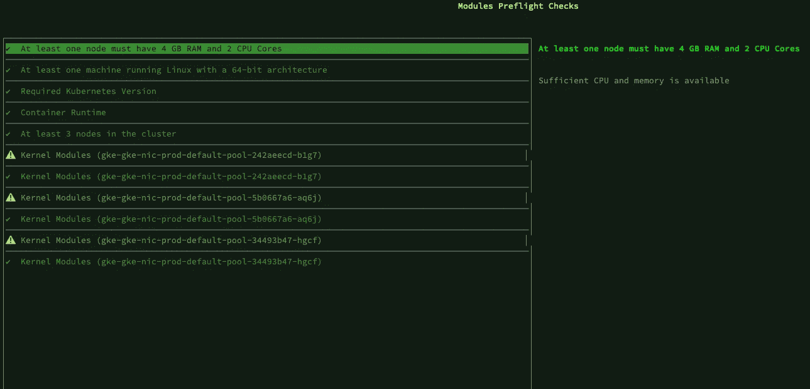

# 为 Kubernetes 有状态应用程序部署和配置 Kustomize 和 MongoDB

> 原文：<https://betterprogramming.pub/how-to-build-a-ci-cd-pipeline-for-kubernetes-stateful-applications-2d6676713397>

## 第 2 部分:让我们在 CI/CD 管道中安装 MongoDB 操作符和 Ondat


由 [Vlad Hilitanu](https://unsplash.com/@vladhilitanu?utm_source=medium&utm_medium=referral) 在 [Unsplash](https://unsplash.com?utm_source=medium&utm_medium=referral) 上拍摄的照片

这是系列文章的第二篇。第一个是可用的[这里是](/how-to-build-a-ci-cd-pipeline-for-kubernetes-stateful-applications-aef6c8c5edc2?sk=9e7aa51f55483fd0e8cbf8e38db94430)，在这里我们展示了一些工具，允许我们创建一个 Kubernetes 友好的自动化环境，用于开发基于 Flask、MongoDB、Pymongo 和漫威 API 的 web 应用程序。在第二部分中，我们部署和配置 Kustomize、MongoDB 和 Ondat。

# 安装和配置 Kustomize

正如在上一篇文章中提到的，有 2 种方法可以使用 Kustomize。您可以本机使用`kubectl -k`或安装二进制文件。对于后者，您可以使用以下命令自动检测您的操作系统并安装 Kustomize:

```
curl -s "https://raw.githubusercontent.com/kubernetes-sigs/kustomize/master/hack/install_kustomize.sh"  **|** bash
```

然而，这个脚本不适用于基于 ARM 的架构。或者，导航到[发布页面](https://github.com/kubernetes-sigs/kustomize/releases)，为您的发行版选择正确的二进制文件，并将其移动到您的`$PATH`中。

为了测试 Kustomize 是否按预期工作，您可以从[https://github.com/vfiftyfive/CFD12-Demo-Manifests](https://github.com/vfiftyfive/CFD12-Demo-Manifests)下载应用程序清单并生成开发清单。为此，运行以下命令:

```
$ git clone [https://github.com/vfiftyfive/CFD12-Demo-Manifests](https://github.com/vfiftyfive/CFD12-Demo-Manifests) && cd CFD12-Demo-Manifests
Cloning into 'CFD12-Demo-Manifests'...
remote: Enumerating objects: 164, done.
remote: Counting objects: 100% (164/164), done.
remote: Compressing objects: 100% (96/96), done.
remote: Total 164 (delta 80), reused 136 (delta 52), pack-reused 0
Receiving objects: 100% (164/164), 15.02 KiB | 3.75 MiB/s, done.
Resolving deltas: 100% (80/80), done.$ kustomize build overlay/dev 
allowVolumeExpansion: true
apiVersion: storage.k8s.io/v1
kind: StorageClass
metadata:
  name: ondat
parameters:
  csi.storage.k8s.io/controller-expand-secret-name: csi-controller-expand-secret
  csi.storage.k8s.io/controller-expand-secret-namespace: kube-system
  csi.storage.k8s.io/controller-publish-secret-name: csi-controller-publish-secret
  csi.storage.k8s.io/controller-publish-secret-namespace: kube-system
  csi.storage.k8s.io/fstype: ext4
  csi.storage.k8s.io/node-publish-secret-name: csi-node-publish-secret
  csi.storage.k8s.io/node-publish-secret-namespace: kube-system
  csi.storage.k8s.io/provisioner-secret-name: csi-provisioner-secret
  csi.storage.k8s.io/provisioner-secret-namespace: kube-system
  storageos.com/replicas: "1"
provisioner: csi.storageos.com...
```

我们截断了输出，但是该命令生成了将应用程序部署到 dev 集群所需的所有清单。你还可以注意到在`base`和`dev`文件夹中有一个名为`kustomization.yaml`的附加文件。Kustomize 需要这些文件来了解要呈现哪些清单以及如何呈现。位于`base`文件夹中的定制文件包含以下代码:

```
apiVersion: kustomize.config.k8s.io/v1beta1
kind: Kustomization
resources:
- ondat_sc.yaml
- mongo_sts.yaml
- marvel_deploy.yaml
- job.yaml
- marvel_svc.yaml
```

一旦 Kustomize 查看了`base`文件夹，它就将定制应用于在 *resources* 下的文件中描述的所有子 YAML 资源。

*dev* 文件夹还包含一个`kustomization.yaml`文件，该文件详细描述了呈现最终版本清单所需的特定更改。

```
apiVersion: kustomize.config.k8s.io/v1beta1
kind: Kustomization
patchesStrategicMerge:
- ondat_sc.yaml
- marvel_deploy.yaml
- mongodbcommunity_cr.yaml
- job.yaml
resources:
- ../../base
configMapGenerator:
- name: mongo-config
  literals:
  - MONGO_SEED0=mongodb-0.mongodb.default.svc.cluster.local
  - MONGO_SEED1=mongodb-1.mongodb.default.svc.cluster.local
  - MONGO_SEED2=mongodb-2.mongodb.default.svc.cluster.local
  - OFFSET=600
  - MONGO_USERNAME=admin
secretGenerator:
- name: admin-password
  literals:
  - password=mongo
configurations:
- name_reference.yaml
```

让我们来看看不同的部分:

*   列出了 Kustomize 在构建目标清单时应该查看的文件。这些文件位于 *dev* 文件夹下，描述了应用于位于 *base* 文件夹中的清单的修改。这些文件可以在 git repo 中访问，下面是它们描述的更改的摘要:
*   `ondat.sc.yaml` *:* 使用`StorageClass`为所有卷创建 1 个副本，并启用加密。
*   `marvel_deploy.yaml` *:* 设置副本数量为 2，从 Kustomize `Secret`生成器注入 MongoDB 密码，从`configMap`生成器添加环境变量。
*   `mongodbcommunity_cr.yaml`:设置 MongoDB 版本为 5.0.5，设置 admin 用户，使用 Ondat `StorageClass`配置带有`volumeClaimTemplate`的 Kubernetes `StatefulSet`，设置数据和日志卷大小。
*   `job.yaml` *:* 从 Kustomize `Secret`生成器注入 MongoDB 密码，从`configMap`生成器注入环境变量。

在其余部分，我们有:

*   `resources`，定义基本清单的位置。
*   `configMapGenerator`，每次 Kustomize 运行时都会生成一个具有唯一名称的`configMap`。您可以使用文字或文件来定义变量。
*   `secretGenerator`，Kustomize 每次运行时都会生成一个唯一名称的`Secrets`。您可以使用文字或文件来定义您的秘密。
*   `configurations`，指定 Kustomize 用来修改或插入特定值的自定义对象路径。例如，在我们的场景中，Kustomize 动态配置对 MongoDB 定制资源中秘密的引用。由于它是一个定制资源，Kustomize 不知道在哪里可以找到等价的秘密名称参数。相反，我们在文件`name_reference.yaml`中定义它:

```
nameReference:
- kind: Secret
  fieldSpecs:
  - kind: MongoDBCommunity
    path: spec/users/passwordSecretRef/name
```

因此，每次调用 Kustomize 时，都会在这个位置添加一个由初始的`Secret`名和一个随机字符串组成的唯一的`Secret`名。Kustomize 还将替换相关资源中本地对象 YAML 定义内的所有秘密。这些是您在`kustomization.yaml`文件中定义的资源。

# 安装并配置 MongoDB 操作符

对于本文，我们使用了 [MongoDB 社区操作符](https://github.com/mongodb/mongodb-kubernetes-operator)，因为它免费且易于使用。但是，对于生产环境，我们建议使用企业版的操作器，或者准备好自己支持它并从社区获得帮助。有多种选项可用，比如 [MongoDB 企业操作符](https://docs.mongodb.com/kubernetes-operator/master/)、 [Percona 操作符](https://github.com/percona/percona-server-mongodb-operator)或 [KubeDB 操作符](https://kubedb.com/docs/0.8.0-beta.0/guides/mongodb/overview/)。

## 了解操作员

你们中的一些人可能不熟悉 Kubernetes 操作员，也不知道为什么我们需要一个操作员来安装一个数据库集群。所以让我们稍微关注一下这方面。Kubernetes 操作员基本上由两部分组成:

*   作为容器提供的一段代码，它持续监视 Kubernetes API 中的特定对象，并根据这种主动监视执行操作。它被称为**定制控制器。**
*   受监控的自定义资源。自定义资源是非本机的 Kubernetes 对象。自定义资源模式在自定义资源定义(CRD)中定义，由用户作为 YAML 文件提供，并发送给 Kubernetes API。用该模式创建的每个对象都进一步保存在 Kubernetes etcd 存储中。您可以将 CRD 比作 OOP 中的一个类，将自定义资源比作该类的一个实例。它扩展了现有的 Kubernetes API。

Kubernetes 操作员的工作是执行自动化操作，并像人类操作员一样与集群或集群外的系统进行交互。它不仅限于部署组件。它可以执行 CRUD 操作来响应 Kubernetes 事件，这些事件本质上是动态的。它利用事件数据作为工作流的输入。运营商的一个常见用例是在 Kubernetes 中自动部署软件解决方案。因此，在数据库的情况下，一旦 Kubernetes API 获取了相应的数据库资源，Kubernetes 操作员就会安装数据库(集群或独立的)，通常以 YAML 清单的形式，将数据库的配置描述为定制资源。

另外，记住数据库是作为`StatefulSet`部署的。当您扩展`StatefulSet`时，Kubernetes 不会自动*扩展数据库集群。它只是用数据库映像部署新的容器。需要做一些额外的工作来配置它。它由 Kubernetes 操作员执行。当你缩小`StatefulSet`的时候也是一样。*

在 MongoDB 操作符的例子中，添加的 CRD 产生了一个种类为`mongodbcommunity`的对象。定制资源封装了部署和维护 MongoDB 数据库所需的所有信息。首先，您需要安装操作符并创建自定义资源。这可以在 Kubernetes 集群的自动部署过程中实现，也可以在集群安装后手动实现。你可以在这个 [repo](https://github.com/vfiftyfive/mongodb-community-operator-manifests) 中找到所有需要的文件。我们将执行几个步骤来安装操作符:

*   安装 CRD
*   创建操作员配置清单。可以参考 [MongoDB 社区运营商](https://github.com/mongodb/mongodb-kubernetes-operator/blob/master/docs/install-upgrade.md)文档和例子。您还可以找到我们在 [git repo](https://github.com/vfiftyfive/mongodb-community-operator-manifests.git) 中使用的配置。运营商配置清单是`manager.yaml`。

您需要首先配置操作符的范围。它定义了操作员监视哪些名称空间:安装操作员的`Namespace`、特定的名称空间或所有名称空间。在我们的示例中，`manager.yaml`文件具有以下配置:

```
env:
- name: WATCH_NAMESPACE
  value: "*"
```

它告诉操作员监视 MongoDB 定制资源操作的所有名称空间。

*   创建集群范围的角色和角色绑定。必须用您想要使用的名称空间的名称来修改`ClusterRoleBinding`服务帐户名称空间(在下面的文本中以粗体显示)。它位于文件`clusterwide/role_binding.yaml`中

```
kind: ClusterRoleBinding
apiVersion: rbac.authorization.k8s.io/v1
metadata:
  name: mongodb-kubernetes-operator
subjects:
- kind: ServiceAccount
  namespace: **mongo-operator**
  name: mongodb-kubernetes-operator
roleRef:
  kind: ClusterRole
  name: mongodb-kubernetes-operator
  apiGroup: rbac.authorization.k8s.io
```

*   对于您希望操作员观察的每个名称空间，您需要在该名称空间中部署一个`Role`、`RoleBinding`和`ServiceAccount`
*   最后一步是创建和部署数据库配置清单(定制资源)，这将在后面详述。

## 部署操作员

执行以下命令来安装和配置操作员:

```
#Clone the git repository
$ git clone [https://github.com/vfiftyfive/mongodb-community-operator-manifests](https://github.com/vfiftyfive/mongodb-community-operator-manifests) && cd mongodb-community-operator-manifests
Cloning into 'mongodb-community-operator-manifests'...
remote: Enumerating objects: 17, done.
remote: Counting objects: 100% (17/17), done.
remote: Compressing objects: 100% (14/14), done.
remote: Total 17 (delta 5), reused 15 (delta 3), pack-reused 0
Receiving objects: 100% (17/17), done.
Resolving deltas: 100% (5/5), done.#Install the CRD
$ kubectl apply -f mongo-crd.yaml#Deploy the clusterwide RBAC resources
$ kubectl apply -f clusterwide/
clusterrole.rbac.authorization.k8s.io/mongodb-kubernetes-operator created
clusterrolebinding.rbac.authorization.k8s.io/mongodb-kubernetes-operator created#Create a namespace for the operator
$ kubectl create ns mongo-operator
namespace/mongo-operator created#Deploy namespace RBAC resources in the operator namespace.
$ kubectl apply -k rbac/ -n mongo-operator
serviceaccount/mongodb-database created
serviceaccount/mongodb-kubernetes-operator created
role.rbac.authorization.k8s.io/mongodb-database created
role.rbac.authorization.k8s.io/mongodb-kubernetes-operator created
rolebinding.rbac.authorization.k8s.io/mongodb-database created
rolebinding.rbac.authorization.k8s.io/mongodb-kubernetes-operator created#Deploy namespace RBAC resources in the default namespace (where the app will be deployed)
$ kubectl apply -k rbac/ 
serviceaccount/mongodb-database created
serviceaccount/mongodb-kubernetes-operator created
role.rbac.authorization.k8s.io/mongodb-database created
role.rbac.authorization.k8s.io/mongodb-kubernetes-operator created
rolebinding.rbac.authorization.k8s.io/mongodb-database created
rolebinding.rbac.authorization.k8s.io/mongodb-kubernetes-operator created#Deploy the Operator
$ k apply -f manager.yaml -n mongo-operator
deployment.apps/mongodb-kubernetes-operator created#Check the Operator has correctly been deployed
$ kubectl get po -n mongo-operator
NAME                                           READY   STATUS ...
mongodb-kubernetes-operator-6d46dd4b74-ztx9c   1/1     Running ...
```

一旦操作员检测到 Kubernetes API 中添加了新的定制资源，就可以部署新的 MongoDB 数据库。

下一步是安装分布式存储层 Ondat(以前的 StorageOS)。

# 安装 Ondat

Ondat 提供了一个数据网格，作为一个分布式持久存储层，提供 Kubernetes 中默认不包含的高级功能。这包括复制、加密、性能优化、智能卷放置等，所有这些都作为原生 Kubernetes 标签和注释的一部分进行管理。

它可以通过一个`kubectl`插件用一行代码部署(或者使用一个可用的舵图[这里是](https://github.com/ondat/charts)):

```
kubectl storageos install --include-etcd
```

但是首先，让我们通过执行以下命令来安装插件:

```
curl -sSLo kubectl-storageos.tar.gz \
    https://github.com/storageos/kubectl-storageos/releases/download/v1.0.0/kubectl-storageos_1.0.0_linux_amd64.tar.gz \
    && tar -xf kubectl-storageos.tar.gz \
    && chmod +x kubectl-storageos \
    && sudo mv kubectl-storageos /usr/local/bin/ \
    && rm kubectl-storageos.tar.gz
```

因为您的 Kubernetes 主机的内核模块有一些[先决条件](https://docs.ondat.io/docs/prerequisites/systemconfiguration/)，所以您应该首先运行预检检查，通过运行以下命令来查看您的集群是否兼容:

```
kubectl storageos preflight
```

(快速提示:如果你使用 GKE，使用 *ubuntu_containerd* 镜像，它已经包含了*Linux-modules-extra-x . y . z*包)

该命令将输出如下所示的综合报告。该屏幕抓图描述了一个在我们的 3 节点群集中没有 NVMe 驱动器的示例。如果您没有运行性能密集型工作负载，可以安全地忽略此警告。



然后，您可以使用带有 install 子命令的插件:

```
kubeclt storageos install --include-etcd
```

该命令有许多选项。如果您考虑生产部署，您应该看一看它们并熟悉最佳实践。由于这不是本文的主题，我将在这里为您指出正确的方向！

要检查部署是否完成，请运行以下命令，确保`DaemonSet`已启动并正在运行:

```
$ kubectl get pods -n storageos | grep node                                                                                                                                                 
storageos-node-8chxx                     3/3     Running          
storageos-node-gsdzt                     3/3     Running          
storageos-node-sq2ds                     3/3     Running 
```

所有容器都必须启动并运行。您还应该注意到一个名为“storageos”的新`StorageClass`。但是请记住 Kustomize 将创建一个新的`StorageClass`，所以我们不会使用它。

我们现在已经部署和配置了 Kustomize、MongoDB 和 Ondat。这已经很多了！在下一部分中，我们将安装和配置 Skaffold，并构建管道来持续开发、部署和测试我们的应用程序。我们把最好的留到了最后，所以不要错过下一篇文章！