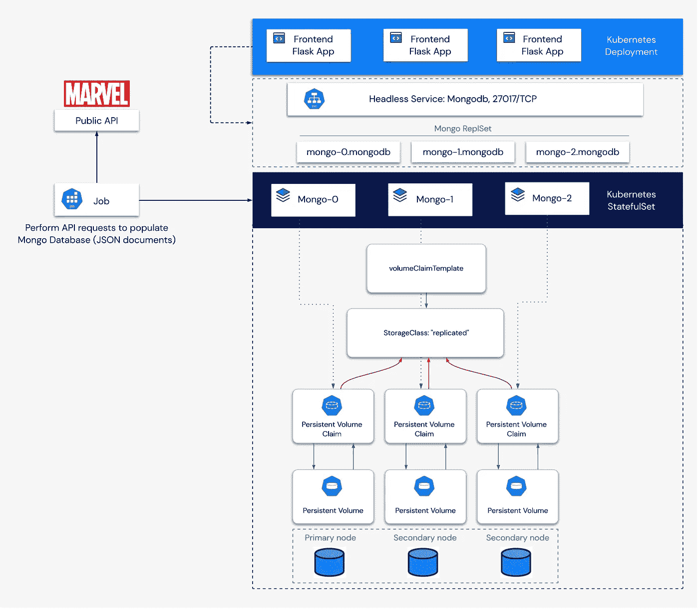
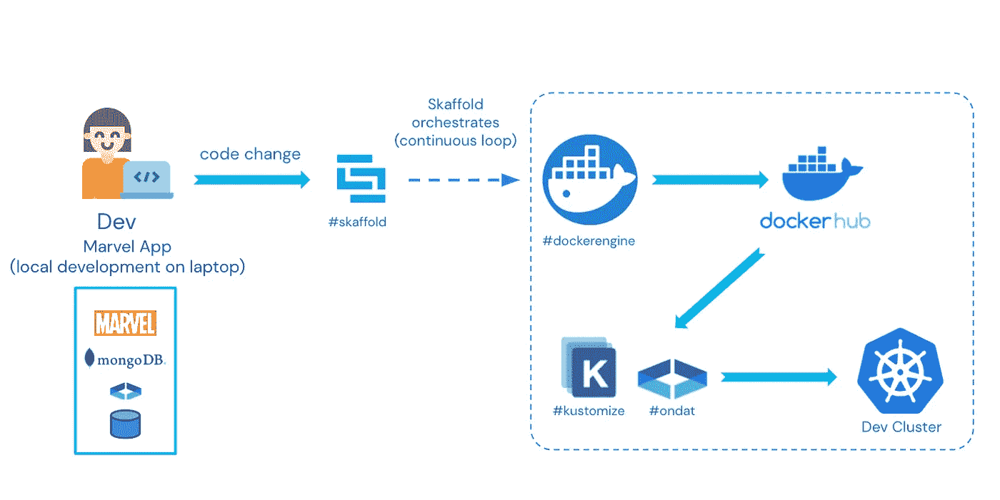

# 如何为 Kubernetes 有状态应用程序构建 CI/CD 管道

> 原文：<https://betterprogramming.pub/how-to-build-a-ci-cd-pipeline-for-kubernetes-stateful-applications-aef6c8c5edc2>

## 第 1 部分:让我们开始吧


在 [Unsplash](https://unsplash.com?utm_source=medium&utm_medium=referral) 上由 [Mourizal Zativa](https://unsplash.com/@mourimoto?utm_source=medium&utm_medium=referral) 拍摄的照片

*这一系列的帖子将带您体验构建一个简单(但很酷)的有状态应用程序的实践，这个应用程序是为运行在 Kubernetes 上而设计的。第 1 部分搭建了舞台。*

*链接到* [*第二部分*](/how-to-build-a-ci-cd-pipeline-for-kubernetes-stateful-applications-2d6676713397?sk=dc1ddae00099f55160f1f0eb60587404) *和* [*第三部分*](/how-to-use-skaffold-with-docker-and-kustomize-to-build-a-pipeline-for-stateful-applications-running-c74ca0e1c13a?sk=0aa5ab54cdbdcf2cf5997900c062b961) *。*

在 Kubernetes 中按需提供有状态的应用程序具有挑战性。有状态应用程序建立在数据库、消息总线或类似的将数据保存到磁盘的系统上。如果你认为，“嗯，几乎每个应用程序都是这样”，那么你是对的，但问题是，一般来说，后端并不在 Kubernetes 中。

此外，它们的架构通常分布在不同的平台上。通常，前端组件已经位于 Kubernetes 中，可以按需供应、扩展和关闭，因为它通常是无状态的。同时，数据集可以以各种格式和形式托管:本地虚拟机、公共云中的 PaaS 服务、大数据平台，甚至是物理机。

本系列探讨了在开发运行在 Kubernetes 上的有状态应用程序和构建按需数据服务时的 DevOps 体验。你可能会问，为什么要在 Kubernetes 中运行所有组件。目标是让应用程序所有者利用原生 Kubernetes 的优势，加快关键业务应用程序的发布。

我们将把重点放在工具集上，该工具集使开发人员能够有效地浏览这些应用程序的开发生命周期。也就是说，我们将深入研究:

*   草泽
*   斯卡福德
*   Ondat 持久卷
*   MongoDB 数据库和副本集
*   MongoDB 社区 Kubernetes 操作员
*   皮蒙戈

如果这不是有状态应用程序的最 DevOps 设置，我就不知道 DevOps 意味着什么了😆。

# 认识漫威应用程序

我们将建立一个应用程序，显示随机选择的漫威字符卡，以展示 Kubernetes 的能力。我们的目标也是探索 DevOps 工具如何适应应用程序开发过程。希望这将比另一个“Hello World”应用程序有趣得多！应用程序架构如下所示:



这里有代码:[https://github.com/vfiftyfive/FlaskMarvelApp](https://github.com/vfiftyfive/FlaskMarvelApp)。

FE(前端)组件是 Python Flask 应用程序。它的作用是为 MongoDB 数据库中的数据提供一个可视化层。它作为`Deployment`在库伯内特斯运行。

BE(后端)是一个 MongoDB 数据库，部署为一个 3 节点集群，由 MongoDB 社区 Kubernetes 操作员管理。从`StatefulSet`开始，它运行在 Kubernetes 中，这是需要将数据持久化到磁盘的应用程序的标准。

如图所示，`StatefulSet`利用 Kubernetes 控制器，通过声明绑定到单个`PVCs`的持久卷(`PV`)来确保每个`Pod`能够访问自己的数据存储。有关`StatefulSets`及其用例的更多信息，您可以在 Ondat 网站或官方 Kubernetes [文档](https://kubernetes.io/docs/concepts/workloads/controllers/statefulset/)中查看[这里](https://docs.ondat.io/docs/usecases/)。

作为应用程序部署的一部分，还提供了 Kubernetes `Job`。它的作用是从可用的漫威 API[获取漫威角色的信息，并将其存储在 MongoDB 数据库中。`Job`只在应用程序部署时运行一次。Kubernetes 将调度`Pods`，直到任务成功完成(在有限的重试次数内)。`Pods`可能会失败，等待与数据库的连接建立，但一旦成功，就再也不会重新运行。然后，FE 可以显示直接从数据库中检索的随机字符卡。](https://developer.marvel.com/)

该应用包括 FE +BE 和用相关信息填充 BE 的数据初始化步骤。它可以使用由命令行工具动态生成的 YAML 清单部署在 Kubernetes 中，或者作为 CI/CD 管道部署。Kustomize 是本文中我们用来生成清单的工具。它还可以更新与特定构建迭代相关的对象。使用 Kustomize，您可以轻松地更新容器映像引用，或者对于我们的用例，使用新版本的 Mongo 部署应用程序，或者提供新的 Ondat `StorageClass`。

# 模板化和自动化所有的事情！

这一切都始于在不同的开发阶段迭代应用程序测试和部署的能力，例如在本地笔记本电脑上，在远程测试集群上，或者在试运行、用户验收测试(UAT)和生产阶段。Kustomize 可以作为一个`kubectl`选项(`-k`)在生成应用程序清单时应用定制。该工具允许开发人员根据特定环境动态调整应用程序需求和上下文。然而，我们通常建议使用 Kustomize 作为一个单独的二进制文件，因为它更灵活并且总是最新的。

Kustomize 的原理是通过指定您想要修改的基本清单中的元素来构建一个覆盖图。在本文中，我们将重点放在应用程序开发阶段，在这个阶段，我们在本地 Kubernetes K3s 集群中对应用程序进行编码和测试。在这个用例中，Kustomize 需要两个文件夹，一个用于基本清单，一个用于 *Dev* 覆盖:

```
base\
    job.yaml
    kustomization.yaml
    marvel_deploy.yaml
    marvel_svc.yaml
    mongodbcommunity_cr.yaml
    ondat_sc.yaml
overlay\
    dev\
        job.yaml
        kustomization.yaml
        marvel_deploy.yaml
        mongodbcommunity_cr.yaml
        name_reference.yaml
        ondat_sc.yaml
```

这些文件的内容可以在 这里访问 [*。您可以简单地使用`build`选项运行 Kustomize 来生成适当的 Kubernetes 清单。例如，要用 *dev* 覆盖来修改基本清单，您可以运行`kustomize build overlay/dev`，假设您在“覆盖”目录的父文件夹中。输出是一组直接显示在终端上的清单，所以如果您想将结果保存为 YAML，只需将输出重定向到一个文件。另一种选择是使用`kustomize build`的输出作为`kubectl apply`的输入，如下所示:*](https://github.com/vfiftyfive/CFD12-Demo-Manifests)

```
kustomize build overlay/dev | kubectl apply -f -
```

它会直接将对象部署到您的 Kubernetes 集群中。

# 对准移动部件

当开发一个运行在 Kubernetes 上的应用程序时，您很早就会面临重复的任务。它们包括在提交新代码时构建新的容器映像，更新 Kubernetes 清单，以及将应用程序栈的新版本部署到 Kubernetes 测试集群中，以便可以执行测试。

我们的目标是提供一个管道来自动构建容器映像，相应地更新清单，并且一旦我们修改了源代码，*就会持续地*部署应用程序堆栈。工作流程如下所示:



Skaffold 就是让你做到这一点的工具之一。它是 Google 的一个开源项目，提供了一个 CLI 来管理 CI/CD 管道中各个阶段的应用程序的生命周期。它可以帮助您的应用程序的开发、构建和部署阶段。在我们的用例中，我们对早期开发阶段感兴趣。Skaffold 的作用是，在执行`git commit`并使用 Kustomize 将代码部署到 dev Kubernetes 集群之前，每次代码保存到本地时，从 FE Dockerfile 文件构建一个新的映像。因此，您不需要向 git 存储库提交或推送代码来测试它。

让我们从 FE [Dockerfile](https://github.com/vfiftyfive/FlaskMarvelApp/blob/master/Dockerfile) 的内容开始。

```
FROM python:3.9

WORKDIR /code

COPY ./requirements.txt /code/requirements.txt

RUN pip install --no-cache-dir --upgrade -r /code/requirements.txt

COPY ./app /code/app

CMD ["gunicorn", "--conf", "app/gunicorn_conf.py", "--bind", "0.0.0.0:80", "app.main:app"]
```

在这里，我们执行非常标准的操作:

*   安装 Flask 应用程序所需的依赖项
*   将源代码复制到容器中
*   使用`gunicorn` WSGI 运行 web 服务器(因为该应用程序不提供任何静态 HTML 页面，所以不需要`nginx`或其他 HTTP 服务器)。

ska fold*dev*模式允许您实时检测应用程序源代码中发生的任何变化，使用 docker 文件自动构建新的容器映像，并将其部署到 dev Kubernetes 集群。不需要通过 webhook 执行`git commit`或`git push`来触发这个过程。在这种模式下，Skaffold 二进制文件作为一个检测代码变化的守护进程运行。Skaffold 可以使用不同的工具部署应用程序组件。我们选择了 Kustomize，但是 Docker、kubectl 和 Helm 也是可用的选项。类似地，Skaffold 构建阶段可以利用 Dockerfiles、 [buildpacks](https://buildpacks.io/) 和[文档](https://skaffold.dev/docs/pipeline-stages/builders/)中提到的其他工具，以及定制脚本。

因为我们使用基于 ARM 的架构进行开发，所以我们需要一个自定义脚本来执行 Docker 跨平台构建。这里的[给出了这样一个脚本的例子](https://github.com/GoogleContainerTools/skaffold/tree/main/examples/custom-buildx)。我们使用的`build.sh`脚本位于漫威应用[库](https://github.com/vfiftyfive/FlaskMarvelApp)的根目录下。它包含与示例中相同的代码。Skaffold 利用这个脚本在构建阶段构建图像工件。然后，Kustomize 动态生成 Kubernetes 清单，Skaffold 将它们部署到集群中。

如果您的机器运行在 x86 处理器上，您不需要任何定制脚本或额外的构建命令。但是不要担心，我们将详细研究每个组件！

下一次，我们将通过完成建造这条管道所需的每一个步骤来弄脏我们的手。我们还将深入研究 MongoDB 操作符，并解释为什么需要它！