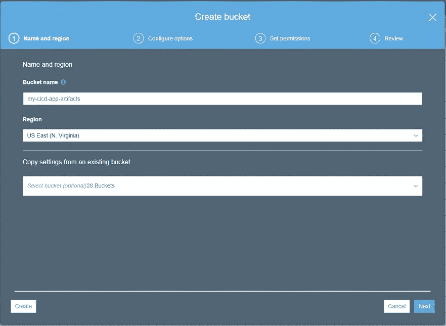
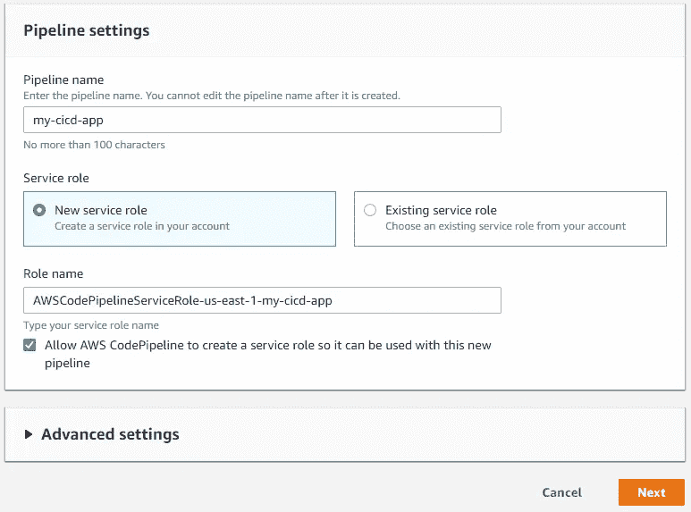
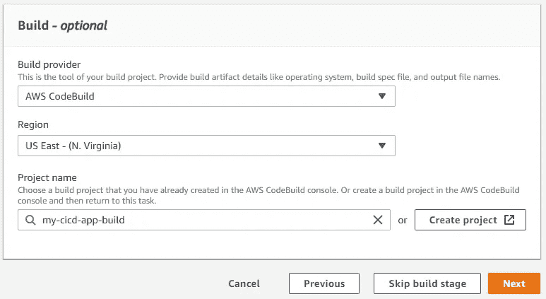
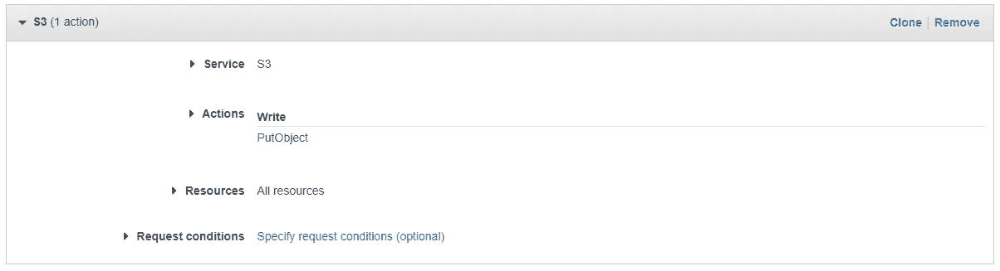

# 如何在 5 分 58 秒内在 AWS 中构建 CI/CD 管道

> 原文：<https://betterprogramming.pub/how-to-build-a-ci-cd-pipeline-in-aws-in-5-minutes-and-58-seconds-4de156477042>

## 是的，真的。我计时了


照片由[迈克·奥斯丁](https://unsplash.com/@bigmike48?utm_source=medium&utm_medium=referral)在 [Unsplash](https://unsplash.com?utm_source=medium&utm_medium=referral) 拍摄

如果你和我一样，你不会再想把时间花在与 DevOps 程序的斗争上了。获得要构建和部署的代码是一个需要解决的问题，对吗？没错。

AWS 已经确定了 CI/CD。为了清楚起见， *CI/CD* 代表*持续集成，持续交付*。简单地说，如果您有一个 CI/CD 管道，无论何时您将代码推送到您的存储库，它都会自动编译并在您的开发环境中安装您的软件。听起来不错吧？确实是。

让我们来看看如何在不到六分钟的时间内从头开始构建一个完全托管的管道。我说的是在这段时间内在云中建立和部署存储库和管道**和**。让我们开始吧。

# 先决条件

该管道使用 SAM 模板来构建和部署无服务器应用程序。在我们开始之前，您需要安装 [AWS CLI](https://aws.amazon.com/cli/) 和 [SAM CLI](https://docs.aws.amazon.com/serverless-application-model/latest/developerguide/serverless-sam-cli-install.html) ，并为您的 AWS 用户帐户提供 Git 凭证。

# 创建存储库

在这个解决方案中，我们将使用完整的 AWS，因此对于我们的存储库管理，我们将使用 [CodeCommit](https://aws.amazon.com/codecommit/) 。CodeCommit 是一个基于 Git 的存储库管理服务。因此，第一步，登录您的 AWS 帐户，选择一个地区，并打开 CodeCommit 控制台。

点击`Create Repository`按钮，给你的新回购命名。


# 初始提交

在您的机器上，导航到您存储工作区的目录，并下拉您刚刚创建的空存储库。CodeCommit 为 Git 提供了 HTTPS 和 SSH 选项，所以使用您喜欢的选项。

现在我们需要添加 HelloWorld lambda 函数。SAM 模板可以帮助我们做到这一点:

```
sam init --name my-cicd-app --runtime nodejs10.x
```

这将为我们生成一个基本的 Hello World lambda 函数，用 NodeJS 10 编写。然而，我们的管道缺少一样东西:buildspec.yml 文件。对于我们的快速管道，我们将只使用一个最小的文件。您可以根据需要向该文件添加或多或少的内容。

将该文件添加到项目的根目录，提交并推送到 master。

# 创建 S3 存储桶

您的存储库将需要一个地方来存储构建工件。我们将使用亚马逊 S3 的存储服务。我们在`buildspec.yml`中使用的 build 命令将为我们自动删除这个桶中的所有工件。

导航到 S3 控制台，点击`Create Bucket`。为您的存储桶命名，但是请注意，S3 存储桶名称需要是全局唯一的。这意味着世界上可能没有其他人有和你同名的桶。一般来说，我喜欢把我的桶命名为`(project name)-artifacts`。



# 创建管道角色

AWS 中的一切都是通过 IAM 服务由角色管理的。在我们建立管道之前，我们需要建立一个角色，它将允许我们的管道执行它所需要的一切。

导航到 IAM 控制台，点击导航窗格上的`Roles`。点击`Create role`按钮，调出新的角色画面。

为“可信实体的类型”选择`AWS Service` ，为“将使用角色*的服务”选择`CloudFormation`* 点击`Next: Permissions`继续。

由于您的管道将创建任意数量的资源，并且需要在 AWS 的几乎每个领域执行任务，我们需要赋予这个角色`AdministratorAccess`。选择 AdministratorAccess 权限旁边的复选框，并点击`Next: Tags`。

如果你愿意，你可以添加标签，但是我们的管道现在不需要它们，所以点击`Next: Review`。

最后，给它一个对你有意义的名字。这个角色可以在所有管道中重用，所以我喜欢给它一个通用的名字，比如`CloudFormationAdminRole`。一旦你命名了你的角色，点击`Create Role`。

# 建造管道

基本的 CI/CD 管道由三部分组成:

*   源代码控制
*   建设
*   部署

我们已经用 CodeCommit 设置了源代码控制，但是我们仍然需要配置构建和部署部分。幸运的是， [AWS CodePipeline](https://aws.amazon.com/codepipeline/) 将带我们完成组装，并为我们连接它们。

导航到 AWS 中的代码管道控制台并点击`Create Pipeline`。

为您的管道命名。我喜欢使用我的存储库名称来方便地跟踪事物。请注意，角色名称字段将在您键入名称时填写。点击`Next`。



您已经创建了存储库并完成了初始提交，因此下一个屏幕将很容易。

*   **源提供者:** AWS 代码提交
*   **存储库名称:**您的存储库名称(对于本教程为 my-cicd-app)
*   **分行名称:**主

将 CloudWatch 事件作为检测选项。每当对您的存储库进行推送时，它都会触发管道运行。另一个选项将不时地轮询以查看是否发生了变化。点击`Next`。

现在我们需要为我们的项目建立一个构建。在构建提供者*中选择`AWS CodeBuild`。*下一步，点击`Create Project` 按钮。这将打开一个对话框，引导我们创建一个新的 CodeBuild 项目。

该对话框中有许多字段，所以我将只包括您需要配置的字段。

*   **项目配置>项目名称:**您的构建的名称。我遵循命名惯例“(项目名)-构建”
*   **环境>操作系统:**亚马逊 Linux 2
*   **环境>运行时:**标准
*   **环境>图片:**AWS/codebuild/amazonlinux 2-x86 _ 64-标准:1.0
*   **环境>附加配置>环境变量>名称:**构建 _ 输出 _ 存储桶
*   **环境>附加配置>环境变量>值:**我们 S3 桶的名字。我们的例子是`my-cicd-app-artifacts`

保留所有其他字段的默认值，然后点击`Continue to CodePipeline`。这将关闭对话窗口并返回到*添加构建阶段*屏幕。

我们的构建现在应该被填充到*项目名称*字段中。点击`Next`。



接下来，我们将配置部署阶段。在*部署提供者*下拉菜单中选择`AWS CloudFormation`。按如下方式填写其他字段:

*   **动作模式:**创建或更新堆栈
*   **栈名:**使用项目名。我们的例子是`my-cicd-app`
*   **工件名称:** BuildArtifact
*   **文件名:** packaged.yaml(从我们的 buildspec.yml 生成)
*   **功能:**选择功能 _IAM 和功能 _ 自动 _ 扩展
*   **角色名称:**使用我们为管道创建的角色。我们的例子是 CloudFormationAdminRole

点击`Next`进入评论页面。点击`Create pipeline`来触发 AWS 构建所有的部分并将它们粘在一起。

# 更新生成权限

如前所述，AWS 中的一切都是由角色和权限驱动的。对于我们的管道，CodeBuild 将需要权限来将我们的构建工件放入我们创建的 S3 桶中。因此，我们需要导航回 IAM 控制台。

我们将创建一个新的策略，该策略可以在以后的所有管道中重复使用。点击导航窗格中的`Policies` 并点击`Create Policy`。填写以下值:

*   服务: S3
*   **动作>写:**放置对象
*   **资源:**所有资源

点击`Review policy`，将其命名为`AddArtifactsToS3` **。**打`Create policy` **。**



在导航窗格中点击`Roles`并搜索我们的 CodeBuild 角色。应该命名为“codebuild-(项目名)-service-role。”单击角色进行编辑。

我们需要将新策略附加到 CodeBuild 角色，因此点击`Attach Policies` 并搜索`AddArtifactsToS3`。点击`Attach Policy` 继续。

# 运行管道

当我们为 CodeBuild 设置写入 S3 的权限时，管道可能会运行并失败。因此，现在我们希望触发管道再次运行，因为它拥有正确的权限。

导航到代码管道控制台，并从列表中选择您的管道。按下**释放变化**按钮，启动管道。

整个过程现在应该运行无误。完成后，您应该已经部署了 Hello World 函数，并且可以访问它了！

# 尽情享受吧！

此时，您应该能够开始修改`buildspec`和模板文件来创建您自己的项目。每次推送时，资源都会自动为您部署。

现在，您可以将注意力集中在真正重要的地方，即业务上。将您的时间花在创新和创造价值上，而不是与部署脚本和监控基础架构斗争。