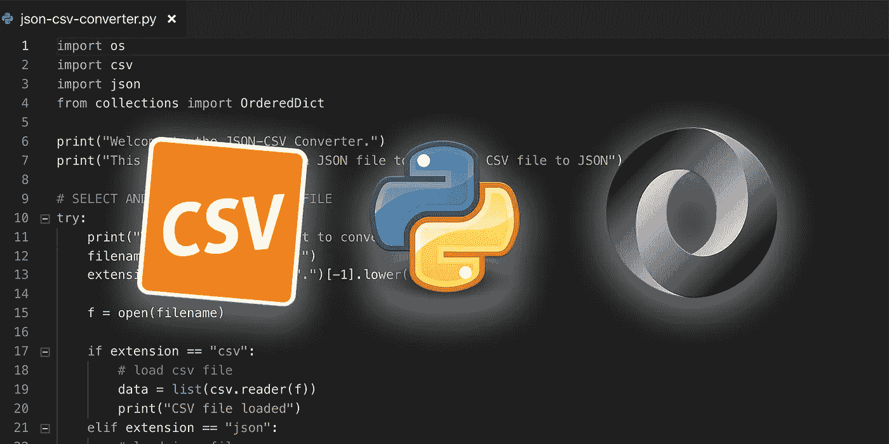

# 如何用 Python 构建命令行 JSON/CSV 转换器

> 原文：<https://betterprogramming.pub/how-to-build-a-command-line-json-csv-converter-in-python-204d74563456>

## 关于如何构建 CSV 到 JSON/JSON 到 CSV 转换器的分步演练



我不是开发商。我有一些编程的背景，但是我想说我更擅长跟随教程而不是编程。我开始这个项目，因为我厌倦了谷歌在线转换器和运行到文件的限制。该项目可在[https://github.com/jhsu98/json-csv-converter](https://github.com/jhsu98/json-csv-converter)获得，但是如果你想知道我是如何建造它的，那么请继续。

在我们开始之前，我假设您已经安装了 Python 3.x，并且知道要运行脚本，您需要键入`python3 json-csv-converter.py`。

# 入门指南

我们需要导入四个库:os、csv、json 和 OrderedDict。跟随教程时，有一件事让我慢了下来，那就是不知道每个导入是用来做什么的。这里有一个快速纲要:

*   操作系统:操作文件名并检查文件是否存在
*   **csv:** 导入 csv 文件并写入转换后的 CSV 文件
*   **json:** 导入 json 文件并写入转换后的 JSON 文件
*   **OrderedDict:** 创建一个有序字典，它跟踪添加到对象的顺序属性。这是来自模块`collections`。

为了导入这四个库，我们将使用`import`关键字，后跟模块名。

```
import os 
import csv 
import json 
from collections import OrderedDict
```

接下来，让我们添加一些欢迎用户使用我们的脚本的描述性文本。

```
print("Welcome to the JSON-CSV Converter.") 
print("This script will convert a JSON file to CSV or a CSV file to JSON")
```

# 请求并加载文件

从这里开始，下一步是请求加载文件。我们可以做一个简单的输入，但是，如果文件不存在，我们的脚本的其余部分将无法工作。所以我们将使用 try/except/else 语句来控制我们的脚本流。以下是大致的结构:

```
try: 
   # ask for the filename 
   # load data 
except Exception as e: 
   # print error message, exit script
   print("Error opening file ... exiting:",e) 
   exit() 
else: 
   # convert the file and save the output
```

如果您仍然不确定代码块是如何工作的，那么 *try* 部分将会执行，如果出现任何错误，除了部分之外的*部分将会执行。假设没有出错，一旦 try 部分完成，将执行 *else* 部分。*

现在让我们具体询问文件名并加载文件。我们使用`input`函数向用户询问文件名，并在基于句点(`.`)进行分割时通过获取最后一部分来确定扩展名。然后，我们将使用适当的方法读入文件— `csv.reader()`或`json.load()`—同时打印一条错误消息，如果文件没有适当的扩展名，则退出。

```
try: 
   print("Which file do you want to convert?") 
   filename = input("Filename: ") 
   extension = filename.split(".")[-1].lower() 
   f = open(filename) 
   if extension == "csv": 
      # load csv file data = list(csv.reader(f)) 
      print("CSV file loaded") 
   elif extension == "json": 
      # load json file data = json.load(f, object_pairs_hook=OrderedDict) 
      print("JSON file loaded") 
   else: 
      print("unsupported file type ... exiting") 
      exit()
```

这里的论点`object_pairs_hook=OrderedDict`很关键。如果没有这个设置，JSON 键值对将是无序的，这意味着每个对象的属性将以不同的方式显示。 *OrderedDict* 设置将确保属性保持其被读取的顺序。

# 将 CSV 转换为 JSON

我们将首先把 CSV 处理成 JSON。因为 CSV 文件是表格形式的，所以第一行将包含每一列的名称。这些列名将成为 JSON 的键值对结构中的键。键是对象中值的标识符。知道了第一行是键，我们现在需要遍历剩余的数据行。为所有转换后的数据创建一个空列表后，将对每个包含数据的行执行以下步骤:

1.  创建一个新的空有序字典
2.  遍历每个值(电子表格中的每个单元格是什么)
3.  将键-值对添加到有序字典中，其中键是来自第一行的文本，值是数据(如果存在)或者是空的`None`。
4.  将该行的所有单元格添加到有序字典后，将对象添加到更大的数组中。

```
# CONVERT CSV TO JSON
if extension == "csv":
   keys = data[0]
   converted = []
   for i in range(1, len(data)):
      obj = OrderedDict()
      for j in range(0,len(keys)):
         if len(data[i][j]) > 0:
            obj[keys[j]] = data[i][j]
         else:
            obj[keys[j]] = None
      converted.append(obj)
```

请务必仔细阅读代码。我们正在嵌套循环，所以外部循环使用变量`i`，而内部循环使用变量`j`。另外，请注意，外部循环从范围的索引 1 开始，因为第一行包含键而不是数据。

# 将 JSON 转换为 CSV

现在编写将 JSON 转换成 CSV 的部分。块的一般结构是相似的，但是部分更复杂一点。这是因为在一个 CSV 文件中，所有的键都方便地位于第一行。在 JSON 文件中，每个对象都独立于其他对象，这意味着它可能有其他对象没有的键。这意味着我们需要遍历整个数据集来找到所有唯一的键。

```
# CONVERT JSON TO CSV
if extension == "json":
   # get all keys in json objects
   keys = [] for i in range(0,len(data)):
      for j in data[i]:
         if j not in keys:
            keys.append(j)
```

现在我们有了所有的键，让我们创建一个数组来保存转换后的数据，并将这些键添加为第一行。接下来，我们将第二次遍历数据集。这里的技巧是嵌套循环不是数据，而是我们上面创建的键数组。我们必须确保数据的顺序与键的顺序相匹配。对于每个键——我们的 CSV 文件中的一列——如果该键存在于当前对象中，则添加相应的值，否则添加`None`值。

```
# map data in each row to key index
converted = []
converted.append(keys)for i in range(0,len(data)):
   row = [] for j in range(0,len(keys)):
      if keys[j] in data[i]:
         row.append(data[i][keys[j]])
      else:
         row.append(None) converted.append(row)
```

# 创建转换后的文件

我们准备好将转换后的数据保存到一个新文件中。首先，让我们为即将转换的文件准备基本名称和扩展名。在`try/except/else`的`else`块中，我们将从之前输入的名称中分离出基本名称，并交换扩展。我们还需要确保我们即将发布的文件的名称不存在。如果它确实存在，我们将在文件名中添加一个数字迭代器。

```
converted_file_basename = os.path.basename(filename).split(".")[0]
converted_file_extension = ".json" if extension == "csv" else ".csv"if(os.path.isfile(converted_file_basename + converted_file_extension)):
   counter = 1 while os.path.isfile(converted_file_basename + " (" + str(counter) + ")" + converted_file_extension):
      counter += 1

converted_file_basename = converted_file_basename + " (" + str(counter) + ")"
```

如果您不熟悉三元运算符，这是编写 if/else 语句的一种速记方式。Python 处理顺序的方式与其他语言略有不同，其他语言的表达方式首先是肯定和否定。在 Python 中，首先是正数，然后是表达式，最后是 else 值。

我们的最后一步是使用`json.dump()`或`csv.writer()`方法在我们新创建的文件中写入数据。如果一切顺利，将打印一条成功消息。否则，将打印失败信息。

```
try:
   if converted_file_extension == ".json":
      with open(converted_file_basename + converted_file_extension, 'w') as outfile:
         json.dump(converted, outfile)
   elif converted_file_extension == ".csv":
      with open(converted_file_basename + converted_file_extension, 'w') as outfile:
         writer = csv.writer(outfile)
         writer.writerows(converted)
except:
   print("Error creating file ... exiting")
else:
   print("File created:",converted_file_basename + converted_file_extension)
```

# 结论

我希望你从这个教程中学到了一些东西。这里没有什么惊天动地的东西，它实际上是一个非常简单的脚本，但它满足了一个需要，我想分享我学到的东西。我完全知道我的代码可能会用到一些工作，你也可以去 [GitHub](https://github.com/jhsu98/json-csv-converter) 查看回购协议。如果你没有按照上面的方法去做，克隆它，提交问题进行改进，我很乐意接受任何建设性的批评。

*查看*[*https://github.com/jhsu98/json-csv-converter*](https://github.com/jhsu98/json-csv-converter)仓库