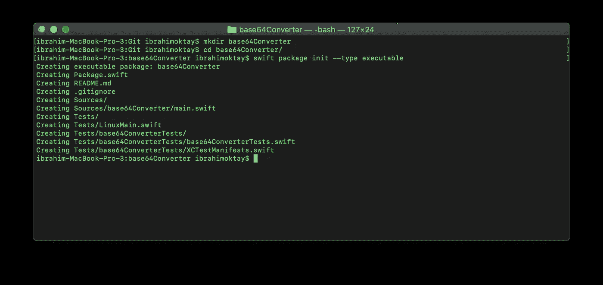
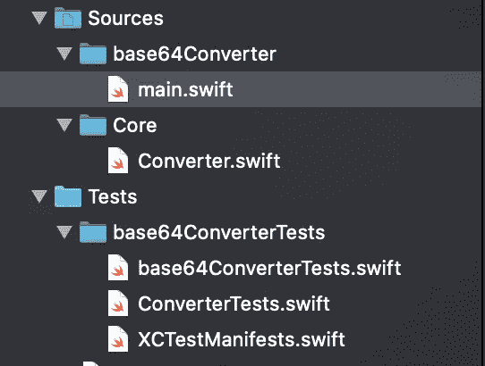

# 如何用 Swift ArgumentParser 构建命令行工具

> 原文：<https://betterprogramming.pub/how-to-build-a-command-line-tool-with-swift-argumentparser-a385a1d389d2>

## 使用 Swift 包管理器和 ArgumentParser 库，然后轻松分发您全新的命令行工具


在 [Unsplash](https://unsplash.com?utm_source=medium&utm_medium=referral) 上由[毛里克·苏塔里亚](https://unsplash.com/@truemaulik?utm_source=medium&utm_medium=referral)拍摄的照片。

在软件开发中，有时您需要完成一个简单的任务，您需要自动化一些任务，或者您可能需要一个工作流来处理一些操作。在这种情况下，简单的命令行工具非常有用，可以节省您大量的时间。

如果您开发 iOS 应用程序，您应该熟悉命令行工具，如 CocoaPods、Carthage 和浪子。想象一下，如果你手动完成所有这些操作。想象一下，您必须克隆一个存储库，并在每次代码更改时获取，手动构建框架，并将其添加到您的项目中。现在想象一下，如果一个简单的命令就可以做到这一点。我们如何构建这样一个工具？

# **简介**

首先，我们来学习一些基础知识。我们将使用 Swift Package Manager (SPM)创建我们的命令行工具。然后，我们将使用 Swift ArgumentParser 使我们的代码更加优雅和类型安全。

Swift ArgumentParser 是一个新的开源库，它使得解析参数变得更加容易。

以下是 GitHub 回购:

[](https://github.com/apple/swift-argument-parser) [## 苹果/swift-argument-parser

### 首先声明一个类型，该类型定义了需要从命令行收集的信息。装饰每个…

github.com](https://github.com/apple/swift-argument-parser) 

## 我们开始吧

我将为演示创建一个简单的 base64 转换器。那么，我们开始吧。

1.  创建一个文件夹并更改目录。
2.  使用 SPM 创建项目。

```
$ mkdir base64Converter
$ cd base64Converter/
$ swift package init --type executable
```

以下是您应该看到的内容:



此时，您可以使用下面的代码运行您的项目:

```
swift run 
Prints: Hello, world!
```

*注意:如果你要写测试，把你所有的代码写成一个库。否则，您将无法测试您的代码。这是行不通的。我将在本文的后面向您展示如何做到这一点。*

回到手头的话题。你可以点击`Package.swift`文件，它会为你打开 Xcode。现在，我们可以添加 ArgumentParser 库。然后，Xcode 会自动为您获取并解析库。您的`Package.swift`文件应该如下所示:

之后，您可以开始实现`main.swift`文件，这是您的命令行工具的入口点:

在命令行中运行:

```
swift run base64Converter “Say hi”
```

看结果。它还没有转换，但是它打印了`“Say hi”`。你不需要每次都使用命令行。你可以在 Xcode 中点击播放按钮。它也能工作。

## 让我们继续学习一些基础知识

你大概看过`@Argument()`。这是我们从命令行获取值的方式。ArgumentParser 用这些属性包装器为我们处理所有的困难工作:

*   `Argument`
*   `Option`
*   `Flag`

查看[文档了解更多详情](https://github.com/apple/swift-argument-parser/blob/master/Documentation/02%20Arguments%2C%20Options%2C%20and%20Flags.md)。

这是我们希望使用命令行工具的方式:

```
> base64Converter "this is an example" --encode
> base64Converter dGhpcyBpcyBhbiBleGFtcGxl --decode
```

不同的组合可以达到相同的使用效果。因此，选择最适合您需求的选项。因为我们有两个操作，第一个是将 string 转换为 base64，第二个是将 base64 转换为 string。我们会选择`@Flag()`。但是它与通常的用法有些不同，因为它是一个自定义的枚举。是的，我们能做到！

```
**enum** CodingType: EnumerableFlag {
  **case** encode
  **case** decode
}
```

这是代码:

就是这样。我们现在有了命令行工具。这非常简单明了。它还是类型安全的，您不必手动进行解析。让我们为我们的命令行工具添加一些测试。

# 试验

在`Tests/base64ConverterTests`下创建一个名为`ConverterTests`的文件。添加下面的代码并运行测试(快捷键:Cmd + U):

构建将失败，您将看到以下错误:

出于某种原因，您不能测试您的 Swift 可执行文件，但是您可以为您的库编写测试。因此，如果你要写测试，你应该把你所有的逻辑写在一个库中，并把它作为一个依赖项。当然，您可以根据需要创建任意数量的库。

## 让我们修正我们的代码

在`Sources`下创建另一个名为`Core`的文件夹，在`Core`下创建一个名为`Converter.swift`的文件。将`Converter struct`从`main.swift`复制到该文件中。确保您的文件结构如下所示:



然后打开 `Package.swift`文件。添加一个名为`Core`的新目标，并将其作为依赖项添加到`base64Converter`目标中。之后，它应该是这样的:

注意:如果你的代码没有编译，检查你的导入。移除未使用的代码。

1.  在`main.swift`中，你要加上`import Core`。
2.  在`ConverterTests.swift`中增加`@testable import Core`。
3.  最后，`Converter`结构和方法必须是公共的。

现在，您将能够运行您的测试。

## 如何创建版本并安装

运行这些命令后，您不需要再次编写`swift run`来运行您的命令。你可以简单地调用`base64Converter`:

```
swift build --configuration release
cp -f .build/release/base64Converter /usr/local/bin/base64Converter
```

# 奖金:如何分配

有一个神奇的开源发行工具叫做 [Mint](https://github.com/yonaskolb/Mint) 。根据文档，它是:

> "一个安装和运行 Swift 命令行工具包的包管理器."

您还应该将此代码包含在您的`Package.swift`中:

```
name: "base64Converter",
products: [
 .executable(name: "base64Converter", targets: ["base64Converter"]),
],
...
```

将代码推送到 GitHub 后，可以运行以下命令:

```
brew install mint //if you already have Mint, skip this onemint install ibrahimoktay/base64Converter  //github_name/repo_name
```

# 结论

感谢您的阅读！如果您有任何问题或反馈，请联系我们。您可以通过下面的链接找到该项目:

[](https://github.com/ibrahimoktay/base64Converter) [## Ibrahim oktay/base64 转换器

### 将 string 转换为 Base64 和 Base64 转换为 string 的简单命令行工具

github.com](https://github.com/ibrahimoktay/base64Converter)