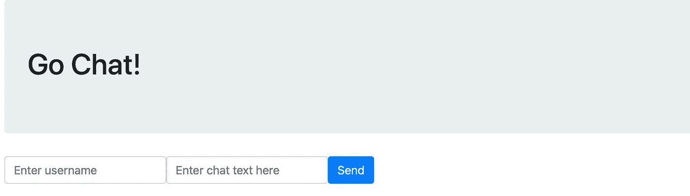

# 如何用 Golang 和 WebSockets 构建并发聊天 App

> 原文：<https://betterprogramming.pub/how-to-build-a-concurrent-chat-app-with-golang-and-websockets-fb48562a1329>

## 使用 Go 构建实时聊天应用程序


[Yura Fresh](https://unsplash.com/@mr_fresh?utm_source=medium&utm_medium=referral) 在 [Unsplash](https://unsplash.com?utm_source=medium&utm_medium=referral) 上的照片

[Go](https://golang.org/) 出现于谷歌，出于使用易于理解的语法构建高性能应用程序的需要。它是一种静态类型的编译语言，由 C 的一些创新者开发，没有手动内存管理的编程负担。首先，它被设计成利用现代多核 CPU 和网络机器。

在本文中，我将展示 Go 的能力。我们将利用 Go 轻松创建并发应用的能力来构建一个聊天应用。在后端，我们将使用 [Redis](https://redis.io/) 作为中介接受来自浏览器的消息，并将它们发送给订阅的客户端。在前端，我们将通过 [socket.io](https://socket.io/) 使用 WebSockets 来促进客户端通信。我们将把它全部部署在 Heroku 上，这是一个 PaaS 提供商，可以轻松部署和托管您的应用。就像 Go 使编程这样的应用程序变得简单一样，Heroku 使用额外的基础设施来补充它变得容易。

# Go 中的频道

开发人员发现 Go 的吸引力在于它的并发通信能力，这是通过一个叫做*通道*的系统实现的。利用经常被引用的[并发性和](https://blog.golang.org/waza-talk)并行性之间的区别很重要。*并行性*是 CPU 同时执行多个任务的过程，而*并发性*是 CPU 在相互重叠的同时开始、运行和完成的多个任务之间切换的能力。换句话说，并行程序一次处理许多操作，而并发程序可以在同一时间内在许多操作之间切换。

Go 中的一个*通道*是并发性流动的管道。通道可以是单向的(数据由通道发送或接收),也可以是双向的(两者兼有)。下面的示例演示了并发性和通道的基本原则:

您可以在 [Go 游乐场](https://play.golang.org/p/_FKRgsC7ptB)在线运行此示例，查看结果。通道是通过首先指定它们将与之通信的数据类型来创建的——在本例中是`string`。两个[go routine](https://tour.golang.org/concurrency/1)、`one`和`two`接受这些通道中的每一个作为参数。然后两者循环五次，将消息传递给通道，这由`<-`符号表示。同时，在主函数中，一个无限的`for`循环等待来自通道的消息。`select`语句选择有未决消息的通道，打印它，然后继续前进。如果通道被关闭(这不仅对内存管理很重要，而且表明不再发送数据)，通道被设置为`nil`。当两个通道都是`nil`时，环路中断。

从本质上说，接收者无休止地等待接收数据包。当它收到数据时，它对数据进行操作，然后继续等待更多的消息。这些接收器同时运行，不会中断程序流的其余部分。对于这个聊天应用程序，我们将等待用户通过通道向接收者发送消息。当收到消息时，应用程序会将它广播到前端，以便每个坐在聊天中的人都可以阅读文本。

# 先决条件

您应该安装了 Golang 的一个相对较新的版本；1.12 以上的都可以。在您的 [GOPATH](https://golang.org/doc/gopath_code.html) 中创建一个名为`heroku_chat_sample`的目录。如果您想在本地运行代码，您也可以安装并运行一个 Redis 服务器——但这肯定不是必需的，因为 Heroku 插件将在生产中为我们提供这一功能。

# 构建一个简单的服务器

让我们从一个快速简单的“Hello World”服务器开始，来验证我们可以运行 Go 程序。我们将从获取 [Gorilla](https://www.gorillatoolkit.org/) 开始，这是一个 web 工具包，它简化了编写 HTTP 服务器的过程:

```
go get -u github.com/gorilla/mux
```

接下来，创建一个名为`main.go`的文件，并将这些行粘贴到其中:

最后，在你的终端中输入`go run main.go`。您应该能够在浏览器中访问 localhost:4444 并看到问候语。通过这几行代码，我们可以更好地理解如何使用 Gorilla 创建路线。

但是静态文本很无聊吧？让这个服务器显示一个 HTML 文件。创建一个名为`public`的目录，并在其中创建一个名为`index.html`的文件，如下所示:

这个页面需要一些 JavaScript 来与服务器通信；现在让我们创建一个占位符`app.js`文件:

然后，让我们将服务器代码更改为如下所示:

如果您重启服务器并返回到 localhost:4444，您应该会看到一个邀请您聊天的页面。它还不会做太多，但它是一个开始！



让我们再做一个小小的改变，看看这个应用程序如何成为[一个十二因素应用程序](https://12factor.net/config):将我们的端口号存储在一个环境变量中。这在目前的开发中不会非常重要，但当我们将应用程序部署到生产中时，它会有所不同。

创建一个名为`.env`的文件，并将这一行粘贴到其中:

```
PORT=4444
```

然后，获取 [godotenv](https://github.com/joho/godotenv) 模块:

```
go get github.com/joho/godotenv
```

最后，让我们再次更改服务器代码，以接受这个环境变量:

简而言之，只要`GO_ENV`是空的，我们将从`.env`中本地定义的任何地方加载我们的环境变量。否则，应用程序希望环境变量由系统设置，我们将在时机成熟时进行设置。

# 使用 WebSockets 和 Redis 建立通信

[WebSockets](https://developer.mozilla.org/en-US/docs/Web/API/WebSocket) 是一种从客户端/浏览器向服务器传递消息的有用技术。它将成为我们聊天室中所有用户发送和接收聊天信息的基本技术。在后端，我们将使用 Redis 来存储聊天历史，这样任何新用户都可以立即获得房间中所有以前的消息。Redis 是一个内存数据库，通常用于缓存。对于这个项目，我们不需要关系数据库的重量，但是我们需要某种存储系统来跟踪用户和他们的消息。

# 建立 Redis

首先，让我们准备引入 Redis 作为依赖项。如果您在本地运行 Redis，您需要添加一个新行来指定您的 Redis 实例在您的`.env`文件中的主机和端口:

```
REDIS_URL=127.0.0.1:6379
```

从 GitHub 获取 Redis 模块作为依赖项:

```
go get -u github.com/gomodule/redigo/redis
```

我们将把我们的 Redis 客户机设置为一个全局变量，以使工作更容易:

```
var (
 rdb *redis.Client
)
```

然后，在我们的`main()`函数中，我们将通过环境变量创建这个客户机的一个实例:

```
redisURL := os.Getenv(“REDIS_URL”)
opt, err := redis.ParseURL(redisURL)
if err != nil {
 panic(err)
}
rdb = redis.NewClient(opt)
```

我们在这里使用环境变量，因为服务器地址可能与我们在开发中使用的不同，但是我们不想硬编码这些值。如果你没有在本地运行的 Redis 服务器，不要担心——在我们将应用程序发布到 Heroku 后，你仍然可以跟随教程并在浏览器中实时查看结果。

当服务器启动时，它会先连接到 Redis，然后再监听任何传入的连接。

# 设置 WebSockets

配置我们的 WebSockets 有点棘手，特别是因为我们需要跳转到一些 JavaScript 代码来完成连接。然而，在我们到达那里之前，让我们后退一步，记住我们正在努力做什么。用户将访问网页，给自己分配一个用户名，并在聊天室发送消息。公平地说，最小的数据块是用户的名字和他们的信息。让我们在 Go 中建立一个数据结构来捕捉这一点:

```
type ChatMessage struct {
 Username string`json:”username”`
 Text string`json:”text”`
}
```

因为我们将与前端进行通信，所以准备考虑这个结构在 JSON 中的表示方式是很有用的。

接下来，让我们在`main()`中为我们的 web 服务器添加两行功能。第一行将指出每当一个新的 WebSocket 连接打开时，我们希望运行哪个函数——换句话说，每当一个新用户加入时。第二行将设置一个长期运行的 goroutine，它决定每当用户发送消息时做什么:

```
http.HandleFunc(“/websocket”, handleConnections)
go handleMessages()
```

最后，让我们跳回到文件的顶部，添加一些全局变量。我们将在代码后解释它们的用途:

```
var clients = make(map[*websocket.Conn]bool)
var broadcaster = make(chan ChatMessage)
var upgrader = websocket.Upgrader{
CheckOrigin: func(r *http.Request) bool {
 returntrue
},
}
```

在这些行中:

*   `clients`是所有当前活动客户端(或打开的 WebSockets)的列表。
*   `broadcaster`是一个单通道，负责发送和接收我们的 ChatMessage 数据结构。
*   `upgrader` 有点老爷车；有必要将 Gorilla 的传入请求“升级”为 WebSocket 连接。

# 表达重要意思

让我们先开始建造`handleConnections`。当一个新用户加入聊天时，会发生三件事:

1.  它们应该被设置为接收来自其他客户端的消息。
2.  他们应该能够发送自己的信息。
3.  他们应该收到以前聊天的完整历史记录(由 Redis 支持)。

用 Gorilla 解决第一个问题很简单。我们将创建一个新的客户端，并将其添加到我们的全球`clients`列表中，只需几行代码:

接下来让我们看看如何发送消息:

在客户端 WebSocket 被打开并添加到`clients`池之后，无限的`for`循环将无休止地运行。与其他语言不同，Go 实际上鼓励无限循环。诀窍是记得摆脱它们，并在你摆脱它们的时候清理干净。这里，WebSocket 只是不停地寻找客户端发送的消息: `ws.ReadJSON(&msg)`正在检查`msg`是否被填充。如果`msg`不是`nil`，它会将消息发送到广播频道。就发送信息而言，差不多就是这样了。如果这个 WebSocket 后来出现了问题，它会将自己从客户端池中删除——删除`(clients, ws)`,然后退出这个循环，切断它的连接。

当一个`msg`被发送到广播频道时会发生什么？这就是`handleMessages`的用武之地。

# 接收消息

向每个连接的客户端发送新消息是`handleMessages`的职责。就像发送消息一样，这一切都始于一个无限的`for`循环:

```
func handleMessages() {
 for {
   // grab any next message from channel
   msg := <-broadcaster
 }
}
```

这一行什么也不做，直到有东西被发送到通道。这是 goroutines、并发性和通道的核心。并发性依赖于通道之间的相互通信。如果没有数据被发送，就没有理由或工作。当收到一个`msg`时，我们可以将它发送给所有打开的`clients`:

```
for client := range clients {
 err := client.WriteJSON(msg)
 if err != nil && unsafeError(err) {
   log.Printf(“error: %v”, err)
   client.Close()
   delete(clients, client)
 }
}
```

我们使用范围操作符迭代每个`client`;对于每个`client`，我们不是读取 JSON，而是将它写出来。同样，接下来的事情是在 JavaScript 方面处理的。如果这个写操作有问题，我们将打印一条消息，关闭`client`，并将其从全局列表中删除。

# 保存和恢复历史

但是我们的最后一个功能是什么呢？它要求每个新的`client`都可以访问完整的聊天记录。为此，我们需要使用 Redis，特别是在两个操作中:

1.  任何新消息都应该被添加到正在运行的消息列表中。
2.  任何新用户都应该收到完整的列表。

当发送新消息时，我们可以使用`[RPUSH](https://redis.io/commands/rpush)`将它们作为列表存储在 Redis 中:

```
rdb.RPush(“chat_messages”, json)
```

当新用户加入时，我们可以使用`[LRANGE](https://redis.io/commands/lrange)`一次发送整个列表:

```
chatMessages, err := rdb.LRange(“chat_messages”, 0, -1).Result()
if err != nil {
 panic(err)
}
```

这个应用程序有点棘手，因为我们需要将所有消息发送给一个客户端。然而，我们可以假设只有新的连接调用`handleConnections`，在无限 for 循环之前的任何时候，我们都可以与这个`client`通信，并向他们发送我们的消息。我们的代码应该是这样的:

# 完整的后端代码

他就是我们完整的围棋代码的样子:[https://gist . github . com/gjtorikian/8894 dec 140 a6e 57934572 F5 b 447 F6 d 51](https://gist.github.com/gjtorikian/8894dec140a6e57934572f5b447f6d51)

# 前端

由于本文主要关注 Go 和 Heroku，所以我们不会详细讨论 JavaScript 代码。不过也就 25 行左右，就不多赘述了！

我们之前的`index.html`可以保持原样。让我们把`app.js`的内容替换成以下内容:

让我们把它分成几块。第一行(`let websocket`和`let room`)只是设置了一些我们稍后可以使用的全局变量。

`websocket.addEventListener`负责处理`client`收到的任何新消息。换句话说就是`handleMessages`对应的前端代码。当`handleMessages`写 JSON 时，它将它作为一个名为`message`的事件发送。从那里，JavaScript 可以解析出数据，对其进行一些样式化，并将文本添加到聊天室中。

类似地，表单逻辑使用 WebSockets 发送数据到我们前面的`ws.ReadJSON line`。任何时候提交表单，JavaScript 都会记录下谁说了什么以及他们说了什么。然后，它将消息发送到 WebSocket，以便 Go 代码可以将它存储在 Redis 中，并通知所有客户端。

# 部署到 Heroku

您现在可以将此应用程序部署到 Heroku 了！如果你还没有，一定要在 Heroku 上创建一个[免费账户，然后安装](https://signup.heroku.com/) [Heroku CLI](https://devcenter.heroku.com/articles/heroku-cli) ，这使得创建应用程序和附加组件变得更加容易。

首先，登录您的帐户:

```
heroku login
```

接下来，让我们使用 create 创建一个新的应用程序:

```
heroku create
```

你会被分配一个随机的名字；我有 evening-wave-98825，所以我将在这里引用它。

接下来，创建一个 [Procfile](https://devcenter.heroku.com/articles/procfile) 。Procfile 指定应用程序启动时要运行的命令，以及设置任何工作线程。

我们的将是一条线:

```
web: bin/heroku_chat_sample
```

由于我们需要 Redis，我们可以为我们的演示应用程序附加免费实例:

```
heroku addons:create heroku-redis:hobby-dev -a evening-wave-98825
```

让我们构建应用程序，并提交我们所拥有的一切:

```
go mod init
go mod vendor
go build -o bin/heroku_chat_sample -v .
git init
git add .
git commit -m “First commit of chat app”
```

让我们把这些都送给 Heroku:

```
heroku git:remote -a evening-wave-98825
git push heroku main
```

这个过程是您将所有东西部署到生产环境中所需要的。如果您访问 Heroku 为您生成的 URL，您应该会看到您的聊天应用程序。它可能看起来很简单，但在幕后有很多事情要做！

你可以从 [GitHub](https://github.com/gjtorikian/heroku_chat_sample) 下载本文使用的所有代码。