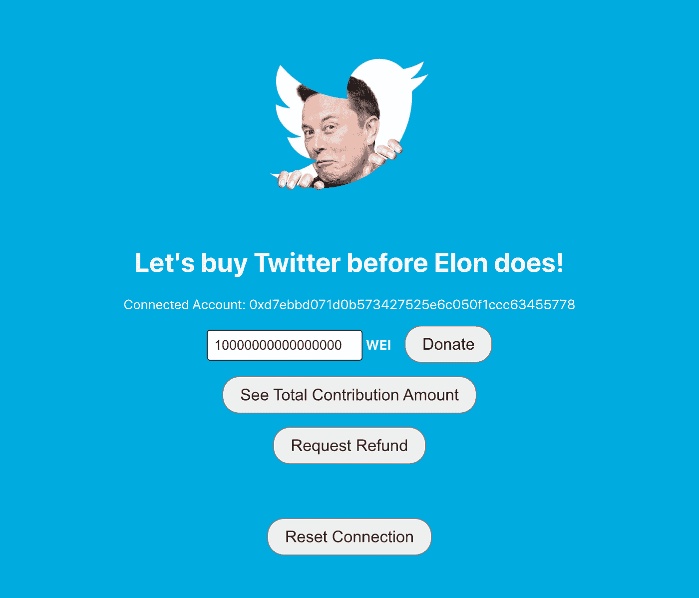

# 如何建立一个众筹 Web3 Dapp

> 原文：<https://betterprogramming.pub/how-to-build-a-crowdfunding-web3-dapp-76eb534eddf4>

## 我们买推特吧！

众筹 web 3 dapp——让我们买下 Twitter 吧！—作者图片

在过去的几个月里，科技界一直在热议埃隆·马斯克收购 Twitter 的消息。收购是否真的会发生还有待观察，但许多 Twitter 员工和 Twitter 用户担心这对公司文化和应用本身意味着什么。

我开玩笑地对自己说，“如果我们团结起来，买下 Twitter 会怎么样？”我没有 440 亿美元，但也许我们可以众筹？我当然可以创建一个 GoFundMe 或 Kickstarter 项目。

我最近也在钻研 Web3 的世界，它完全是关于去中心化的。因此，我的下一个思路变成了，“使用 Web3 技术构建一个众筹应用程序需要什么？”

这篇文章将探讨这一点。我们将考虑众筹应用程序通常如何工作，它们在 Web3 世界中如何工作，以及我们如何构建自己的众筹 Web3 去中心化应用程序(“d app”)。我们甚至会包括一些代码样本，以帮助您构建自己的分散式众筹平台。

准备好迎战埃隆了吗？

# 众筹应用如何工作

像 [GoFundMe](https://www.gofundme.com/) 或 [Kickstarter](https://www.kickstarter.com/) 这样的众筹应用程序允许用户创建新的筹款人，任何人都可以为其捐款。集资者创建者接受捐款，通常是在一定条件下，然后众筹平台拿一小部分钱作为他们的份额。每个人都赢了。

对于 Kickstarter 这样的平台来说，必须在截止日期前达到筹资目标才能释放资金。如果目标及时实现，那么募捐者创建者将收到他们项目的资金，并且所有捐助者的信用卡将根据他们的捐助金额收费。如果截止日期过去了，而目标没有实现，那么每个贡献的人都可以拿回他们的钱(或者更确切地说，他们的信用卡没有被扣款)。

这种模式非常有效，很多成功的项目都是由 Kickstarter 这样的平台资助的。但是如果我们能省去中间人呢？

# Web3 众筹 Dapp 如何运作

Web3 自带交易层，允许用户转移其加密钱包中的资金。热门钱包包括[比特币基地钱包](https://www.coinbase.com/wallet)或 [MetaMask](https://metamask.io/) 。

由于区块链的分散性，Web3 应用通常被称为“dapps”。dapp 构建有一个前端 UI，它与部署到区块链的智能合约进行交互，这个智能合约充当后端代码和数据库，你可以在典型的 Web2 应用中看到。

对于一个 web3 众筹 dapp，我们可以利用一个智能合同，允许人们从钱包中为某项事业认捐资金，就像 Kickstarter 活动一样。智能合同可以内置逻辑，只允许众筹项目创始人在目标实现后撤回资金。在此之前，资金将由智能合同托管。

这意味着捐赠者在捐赠时会从他们的钱包中转移资金，但只要目标尚未实现，他们可以随时要求退款。

一旦目标达到，资金被撤回，接受捐赠的人可以随心所欲地使用这笔钱，所以从技术上来说，他们可以拿钱走人。

如果我们想将这个想法更进一步，我们可以探索[分散自治组织(DAOs)](https://ethereum.org/en/dao/) 以及它们如何不仅处理众筹，还处理集体所有权和集体决策。然而，现在，我们将只坚持一个简单、聪明的契约。

因此，考虑到这个高级架构，让我们来看看我们构建的一个实际的 Web3 众筹 dapp！你可以在 GitHub 上找到演示应用的所有[代码。](https://github.com/thawkin3/coinbase-crowdfunding-app)

# 我们的 Web3 众筹 Dapp

众筹 web 3 dapp——让我们买下 Twitter 吧！

从用户的角度来看，我们的 dapp 相当简单。用户访问页面并点击按钮连接他们的钱包。同样，这可以是用户选择的任何加密钱包。

如果用户没有加密钱包浏览器扩展，点击该按钮将提示比特币基地钱包的登录用户界面弹出，使新用户可以在几分钟内连接现有的移动钱包或创建一个新的钱包。

比特币基地钱包的入职界面

连接钱包后，用户可以通过修改输入字段中的值，然后单击“捐赠”按钮来提交捐赠。(我们在智能合约中设定了 0.01 以太的最低捐赠金额和 10 以太的资金目标，但这些值是任意的。)

他们还可以点击另外两个按钮来查看为该目标贡献的总金额，或者要求退还他们之前承诺的款项。在用户界面的底部有一个按钮，如果需要，可以重置钱包连接重新开始。

众筹网站 3 dapp——捐款

这就是它的全部功能。

那么，我们是如何建造的呢？我们使用了多种技术来创建 dapp:

*   [反应](https://reactjs.org/)为前端 UI
*   [智能合同的可靠性](https://soliditylang.org/)
*   [重新混合](https://remix-project.org/)用于编译和部署智能合同
*   [比特币基地钱包 SDK](https://docs.cloud.coinbase.com/wallet-sdk/docs) 用于连接用户的钱包
*   [比特币基地钱包](https://www.coinbase.com/wallet)和[元掩码](https://metamask.io/)用于发送和接收资金的加密钱包
*   用于备份 RPC 端点的 Infura

我们已经在[自述文件](https://github.com/thawkin3/coinbase-crowdfunding-app#readme)中概述了所有的设置步骤，所以我们不会一步一步地详细介绍我们是如何构建这个应用的。如果你想跟随或者建立你自己的众筹 dapp，我们强烈建议你遵循上面自述文件中的步骤！

这里我们强调了提供应用程序主要功能的两个关键文件:用于智能合约的`Crowdfunding.sol`文件和用于 React 前端 UI 的`App.js`文件。

`Crowdfunding.sol`档案全文转载如下:

这个文件是我们在 Remix online IDE 中编译和部署的，所以它实际上并不包含在项目 repo 中。相反，我们引用合同部署的地址，并使用合同的应用程序二进制接口(ABI)中定义的方法。

浏览这个文件，你可以看到我们已经为`donate`、`getBalance`、`withdraw`和`returnFunds`定义了方法。每个方法都顾名思义。

*   `donate`方法允许用户承诺捐款。
*   `getBalance`方法显示当前捐赠的总额。
*   `withdraw`方法允许在达到筹款目标的情况下提取资金。
*   `returnFunds`方法允许用户在捐款后如果改变主意，可以要求退还他们承诺的金额。

现在让我们用我们的`App.js`文件来看看前端代码，下面也完整地复制了它:

这个文件中有很多代码，但是让我们讨论几个亮点。如您所见，我们使用比特币基地钱包 SDK 来连接用户的钱包。我们使用合同的 ABI 和部署地址加载众筹合同。我们通过使用`.call()`和`.send()`与智能合约的方法进行交互，并且我们将点击处理程序绑定到我们的按钮，使应用程序具有交互性。

从高层次来看，这就是所有这些工作方式背后的神奇之处。要了解更多详细的设置说明，我们会再次向您推荐在 GitHub 上的[自述文件中找到的分步指南。](https://github.com/thawkin3/coinbase-crowdfunding-app#readme)

# 结论

那么，我们今天学到了什么？

我们了解到，Web3 技术允许在没有中介机构的情况下进行金融交易。我们了解到，除了将钱从一个人转移到另一个人，我们还可以使用 Web3 技术来支持众筹。

最后，我们探索了如何构建一个简单的众筹 dapp，它背后的技术，以及如何将这些技术结合使用，使您能够在几个小时内建立并运行一个应用程序。