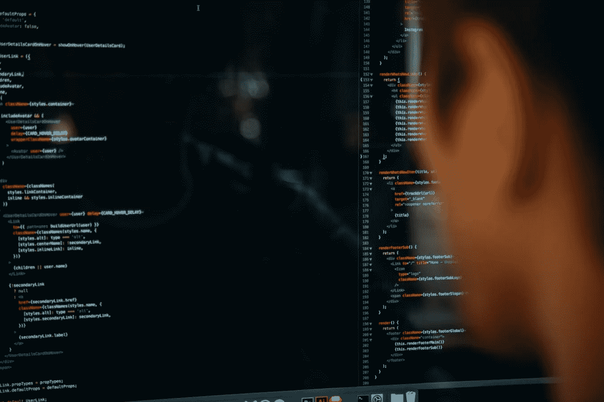

# 如何构建自定义分类器 Android 应用程序

> 原文：<https://betterprogramming.pub/how-to-build-a-custom-classifier-android-app-452b68a89150>

## 使用颤振和自动视觉边缘

查尔斯在 [Unsplash](https://unsplash.com/s/photos/machine-learning?utm_source=unsplash&utm_medium=referral&utm_content=creditCopyText) 上的照片

所以，你想建立一个分类器，而且你想快速完成。也许你有一个分类器可能有用的爱好，或者你已经有了一组图像，你想把它们变成一个应用程序，或者你只是想尝试构建一些新的东西——有许多不同的原因。

这篇文章将指导你使用谷歌的 [Flutter](https://flutter.dev/) 和 [AutoML Vision Edge](https://firebase.google.com/docs/ml-kit/automl-image-labeling) 服务为 Android 设备构建一个分类器应用程序。

# 为什么颤动？

用自己的[话说](https://flutter.dev/):

> “Flutter 是 Google 的 UI 工具包，用于从单个代码库为移动、web 和桌面构建漂亮的本地编译应用程序。”

Flutter 使用的是 [Dart](https://dart.dev/) ，这是一种快速、直观、有些罕见的语言。然而，作为一个更习惯于 Java 而不是 JavaScript 的人，我感觉就像在家里一样，并且能够很快提高。

有了它的热重载特性，迭代 UI 变得轻而易举。这个快速发展的社区充满了乐于助人的人和资源。

如果你想在尽可能多的平台上尽可能快地推出你的应用，包括移动和 PWA，Flutter 是正确的选择。Flutter web 正在迅速获得牵引力，谷歌似乎致力于定期改进和更新它。

# 为什么选择 AutoML Vision Edge？

谷歌的 AutoML Vision Edge 服务可以通过 Firebase 访问，有很多好处。它允许你创建没有任何编码的分类 ML 模型。

你所需要做的就是提供训练数据，然后谷歌将在此基础上训练一个模型。您可以从模型的三个优化中选择一个:延迟、准确性或这两者之间的平衡。

然后，您可以指定模型应该训练的小时数，它会立即开始工作。请注意，训练可能比选择的小时数更快完成，因为 Google 将训练时间分布在多台机器上。

训练完成后，您可以下载模型，发布它(使它可供您的应用程序使用)，查看平均精度等评估统计数据，并测试它。

这项服务的另一个好处在于，你的新机型可以直接在 edge 设备上运行。这有两个主要优点:

*   您的应用程序不需要互联网连接来进行分类。
*   分类非常快(不到 0.1 秒)。

这两点结合起来，就可以让你的 app 随时随地进行分类！

# 数据收集

如何获取训练数据因您希望构建的分类器类型而异，这超出了本文的范围。

也许你已经有了一个带标签的数据集，或者你已经建立了一个自动下载和标记图像的 web scraper。无论如何，为了让你的模型相当准确，你需要每个标签至少有 100 张图片。少于这个数字，你的模型就有不可靠的风险。

# 构建用户界面

有几种方法可以将这个模型集成到你的应用程序中(下面会详细介绍)。因为在这篇文章中，你的目标是构建一个 Android 应用程序，所以我们将使用一些原生 Java 代码。

为了让 Flutter 与本机组件对话，您需要在有状态分类小部件中指定一个通道和一些方法名。将以下内容添加到您的`.dart`文件中:

做一些常数

接下来，您需要实现一种方法，让用户选择一个图像来提供给您的模型。

为了实现这一点，一个很好的选择是[抖动图像拾取器](https://pub.dev/packages/image_picker)包。将它添加到您的`pubspec.yaml`文件的`dependencies`部分，就像这样:

添加图像拾取器依赖项

记得要`flutter pub get`。接下来，实现图像拾取器的异步`pickImage()`:

用户可以拍摄或选择一张图片

例如，这些方法可以注册为您创建的按钮的处理程序。如何向用户呈现这些选项取决于您。

然后，您需要将图像文件传递给模型，该模型在您的本地组件中运行。为此，请使用前面定义的通道和方法名称:

将选择的图像发送到本机组件

在对图像进行分类时，您可能希望显示一个微调器。但是，在大多数情况下，分类执行得如此之快，以至于微调器不可见。

不过，根据您的实现，该应用程序可能会使用远程模型，或者检查本地模型的更新并下载最新版本，如果您的版本已经过时。

在这种情况下，旋转器可能有助于覆盖这段短暂的时间(2 到 4 秒，取决于设备的互联网连接和模型的大小)。

注意，当模型完成对图像的分类时，需要一个回调，所以接下来添加这个回调。为了方便起见，这个例子存储结果是一个`SplayTreeMap`，将结果标签映射到以降序排序的置信度值。

处理分类结果

通过将结果存储在一个排序的地图中，您可以很容易地用前三个结果更新您的 UI:

仅显示前 3 项

一些基本的 UI 就这样了！接下来，您需要整合模型。

# 整合模型

当您下载您的模型时，您应该得到三个文件:

*   `dict.txt` —列出模型的标签。
*   `manifest.json` —包含一些元数据。
*   `model.tflite`——是实际的模型。

你需要把它们放在一个`android/add/assets`子目录中的某个地方，比如`<PROJECT_ROOT>/android/app/assets/ml-model`。

有关如何配置项目级和应用级`build.gradle`文件的更详细概述，请查看[文档](https://firebase.google.com/docs/ml-kit/android/label-images-with-automl)。

一旦设置完成，打开`android/app/src/main/java/your/package/name`中的`MainActivity.java`。

关于模型的加载，您有一大堆选项可以选择，比如什么时候使用本地模型还是托管模型，什么时候更新本地模型，等等。

在任何情况下，您都需要在您的`.dart`文件中定义的通道和方法名称，以及您的模型名称。这些必须完全匹配。

您可能还希望定义一个最小置信度阈值，低于该阈值则不会返回任何结果，这由您来定义本机代码应该承担多少责任:

再做同样的常数，加上一些其他的

当你读到这篇文章的时候，下面的具体实现可能已经改变了，因为 Flutter 正在不断改进它与原生平台的集成。

但是，在编写本文时，由 Dart 代码调用的函数将如下所示:

获取传递的图像数据

接下来，初始化 Firebase:

初始化 Firebase

此时，您可以使用远程模型，使用本地模型，或者检查本地模型是否需要更新。

你想让这个初始化部分变得多复杂取决于你自己。为了简洁起见，这个例子只使用了之前添加的本地模型，它也需要初始化:

建立模型

然后，您需要准备您的图像:

准备图像

最后，让模型对图像进行分类，并将结果返回给 Flutter:

将图像分类

就是这样！您现在应该有一个功能性的 Flutter 应用程序，它可以拍摄或选择图像，使用本地模型对其进行分类，并显示结果。

# 结论

Flutter 和 AutoML Vision Edge 使您能够在非常短的时间内制作快速、准确(取决于您的训练数据)且独立于互联网连接的分类器应用程序，而无需了解任何 ML 理论或编写任何 ML 代码。

现在，您可以将节省下来的所有时间用于构建额外的功能和令人惊叹的 UI。编码快乐！

# 资源

*   [颤动](https://flutter.dev/)
*   [颤动图像拾取器](https://pub.dev/packages/image_picker)
*   谷歌 [AutoML 视觉边缘](https://firebase.google.com/docs/ml-kit/automl-image-labeling)