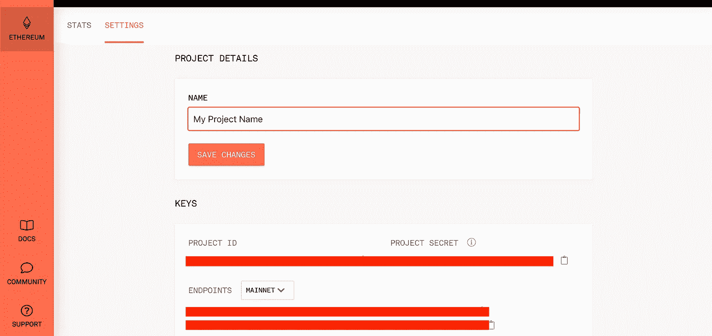
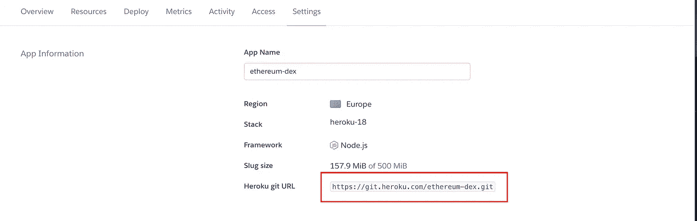
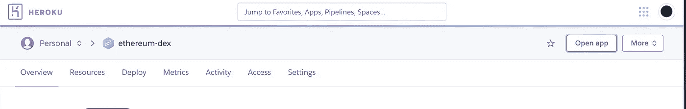

# 如何不花一分钱建立 DApp 投资组合

> 原文：<https://betterprogramming.pub/how-to-build-a-dapp-portfolio-without-spending-a-penny-42d7d0b63d8f>

## 使用 testnets 和免费 web 服务免费部署以太坊 DApps


图片来自 [Pixabay](https://pixabay.com/?utm_source=link-attribution&utm_medium=referral&utm_campaign=image&utm_content=3080553) 的 [WorldSpectrum](https://pixabay.com/users/WorldSpectrum-7691421/?utm_source=link-attribution&utm_medium=referral&utm_campaign=image&utm_content=3080553)

构建一个分散应用程序(DApps)的组合是向世界展示你是区块链开发者的最好方式。

你可能会认为维持一个公共 DApps 的投资组合要花很多钱。托管网站和域名要花钱，部署智能合同也要花钱。

我在这里告诉你，你可以构建、部署和维护多个以太坊 DApps，而不需要在以太坊主网络(mainnet)上支付一分钱的托管费或一个 Wei。

# 使用测试网

测试网络(testnets)是反映 mainnet 生产环境的公共区块链网络。

它们允许核心开发人员在部署到 mainnet 之前测试新特性，如分片和共识机制。它们还允许 DApp 开发人员在将不可变代码部署到 mainnet 之前测试他们的应用程序。

有几个[测试网可以从](https://medium.com/blockcentric/ethereum-testnets-what-are-they-and-why-so-many-ebf62821bbc)中选择，每一个都有稍微不同的特征，比如他们的共识机制和节点软件支持。

Ropsten 测试网与以太坊主网最为相似。 [MetaMask](https://chrome.google.com/webstore/detail/metamask/nkbihfbeogaeaoehlefnkodbefgpgknn?hl=en) Chrome 扩展默认支持 Ropsten、 [Kovan](https://kovan-testnet.github.io/website/) 、 [Rinkeby](https://www.rinkeby.io/) 和 [Goerli](https://github.com/goerli/testnet) testnets。

在这些测试网上获取乙醚就像从水龙头里索取乙醚一样简单。大多数网络都有一个聊天机器人风格的水龙头，在那里你可以粘贴你的部署帐户的公共地址。

# 部署您的智能合同

这个例子假设你熟悉[松露套件](https://www.trufflesuite.com/)。如果没有，也不用担心。有大量的[演练和教程](https://medium.com/blockcentric/blockchain-development-resources-b44b752f3248)可以让你学习如何使用 Truffle Suite 部署 DApps。

一旦你在你想要的测试网上有了一些以太，你需要一个以太坊节点来部署你的契约。节点需要很长时间来设置，技术知识需要更长时间来学习…真扫兴。

幸运的是，有区块链基础设施服务可以消除设置节点的所有复杂性。我最喜欢用的是 [Infura](http://infura.io) 。

创建一个 Infura 帐户和一个新项目。转到“设置”选项卡，在那里您可以选择想要与之互动的网络。



图 1: Infura 项目设置页面

记下要部署到的网络的 HTTPS 端点。

我将展示一个配置为部署到 Kovan testnet 的`truffle-config.js`文件的例子。

确保您的存储库中有以下软件包，您可以使用 npm 安装这些软件包:

```
"truffle-hdwallet-provider": "1.0.4",
"truffle-hdwallet-provider-privkey": "1.0.3",
"web3": "1.0.0-beta.46"
```

**注意**:我这里用的是 [web3](https://web3js.readthedocs.io/en/v1.2.6/) 版本 1.0.0。您必须使用此版本或更高版本才能成功部署。

接下来，修改您的`truffle-config.js`文件，将新网络添加到`networks`对象中。图 2 显示了这种改变的结果。

图 2:松露配置文件

您的项目现在已经设置好了，可以使用以下命令将您的智能合约迁移到 Kovan testnet:

```
truffle migrate --network kovan
```

# 免费网络服务

现在，您的智能合约已在公共(测试)网络上运行，您需要在 web 上托管您的前端，以便用户可以开始使用您的 DApp。

有几种选择。你可以在家里运行网络服务器，这需要时间和金钱，或者你可以使用行业领先的托管服务，如 [DigitalOcean](https://www.digitalocean.com/) 或 [AWS](https://aws.amazon.com/) ，它们收取月租费(尽管对低端包来说很少)。

你需要的是一个免费的托管服务，即快速和易于使用，并提供一个平台来测试你的 DApp。

这些服务是存在的！我将介绍其中的两个。介绍 [Heroku](http://heroku.com) 和 [GitHub 页面](https://pages.github.com/)。

## 赫罗库

> **“**Heroku 是一个平台即服务(PaaS)，它使开发者能够完全在云中构建、运行和操作应用程序。”——[Heroku.com](http://heroku.com)

Heroku 支持多种技术，尤其擅长部署节点应用程序。假设您的项目使用的是 Truffle Suite，那么使用 Heroku 进行部署不会有任何问题。

要使用命令行部署到 Heroku，您首先需要进入 Heroku 下载页面并安装 [Heroku 命令行界面](https://devcenter.heroku.com/articles/heroku-cli#download-and-install) (CLI)

转到 Heroku.com，创建一个帐户，并创建一个新的应用程序。一旦你完成了基本的设置，进入“设置”标签，找到你的“Heroku git URL”。图 3 显示了在哪里可以找到它。



图 Heroku 应用程序设置选项卡示例

打开您的终端并导航到您的项目根文件夹。假设您已经在使用 Git 进行版本控制，使用 Heroku Git URL 添加一个新的遥控器，如下所示(其中`[heroku_git_url]`是您的 Heroku 应用程序的 URL):

```
git remote add heroku [heroku_git_url]
```

然后，使用新安装的 Heroku CLI 登录您的帐户:

```
heroku login
```

这将打开您的浏览器进行确认。一旦成功登录，剩下的就是部署了！运行以下命令以推送到 Heroku:

```
git push heroku master
```

等待日志完成，瞧，你的 DApp 现在是活的！

Heroku 根据您的项目名称分配一个 URL。要打开应用程序，回到 Heroku.com，点击图 4 所示的“打开应用程序”按钮。



图 4: Heroku 应用概述

你的 DApp 现在在 Heroku 直播！

## GitHub 页面

> “GitHub Pages 是一个静态网站托管服务，它直接从 GitHub 上的一个存储库中获取 HTML、CSS 和 JavaScript 文件”——[Github.com](http://Github.com)

用过 Git 的人都知道 GitHub。它是世界上最大的开源版本控制平台，每天都有无数的开发者在使用。

[GitHub Pages](https://pages.github.com/) 是一项允许直接从 GitHub repo 托管静态网站的服务。这意味着只要你的应用不做任何服务器端的计算(比如 PHP)，你就可以使用了！

如果你还没有使用 GitHub 进行回购，我强烈建议你利用这一点。假设您是，并且您的项目使用的是 Truffle Suite，那么进入命令行并导航到项目的根目录。

通过运行以下命令安装`gh-pages`包:

```
npm install --save gh-pages
```

接下来，你需要给你的`package.json`文件添加一些细节。在文本编辑器中打开包文件。

在主对象中，添加以下内容，其中`[user-name]`是您的 GitHub 用户名，`[repo-name]`是您的 GitHub repo 的名称:

```
"homepage": "https://[user-name].github.io/[repo-name]/",
```

在`package.json`的`“scripts”`部分增加以下选项:

```
"predeploy": "npm run build",
"deploy": "gh-pages -d build",
```

现在剩下的就是运行`npm run deploy`将你的 DApp 部署到 GitHub 页面。

你的 DApp 现在在 GitHub 页面上直播了！

# 结论

建立 DApps 的投资组合不需要任何成本。

通过使用 Heroku、GitHub Pages 和 Ethereum testnets，您可以将您的项目公开，任何人都可以使用，只要他们有 web3 兼容的浏览器或扩展，如 MetaMask。