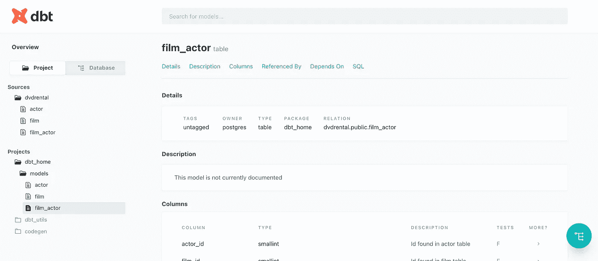
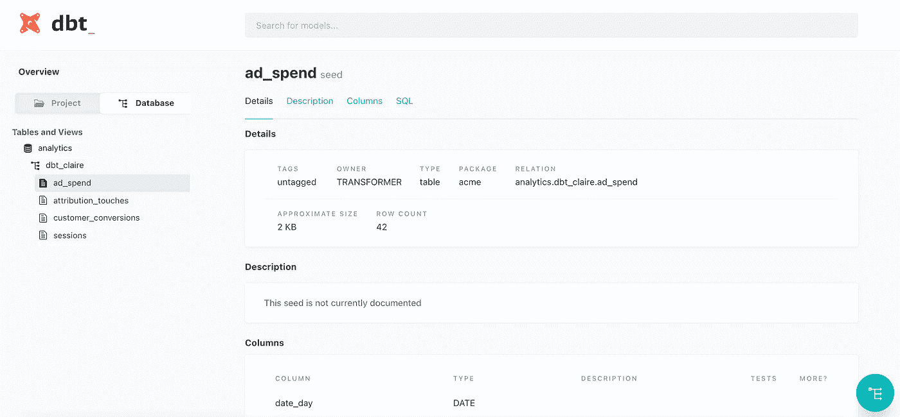

# 如何用 Python 构建数据目录

> 原文：<https://betterprogramming.pub/how-to-build-a-data-catalog-in-python-eec6f4dd4d48>

## 让团队能够提出有意义的问题



尽管我们想认为我们作为数据团队是最高效的，因为我们为组织提供数据，但不幸的是，事实并非如此。许多利益相关者浪费时间试图弄清楚我们有什么数据，谁拥有数据源，以及如何访问数据集。这通常会导致一天中对各种数据人员的随机 pings 使我们的工作比改进我们的流程更具反应性，以便为我们的用户和利益相关者提供更好的数据。

当公司变得更大，数据团队增长甚至分成多个小组时，这个问题只会加剧。现在你有多个团队，拥有不同的数据资源，却无处确认真相的来源。

在本文中，我想谈谈什么是数据目录，以及它如何解决查找谁拥有什么数据源的问题。

下面是[代码](https://github.com/sdf94/dbt-example)。随着我对 dbt 的了解越来越多，我打算对这个回购协议进行修改，所以如果网站看起来不一样，这可能就是原因。

# **什么是数据目录？**

数据目录是一种组织和跟踪已收集并存储在数据库中的数据的方法。这些信息可用于各种目的，例如确保数据的准确性、确定在哪里可以找到数据，甚至帮助确定数据中哪里有差异。

数据目录通常包含关于数据集的元数据，例如数据集的创建时间、处理方式以及随着时间的推移对其内容所做的任何更改。元数据还可以包括有关数据源、数据集来源以及处理方式的详细信息。

一个设计良好的目录将使人们更容易找到他们需要的信息来回答他们的问题或解决他们的问题。它还为人们提供了一种更简单的方式来导航和查找可能感兴趣的其他内容。

# *dbt 是什么？*

dbt(数据构建工具)是用于数据转换作业的工具。用户可以在他们喜欢的文本编辑器中编写 dbt 代码，并运行 dbt 命令。代码被编译成原始 SQL，并根据配置的数据仓库执行。

这是我的另一篇文章，更深入地探讨了 dbt 的功能。

[](https://pub.towardsai.net/one-tool-to-rule-them-all-2083371c1618) [## DBT——统治他们的唯一工具

### 数据构建工具(DBT)为您提供更好的数据质量。

pub.towardsai.net](https://pub.towardsai.net/one-tool-to-rule-them-all-2083371c1618) 

## **文件夹结构**

dbt init 初始化分析、`data`、`macros`、`models`、`snapshots`和`tests`文件夹和`dbt_project.yml`文件。

在这个项目中，我目前只使用模型，所以你现在可以忽略其他文件夹。

```
|--dbt-example
|--|--dbt_home
|--|--|-- analyses
|--|--|-- data
|--|--|-- macros
|--|--|-- models
|--|--|-- snapshots
|--|--|-- tests
|--|-- dbt_project.yml
|--|-- packages.yml
```

查看`dbt_project.yml`文件时，确保配置文件与`~/.dbt/profile.yml`中的配置文件名相匹配。

## 设置数据目录所需的模型

首先，我们需要为目录设置模型。这些模型代表了我们源中的表。我们需要在`profile.yml`文件中定义我们的数据库。

这里是我用过的`profile.yml`。

```
config:
    use_colors: True
    send_anonymous_usage_stats: Falsedvdrental:
  target: dev
  outputs:
    dev:
      type: postgres
      host: localhost
      user: postgres
      password: "your awesome password"
      port: 5432
      dbname: dvdrental
      schema: public
      threads: 4
```

如果您有大量的数据库，那么您可以将 user、password、hosts 等设置为环境变量，作为 dbt 实现的 jinja 模板的一部分。

```
profile:
  target: prod
  outputs:
    prod:
      type: postgres
      host: 127.0.0.1
      user: "{{ env_var('DBT_USER') }}"
      password: "{{ env_var('DBT_PASSWORD') }}"
      ....
```

现在我们有了 profile.yml，我们可以设置`dbt-codegen`来产生所有的源和模型。

`dbt-codegen` —使用`dbt-codegen`，您能够生成所有的源，包括模式和数据库，以及模型或表格。

首先，让我们专注于制作源。这是我的:

```
dbt run-operation generate_source --args '{"schema_name": "public", "database_name": "dvdrental"}'01:57:51  Running with dbt=1.0.4
01:57:51  [WARNING]: Configuration paths exist in your dbt_project.yml file which do not apply to any resources.
There are 1 unused configuration paths:
- models.dbt-home.example01:57:52  version: 2sources:
  - name: public
    tables:
      - name: actor
      - name: actor_info
      - name: address
      - name: category
      - name: city
      - name: country
      - name: customer
      - name: customer_list
      - name: film
      - name: film_actor
      - name: film_category
      - name: film_list
      - name: inventory
      - name: language
      - name: nicer_but_slower_film_list
      - name: payment
      - name: rental
      - name: sales_by_film_category
      - name: sales_by_store
      - name: staff
      - name: staff_list
      - name: store
```

删除版本 2 之前的所有内容，这样您就可以得到:

```
version: 2sources:
  - name: public
    tables:
      - name: actor
      - name: actor_info
      - name: address
      - name: category
      - name: city
      - name: country
      - name: customer
      - name: customer_list
      - name: film
      - name: film_actor
      - name: film_category
      - name: film_list
      - name: inventory
      - name: language
      - name: nicer_but_slower_film_list
      - name: payment
      - name: rental
      - name: sales_by_film_category
      - name: sales_by_store
      - name: staff
      - name: staff_list
      - name: store
```

我删除了除了我想要关注的三个表之外的所有内容，使命名更加清晰，这将成为`dvdrental_sources.yml`。

```
version: 2sources:
  - name: dvdrental
    schema: public
    tables:
      - name: actor
        meta:
          contains_pii: true
      - name: film
      - name: film_actor
```

接下来，让我们专注于生产模型。注意:在继续之前，如果需要的话，请确保调整列、描述和测试。这是我用过的。

```
dbt run-operation generate_base_model --args '{"source_name": "dvdrental", "table_name": "actor"}' 02:04:03  Running with dbt=1.0.4
02:04:03  [WARNING]: Configuration paths exist in your dbt_project.yml file which do not apply to any resources.
There are 1 unused configuration paths:
- models.dbt-home.example02:04:03  
with source as (select * from {{ source('dvdrental', 'actor') }}),renamed as (select
        actor_id,
        first_name,
        last_name,
        last_updatefrom source)select * from renamed
```

用和`source`去掉*之前的所有内容，这样你就得到*

```
with source as (select * from {{ source('dvdrental', 'actor') }}),renamed as (select
        actor_id,
        first_name,
        last_name,
        last_updatefrom source)select * from renamed
```

最后一步是生成模型 YAML 文件:

```
dbt run-operation generate_model_yaml --args '{"model_name": "actor"}'
```

要返回:

```
02:10:07  Running with dbt=1.0.4
02:10:07  [WARNING]: Configuration paths exist in your dbt_project.yml file which do not apply to any resources.
There are 1 unused configuration paths:
- models.dbt-home.example02:10:07  version: 2models:
  - name: actor
    description: ""
    columns:
      - name: actor_id
        description: ""- name: first_name
        description: ""- name: last_name
        description: ""- name: last_update
        description: ""
```

删除版本 2 之前的所有内容，这样您就可以得到:

```
version: 2models:
  - name: actor
    description: ""
    columns:
      - name: actor_id
        description: ""- name: first_name
        description: ""- name: last_name
        description: ""- name: last_update
        description: ""
```

根据需要对这些文件进行必要的调整，包括表描述、表元数据、列名、列数据类型和列测试。

## 项目的数据目录设置

在这个实例中，我们已经设置了创建文档或目录所需的所有 SQL 和 YAML 文件。在`dbt`文件夹中(在我们的例子中是`dbt-example`，运行以下命令:

```
dbt docs generate
```

这将提供服务于文档网站所需的必要工件或信息。

如果你现在逃跑，

```
dbt docs serve
```

该命令将提供一个专门用于本地/开发的本地网站，并将根据需要调整 YAML 和 SQL 文件。完成更改后，请确保再次运行这些命令。这将更新更改。

正如 dbt 所建议的，制作这个网站的最佳方式取决于你如何使用它。在这里可以找到一些存放文档的常用方法[:](https://docs.getdbt.com/docs/building-a-dbt-project/documentation)

1.  [dbt 云](https://docs.getdbt.com/docs/dbt-cloud/using-dbt-cloud/cloud-generating-documentation)
2.  [S3 上的主机](https://docs.aws.amazon.com/AmazonS3/latest/dev/WebsiteHosting.html)(可选[带 IP 访问限制](https://docs.aws.amazon.com/AmazonS3/latest/dev/example-bucket-policies.html#example-bucket-policies-use-case-3))
3.  [在网络上发布](https://discourse.getdbt.com/t/publishing-dbt-docs-to-netlify/121)
4.  启动像 Apache/Nginx 这样的 web 服务器

只有 S3 是特定于 AWS 的，而其他人是云不可知的，或者不必担心基础设施(`dbt`云)。

## dbt 实验室的示例网站

除了我网站的代码，你也可以看看 dbt 实验室的例子。项目网站代码此处[此处](https://github.com/dbt-labs/attribution-playbook)，发布网站此处[此处](https://www.getdbt.com/attribution-playbook/#!/overview)。从代码中可以看出，文件夹结构是这样设置的:

```
|- [analysis](https://github.com/dbt-labs/attribution-playbook/tree/master/analysis)
|- [data](https://github.com/dbt-labs/attribution-playbook/tree/master/data)
|- [models](https://github.com/dbt-labs/attribution-playbook/tree/master/models)
`- dbt_project.yml
```

设置的第一步是克隆回购。然后，运行这些命令。

```
dbt docs generate
dbt docs serve
```

这将给你一个示例网站的副本。



[示例网站](https://www.getdbt.com/attribution-playbook/#!/overview)作者截图

在资源细节中，你会看到元数据，可以通过`manifest.json`和`catalog.json`文件找到。

## **多个项目和团队的数据目录**

没有为多个项目创建数据目录的特定方法。以下是我们的选择:

1.  一个存储库
2.  带有一个共享存储库的独立团队存储库
3.  完全独立的存储库
4.  独立的团队资源库+一个文档资源库

要了解这些选项的优缺点，请看这篇[文章](https://discourse.getdbt.com/t/how-to-configure-your-dbt-repository-one-or-many/2121)。

# 结论

在本文中，我提供了为您的数据团队的项目创建数据目录的步骤。我使用了`dbt`核心版本，并提供了我自己的基础设施，但是你也可以在不需要管理基础设施的情况下额外付费实现`dbt`云*。*

通过提供这个数据目录网站，您现在已经为公司提供了最好的数据工具，一个供员工查找和了解在哪里可以找到他们工作所需的数据的集中场所。