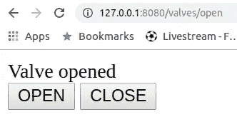

# 如何构建一个 FastApi 服务器来控制一个树莓 pi

> 原文：<https://betterprogramming.pub/how-to-build-a-docker-compose-app-for-a-raspberry-pi-7d7003b4cbc>

## 使用 docker-compose，您需要了解从安装到部署的所有信息


摘自[https://www . heise . de/ratgeber/Docker-auf-DEM-Raspberry-Pi-einrichten-4269052 . html](https://www.heise.de/ratgeber/Docker-auf-dem-Raspberry-Pi-einrichten-4269052.html)

最近，我的一个朋友问我是否可以帮助他建立一个图形用户界面，让他可以使用[树莓派](https://www.raspberrypi.org/)轻松控制几个阀门。除此之外，他还想在数据库中记录一些事情。

我的回答是:

“听起来很棒！让我们构建一个小型 web 服务器，它将网页作为 GUI，与 [MongoDB](https://www.mongodb.com/) 数据库一起，在您的 Raspberry Pi 上的[Docker-compose](https://docs.docker.com/compose/)**环境中运行。”**

**在这里，我想告诉你我做了什么，让树莓派(Rpi)的所有大胆的点工作。我假设你已经知道 Docker 和 Docker Compose 是什么。如果没有，慢慢来，仔细阅读 [Docker](https://www.docker.com/) 和 [Docker Compose](https://docs.docker.com/compose/) 。**

**你吃完了吗？让我们开始吧。**

# **设置 Docker 和 Docker 撰写**

**首先，Docker 和 Docker 为什么要作曲？**

**对我来说，只要我构建了一个依赖于安装在目标机器上的依赖项的应用程序，我就会使用 Docker。这避免了潜在的麻烦，并最终避免了“但是它在我的机器上运行”的问题。**

**当应用程序需要配置和/或由多个必须相互交互的组件组成时，我使用 Docker Compose。**

# **码头工人**

**为了让我们的应用程序在 Rpi 上运行，我们首先需要安装 Docker 和 Docker Compose。幸运的是，这非常简单。**

**首先，我们需要安装 Docker。要做到这一点，并能够以非 sudo 用户的身份运行 Docker，只需执行以下命令:**

```
curl -sSL [https://get.docker.com](https://get.docker.com) | sh
sudo usermod -aG docker $USER
# When you do a reboot, you can just type docker ---.
# Alternatively, to make it work in your current session, just typenewgrp docker
```

**为了检查一切是否如预期的那样工作，执行通常的 Docker `hello-world`示例:**

```
docker run hello-world
```

# **Docker 撰写**

**接下来，要安装 Docker Compose，我们需要 [Python](https://www.python.org/) 3 和 [Pip](https://pypi.org/project/pip/) 3。为什么是 3？这不仅仅是因为我不喜欢 Python 2，还因为你不必安装额外的依赖项。**

**如果你还没有安装它，跟随这篇[文章](https://medium.com/@isma3il/install-python-3-6-or-3-7-and-pip-on-raspberry-pi-85e657aadb1e)。现在，我想我可以有把握地假设您有 Pip 3，并且安装 Docker Compose 就像:**

```
pip3 install docker-compose
**# To check if everything worked as expected**
docker-compose --version
```

**现在，您的 Rpi 应该已经设置好了。把它放在一边，切换到您的本地机器上开发应用程序，我将在下面向您解释。**

# **网络服务器**

**有几种语言和框架可以用来编写 web 服务器。作为一个 Python 爱好者，我将向您展示如何用现代 Python 3.6+编写一个*快速* web 服务器。**

**为了管理项目的依赖和包，我将使用[诗歌](https://poetry.eustace.io)。为了构建 web 服务器，我使用 [FastAPI](https://github.com/tiangolo/fastapi) 作为 web 框架，使用[uvicon](http://www.uvicorn.org/)作为服务器。**

**我将提供一个简单的网页，对不起 UI/UX 人。最后，所有这些都将打包到一个 Docker 映像中，稍后将在我们的 Rpi 上运行。**

**这是总体大纲，所以让我们一步一步地看，看看需要做些什么。**

# **诗意**

**首先，我们在开发机器上安装诗歌，而不是 Rpi，来创建和管理我们的应用程序。我在所有的 Python 项目中使用诗歌，因为它简化了我管理依赖项、包和创建脚本的生活。**

**有各种方法来安装它，但在这里，我们只打算使用 Pip。在撰写本文时，我使用的是诗歌版本 0.12.7，所以让我们安装它:**

```
pip3 install poetry=0.12.7
```

**接下来，我们使用诗歌初始化名为`rpiserver`的应用程序，如下所示:**

```
poetry new rpiserver
```

**现在，您应该有一个名为`rpiserver`的新文件夹，这是我们剩余部分的基本文件夹。**

# **Web 框架和服务器**

**正如我已经说过的，我使用 FastAPI 作为框架，使用 Uvicorn 作为服务器。FastAPI 是一个现代的 web 框架，速度非常快，允许您用最少的代码设置端点，自动为您创建 OpenAPI 文档。**

**此外，与[烧瓶](https://palletsprojects.com/p/flask/)不同，它与 Uvicorn 一起直接投入生产。**

**对于一个业余爱好项目来说，文档和生产准备可能不是那么重要，但是为什么不拥有它呢？好，让我们通过以下方式将其添加到我们的`rpiserver`项目中:**

```
poetry add fastapi --extras all
```

**安装`extras` 依赖项直接为我们安装 Uvicorn。现在，我们可以开始编写 API 了。**

**我在本文中简化的目标是使用 Rpi 和 GPIOs 构建打开和关闭阀门的接口。我使用两个 REST API 端点来实现这一点。**

**除此之外，当服务器停止时，我想关闭阀门。为了与 GPIOs 通信，我们首先需要安装另一个名为 [RPi 的模块。GPIO](https://pypi.org/project/RPi.GPIO/) 。**

```
poetry add RPi.GPIO
```

**接下来，让我们创建一个文件`server.py` *，*导入库，并配置 GPIOs。**

```
**from** fastapi **import** FastAPI
**from** pydantic **import** BaseModel
**try**:
    import RPi.GPIO as GPIO
**except** RuntimeError **as** e:
    **from** .Dummypi **import** GPIOGPIO.setmode(GPIO.BCM)
GPIO.setwarnings(False)
```

**为了在我的本地机器上测试和实现 API，我创建了一个助手类`Dummypi`,它具有与真正的 GPIO 模块相同的接口，但是只是将我们正在做的事情打印到控制台。**

**接下来，我创建了一个类，它提供了与阀门交互的简单接口:**

```
**class** Valve(BaseModel):
    gpio : int
    is_open : bool = False**def** init(self):
        GPIO.setup(self.gpio, GPIO.OUT)
        return self**def** open(self):
        GPIO.output(self.gpio, GPIO.HIGH)
        self.is_open = True**def** close(self):
        GPIO.output(self.gpio, GPIO.LOW)
        self.is_open = Falsevalve = Valve(gpio=19).init()
```

**您现在只需要定义 GPIO ID，就可以开始了。**

**该类从`BaseModel`继承的原因是我想从我的 REST 端点返回实例`valve`，但是你马上就会看到。**

**现在，实际的终端应用程序:**

```
valve_app = FastAPI()@valve_app.on_event(**"shutdown"**)
**def** close_valves():
    valve.close()@valve_app.get(**"/valves/open"**, response_model=Valve)
**def** open_valve(id:int):
    valve.open()
    **return** valve@valve_app.get(**"/valves/close"**, response_model=Valve)
**def** close_valve():
    valve.close()
    **return** valve
```

**那么，我们在这里做了什么？**

**我们首先创建了一个 FastAPI 应用程序，我称之为`valve_app`。我之所以选择这个名字，而不仅仅是 app，是为了强调在下面的装饰器中以及启动服务器时，你必须使用*这个名字*。**

**接下来，在`close_valves`中，我定义了当服务器关闭时该做什么，即关闭阀门。**

**现在真正有趣的部分，我们的封闭和开放端点。它们都是`GET`方法，你可以从装饰器中看到。一个可通过`[http://SERVER-ADDRESS/valves/open](http://SERVER-ADDRESS/valves/open)`进入，另一个可通过`[http://SERVER-ADDRESS/valves/](http://SERVER-ADDRESS/valves/close)close`进入。**

**两个端点都返回一个对象*的 JSON 表示。*你通过`reponse_model`参数来定义。就是这样！不会太多吧？您可以通过以下方式运行服务器:**

```
poetry run uvicorn rpicontrol.server:valve_app — reload — port 8080
```

**现在，打开浏览器，输入`http://localhost:8080/valves/open`。这将打开你的阀门，并显示相应的 JSON。**

**要访问 OpenAPI 文档，只需键入`[http://localhost:8080/docs](http://localhost:8080/docs)`。**

**耶！或者说，几乎是。我们不是说过要创建一个图形用户界面吗？保持冷静，这是我们下一步要做的。**

# **网页**

**为了创建图形用户界面，我们的端点必须返回 HTML 页面，而不是 JSON 对象。用 FastAPI 实现这一点的一种方法是返回一个`HTMLResponse`的实例。相应的代码读作:**

```
**from** starlette.responses **import** HTMLResponse@app.get(**"/"**,  response_class=HTMLResponse)
**def** read_item():
    return generate_html_response()@app.get(**"/valves/open"**, response_class=HTMLResponse)
**def** open_valve():
    valve.open()
    return generate_html_response()@app.get(**"/valves/close"**, response_class=HTMLResponse)
**def** close_valve():
    valve.close()
    return generate_html_response()
```

**我现在做了什么？**

**首先，我添加了另一个端点“`/`”，当点击服务器 URL 时，它将直接返回您的网页。这基本上是我们的主要切入点。所有的端点现在都返回一个`HTMLReponse`和相同的网页。**

**这是通过`generate_html_reponse` *，*创建的，我接下来会向您展示。最后要注意的是，以前，我们在装饰器中声明了`response_model` ，它必须是类型`BaseModel`。**

**现在，当我们返回一个 HTML 页面时，我们需要定义`reponse_class`。**

**最后，创建 HTML 页面的函数。该页面显示打开/关闭状态，并提供两个打开和关闭按钮。按钮简单地分别跟随链接`/valves/open`、`/valves/close`。**

**这也是两个端点返回网页的原因。这是有点 hacky，但它工作得很好。**

```
**def** generate_html_response() -> HTMLResponse:
    state = **"opened" if** valve.is_open **else** **"closed"** html_content = **f"""
    <html>
        <head>
            <title>Your Basic Valve App</title>
        </head>
        <body>
            Valve** {state}
 **<br>
<button onclick="location.href='/valves/open'" type="button">OPEN
</button>
<button onclick="location.href='/valves/close'" type="button">CLOSE
</button>
        </body>
    </html>
    """
    return** HTMLResponse(content=html_content, status_code=200)
```

**网站看起来像这样:**

****

**我知道这看起来很 90 年代。但是，可以肯定的是，FastAPI 允许您提供高度专业的 HTML 页面，这些页面是使用 [Jinja 2 模板引擎](https://jinja.palletsprojects.com/en/2.10.x/)进行模板化和渲染的。**

**你也可以很容易地添加静态文件，如 CSS 文件和图片，以美化你的页面。**

**我最初也想过在这里添加这一点，但那会使帖子太长，所以我只是让你参考相应的 [FastAPI 页面](https://fastapi.tiangolo.com/tutorial/templates/)以了解更多细节。**

# **Docker 图像**

**最后一步是将我们的 web 服务器打包成 Docker 映像。为此，首先，创建一个名为`Dockerfile`的文件，并将其放在您的`pyproject.toml`文件旁边。**

**添加一个`.dockerignore`文件也是很好的做法。在该文件中，您指定了在构建时不应该复制到 Docker 映像中的所有内容。这有助于精简您的映像并加快构建时间。**

**接下来，我们需要选择一个基础图像。我们的代码需要 Python 3.7，图像应该在您的 Rpi 上运行，因此，我选择了`arm32v7/python:3.7-slim-buster` *。***

**添加这个并安装诗歌，docker 文件的第一行如下所示:**

```
**FROM** arm32v7/python:3.7-slim-buster
**RUN** apt-get update \
&& apt-get install build-essential -y \
&& pip install poetry
```

**下一步是复制`pyproject.toml`文件并安装所有非开发依赖项:**

```
**COPY** ./pyproject.toml /app/
**WORKDIR** /app/
**RUN** poetry install --no-dev
```

**最后，我们复制我们的应用程序代码，并添加一个入口点，在运行容器时启动服务器:**

```
# Install app
**COPY** ./rpicontrol /app/rpicontrol
**RUN** poetry install --no-dev
**ENTRYPOINT** poetry run uvicorn rpicontrol.server:valve_app --reload --host 0.0.0.0 --port 8080
```

**为什么我们不一次复制所有内容，只运行一次诗歌安装？**

**这是一个很小但非常有效的 Docker 构建优化技术。当一次做所有事情并改变你的代码时，在一次重建中，Docker 会重新安装所有的依赖项，即使它们没有改变。**

**通过将这两个步骤分开，我们利用了 Docker 的层缓存机制，并且不必重新安装依赖项。一般来说，经常变化的东西应该出现得很晚，才能利用 Docker 的层缓存机制。**

**这将为您在代码或配置文件中更改小东西时节省大量构建时间。很抱歉那个借口，但我希望将来能对你有所帮助。这里是更多的细节。**

**最后要注意的是，最终，您必须在 Raspberry Pi 上构建该映像，这样优化会更有意义，因为有了基本映像。然而，如果您想在本地测试构建，只需从基本映像中删除`arm32v7/`就可以了。**

**现在，这就是 web 服务器，让我们部署它吧！**

# **部署应用程序**

**为了部署这个应用程序，我最后添加了一个`docker-compose.yaml`文件，它比`pyproject.toml`文件高一级。我宁愿向您展示我的文件夹结构，以免让您感到不必要的困惑:**

```
├── docker-compose.yaml
└── rpicontrol
 ├── Dockerfile
 ├── poetry.lock
 ├── pyproject.toml
 ├── rpicontrol
 │ ├── Dummypi.py
 │ ├── __init__.py
 │ ├── server.py
```

**为什么我在这里使用 docker-compose？因为两个原因:**

1.  **我可以将运行 Docker 容器的配置参数存储在一个文件中，并对该文件进行版本控制。**
2.  **将来，我想添加一个数据库，这将是添加到组合文件中的另一个服务。**

**那么，合成文件应该包含什么呢？**

**我希望可以通过端口 80 访问该应用程序，所以我将容器端口 8080 映射到 Rpi 上的端口 80。为了访问 GPIOs，我还需要在特权模式下运行服务，并且我还必须将`/dev/mem`从 Rpi 挂载到 Docker 容器。**

**所有这些都是通过以下 docker-compose 文件完成的:**

```
version: '3.7'
services:
  server:
    image: rpicontrol
    build: ./rpicontrol
    ports:
      - 80:8080
    devices:
      - "/dev/mem:/dev/mem"
    privileged: true
```

**现在，假设您已经将整个文件夹复制到您的 Rpi，希望通过克隆一个 Git repo，您只需输入:**

```
docker-compose up
```

**这将建立图像，只是第一次它没有找到相应的图像。之后，它将重用可用的那个。如果您进行了任何更改，您可以通过以下方式重建映像:**

```
docker-compose build
```

**要访问 Rpi，您必须在同一个网络上，并且知道它的 IP 地址。**

**现在，只要打开一个浏览器，进入`[http://192.168.1.RPIIP](http://192.168.1.RPIIP.)` [。](http://192.168.1.RPIIP.)现在，我们有一个正在运行的网络服务器，一个丑陋的网页，可以通过图形用户界面控制我们的阀门。任务完成了。**

# **结论**

**感谢您的关注。我想我已经在这篇文章中涉及了很多东西，实际上比我之前想的要多得多。**

**我希望至少有一样东西对你有用，你可以开始开发和部署漂亮的 web 应用程序，也许是在 Raspberry Pi 上。**