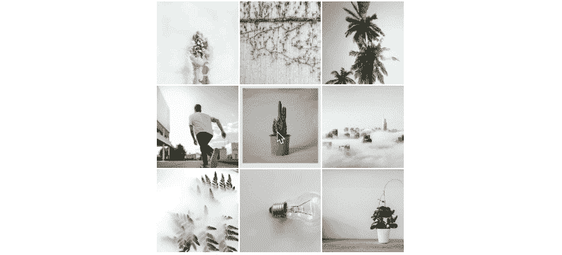
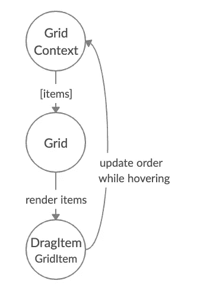
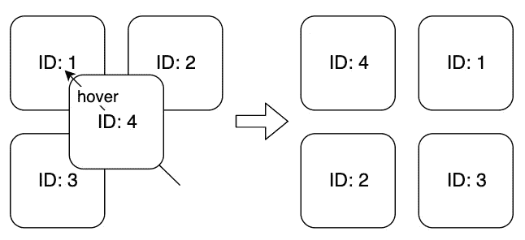

# 如何在 React 中构建拖放网格

> 原文：<https://betterprogramming.pub/how-to-build-a-drag-and-drop-grid-in-react-3008c5384b29>

## 构建一个简单、漂亮、交互式的图片网格


丹尼尔·麦卡洛在 [Unsplash](https://unsplash.com/s/photos/grid?utm_source=unsplash&utm_medium=referral&utm_content=creditCopyText) 上的照片

在本教程中，我们将在 React 中构建一个拖放图像网格。下面的 gif 展示了想要的效果:



所有图片均来自 Pexels.com

在我开始写这篇文章的时候，我找不到任何关于如何着手这个项目的好资料来源，于是决定自己从头开始创建它。还有，有几个很棒的库，比如`[react-beautiful-dnd](https://github.com/atlassian/react-beautiful-dnd)`，但是它们没有提供我需要的简单的二维网格支持。

该项目可在:[github.com/tfiechowski/react-dnd-grid-tutorial](https://github.com/tfiechowski/react-dnd-grid-tutorial)

# 设置

让我们从创建应用程序和安装一些我们将在整个项目中使用的依赖项开始。`react-dnd`是我们将用于拖放交互的库，我们将使用`styled-components`进行样式化。

```
create-react-app dnd-grid-tutorial
cd dnd-grid-tutorial
yarn add styled-components react-dnd react-dnd-html5-backend
```

# 网格组件

让我们首先创建一些网格组件来保存我们的图像。我的风格基于 StackOverflow 的这个答案。CSS 不是本教程的主要话题，所以我将省略细节。

我们使用`background-image` CSS 属性代替``标签，以便有一些好的助手属性，如`background-size`和`background-position`。网格的宽度是 600px，所以不会扩展到整个屏幕。这只是为了测试和开发的目的。`GridItemWrapper`的`flex-basis (flex: 0 0 33.3%;)`设置为 33.3%。因此，我们每行将有三个项目。

`GridItem`有一些带参的魔术，现在不关注了。我稍后会解释。

让我们把下面的代码放到`src/Grid.js`中:

src/Grid.js

这就是教程中使用的接口组件。如果您寻求另一种布局或风格，请随意使用这里的属性。

# 拖放式

所需的拖放功能本身不会工作。关于订购的状态和信息需要存储在某个地方。为此，我们将使用 React 上下文并创建`GridContext`。它还将保存用于重新排序项目的逻辑。

为了使网格项目可以拖放，我们将创建一个定制的包装器组件(`DragItem`)，它将利用`react-dnd`的拖放特性。



渲染/顺序更新循环

这张图表简要显示了引擎盖下将要发生的事情:

*   `Grid`从`GridContext`获取物品，并渲染`DragItems`列表。
*   如果悬停`GridContext` 时项目位置改变，则更新项目在其内部状态的顺序。
*   `Grid` 使用更新后的项目及其顺序进行重新渲染。

## 拖放源和目标

简单来说，[拖动源是可拖动的组件](http://react-dnd.github.io/react-dnd/docs/api/use-drag)，而[拖放目标是我们可以将某些东西拖放到](http://react-dnd.github.io/react-dnd/docs/api/use-drop)上的组件。

每个可拖动的组件需要指定它的`item`属性，用来描述被拖动的数据。这是拖放源和拖放目标之间唯一共享的信息。将大量数据放在那里可能很诱人，甚至是对源对象(在我们的例子中是一个图像)的引用，但是最好尽可能保持简单。为了实现这一点，每个`item`将有一个唯一的 ID。

使用`[useDrag](http://react-dnd.github.io/react-dnd/docs/api/use-drag)`创建拖动源，使用`[useDrop](http://react-dnd.github.io/react-dnd/docs/api/use-drop)`创建放下目标。在下面的例子中，我们将创建一个既可拖动又可感知拖放的简单元素。两个项目的 IDs 一个被悬停，另一个被悬停——将被显示。

大多数时候我们可能会使用 React 组件，但是在拖放的情况下，我们需要直接访问 DOM 节点。为了实现这一点，[我们将创建一个](https://pl.reactjs.org/docs/refs-and-the-dom.html) `[ref](https://pl.reactjs.org/docs/refs-and-the-dom.html)`并将它与`react-dnd`和一个 DOM 元素连接起来。

`useDrag`和`useDrop`都返回数组，其中第二个元素是将我们的 ref 与`react-dnd`内部连接起来的函数。这些功能被称为*连接器功能*。

在下面的例子中，您可以看到`item`属性是如何在拖动源和拖放目标之间传递的。此外，[还有一个](http://react-dnd.github.io/react-dnd/docs/api/use-drag#specification-object-members) `[type](http://react-dnd.github.io/react-dnd/docs/api/use-drag#specification-object-members)` [字段，告诉空投目标他们应该对](http://react-dnd.github.io/react-dnd/docs/api/use-drag#specification-object-members)的哪些物品做出反应。一个`ref`被创建，通过`connectDrag`和`connectDrop`与`react-dnd`连接，然后被传递给`div`元素。

拖放挂钩的简单例子

然后我们可以渲染一些元素并把它们拖到其他元素上。

```
<SimpleDragAndDropComponent *itemId*="1" />
<SimpleDragAndDropComponent *itemId*="2" />
<SimpleDragAndDropComponent *itemId*="3" />
<SimpleDragAndDropComponent *itemId*="4" />
```

控制台的示例输出可能是:

```
Hovering item. id:  1  created:  10:06
Hovered over item with id:  2Hovering item. id:  1  created:  10:06
Hovered over item with id:  3Hovering item. id:  3  created:  10:06
Hovered over item with id:  2
```

这个例子展示了一些潜力，但是我们还不能动态地重新排序这些项目。将元素放到另一个元素上暂时不会有任何作用。现在让我们来处理这个问题。

# 网格上下文

为了构建`GridContext`，我们将使用 React 上下文。该组件将保存关于项目的信息，并公开对它们进行重新排序的方法。

使用有状态的组件代替上下文是可能的，但是这样有更大的灵活性。如果组件结构变得稍微复杂一点，就不需要深度的 prop 传递，因为我们基本上可以在任何地方访问上下文，特别是用`useContext` hook。

让我们决定如何即时重新订购商品。

## 重新排序机制

要在拖动项目时重新排序它们，我们将使用一个简单的方法:每当拖动的项目在另一个项目上时，它将取代它的位置，并将右边的所有剩余项目推得更远:



记住这一点，同时要求我们对条目 id 进行操作，我们可以开始实现`GridContext`。

## 网格上下文

它将保持项目数组的状态，并公开两个方法:`moveItem(sourceId, destinationId)`和`setItems(items)`。

`moveItem`功能负责将给定`sourceId`的项目移动到另一个带有`destinationId`的项目的位置，并将其余项目向右移动一个位置。还有`move`和`moveElement`实用函数来处理数组的重新排列。`setItems`仅覆盖上下文状态中的项目。

`[GridContext](https://github.com/tfiechowski/react-dnd-grid-tutorial/commit/d6aa0a2ae8a10640726f7f41d563610eff256b91)`[可以通过以下方式实现:](https://github.com/tfiechowski/react-dnd-grid-tutorial/commit/d6aa0a2ae8a10640726f7f41d563610eff256b91)

src/grid text . js

## DragItem

现在，让我们来处理`DragItem`组件，并像这样实现它:

src/DragItem.js

现在让我们来了解一下这里发生了什么。

首先，我们用 `[memo](https://reactjs.org/docs/react-api.html#reactmemo)`包装了组件本身[。它提高了性能，因为它只是浅显地检查道具是否改变，如果没有，它重用最后渲染的结果。在我们的道具中:](https://reactjs.org/docs/react-api.html#reactmemo)

*   `id` —该商品的唯一标识，
*   `onMoveItem` —实际移动和重新排列项目的处理程序，
*   `children` —要渲染的子对象。

然后我们创建一个`ref`，它将被用作对相应 DOM 节点的引用。

**拖动:**拖动源由`useDrag`创建。在返回数组的第一个元素中，我们有`{ isDragging }`。它不是现成可用的，但它实际上是从下面的`collect`方法返回的一个值。`collect`函数可以访问[监视器，该监视器有几个可用的助手方法](http://react-dnd.github.io/react-dnd/docs/api/drag-source-monitor)。`item`是必需的属性。我们将唯一的 ID 和一个`type`放在那里，以指定它是哪种可拖动的项目。

**下降:**现在我们使用`useDrop`设置下降目标。`accept`属性被设置为`IMG`，因为我们只希望将该类型的项目放在这里。当[一个被拖动的项目悬停在放置目标组件](http://react-dnd.github.io/react-dnd/docs/api/use-drop#specification-object-members)上时，调用`hover`方法。

问题:`hover`函数如何获得作为参数的`hoveredOverItem`?

在我们的例子中，网格中的每一项都是可拖放的。拖放机制与同一个 DOM 元素相关联(通过`connectDrag/Drop(ref)`)，所以每当我们将一个项目悬停在另一个项目上时，我们实际上会在`useDrag`中获得在那个`item`中指定的内容。

**重新排序:**通过比较拖动和悬停项目的 id，我们可以检测到项目应该重新排序的时刻。我们使用`onMoveItem`处理器，按照以下方式完成:

```
hover(hoveredOverItem) {
  if (hoveredOverItem.id !== id) {
    onMoveItem(hoveredOverItem.id, id);
  }
}
```

现在我们需要用拖放操作来连接我们的`ref`:我们通过调用从`useDrag/Drop`获得的连接器函数来完成:

```
connectDrag(ref);
connectDrop(ref);
```

**一些样式:**让我们使用得到的`isDragging`变量来区分被拖动的项目。让我们这样做，改变其不透明度为 0.5:

```
const opacity = isDragging ? 0.5 : 1;
const containerStyle = { opacity };
```

**渲染儿童:**现在来了一点棘手的部分。我们希望`DragItem`尽可能地可重用，所以直接在这里放一些 div 或图像是不合理的。我们可以利用`[children](https://medium.com/javascript-in-plain-english/how-to-use-props-children-in-react-7d6ab5836c9d)` [道具](https://medium.com/javascript-in-plain-english/how-to-use-props-children-in-react-7d6ab5836c9d)来渲染我们放在`DragItem`里面的任何东西。

能够在`DragItem`中呈现任何内容是一个很大的优势，但是有一个警告:我们创建的`ref`不能直接附加到任何实际的 DOM 节点上，我们也不能轻易传递它。根据 [React 文档](https://reactjs.org/docs/forwarding-refs.html#forwarding-refs-in-higher-order-components)，“那是因为`ref`不是道具。和`key`一样，React 的处理方式也不一样。”

我们需要将它作为一个自定义道具传递，并手动将其附加到目标组件中。现在，您可以看到我们之前创建的`GridItem`组件中的`ref`和`forwardedRef`的神奇之处:

```
export const GridItem = ({ *forwardedRef*, ...*props* }) => (
  <GridItemWrapper *ref*={forwardedRef} {...props} />
);
```

`GridItemWrapped`只是一个 div(用`styled.div`创建的)，所以在这里传递`ref`完全没问题。记住这一点，让我们完成`DragItem`并让它返回带有更新的样式和一个`forwardedRef`的孩子:

```
return React.Children.map(children, *child* =>
  React.cloneElement(child, {
    forwardedRef: ref,
    style: containerStyle
  })
);
```

我们有子道具，所以我们将使用 React 内置 API 来操纵它们:`[React.Children.map](https://reactjs.org/docs/react-api.html#reactchildrenmap)`和`[React.cloneElement](https://reactjs.org/docs/react-api.html#cloneelement)`。我们传递的每个子对象都将把`ref`作为`forwardedRef`传递，并有一个自定义的不透明样式。如前所述，`forwardedRef`被手动附加到 GridItem 组件中的 DOM 元素。

注意:这种情况会自动发生*。我相信这个例子没问题，但是如果你发现以这种方式修改子样式太含蓄，你可以，例如，在这里传递`isDragging`作为一个道具，然后决定组件本身的样式。*

# *把一切都连接起来*

*好了，我们有了所有的积木，现在让我们把所有的东西连接起来。`react-dnd`需要[设置拖拽交互和上下文](http://react-dnd.github.io/react-dnd/docs/tutorial#adding-drag-and-drop-interaction),`GridContext`需要一个提供者来正确工作。`src/index.js`这是一个完美的地方:*

*src/index.js*

*注意:这超出了本教程的范围，但是将来你可能想探索其他的拖放后端，比如[触摸后端](https://react-dnd.github.io/react-dnd/docs/backends/touch)。*

*现在，让我们去`src/App.js`，接上`GridContext`、`Grid`和`DragItems`:*

*尽管网格是空的，但现在一切都应该工作正常。我准备了[几样东西来用](https://github.com/tfiechowski/react-dnd-grid-tutorial/commit/e28a0213b90b2f337e2cac9348cb8d4fa2a32d91)。随意复制它们并在`GridContext`构造函数中使用它们来初始化项目列表。我们将看到预期的效果:*

**

# *旁注*

*这是一个简单的例子，没有复杂的事情发生，也没有任何 API 集成。有几个进一步发展它的机会。*

*可以扩展`DragItem`组件来接受类似`onItemDrop`的道具(在 `[useDrop](http://react-dnd.github.io/react-dnd/docs/api/use-drop)`中的`[drop](http://react-dnd.github.io/react-dnd/docs/api/use-drop)` [中调用)并指示拖动结束。它可以用于更新后端或同步整个应用程序中的其他东西。](http://react-dnd.github.io/react-dnd/docs/api/use-drop)*

*您可以扩展`GridContext`来保存两个列表，一个是主工作网格，另一个是备用网格，其中的图像等待添加到第一个列表中。*

*我在教程中跳过了这一部分，但是在 GridContext 中也添加了一些简单的测试。*

# *摘要*

*我们学习了如何通过动态重新排序来创建图像网格。您可以在此基础上进行构建，或者只是了解如何处理更复杂的拖放场景。*

*整个项目都在 GitHub 仓库中:【https://github.com/tfiechowski/react-dnd-grid-tutorial *

*谢谢！欢迎在评论中发表你的观点。我非常开放，渴望听到你的反馈，无论是积极的还是消极的！*