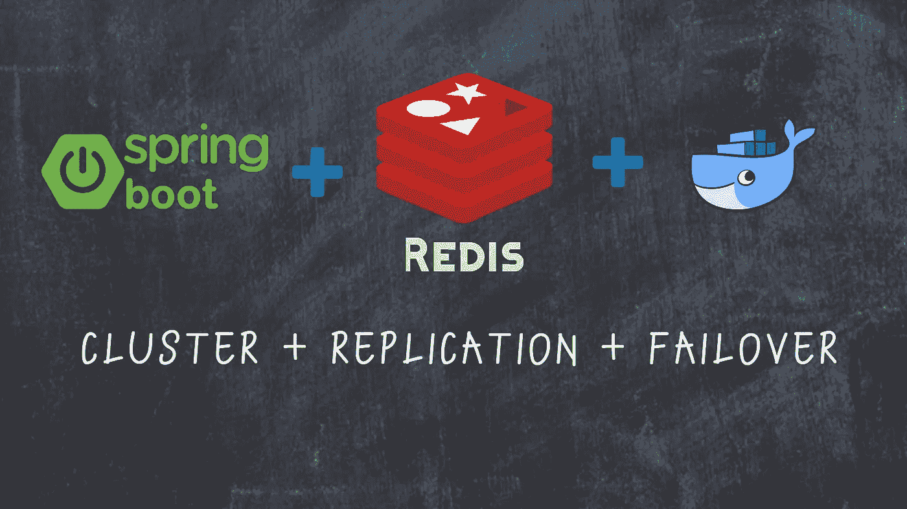
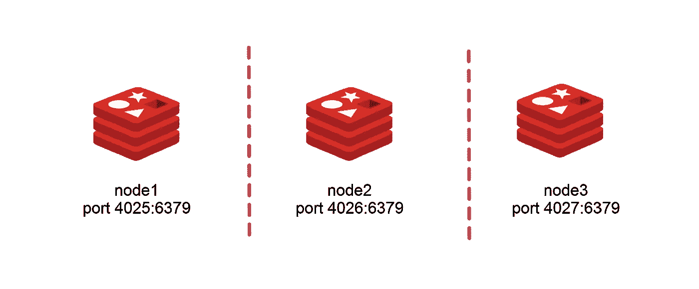
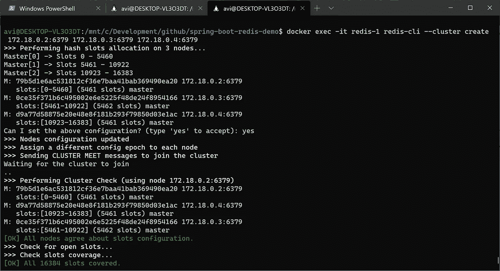
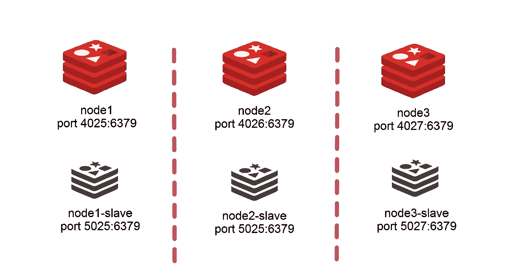
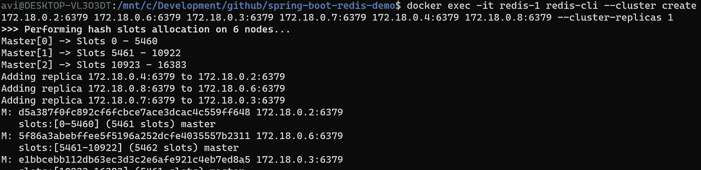
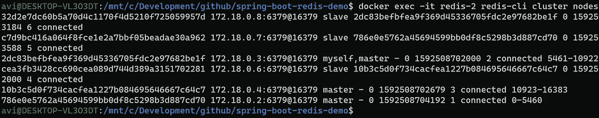
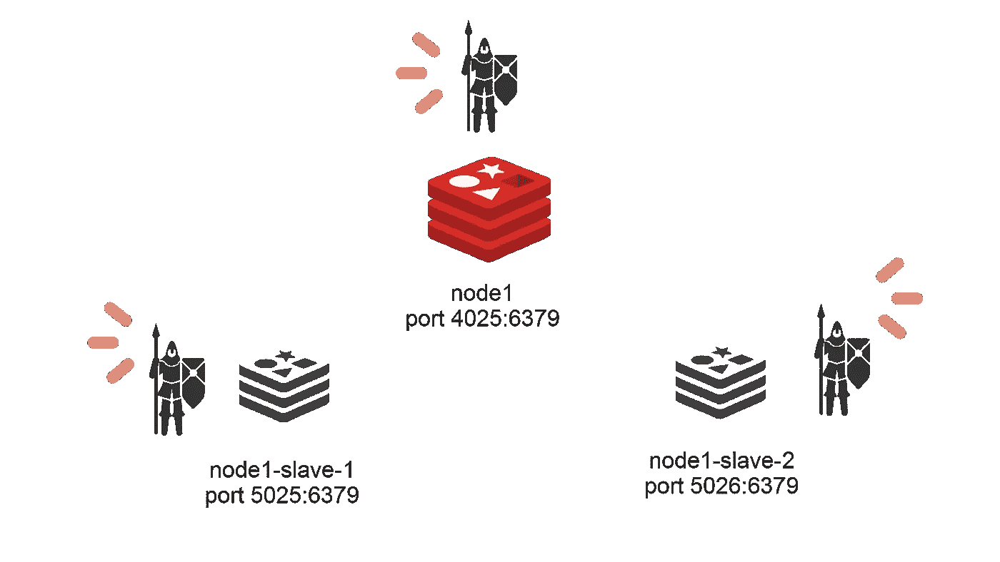
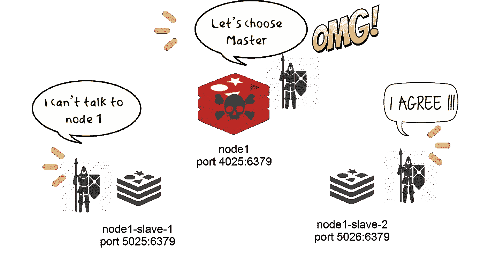

# 如何用 Spring Boot 和多克构建容错 Redis 网络

> 原文：<https://betterprogramming.pub/how-to-build-a-fault-tolerant-redis-network-with-spring-boot-and-docker-17e16ad898ed>

## 具有复制和故障转移功能的集群



*编者按:这篇文章经过编辑，使用了一个更有思想的机器之间的主要/次要关系，而不是以前的、文化上不敏感的术语。根据您在当地使用的术语，您可能需要更新我们在这里称为主/次的术语，以匹配您的系统。谢谢！*

在分布式系统中，实现容错是成功的关键标准之一。

让我们看一下在 Redis 网络中使用 Redis 集群和 sentinels 实现容错和复制。

在本教程中，我将介绍:

*   [Redis 简介](#83e7)
*   使用 Docker 创建带有 Redis 缓存的 spring boot 应用程序
*   构建容错 Redis 网络的不同方法
*   *用 redis 集群分片*
*   *使用 redis 集群进行复制*
*   *带 sentinel(无分片)的 Redis 主从网络*

# Redis 简介

> Redis 是一个开源的(BSD 许可的)、内存中的数据结构存储，用作数据库、缓存和消息代理。
> 
> Redis 具有内置的复制、LRU 驱逐、事务和不同级别的磁盘持久性，并通过 Redis Sentinel 和 Redis Cluster 的自动分区提供高可用性。
> 
> 为了实现其出色的性能，Redis 工作在内存中。

—[Redis 简介](https://redis.io/topics/introduction#:~:text=In%20order%20to%20achieve%20its,each%20command%20to%20a%20log.)

## 在我们深入研究编码之前，需要注意一些关键的 Redis 特性

*   **最大内存:**默认情况下，Redis 在 64 位系统上没有内存限制，在 32 位系统上有 3 GB 内存限制。大内存可以包含更多的数据，并提高命中率，这是最重要的指标之一，但在内存的某个限制下，命中率将处于相同的水平。
*   **驱逐算法:**当缓存大小达到内存限制时，旧数据将被删除，以便为新数据腾出空间。Redis 提供`Last Recently Used`和`Least Frequently Used`驱逐算法。RDB 时间点快照在特定的时间间隔或写入次数后，AOF 会为每个写入操作创建持久性日志。
*   **持久性:**出于各种原因，您可能想要持久化您的缓存。启动后，缓存最初是空的，在停机后恢复的情况下，用快照数据填充它将是有用的。Redis 支持不同的方式来实现持久性。

# 开发 Spring Boot + Redis + Docker 应用程序

在本文的最后，我将针对这个演示对 Github repo 进行一些更新。如果您想在本文的不同地方查看代码，请查看发布版。

[](https://github.com/avinash10584/spring-boot-redis-cluster.git) [## avinash 10584/spring-boot-redis-cluster

### spring-boot-redis-cluster。在…上创建一个帐户，为 avinash 10584/spring-boot-redis-cluster 开发做出贡献

github.com](https://github.com/avinash10584/spring-boot-redis-cluster.git) 

让我们建立我们的 Redis 应用程序！

# 步骤 1:创建一个简单的 Spring Boot 待办事项应用程序

首先，让我们创建一个简单的待办事项应用程序。我们不会为多个用户创建它，只是为了保持简单。

目前，我们只是在应用程序中存储一个简单的待办事项列表作为缓存。我们还没有使用数据库。

# 步骤 2:下载并启动 Redis Docker 映像

从 Docker hub 下载官方 Redis 图像:

`docker pull redis`

在这个命令之后，新的映像应该出现在您的本地存储库中(键入 Docker images 进行检查)。

GitHub 中的项目被配置为使用独立模式和集群模式。

首先，让我们在独立模式下使用 Redis。我们从 Dockerhub 中提取的 Redis 图像开始:

`docker run --rm -p 4025:6379 -d --name redis-1 redis redis-server`

# 步骤 3:将 Redis 集成到 Spring Boot 应用程序中

我们将使用 spring boot cache 与 Redis 对话。Spring 附带了几个注释，您可以添加这些注释来帮助它使用 Redis 缓存。

将`@EnableCaching`添加到您的应用程序配置中，以启用这些注释:

现在，让我们构建我们的 Docker 应用程序，以确保 spring boot 应用程序可以与 Redis 对话。该项目的 docker 文件位于 github repo 中。我将重点放在 Redis 上，所以我将避免 spring boot 应用程序的 docker 文件的细节。

如果您想了解项目中使用的 Docker 文件的更多信息，并了解如何避免 Docker 构建时间和使用缓存，那么请看这篇文章:

[](https://medium.com/codingfullstack/5-essential-docker-tips-for-your-spring-boot-images-8f570270d9ba) [## Spring Boot 形象的 5 个重要提示🐳

### 跟上最新和最佳实践，构建 spring boot docker 映像。

medium.com](https://medium.com/codingfullstack/5-essential-docker-tips-for-your-spring-boot-images-8f570270d9ba) 

`DOCKER_BUILDKIT=1 docker build -t learnings/spring-boot-redis-cluster .`

一旦构建了我们的映像，下一步就是运行该映像:

`docker run --rm -p 4024:4024 --name spring-boot-redis learnings/spring-boot-redis-cluster`

如果您运行应用程序并访问`http://localhost:4024/app/`，您将得到错误`.ConnectTimeoutException: connection timed out`。

这是因为我们希望我们的两个 Docker 映像能够相互对话——默认情况下，它们位于自己的网络上，并且相互隔离。

此时我们有两个选择:

*   **使用 Docker 网络**

或者，

*   **创建一个构建默认网络的 docker-compose**

我将为这个演示创建 docker 网络，我正在创建一个 Docker 网络，但如果你想在项目中添加 docker-compose 文件，请在评论中告诉我。

`docker network create spring-redis-network`

现在让我们将 Redis 和 spring boot 映像连接到这个网络:

`docker network connect spring-redis-network redis-1`

我们现在可以寻找 Redis 实例的 IP 地址，并在`application.yml`中进行更新。

*如果您使用* `*docker-compose*` *可以避免这种查找，因为它可以绑定服务，而无需给出 IP 地址的细节:*

`docker inspect spring-redis-network`

我的 IP 地址是`172.18.0.2`

```
"Name": "redis-1", 
"EndpointID": "88b100f3569bb4ed68ac8cbf84f4b5a20493e11c5e7336a052bbbd25bb5f4205", "MacAddress": "02:42:ac:12:00:02", 
"IPv4Address": "**172.18.0.2**/16", 
"IPv6Address": ""
```

我们现在可以在`application.yml`更新这个:

```
redis: 
   host: 172.18.0.2 
   port: 6379
```

*注意:我们使用端口 6379，因为我们在 Docker 网络中，对主机公开的端口是 4025。*

现在，让我们再次构建应用程序的映像，并连接到我们创建的网络:

```
DOCKER_BUILDKIT=1 docker build -t learnings/spring-boot-redis-cluster
```

运行 Docker 映像时，我们可以通过传递`--net`连接到网络:

```
docker run --rm --net spring-redis-network -p 4024:4024 --name spring-boot-redis learnings/spring-boot-redis-cluster
```

您应该在`[http://localhost:4024/app/](http://localhost:4024/app/)`处看到待办事项列表项

我们可以验证缓存是在 Docker Redis 映像中创建的:

```
docker exec -it redis-1 redis-cli --scan
```

## 步骤 4:修改我们的应用程序以使用 Spring Cache 注释

Spring Cache 通常使用五种基本的注释:

*   `@CachePut`:用于更新缓存。
*   `@Cacheable`:返回一个方法的缓存响应
*   `@CacheEvict`:要删除不再需要的缓存条目，可以考虑删除一个实体。
*   `@Caching` : Java 不允许在一个方法或类中两次使用相同的注释类型。所以，如果你想说`@CacheEvict`在两个不同的缓存中用同一个方法`@Cacheable`可以用来聚合其他缓存注释。

我已经将这些添加到我们的`ToDoListController`中，看起来是这样的:

让我们再次运行我们的应用程序并检查 Redis 统计数据，

```
DOCKER_BUILDKIT=1 docker build -t learnings/spring-boot-redis-cluster . docker run --rm --net spring-redis-network -p 4024:4024 --name spring-boot-redis learnings/spring-boot-redis-cluster docker exec -it redis-1 redis-cli info stats
```

如果你想检查到目前为止的代码，[看一下标签](https://github.com/avinash10584/spring-boot-redis-cluster/releases/tag/REDIS-CACHE)。

# 使用 Redis 集群进行分片

我们已经用 Redis 缓存构建了一个基本的 spring boot 应用程序。

但是，如果我们处理的是无法包含在一个节点中的大量数据，该怎么办呢？Redis 支持集群在多个节点上共享数据。

Redis 集群中的整个键空间被分成 16384 个槽(称为哈希槽)，这些槽被分配给多个 Redis 节点。给定的键被映射到这些槽中的一个，并且键的散列槽被计算:

```
HASH_SLOT = CRC16(key) mod 16384
```

在大多数情况下，您不需要知道这些内部信息，因为 Redis 会处理来自正确集群的数据的推送和提取。

让我们停止 Redis 映像并构建一个集群:

```
docker stop redis-1 
docker stop spring-boot-redis
```

让我们再旋转两个 Redis 节点来构建一个集群。我们还传递了一个位于项目/ `redis-conf`中的 Redis 配置文件。

**Redis 至少需要三个节点才能让集群工作。**

Redis 映像默认禁用 Redis 集群支持，因此我们需要添加一个配置文件，并将其传递给我们的 Redis Docker 映像。我已经将它添加到项目根目录下的`/redis-conf`中。



让我们开始碎片:

```
docker run --rm --net spring-redis-network -v /mnt/c/Development/github/spring-boot-redis-cluster/redis-conf:/redis_config -p 4025:6379 -d --name redis-1 redis redis-server /redis_config/node1.conf docker run --rm --net spring-redis-network -v /mnt/c/Development/github/spring-boot-redis-cluster/redis-conf:/redis_config -p 4026:6379 -d --name redis-2 redis redis-server /redis_config/node2.conf docker run --rm --net spring-redis-network -v /mnt/c/Development/github/spring-boot-redis-cluster/redis-conf:/redis_config -p 4027:6379 -d --name redis-3 redis redis-server /redis_config/node3.conf
```

Redis 映像已经以集群模式启动，但是我们仍然需要创建一个集群来将它们绑定在一起。我们可以进行主从配置，但目前，我们只需要数据分片并创建不带故障转移的集群。

我们将在下一节讨论故障转移。

运行以下命令创建集群:

```
docker exec -it redis-1 redis-cli --cluster create 172.18.0.2:6379 172.18.0.3:6379 172.18.0.4:6379
```

您应该会在输出中看到类似这样的内容:



我们可以检查我们的 Docker 网络，以获取 Redis 节点的新 IP 地址

```
docker inspect spring-redis-network
```

我们的`application-cluster.yml`长这样:

让我们停止 Docker spring boot 应用程序，并使用集群配置重新启动它:

```
docker stop spring-boot-redis DOCKER_BUILDKIT=1 docker build -t learnings/spring-boot-redis-cluster . docker run --rm --net spring-redis-network -e "SPRING_PROFILES_ACTIVE=cluster" -p 4024:4024 --name spring-boot-redis learnings/spring-boot-redis-cluster
```

您可以在浏览器中刷新应用程序，以验证应用程序是否正常工作。

我们还可以验证任何节点中的群集配置:

```
docker exec -it redis-2 redis-cli cluster nodes
```

分片允许我们的数据分布在大型数据集的多个节点中，并通过哈希减少查找。

我们的集群缺少分布式系统的两个关键安全检查:故障转移处理和复制。

# 使用 Redis 集群进行复制

Redis 集群允许我们实现故障转移处理和复制。

我们将在主从配置中设置节点，其中有一个父节点和两个副本节点。

这样，如果我们失去一个节点，群集仍然能够选举新的主节点。在此设置中，写入必须通过主服务器，因为副本服务器是只读的。



这样做的好处是，如果主节点消失，它的整个状态已经复制到辅助节点，这意味着当一个节点被选为主节点时，它可以立即开始接受写入。

## 我们需要哨兵吗？

Sentinels 是独立的 Redis 实例，它们与 Redis 节点一起运行，以决定它们在集群中的角色，并在发生故障转移时根据需要改变主从关系。

> **使用 Redis 集群时不需要 Sentinel。**

***如果任何主实例中出现任何问题，Redis 集群将执行自动故障转移。***

首先，我们应该将我们的集群转换为主从集群。让我们再添加三个节点，作为三个主节点的副本。

首先，我们停止节点，然后再次启动它们:

```
docker stop redis-1 
docker stop redis-2 
docker stop redis-3 # Start redis nodes docker run --rm --net spring-redis-network -v /mnt/c/Development/github/spring-boot-redis-cluster/redis-conf:/redis_config -p 4025:6379 -d --name redis-1 redis redis-server /redis_config/node1.conf docker run --rm --net spring-redis-network -v /mnt/c/Development/github/spring-boot-redis-cluster/redis-conf:/redis_config -p 4026:6379 -d --name redis-2 redis redis-server /redis_config/node2.conf docker run --rm --net spring-redis-network -v /mnt/c/Development/github/spring-boot-redis-cluster/redis-conf:/redis_config -p 4027:6379 -d --name redis-3 redis redis-server /redis_config/node3.conf # Start replicas docker run --rm --net spring-redis-network -v /mnt/c/Development/github/spring-boot-redis-cluster/redis-conf:/redis_config -p 5025:6379 -d --name redis-1-replica redis redis-server /redis_config/node1-replica.confdocker run --rm --net spring-redis-network -v /mnt/c/Development/github/spring-boot-redis-cluster/redis-conf:/redis_config -p 5026:6379 -d --name redis-2-replica redis redis-server /redis_config/node2-replica.confdocker run --rm --net spring-redis-network -v /mnt/c/Development/github/spring-boot-redis-cluster/redis-conf:/redis_config -p 5027:6379 -d --name redis-3-replica redis redis-server /redis_config/node3-replica.conf
```

让我们检查一下 Docker 网络，因为我们需要 IP 地址来创建集群:

```
docker inspect spring-redis-network docker exec -it redis-1 redis-cli --cluster create 172.18.0.2:6379 172.18.0.3:6379 172.18.0.4:6379 172.18.0.6:6379 172.18.0.7:6379 172.18.0.8:6379 --cluster-replicas 1
```

如果您看到以下错误，请停止正在运行的节点，因为它们具有内存中的数据，并且在创建集群时需要为空:

```
[ERR] Node 172.18.0.3:6379 is not empty. Either the node already knows other nodes (check with CLUSTER NODES) or contains some key in database 0.
```

如果一切顺利，您应该会看到以下输出:



我们可以通过以下方式验证我们的群集:

```
docker exec -it redis-2 redis-cli cluster nodes
```



我们最终的`application-cluster.yml`看起来是这样的:

让我们再次运行我们的应用程序，并检查 Redis 统计数据:

```
DOCKER_BUILDKIT=1 docker build -t learnings/spring-boot-redis-cluster . docker run --rm --net spring-redis-network -p 4024:4024 --name spring-boot-redis learnings/spring-boot-redis-cluster docker exec -it redis-1 redis-cli info stats
```

我们现在应该测试我们的故障转移。让我们用`docker stop redis-2`停止我们的一个服务器。

如果您运行`docker exec -it redis-1 redis-cli cluster nodes`，您会看到之前的次映像现在被提升为主映像。

如果父副本出现故障，Redis 会自动将辅助副本提升为主副本。

# Redis 初级-次级(副本)网络，带 Sentinel，无分片

在不需要分片并且一个节点足以满足内存需求的场景中，您可以通过在 Redis 节点的`replica`配置中指定`replicaof`来避免创建集群并构建主从副本。

如果我们不使用 Redis 集群，那么我们需要哨兵来实现故障转移。



哨兵和 Redis 集群是不同的概念。如果主要的死亡，然后哨兵互相交谈，以决定新的主要。



由于 sentinel 配置与集群有很大不同，我把这个配置放在了`/redis-conf-sentinel`

让我们添加 sentinel 服务器，这样我们就可以实现自动故障转移，

哨兵只需要查看主节点就可以决定故障转移。

`sentinel monitor redis-cluster 172.18.0.2 6379 2`

我们可以使用下面的配置来决定一个集群节点在多长时间后被视为关闭。

`sentinel down-after-milliseconds redis-cluster 5000`

我们可以添加以下内容，以便在故障切换开始前允许当前复制写入超时完成:

`sentinel failover-timeout redis-cluster 10000`

让我们停止所有的码头集装箱:

`docker stop $(docker ps -a -q)`

```
docker run --rm --net spring-redis-network -v /mnt/c/Development/github/spring-boot-redis-cluster/redis-conf-sentinel:/redis_config -p 4025:6379 -d --name redis-1 redis redis-server /redis_config/node1.conf docker run --rm --net spring-redis-network -v /mnt/c/Development/github/spring-boot-redis-cluster/redis-conf-sentinel:/redis_config -p 5025:6379 -d --name redis-1-replica redis redis-server /redis_config/node1-replica-1.confdocker run --rm --net spring-redis-network -v /mnt/c/Development/github/spring-boot-redis-cluster/redis-conf-sentinel:/redis_config -p 5026:6379 -d --name redis-2-replica redis redis-server /redis_config/node1-replica-2.confdocker run --rm --net spring-redis-network -v /mnt/c/Development/github/spring-boot-redis-cluster/redis-conf-sentinel:/redis_config -p 6025:6379 -d --name sentinel-1 redis redis-server /redis_config/sentinel1.conf --sentinel docker run --rm --net spring-redis-network -v /mnt/c/Development/github/spring-boot-redis-cluster/redis-conf-sentinel:/redis_config -p 6026:6379 -d --name sentinel-2 redis redis-server /redis_config/sentinel2.conf --sentinel docker run --rm --net spring-redis-network -v /mnt/c/Development/github/spring-boot-redis-cluster/redis-conf-sentinel:/redis_config -p 6027:6379 -d --name sentinel-3 redis redis-server /redis_config/sentinel3.conf --sentinel docker logs sentinel-2
```

我们需要更新我们的 spring boot 应用程序来使用 sentinel 配置。

让我们添加一个单独的`application-sentinel.yml`并启动应用程序:

```
docker stop spring-boot-redis DOCKER_BUILDKIT=1 docker build -t learnings/spring-boot-redis-cluster . docker run --rm --net spring-redis-network -e "SPRING_PROFILES_ACTIVE=sentinel" -p 4024:4024 --name spring-boot-redis learnings/spring-boot-redis-cluster
```

我们可以停止我们的主实例来验证 sentinels 正在工作:

```
docker stop redis-1
```

您应该在您的 sentinel `docker logs sentinel-1`中看到这样的日志:

```
1:X 18 Jun 2020 21:25:06.046 # +sdown primary redis-cluster 172.18.0.2 6379 1:X 18 Jun 2020 21:25:07.679 # +new-epoch 1 1:X 18 Jun 2020 21:25:07.891 # **+vote-for-leader** bfebc5c7d07121c78633024dcbc89a14bf1e4563 1 1:X 18 Jun 2020 21:25:07.948 # +odown primary redis-cluster 172.18.0.2 6379 #quorum 3/2 1:X 18 Jun 2020 21:25:07.948 # Next failover delay: I will not start a failover before Thu Jun 18 21:25:28 2020 1:X 18 Jun 2020 21:25:08.580 # **+config-update-from sentinel** bfebc5c7d07121c78633024dcbc89a14bf1e4563 172.18.0.7 6379 @ redis-cluster 172.18.0.2 6379 1:X 18 Jun 2020 21:25:08.580 # **+switch-primary redis-cluster** 172.18.0.2 6379 172.18.0.4 6379 1:X 18 Jun 2020 21:25:08.581 * 
```

就是这样！我们实现了一个 spring boot Redis 应用程序，并学习了如何创建不同的 Redis 网络。

如果您有任何问题或反馈，请不要犹豫，在评论区留下您的想法。

对于与代码相关的问题，请随意直接在 [GitHub 库](https://github.com/avinash10584/spring-boot-redis-cluster)中创建问题。