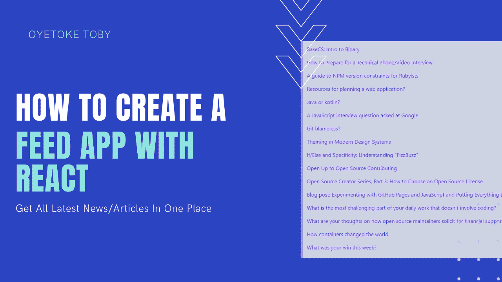
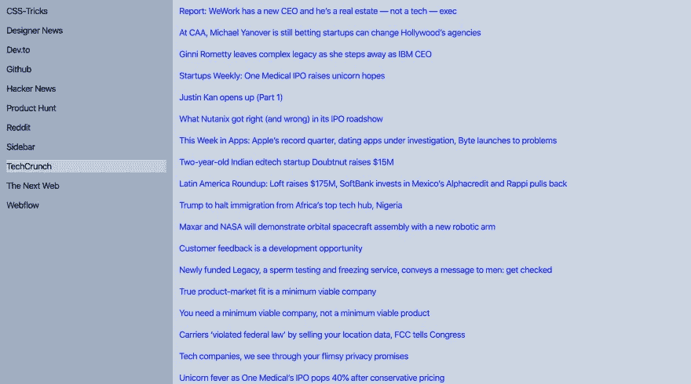

# 如何用 React 和 Tailwind CSS 构建 Feed App

> 原文：<https://betterprogramming.pub/how-to-build-a-feed-app-with-react-and-tailwind-css-c7f7a3241b3c>

## 获取并显示您最喜欢的来源的最新文章



一个 feed 应用程序从网络上的各种来源收集新闻和文章。

在这篇文章中，我将解释如何使用 React、Tailwind CSS 和我的 [feed API](https://medrum.herokuapp.com) 简单地创建一个 Feed 应用程序。

到这一部分结束时，我们将能够建造类似这样的东西:[https://ey6n5.csb.app/](https://ey6n5.csb.app/)

如果您想要现场体验，请观看下面的视频:

# 先决条件

*   [创建 React 应用](https://github.com/facebook/create-react-app) (React)
*   Axios (HTTP)
*   顺风 CSS (CDN)(非必要)

# 设置项目

第一步是用`Create-React-App`建立我们的 React 项目。如果你还没有安装它，在这里阅读安装过程。

要创建应用程序，只需运行以下命令:

```
$ npx create-react-app feed-app
```

成功创建 CRA 应用程序后，让我们进入其他设置。

导航到主目录中的`src`文件夹，并创建:

*   一个`components`文件夹，里面有三个文件:`sidebar.js`、`main.js`、`articles.js`。
*   一个`config.js`文件。

```
$ mkdir components
$ touch config.js components/sidebar.js components/main.js components/articles.js
```

接下来，将 Tailwind CSS 添加到项目中。有很多方法可以做到这一点，但最简单快捷的方法是使用 CDN。点击[这里](https://tailwindcss.com/docs/installation/#using-tailwind-via-cdn)获取 CDN 或者直接使用下面的一个:

```
<link href="https://unpkg.com/tailwindcss@^1.0/dist/tailwind.min.css" rel="stylesheet">
```

现在，在`public`文件夹中，打开`index.html`并用顺风 CSS 更新它。

# Feed API —了解 Medrum API 的工作原理

在我们进入编码和项目的下一阶段之前，让我们试着理解 Feed API 是如何工作的。Medrum 是使用 Python、BeautifulSoup 和 Scrapy 构建的，用于抓取互联网上的文章、新闻和其他各种东西。

Medrum 有两个端点:`articles`和`feeds`。在文章中，你不能指定你想从哪个来源阅读，但是你可以从 feeds。

基本上，要获得最新的文章，您可以向这个端点发送一个请求——https://medrum.herokuapp.com/articles/的，它将返回如下内容:

```
[{"title": "Juno Makes Writing Julia Awesome", "url": "https://towardsdatascience.com/juno-makes-writing-julia-awesome-f3e1baf92ea9", "comment_url": null, "ago": "3h", "date": "2020-02-02 04:06:09AM UTC"}, {"title": "Introducing Leya: The Meta-Statistical Lisp-like language", "url": "https://towardsdatascience.com/introducing-leya-the-meta-statistical-lisp-like-language-ef9012affbdb", "comment_url": null, "ago": "8h", "date": "2020-02-01 11:26:32PM UTC"}, {"title": "Transform Reality with Pandas", "url": "https://towardsdatascience.com/transform-reality-with-pandas-96f061628030", "comment_url": null, "ago": "10h", "date": "2020-02-01 09:34:26PM UTC"}, {"title": "Using Stringr and Regex to Extract Features from Textual, Alphanumeric  and Punctuation Data in R", "url": "https://towardsdatascience.com/using-stringr-and-regex-to-extract-features-from-textual-alphanumeric-and-punctuation-data-in-r-2565256c0a77", "comment_url": null, "ago": "13h", "date": "2020-02-01 06:31:13PM UTC"}, {"title": "Getting Browser User Permission with the Permissions API", "url": "https://levelup.gitconnected.com/getting-browser-user-permission-with-the-permissions-api-eafbc9c7f4d7", "comment_url": null, "ago": "15h", "date": "2020-02-01 04:03:06PM UTC"}, {"title": "Get More Out of Google Colab", "url": "https://medium.com/analytics-vidhya/get-more-out-of-google-colab-5bf9d9519a56", "comment_url": null, "ago": "16h", "date": "2020-02-01 03:34:54PM UTC"}]
```

您可以通过`latest`、`day`、`week`、`month`过滤文章刮出的间隔。例如，你可以使用`[https://medrum.herokuapp.com/articles/?interval=week](https://medrum.herokuapp.com/articles/?interval=week)`获得本周发布的所有文章。

要获得一个提要，你必须指定一个源 id，可以在这里找到:[https://medrum.herokuapp.com/sources/](https://medrum.herokuapp.com/sources/)。

要获得`dev.to`提要，您需要在下面的组合中使用`dev.to`源 id ( `5bbb1af8af62ff6841b4b26e`):

```
[https://medrum.herokuapp.com/feeds/?source=5bbb1af8af62ff6841b4b26e&page=1&sort=popular](https://medrum.herokuapp.com/feeds/?source=5bbb1af8af62ff6841b4b26e&page=1&sort=popular)
```

您可以使用`page`和`sort` ( `popular`、`latest`)过滤端点。

免费使用！

# 构建提要应用程序

现在我们已经了解了 API 的工作原理，让我们看看如何将它整合到我们的应用程序中。

打开`config.js`文件:

```
export const SOURCES_URL = "https://medrum.herokuapp.com/sources/"
export const FEEDS_URL = "https://medrum.herokuapp.com/feeds"
```

这包含了我们将在应用程序中使用的两个端点。

现在打开`main.js`文件并将其粘贴到其中:

下面是我们在上面所做的:

*   我们导入了`Sidebar`和`Articles`组件。
*   我们添加了三个`useState`钩子:`sources`、`articles`、`source`。
*   我们创建了一个函数:`fetchSource`。这将用于获取源提要。
*   我们增加了一个`useEffect`挂钩。这将获得可用的资源，所以我们可以得到他们的饲料。默认情况下，它还会加载一个源提要。
*   我们将`source`、`sources`、`fetchSource`传递给`Sidebar`组件，将`articles`传递给`Articles`组件作为道具。

接下来，我们打开`sidebar.js`组件:

以上其实很好理解，但是这里有分解:

*   如果`sources`支柱是空的，显示装载
*   通过`sources`道具映射，检查当前源的`contentType`是否为`news`，然后显示名称。添加一个`onClick`事件调用`fetchSource`，源 id 为`param`，如果当前源 id 为活动源 id，则添加背景。

接下来，打开`articles.js`文件:

在这里我们没有做太多，我们只是通过`articles` prop 映射来显示所有的提要。

最后要做的是将我们的`main.js`组件导入到`app.js`文件中:

就是这样！如果一切顺利，您应该会看到类似这样的内容:



你可以点击查看现场演示[。](https://ey6n5.csb.app/)

你可以在代码沙箱[中点击](https://codesandbox.io/s/boring-moore-ey6n5)查看代码。

感谢阅读！