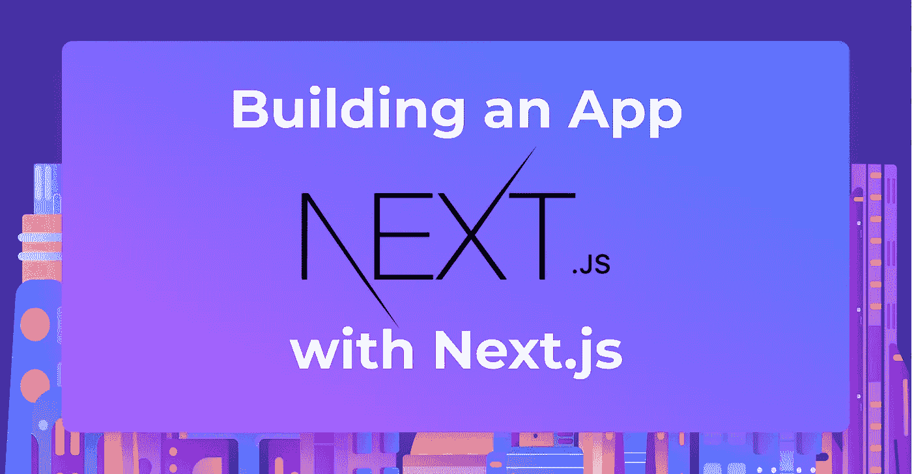
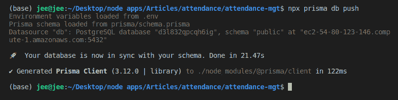
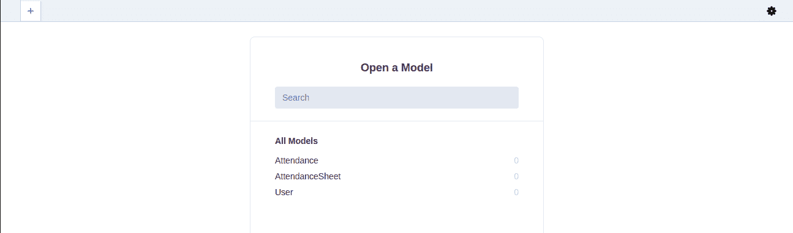
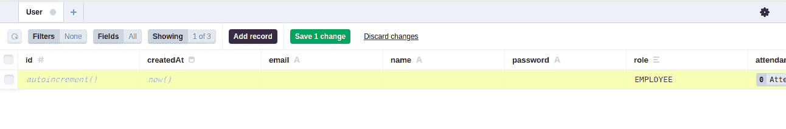
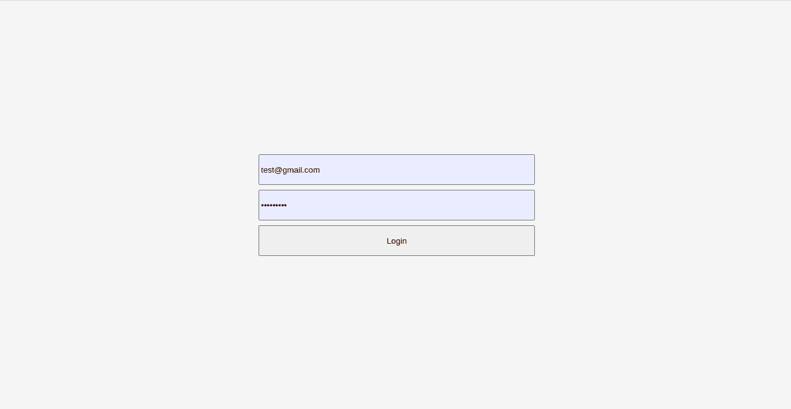
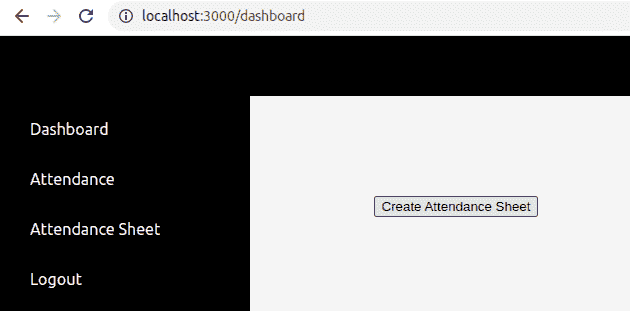
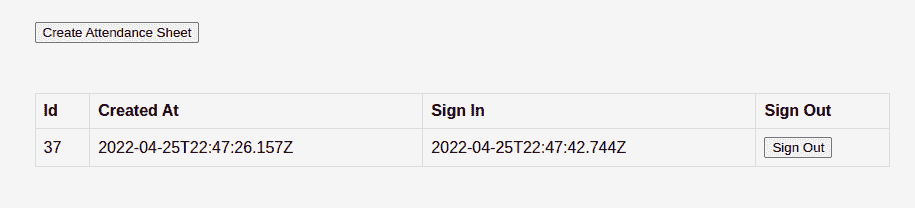
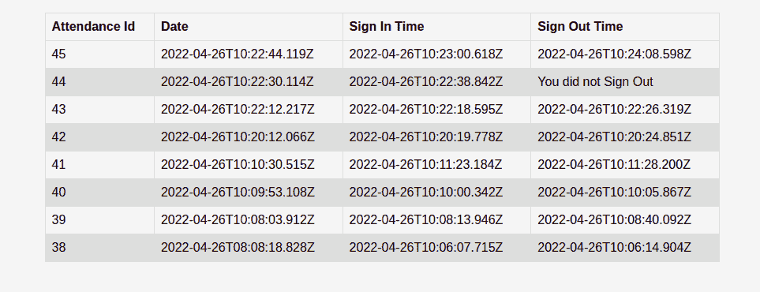
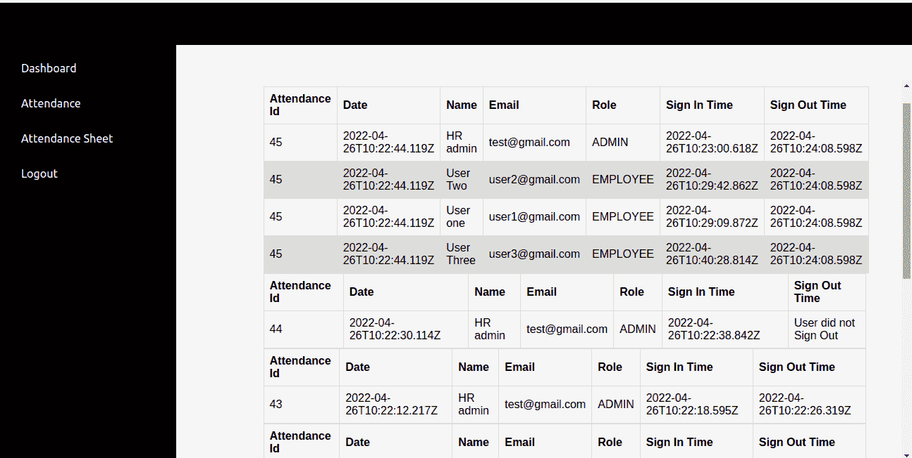

# 如何使用 Next.js、Prisma、Postgres 和 Fastify 构建一个 Fullstack 应用程序

> 原文：<https://betterprogramming.pub/how-to-build-a-fullstack-app-with-next-js-prisma-postgres-and-fastify-5de189870413>

## 构建考勤管理应用程序



在本文中，我们将学习如何使用 Next.js、Prisma、Postgres 和 Fastify 构建一个全栈应用程序。我们将构建一个考勤管理演示应用程序来管理员工的考勤。该应用程序的流程很简单:一个管理用户登录，创建一个当天的考勤表，然后每个员工在考勤表上签名和注销。

# Next.js 是什么？

js 是一个灵活的 React 框架，它为您提供了创建快速 web 应用程序的构建块。它通常被称为全栈 React 框架，因为它使前端和后端应用程序在同一个代码基上使用无服务器功能成为可能。

# Prisma 是什么？

Prisma 是一个开源的 Node.js 和 Typescript ORM，它极大地简化了 SQL 数据库的数据建模、迁移和数据访问。在撰写本文时，Prisma 支持以下数据库管理系统:PostgreSQL、MySQL、MariaDB、SQLite、AWS Aurora、Microsoft SQL Server、Azure SQL 和 MongoDB。您可能还想点击这里的来查看所有受支持的数据库管理系统的列表。

# 什么是 Postgres？

Postgres 也称为 PostgreSQL，它是一个免费的开源关系数据库管理系统。它是 SQL 语言的超集，具有许多特性，允许开发人员安全地存储和扩展复杂的数据工作负载。

# 先决条件

本教程是一个实践演示教程。因此，最好在您的计算机上安装以下软件:

*   [Node.js](https://nodejs.org/en/) 安装在你的机器上
*   [PostgreSQL](https://www.postgresql.org/) 数据库服务器运行

本教程的代码可以在 Github 上的[这里](https://github.com/Claradev32/attendance)获得，所以请随意复制它并跟随。

# 项目设置

让我们从设置 Next.js 应用程序开始。要开始，请运行下面的命令。

```
npx create-next-app@latest
```

等待安装完成，然后运行下面的命令来安装我们的依赖项。

```
yarn add fastify fastify-nextjs iron-session @prisma/client
yarn add prisma nodemon --dev
```

等待安装完成。

# 设置 Next.js 和 Fastify

默认情况下，Next.js 不使用 Fastify 作为其服务器。要使用 Fastify 来服务我们的 Next.js 应用程序，请使用下面的代码片段编辑`package.json`文件中的脚本字段。

```
"scripts": {
"dev": "nodemon server.js",
"build": "next build",
"start": "next start",
"lint": "next lint"
}
```

# 创建我们的 Fastify 服务器

现在让我们创建一个`server.js`文件。这个文件是我们应用程序的入口点，然后我们添加`require('fastify-nextjs')`来包含在 fastify 中公开 Next.js API 的插件，以处理渲染。

打开`server.js`文件，添加下面的代码片段:

```
const fastify = require('fastify')()
async function noOpParser(req, payload) {
return payload;
}
fastify.register(require('fastify-nextjs')).after(() => {
fastify.addContentTypeParser('text/plain', noOpParser);
fastify.addContentTypeParser('application/json', noOpParser);
fastify.next('/*')
fastify.next('/api/*', { method: 'ALL' });
})
fastify.listen(3000, err => {
if (err) throw err
console.log('Server listening on <http://localhost:3000>')
})
```

在上面的代码片段中，我们使用了`fastify-nextjs`插件，它公开了 Fastify 中的 Next.js API，为我们处理渲染。然后，我们用`noOpParser`函数解析传入的请求，这使得请求体对我们的 Next.js API 路由处理程序可用，我们用`[fastify.next](<http://fastify.next>`命令为我们的应用程序定义了两条路由。然后，我们创建 Fastify 服务器，并让它监听端口 3000。

现在继续用`yarn dev`命令运行应用程序:应用程序将在`localhost:3000`运行。

# Prisma 设置

首先，运行以下命令获得基本的 Prisma 设置:

```
npx prisma init
```

上面的命令将创建一个带有`schema.prisma`文件的 prisma 目录。这是您的主 Prisma 配置文件，它将包含您的数据库模式。另外，一个`.env`文件将被添加到项目的根目录中。打开`.env`文件，用 PostgreSQL 数据库的连接 URL 替换伪连接 URL。

用以下代码替换`prisma/schema.prisma`文件中的代码:

```
datasource db {
url = env("DATABASE_URL")
provider="postgresql"
}
generator client {
provider = "prisma-client-js"
}
model User {
id        Int      @id @default(autoincrement())
createdAt DateTime @default(now())
email     String   @unique
name      String
password  String
role      Role     @default(EMPLOYEE)
attendance     Attendance[]
AttendanceSheet AttendanceSheet[]
}
model AttendanceSheet {
id        Int      @id @default(autoincrement())
createdAt DateTime @default(now())
updatedAt DateTime @updatedAt
createdBy    User?    @relation(fields: [userId], references: [id])
userId  Int?
}
model Attendance {
id        Int      @id @default(autoincrement())
createdAt DateTime @default(now())
updatedAt DateTime @updatedAt
signIn    Boolean @default(true)
signOut   Boolean
signInTime    DateTime @default(now())
signOutTime   DateTime
user    User?    @relation(fields: [userId], references: [id])
userId  Int?
}
enum Role {
EMPLOYEE
ADMIN
}
```

在上面的代码片段中，我们创建了一个 User、AttendanceSheet 和 Attendance 模型，定义了每个模型之间的关系。

接下来，在数据库中创建这些表。运行以下命令:

```
npx prisma db push
```

运行上面的命令后，您应该会在终端中看到如下屏幕截图所示的输出:



# 创建效用函数

Prisma 设置完成后，让我们创建三个将在我们的应用程序中不时使用的实用函数。

打开 lib/parseBody.js 文件，并添加以下代码片段。该函数将请求体解析为 JSON:

```
export const parseBody = (body) => {
if (typeof body === "string") return JSON.parse(body)
return body
}
```

打开 lib/request.js 文件，并添加以下代码片段。这个函数发送一个 POST 请求。

```
export const sessionCookie = () => {
return ({
cookieName: "auth",
password: process.env.SESSION_PASSWORD,
// secure: true should be used in production (HTTPS) but can't be used in development (HTTP)
cookieOptions: {
secure: process.env.NODE_ENV === "production",
},
})
}
```

打开/lib/request.js 文件，并添加以下代码片段。这个函数返回一个铁会话的会话属性对象。

```
export const sessionCookie = () => {
return ({
cookieName: "auth",
password: process.env.SESSION_PASSWORD,
// secure: true should be used in production (HTTPS) but can't be used in development (HTTP)
cookieOptions: {
secure: process.env.NODE_ENV === "production",
},
})
}
```

接下来，将`SESSION_PASSWORD`添加到。env 文件:它应该是至少 32 个字符的字符串。

# 设计应用程序

完成了我们的实用功能后，让我们给应用程序添加一些样式。我们为这个应用程序使用 css 模块，所以打开`styles/Home.modules.css`文件并添加下面的代码片段:

```
.container {
padding: 0 2rem;
}
.man {
min-height: 100vh;
padding: 4rem 0;
flex: 1;
display: flex;
flex-direction: column;
justify-content: center;
align-items: center;
}
.login {
width: 450px;
}
.login input {
width: 100%;
height: 50px;
margin: 4px;
}
.login button {
width: 100%;
height: 50px;
margin: 4px;
}
.dashboard {
display: grid;
grid-template-columns: 3fr 9fr;
grid-template-rows: 1fr;
grid-column-gap: 0px;
grid-row-gap: 0px;
height: calc(100vh - 60px);
}
.navbar {
height: 60px;
background-color: black;
}
```

# 创建侧栏组件

完成样式设计后，让我们创建侧边栏组件来帮助我们导航到应用仪表板上的不同页面。打开 components/SideBar.js 文件，粘贴下面的代码片段。

```
import Link from 'next/link'
import { useRouter } from 'next/router'
import styles from '../styles/SideBar.module.css'

const SideBar = () => {

    const router = useRouter()

    const logout = async () => {

        try {

            const response = await fetch('/api/logout', {
                method: 'GET', 
                credentials: 'same-origin', 
            });

            if(response.status === 200)  router.push('/')

        } catch (e) {
            alert(e)
        }

    }

    return (
        <nav className={styles.sidebar}>

            <ul>

                <li> <Link href="/dashboard"> Dashboard</Link> </li>

                <li> <Link href="/dashboard/attendance"> Attendance </Link> </li>

                <li> <Link href="/dashboard/attendance-sheet"> Attendance Sheet </Link> </li>

                <li onClick={logout}> Logout </li>

            </ul>

        </nav>
    )

}

export default SideBar
```

# 登录页面

现在打开 page/index.js 文件，删除其中的所有代码，并添加以下代码片段。下面的代码向 localhost:3000/api/login route 发送一个 post 请求，其中包含通过表单提供的电子邮件和密码。一旦凭证被验证，它调用`router.push('/dashboard')`方法将用户重定向到 localhost:3000/api/dashboard:

```
import Head from 'next/head'
import { postData } from '../lib/request';
import styles from '../styles/Home.module.css'
import { useState } from 'react';
import { useRouter } from 'next/router'

export default function Home({posts}) {

  const [data, setData] = useState({email: null, password: null});

  const router = useRouter()

  const submit = (e) => {
    e.preventDefault()

    if(data.email && data.password) {
      postData('/api/login', data).then(data => {
        console.log(data); 

        if (data.status === "success") router.push('/dashboard')

      });
    }

  }

  return (
    <div className={styles.container}>
      <Head>
        <title>Login</title>
        <meta name="description" content="Login" />
        <link rel="icon" href="/favicon.ico" />
      </Head>

      <main className={styles.main}>

        <form  className={styles.login}>

          <input 
            type={"text"} 
            placeholder="Enter Your Email" 
            onChange={(e) => setData({...data, email: e.target.value})} />

          <input 
            type={"password"}  
            placeholder="Enter Your Password"
            onChange={(e) => setData({...data, password: e.target.value})} />

          <button onClick={submit}>Login</button>

        </form>

      </main>

    </div>
  )
}
```

# 设置登录 API 路由

现在打开 page/api/login.js 文件并添加以下代码片段。我们将使用`PrismaClient`进行数据库查询，而`withIronSessionApiRoute`是在 RESTful 应用程序中处理用户会话的铁会话函数。

这个路由处理对 localhost:3000/api/login 的登录 POST 请求，并在用户通过身份验证后生成身份验证 cookies。

```
import { PrismaClient } from '@prisma/client'
import { withIronSessionApiRoute } from "iron-session/next";
import { parseBody } from '../../lib/parseBody';
import { sessionCookie } from '../../lib/session';

export default withIronSessionApiRoute(
    async function loginRoute(req, res) {

      const { email, password } = parseBody(req.body)

      const prisma = new PrismaClient()

      // By unique identifier
      const user = await prisma.user.findUnique({
        where: {
        email
      },})

      if(user.password === password) {

        // get user from database then:
        user.password = undefined
        req.session.user = user
        await req.session.save();

        return res.send({ status: 'success', data: user });

      };

    res.send({ status: 'error', message: "incorrect email or password" });

  },
  sessionCookie(),
);
```

# 设置注销 API 路由

打开/page/api/logout 文件，添加下面的代码片段。该路由处理对 localhost:3000/api/logout 的 GET 请求，该请求通过销毁会话 cookies 来注销用户。

```
import { withIronSessionApiRoute } from "iron-session/next";
import { sessionCookie } from "../../lib/session";

export default withIronSessionApiRoute(
  function logoutRoute(req, res, session) {
    req.session.destroy();
    res.send({ status: "success" });
  },
  sessionCookie()
);
```

# 创建仪表板页面

该页面为用户提供了签到和签出考勤表的界面。管理员也可以创建考勤表。打开 page/dashboard/index.js 文件，并添加下面的代码片段。

```
import { withIronSessionSsr } from "iron-session/next";
import Head from 'next/head'
import { useState, useCallback } from "react";
import { PrismaClient } from '@prisma/client'
import SideBar from '../../components/SideBar'
import styles from '../../styles/Home.module.css'
import dashboard from '../../styles/Dashboard.module.css'
import { sessionCookie } from "../../lib/session";
import { postData } from "../../lib/request";

export default function Page(props) {

  const [attendanceSheet, setState] = useState(JSON.parse(props.attendanceSheet));

  const sign = useCallback((action="") => {

    const body = {
      attendanceSheetId: attendanceSheet[0]?.id,
      action
    }

    postData("/api/sign-attendance", body).then(data => {

      if (data.status === "success") {

        setState(prevState => {

          const newState = [...prevState]

          newState[0].attendance[0] = data.data

          return newState

        })

      }

    })

  }, [attendanceSheet])

  const createAttendance = useCallback(() => {

    postData("/api/create-attendance").then(data => {

      if (data.status === "success") {
        alert("New Attendance Sheet Created")
        setState([{...data.data, attendance:[]}])
      }

    })

  }, [])

  return (
    <div>

      <Head>
        <title>Attendance Management Dashboard</title>
        <meta name="description" content="dashboard" />
      </Head>

      <div className={styles.navbar}></div>

      <main className={styles.dashboard}>

        <SideBar />

        <div className={dashboard.users}>

          {
            props.isAdmin && <button className={dashboard.create} onClick={createAttendance}>Create Attendance Sheet</button>
          }

          { attendanceSheet.length > 0 &&

            <table className={dashboard.table}>
              <thead>
                <tr> 
                  <th>Id</th> <th>Created At</th> <th>Sign In</th> <th>Sign Out</th> 
                </tr>
              </thead>

              <tbody>
                <tr>
                  <td>{attendanceSheet[0]?.id}</td>
                  <td>{attendanceSheet[0]?.createdAt}</td>

                  {
                    attendanceSheet[0]?.attendance.length != 0 ? 
                      <>
                        <td>{attendanceSheet[0]?.attendance[0]?.signInTime}</td>
                        <td>{
                          attendanceSheet[0]?.attendance[0]?.signOut ? 
                          attendanceSheet[0]?.attendance[0]?.signOutTime: <button onClick={() => sign("sign-out")}> Sign Out </button> }</td>
                      </>
                      :
                      <>
                        <td> <button onClick={() => sign()}> Sign In </button> </td>
                        <td>{""}</td>
                      </>
                  }
                </tr>
              </tbody>

            </table>

          }

        </div>

      </main>

    </div>
  )
}
```

我们使用`getServerSideProps`来生成页面数据，而`withIronSessionSsr`是用于处理服务器端呈现页面的铁会话函数。在下面的代码片段中，我们使用考勤表中的一行来查询考勤表的最后一行，其中`userId`等于存储在用户会话中的用户 id。我们还检查用户是否是管理员。

```
export const getServerSideProps = withIronSessionSsr( async ({req}) => {

  const user = req.session.user

  const prisma = new PrismaClient()

  const attendanceSheet = await prisma.attendanceSheet.findMany({  
    take: 1,
    orderBy: {
      id: 'desc',
    },
    include: { 
      attendance: {
        where: {
          userId: user.id
        },
      }
    }
  })

  return {
    props: {
      attendanceSheet: JSON.stringify(attendanceSheet),
      isAdmin: user.role === "ADMIN"
    }
  }

}, sessionCookie())
```

# 设置创建出勤 API 路线

打开 page/api/create-attendance.js 文件，添加下面的代码片段。

```
import { PrismaClient } from '@prisma/client'
import { withIronSessionApiRoute } from "iron-session/next";
import { sessionCookie } from '../../lib/session';

export default withIronSessionApiRoute( async function handler(req, res) {

    const prisma = new PrismaClient()

    const user = req.session.user

    const attendanceSheet = await prisma.attendanceSheet.create({
        data: {
          userId: user.id,
        },
    })

    res.json({status: "success", data: attendanceSheet});

}, sessionCookie())
```

# 设置签到 API 路线

这个路由处理我们对 localhost 的 API POST 请求:3000/api/sign-attendance。路由接受 POST 请求，而`attendanceSheetId`和`action`用于签到和退出`attendanceSheet`。

打开/page/api/sign-attendance.js 文件，添加下面的代码片段。

```
import { PrismaClient } from '@prisma/client'
import { withIronSessionApiRoute } from "iron-session/next";
import { parseBody } from '../../lib/parseBody';
import { sessionCookie } from '../../lib/session';

export default withIronSessionApiRoute( async function handler(req, res) {

    const prisma = new PrismaClient()

    const {attendanceSheetId, action} = parseBody(req.body)

    const user = req.session.user

    const attendance = await prisma.attendance.findMany({
        where: {
            userId: user.id,
            attendanceSheetId: attendanceSheetId
        }
    })

    //check if atendance have been created
    if (attendance.length === 0) {
        const attendance = await prisma.attendance.create({
            data: {
                userId: user.id,
                attendanceSheetId: attendanceSheetId,
                signIn: true,
                signOut: false,
                signOutTime: new Date()
            },
        })   

        return res.json({status: "success", data: attendance});

    } else if (action === "sign-out") {
        await prisma.attendance.updateMany({
            where: {
                userId: user.id,
                attendanceSheetId: attendanceSheetId
            },
            data: {
              signOut: true,
              signOutTime: new Date()
            },
        })

        return res.json({status: "success", data: { ...attendance[0], signOut: true, signOutTime: new Date()}});
    }

    res.json({status: "success", data: attendance});

}, sessionCookie())
```

# 创建出勤页面

这个服务器端呈现的页面显示了登录用户的所有考勤表。打开/page/dashboard/attendance.js 文件，并添加下面的代码片段。

```
import { withIronSessionSsr } from "iron-session/next";
import Head from 'next/head'
import { PrismaClient } from '@prisma/client'
import SideBar from '../../components/SideBar'
import styles from '../../styles/Home.module.css'
import dashboard from '../../styles/Dashboard.module.css'
import { sessionCookie } from "../../lib/session";

export default function Page(props) {

  const data = JSON.parse(props.attendanceSheet)

  return (
    <div>

      <Head>
        <title>Attendance Management Dashboard</title>
        <meta name="description" content="dashboard" />
      </Head>

      <div className={styles.navbar}></div>

      <main className={styles.dashboard}>

        <SideBar />

        <div className={dashboard.users}>

        <table className={dashboard.table}>

          <thead>

            <tr> 
              <th> Attendance Id</th> <th>Date</th> 
              <th>Sign In Time</th> <th>Sign Out Time</th> 
            </tr> 

          </thead>

            <tbody>

              {
                data.map(data =>   {

                  const {id, createdAt, attendance } = data

                  return (
                    <tr key={id}> 

                      <td>{id}</td> <td>{createdAt}</td>  

                      { attendance.length === 0 ? 

                        (
                          <>
                            <td>You did not Sign In</td>
                            <td>You did not Sign Out</td>
                          </>
                        )
                        :
                        (
                          <>
                            <td>{attendance[0]?.signInTime}</td>
                            <td>{attendance[0]?.signOut ? attendance[0]?.signOutTime : "You did not Sign Out"}</td>
                          </>
                        )

                      }

                    </tr>
                  )

                })

              }  

            </tbody>

          </table>

        </div>

      </main>

    </div>
  )
}
```

在下面的代码片段中，我们从`attendanceSheet`表中查询所有的行，并获取出席人数，其中`userId`等于存储在用户会话中的用户 id。

```
export const getServerSideProps = withIronSessionSsr( async ({req}) => {

  const user = req.session.user

  const prisma = new PrismaClient()

  const attendanceSheet = await prisma.attendanceSheet.findMany({
    orderBy: {
      id: 'desc',
    },
    include: { 
      attendance: {
        where: {
          userId: user.id
        },
      }
    }
  })

  return {
    props: {
      attendanceSheet: JSON.stringify(attendanceSheet),
    }
  }

}, sessionCookie())
```

# 创建考勤表页面

这个服务器端呈现的页面显示了所有的考勤表和签入该考勤表的员工。打开/page/dashboard/attendance.js 文件，并添加下面的代码片段。

```
import { withIronSessionSsr } from "iron-session/next";
import Head from 'next/head'
import { PrismaClient } from '@prisma/client'
import SideBar from '../../components/SideBar'
import styles from '../../styles/Home.module.css'
import dashboard from '../../styles/Dashboard.module.css'
import { sessionCookie } from "../../lib/session";

export default function Page(props) {

  const data = JSON.parse(props.attendanceSheet)

  return (
    <div>

      <Head>
        <title>Attendance Management Dashboard</title>
        <meta name="description" content="dashboard" />
      </Head>

      <div className={styles.navbar}></div>

      <main className={styles.dashboard}>

        <SideBar />

        <div className={dashboard.users}>

        {
          data?.map(data => {

            const {id, createdAt, attendance } = data

            return (
              <>

                <table key={data.id} className={dashboard.table}>

                  <thead>

                    <tr> 
                      <th> Attendance Id</th> <th>Date</th> 
                      <th> Name </th> <th> Email </th> <th> Role </th>
                      <th>Sign In Time</th> <th>Sign Out Time</th> 
                    </tr> 

                  </thead>

                  <tbody>

                    {
                      (attendance.length === 0)  &&
                      (
                        <>
                        <tr><td> {id} </td> <td>{createdAt}</td> <td colSpan={5}> No User signed this sheet</td></tr>
                        </>
                      )
                    }

                    {
                      attendance.map(data => {

                        const {name, email, role} = data.user

                        return (
                          <tr key={id}> 

                            <td>{id}</td> <td>{createdAt}</td>  

                            <td>{name}</td> <td>{email}</td>

                            <td>{role}</td>

                            <td>{data.signInTime}</td>

                            <td>{data.signOut ? attendance[0]?.signOutTime: "User did not Sign Out"}</td>  

                          </tr>
                        )

                      })

                    }  

                  </tbody>

                </table>
              </>
            )
          })

          }

        </div>

      </main>

    </div>
  )
}
```

在下面的代码片段中，我们从`attendanceSheet`表中查询所有的行，并通过选择姓名、电子邮件和角色来获取出席情况。

```
export const getServerSideProps = withIronSessionSsr(async () => {

  const prisma = new PrismaClient()

  const attendanceSheet = await prisma.attendanceSheet.findMany({
    orderBy: {
      id: 'desc',
    },
    include: { 
      attendance: {
        include: { 
          user: {
            select: {
              name: true, 
              email: true, 
              role: true
            }
          }
        }
      },
    },

  })

  return {
    props: {
      attendanceSheet: JSON.stringify(attendanceSheet),
    }
  }

}, sessionCookie())
```

# 测试应用程序

首先，我们必须将用户添加到数据库中。我们将与 Prisma 工作室合作。要启动 Prisma studio，请运行以下命令:

```
npx prisma studio
```

Prisma 索引页面如下所示:



要创建一个具有管理员角色的数据库用户和多个具有雇员角色的用户，请转到此页面:



单击添加记录，然后填写必填字段:密码、姓名、电子邮件和角色。完成后，点击绿色的保存 1 更改按钮。注意，为了简单起见，我们没有散列密码。

用`yarn dev`启动服务器。这将启动服务器并在[localhost:3000](<http://localhost:3000>)上运行应用程序。登录页面如下所示。



使用具有管理员角色的用户登录，因为只有管理用户可以创建考勤表。登录成功后，应用程序会将您重定向到您的控制面板。

点击创建考勤表按钮创建考勤表，然后等待请求完成，考勤表将会出现。用户仪表板如下所示。



考勤表如下所示，点击签到按钮进行签到。登录成功后，将显示登录时间，并显示注销按钮。单击“注销”按钮注销，并对不同的用户重复此过程多次。



接下来，单击侧边栏中的出席链接，查看用户的出席情况。结果应该与下面显示的结果相匹配:



接下来点击侧边栏上的考勤表链接，查看所有用户的出勤情况。结果如下所示:



# 结论

在本文中，您学习了如何在 Next.js 中使用定制的 Fastify 服务器，还学习了 Prisma 和 Prisma studio。我已经向您介绍了如何将 Prisma 连接到 Postgres 数据库，以及如何使用 Prisma 客户端和 Prisma studio 创建、读取和更新数据库。

您还学习了如何使用 iron-session 对用户进行身份验证。在本教程中，我们使用 Next.js、Prisma、Postgres 和 Fastify 构建了一个管理员工出勤的全栈应用程序。请继续关注更多内容，直到下一次。