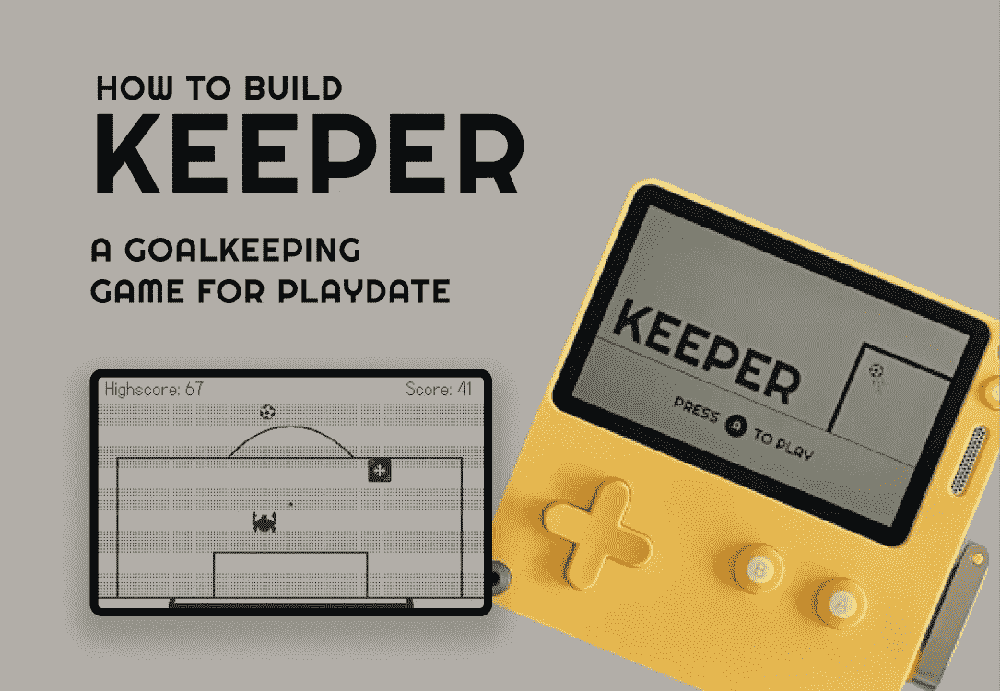
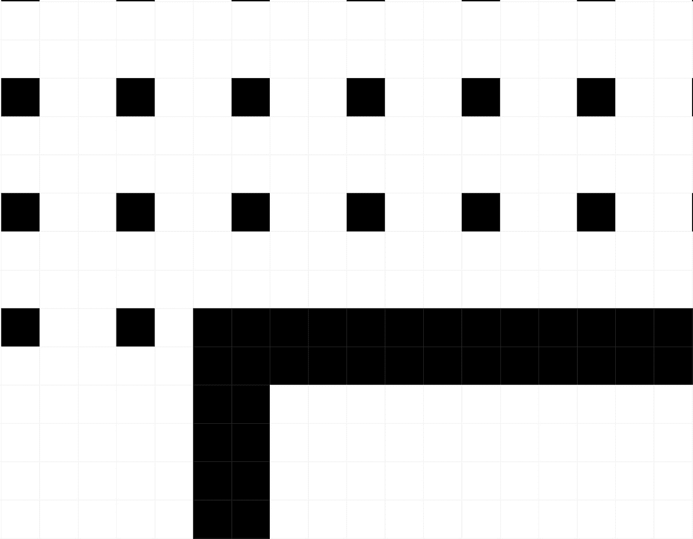
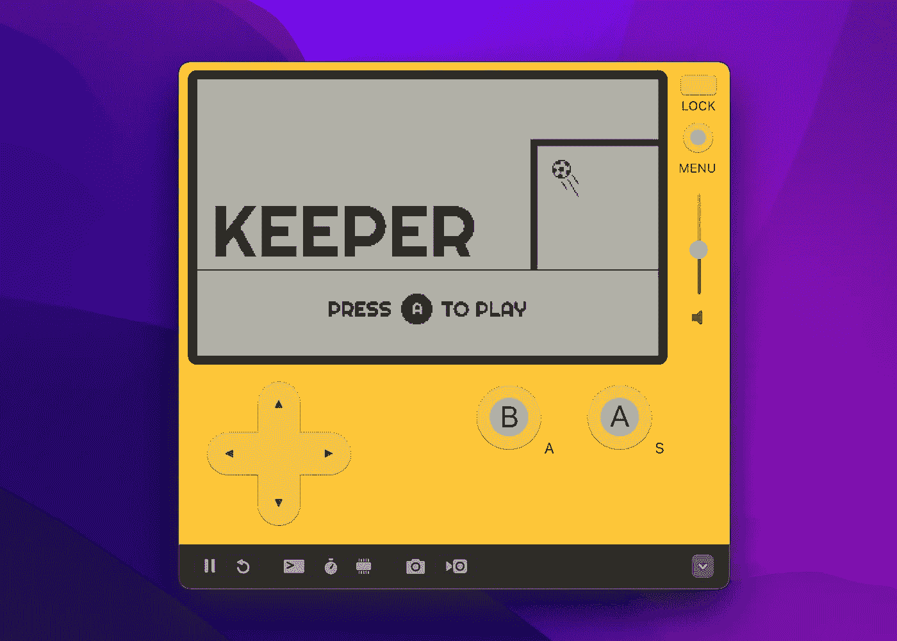
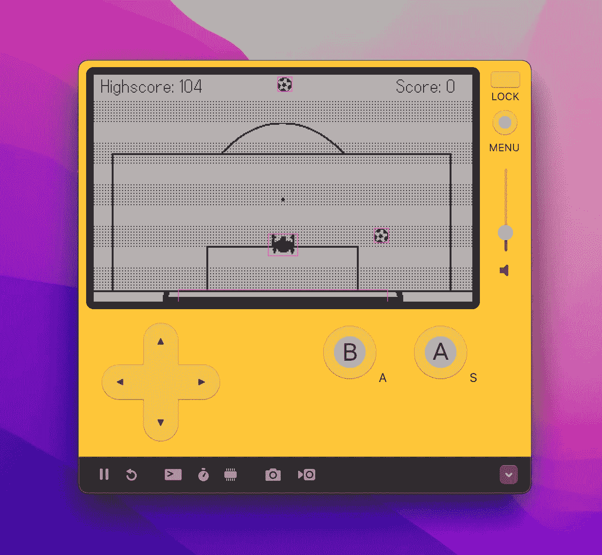
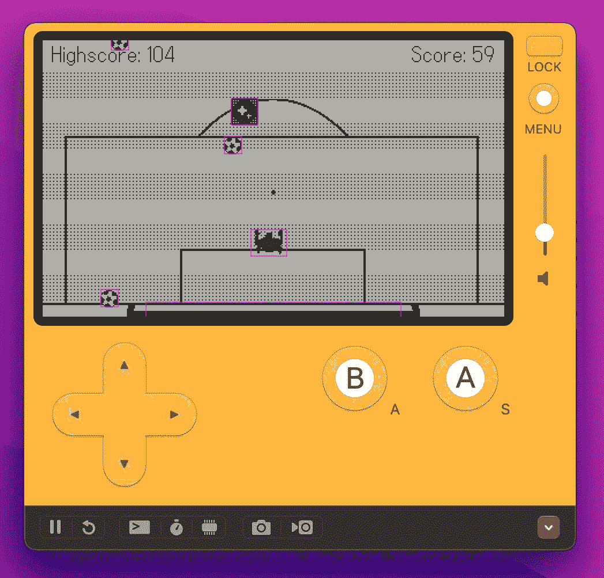

# 如何使用 Playdate SDK 和 Lua 为 Playdate 主机构建游戏

> 原文：<https://betterprogramming.pub/how-to-build-a-game-for-the-playdate-console-using-the-playdate-sdk-and-lua-cc8fd2079433>

## 建立一个守门员游戏



不久前，Panic 和青少年工程公司发布了他们的新独立游戏机:Playdate。

这是一个可爱有趣的小设备，有一个 1 位屏幕，经典的设计和…一个曲柄。是的，一个怪人。

不用说，这个随机但可爱的设备真的激起了我的兴趣。

所以，当我最终收到邮寄过来的游戏机时，我决定试着为它制作一个游戏。我喜欢足球(对你们来说是隔着池塘的足球)——所以我心目中的比赛是一场守门员必须挽救射门的比赛。

经过大约三个周末的修补和一些抓到你的时刻，我终于发布了我的游戏。如果你想尝试一下，你可以在这里免费下载。

当我开发这个游戏的时候，有几次我想“我真希望有人制作了关于如何做这个的教程”。所以这就是我在这一系列文章中要尝试做的事情。我将解释我是如何制作我的游戏的，希望它也能帮助其他人理解如何为游戏日制作他们的游戏。

> *大声喊出来:当我试图理解 PlayDate 开发过程的不同部分时，SquidGodDev 的视频给了我很大的帮助，如果没有他们，我可能不会这么快做出这个游戏。我想链接到他们的* [*YouTube*](https://www.youtube.com/c/SquidGodDev) *和*[*Patreon*](https://www.patreon.com/squidgoddev)*作为一点感谢！*

在我们开始之前，我想设定一些关于本教程的期望。它将:

*   向你展示如何为游戏日制作游戏，
*   链接到一些有用的资源，在设计和开发过程中为您提供帮助，
*   给出 Playdate SDK 的实际例子。

然而，本文不打算:

*   教你如何编码，假设你有基本的编程知识(不过我会链接到其他人的有用教程)，或者
*   教你如何设计(但我会链接到创建这个游戏所需的有用的设计资源，加上我现有的图形和教程创建自己的图形的 Figma 模板)

我们将讨论游戏开发的不同领域。以下是对预期结果的分析:

*   帮助你使用 Lua 和 Playdate SDK 的最佳资源
*   计划建造什么
*   文件结构
*   设计游戏
*   为什么我们要使用面向对象编程(OOP)
*   创建游戏场景
*   在场景中前进
*   开发可以在屏幕上移动的播放器
*   发展你必须防守的球
*   发展你作为守门员必须保护的目标
*   冲突检出
*   应对碰撞
*   记录玩家的分数
*   从游戏日期的存储器中保存、存储和加载高分
*   在屏幕上显示分数和高分
*   为游戏开发电源
*   不同事件发生时播放音频
*   基于游戏性改变音频的速率(速度)
*   让你的游戏准备好发布
*   与世界分享你的游戏

# 开始时的最佳资源

要为游戏日开发游戏，你需要学习 Lua 或 c。Lua 是两者中比较简单的，这也是我们在本教程中要用到的。以下是我精选的一些资源，用于学习 Lua 的基础知识，设置 Playdate SDK，以及 Playdate 的基本编程:

*   [100 秒内 Lua](https://www.youtube.com/watch?v=jUuqBZwwkQw)
*   [【LUA】Ep。5 —表格](https://www.youtube.com/watch?v=7Oxh7MJAd5k)
*   [学会为 Playdate 游戏开发编程！第一部分](https://www.youtube.com/watch?v=C4o7n0LNQhA)
*   [学会为 Playdate 游戏开发编程！第二部分](https://www.youtube.com/watch?v=x_Wi2EjjKz8)

你还需要一个代码编辑器来为你的游戏编写代码。我推荐 Visual Studio 代码(VS 代码)，[你可以在这里下载](https://code.visualstudio.com/)。

# 计划建造什么

构建任何软件的一个常见问题是不知道在哪里停止，让更多的功能和需求慢慢建立，直到它变得势不可挡。在行业中，这通常被称为“范围蔓延”，即项目的范围逐渐扩大。

我的建议(以及我们将如何构建这款游戏)是，在你构建它之前，定义你想要从你的游戏中得到的确切功能。这不仅有助于你思考如何去做和设计什么，也意味着你知道你的最终目标是什么。

我鼓励你跟着教程走，但是对游戏做你自己的改变，让它对你来说是独一无二的。核心功能将是:

1.  让一个球员可以四处走动，并避免射门击中球门
2.  记录他们救了多少次球
3.  为游戏引入一些能量
4.  创建有趣的音频互动

# 文件结构

在开始之前，你应该安装 Playdate SDK，并确保它在你的机器上工作。这里有一个关于如何做的非常清晰的教程:

接下来，您应该用您的游戏名称创建一个新文件夹，然后在该文件夹中，您应该有以下两个文件夹:

*   `.vscode` —包含关于您正在构建什么以及它使用什么编程语言的信息
*   `source` —你所有的源代码都在那里

我还建议在 Playdate SDK 中设置一个构建游戏和运行游戏的快捷方式。如果你点击 *CMD+Shift+P* ，你会看到一个菜单打开，里面有可用的操作。其中一个应该是‘在 Playdate 模拟器中运行 app’。该命令旁边应该有一个 cog 图标，您可以选择一个快捷方式来运行该命令。就我个人而言，我喜欢 CMD+Shift+0 ，因为我已经没有绑定任何东西了。

在你的源文件夹中，你需要添加一个`pdxinfo`文件，它包含了关于你的游戏的所有信息。如果没有这个文件，当你把它下载到游戏日期时，你的游戏可能无法构建或运行。在`pdxinfo`文件中，您应该添加如下内容:

```
name=Your game's name
author=Your name
description=Description of your game
bundleID=com.yourname.yourgame
version=0.1
buildNumber=0001
imagePath=/images
launchSoundPath=/sounds
```

你会注意到我们指向图像和声音的文件夹。您需要在源文件夹中创建这些文件夹。它们将用于您为游戏创建的视频和音频资产。

现在你已经完成了基本的工作，你应该创建一个名为`main.lua`的新文件，这个文件将在每次游戏打开时运行。

在`main.lua`中，你应该有一些代码来导入所有这些文件，以便它们可以在游戏中使用。您还应该添加一些样板代码，如下所示，以便简化 Playdate SDK，并允许计时器正常工作。

```
import "CoreLibs/object"
import "CoreLibs/graphics"
import "CoreLibs/sprites"
import "CoreLibs/timer"
local gfx <const> = playdate.graphics

function helloPlaydate()
  print("beep boop beep")
end

helloPlaydate()

function playdate.update()
  -- Update the sprites and the timer
  gfx.sprite.update()
  playdate.timer.updateTimers()
end
```

在我们第一次构建我们的游戏之前，我们需要添加最后一件事。在`.vscode`文件夹中，你应该添加一个`settings.json`文件，它告诉 VS 代码 SDK 在哪里:

```
{
  "Lua.runtime.version": "Lua 5.4",
  "Lua.diagnostics.disable": ["undefined-global", "lowercase-global"],
  "Lua.diagnostics.globals": ["playdate", "import"],
  "Lua.runtime.nonstandardSymbol": ["+=", "-=", "*=", "/="],
  "Lua.workspace.library": [
  "/Users/YOURNAME/Developer/PlaydateSDK/CoreLibs"
  ],
  "Lua.workspace.preloadFileSize": 1000,
  "playdate.sdkPath": "/Users/YOURNAME/Developer/PlaydateSDK"
}
```

注意:你的 SDK 路径在你的机器上可能是不同的，特别是如果你在 Windows 上，因为上面显示的路径是用于 Mac 的。

一旦所有这些都完成了，你应该可以点击 CMD+Shift+0(或者任何你创建的快捷方式),游戏日期模拟器应该打开，然后在控制台中，你应该会看到你的消息“哔哔哔”。

如果有些东西不起作用，我在 GitHub 上为这个教程创建了一个开放的 repo，第一部分可以在那里下载。请随意将它克隆到您的计算机上，如果需要的话，从那里继续进行。

# 设计游戏

现在是一些有趣的事情:设计你的游戏。

我们需要设计一个:

*   欢迎屏幕，
*   我们游戏的背景，
*   游戏结束屏幕，
*   玩家，
*   球，
*   目标，而且，
*   一组电源。

为此，我们将使用 Figma。Figma 是一个非常直观的数字设计工具，免费提供。你可以在这里注册一个账户。

以下是一些关于学习 Figma 基础知识的有用教程:

一旦你理解了 Figma 的工作原理，你就可以开始创建自己的视觉效果了。为了有所帮助，[我创建了这个 Figma 文件，它为你的游戏日期卡(显示在你的游戏日期安装的游戏列表中)、玩家/精灵和游戏背景提供了正确大小的框架](https://www.figma.com/file/uiBsXYVADaTVaibKSYkuvf/Playdate-Assets/duplicate)。当你点击链接时，它会将文件复制到你的 Figma 帐户中，这样你就可以开始编辑了。

> **抓住时机:**play date 有 1 位屏幕！也就是说它只支持黑白。Playdate 不渲染彩色图像。
> 
> 我的建议是:在你的设计中只使用纯黑(#000000)和纯白(#FFFFFF)。如果你需要创建类似渐变的效果，你可以使用抖动工具。只要确保在抖动设置中你选择了黑白调色板。

当你在 Figma 中设计图形时，我建议选择*视图>像素网格*来打开编辑器的像素网格。这将向您显示一个模糊的网格轮廓，并允许您的形状捕捉到位。您可以逐个像素地设计您的作品，或者您可以绘制重叠像素的形状，Playdate 会将它们呈现为稍微更方的版本。



Figma 中的像素网格示例

在 Figma 文件的第二页(*示例图形’*)你会看到我在我的游戏版本中使用的图形。请随意使用/编辑这些来匹配您的风格，或者如果您想要构建完全相同的游戏，请按原样导出它们。

当你对你的设计满意时，你可以选择所有的框架，在 Figma 编辑器的右下角，你会看到一个导出它们的选项。

你应该注意到卡片图像是特殊的，应该被命名为“卡片”，因为 Playdate SDK 会寻找这个图像，并在主屏幕上自动将卡片图像作为游戏的封面。在我为您创建的 Figma 文件中，我已经将名称设置为“card ”,所以您需要做的就是将它作为 PNG 导出到项目中的/images 文件夹中。

# 为什么我们要使用面向对象编程(OOP)

我见过的很多 Playdate 的开源游戏都把所有的游戏逻辑放在一个`main.lua`文件里。这很好，但随着时间的推移，阅读和维护会变得非常困难，更不用说添加新功能了。

就我个人而言，我发现用面向对象的方式构建游戏更清晰。

你可能想知道，“面向对象”到底是什么意思？

本质上，它允许你为某样东西构建一个蓝图，然后使用这个蓝图创建某样东西的许多不同版本，而不必复制代码。

例如，一个球可以是一个物体。它可以有特定的风格、速度、方向等。如果没有 OOP，你将不得不对每一个不同类型的球进行硬编码，但是有了 OOP，你可以构建一个球类一次，然后想重用多少次就重用多少次。随着教程的深入，这一切会变得更加清晰，但是如果你有兴趣深入探究，那么来自 SquidGodDev 的这个教程会告诉你你需要知道的一切，甚至更多。

在本教程中，我们将使用 OOP 风格。

# 创建游戏场景

在我们的游戏中，我们将有三个游戏场景:

*   **开始场景**在这里我们显示一些东西，比如游戏的欢迎信息，或者说明。
*   实际游戏发生的游戏场景。
*   游戏结束的场景，在玩家认输后，我们把他们也带走，这样他们可以反思自己做得有多好。

当然，在你的游戏中，你可能想根据游戏的复杂程度添加更多的场景。例如，您可能想要为游戏中的不同区域或房间创建额外的游戏场景。

但是现在，我们将坚持上面列出的三个。

在源文件夹中，添加两个新文件:

*   `globals.lua`
*   `sceneController.lua`

`globals.lua`将是我们存储全局变量的地方，我们希望每个文件都能够访问这些变量，`sceneController.lua`文件将是我们处理变化场景的地方。我们不想创建太多的全局变量，因为那会导致以后复杂的错误，但是一些全局变量会支持我们的游戏。

在`globals.lua`文件中，添加以下内容:

```
- Global gamestate variable which indicates what stage the user is at (start, game, game over)
gameState = 'start'
```

这个`gameState`变量将用于跟踪用户的状态(例如，他们是在开始场景，玩游戏，还是在游戏结束场景？)

在`sceneController.lua`文件中，我们需要添加这段代码:

```
local pd <const> = playdate
local gfx <const> = pd.graphics

-- Removes all sprites from the screen
function clearSprites()
   local allSprites = gfx.sprite.getAllSprites()
   for index, sprite in ipairs(allSprites) do
       sprite:remove()
   end
end

-- Sets the background image
function setBackground(imageName)
   -- Display a background image
   local backgroundImage = gfx.image.new( "images/" .. imageName )
   assert( backgroundImage )

   gfx.sprite.setBackgroundDrawingCallback(
       function( x, y, width, height )
           backgroundImage:draw( 0, 0 )
       end
   )
end

-- Sets up the starting scene
function setStartingScene()
   gameState = 'start'
   clearSprites()

   setBackground('startingBackground')
end

-- Sets up the game scene
function setGameScene()
   gameState = 'game'
   clearSprites()

   setBackground('background')
end

-- Sets up the game over scene
function setGameOverScene()
   gameState = 'game over'
   clearSprites()
   setBackground('endingBackground')
end
```

这里有几个需要消化的东西，我们就一个一个分解吧。

`clearSprites()`功能可以让我们摆脱屏幕上的一切。它遍历所有存在的精灵并删除它。当我们想从一个场景到另一个场景时，这很有用，因为这意味着我们有一个干净的石板。

`setBackground(name)`功能允许我们改变不同场景的背景。我们传入 name 参数(它只是图像的名称)，然后将图像绘制到背景，从 0，0(屏幕的左上角)开始。

`setStartingScene()`、`setGameScene()`和`setGameOverScene()`都做类似的事情:

1.  更改`gameState`，使其更新到最新的场景。
2.  清除所有精灵。
3.  通过调用 setBackground 函数并传入背景图像的名称来更改背景。

为了将这一切联系起来，我们需要返回到`main.lua`文件并导入我们新创建的文件:

```
import "globals"
import "sceneController"
```

如果您不将文件导入`main.lua`，那么您将无法访问该文件或其他导入文件中的功能。

导入后，我们需要调用一个函数来设置场景:

```
setStartingScene()
```

如果你再次运行游戏，你会看到你的开始场景出现。

如果你想看游戏场景或者游戏结束场景，你只需要把那个函数调用改成`setGameScene()`或者`setGameOverScene()`。

您的`main.lua`应该是这样的:

```
import "CoreLibs/object"
import "CoreLibs/graphics"
import "CoreLibs/sprites"
import "CoreLibs/timer"
import "globals"
import "sceneController"

local gfx <const> = playdate.graphics

setStartingScene()

function playdate.update()
   -- Update the sprites and the timer
   gfx.sprite.update()
   playdate.timer.updateTimers()
end
```

# 在场景中前进

我们从起始场景开始，但是我们希望能够从那里进展到主游戏场景。

为此，我们将创建一个组件，允许我们按下 A 按钮，然后这个按钮为我们调用`setGameScene()`函数。

在源文件夹中创建一个名为`playGameButton.lua`的新文件。在文件中，您应该使用以下代码:

```
local pd <const> = playdate
local gfx <const> = pd.graphics

class('PlayGameButton').extends(gfx.sprite)

function PlayGameButton:init(x, y)
   local playGameButtonImage = gfx.image.new("images/playGameMessage")
   assert( playGameButtonImage )
   self:setImage(playGameButtonImage)
   self:moveTo( x, y )
   self:add()
end

-- When the A button is pressed and released, the game state changes and the user can play the game
function playdate.AButtonUp()
   if gameState == 'start' or gameState == 'game over' then
       setGameScene()
   end
end
```

让我们消化一下这里发生的事情。

首先，我们创建一个扩展 Sprite 类的`PlayGameButton`类。这意味着我们将来可以制作一个`PlayGameButton`对象。

然后我们有一个用于`PlayGameButton`的 init 函数，它接受一个 X 和 Y 坐标，指示我们想把它放在屏幕上的什么地方。

在 init 函数中，我们还设置了想要用于按钮图像，以及一个将它添加到屏幕的函数调用。

> **注意:**你会注意到在 init 函数中我们使用了 *self* 关键字。这基本上意味着我们指的是按钮的特定实例。如果你曾经用类似 TypeScript 的语言编程，这类似于使用 *this* 关键字。
> 
> 当游戏中同时存在多个对象实例时，这是最有用的。我们将只创建一个按钮，但是当我们开始创建多个足球时，你会看到拥有一个对象的多个实例的影响是非常方便的。

文件中唯一的另一个函数是 AButtonUp()回调函数，它在控制台上的 A 按钮被按下*和释放*时运行。

> **Gotcha moment:** 开发过程中很难诊断的一个问题是，当我按下 A 按钮时，控制台将其视为我在重复发送 A 按钮。
> 
> 问题？我使用的是 AButtonDown()函数，只要按钮被按下，该函数就会一直被触发(因此，如果您延长按钮的按下时间，事件就会一直被触发)。AButtonUp()解决了这个问题，因为它只在按下并释放 A 按钮时调用该功能一次。

一旦按钮被按下，就有一些逻辑来检查玩家是在游戏的开始还是结束场景，如果是，就被发送到主游戏场景。

这是为了使用户可以从开始场景或游戏结束场景转到主游戏。

接下来我们需要做的是确保 PlayGameButton 被添加到正确的场景中。在`sceneController.lua`文件中，修改开始场景和游戏结束场景的函数，以便将`PlayGameButton`添加到屏幕上:

```
-- Sets up the starting scene
function setStartingScene()
   gameState = 'start'
   clearSprites()

   PlayGameButton(200, 200)
   setBackground('startingBackground')
end

-- Sets up the game over scene
function setGameOverScene()
   gameState = 'game over'
   clearSprites()

   PlayGameButton(200, 200)
   setBackground('endingBackground')
end
```

我们向`PlayGameButton`传递‘200，200’来设置我们希望它在屏幕上呈现的坐标。

最后，我们需要在我们的`main.lua`文件中导入`playGameButton.lua`文件:

```
import “playGameButton”
```

一旦完成并保存，你应该能够运行命令在 Playdate 模拟器中玩你的游戏，并看到你现在有一个开始场景和一个 play game 按钮。

如果你点击 A 按钮，你将进入主游戏场景。当然，还没有任何事情发生，因为我们还没有开发出任何可玩的游戏，但是我们很快就会了。

最终，当游戏结束时，我们还会在游戏结束场景中看到“玩游戏”按钮。



游戏的开始屏幕

## 创建一个可移动的播放器

我们想创造一个守门员，我们可以在屏幕上移动来保存射门。

首先，我们需要添加一个名为`player.lua`的新文件到我们的源文件夹中。在播放器文件中，添加以下代码:

```
local pd <const> = playdate
local gfx <const> = pd.graphics

class('Player').extends(gfx.sprite)

-- Instantiates the Player
function Player:init(x, y)
   local playerImage = gfx.image.new("images/playerImage")
   assert( playerImage )
   self:setImage(playerImage)
   self:moveTo( x, y )
   self:setCollideRect(0, 4, 32, 24)
   self:add()

   self.speed = 4
end

-- Runs every time the playdate refreshes, constantly checking if a button is being presssed (multiple can be pressed at once)
function Player:update()
   -- Allow player movement with the D-pad
   if playdate.buttonIsPressed( playdate.kButtonUp ) then
       if (self.y > 8) then
           self:moveBy( 0, -self.speed * keeperSpeedMultiplier )
       end
   end
   if playdate.buttonIsPressed( playdate.kButtonRight ) then
       if (self.x < 384) then
           self:moveBy( self.speed * keeperSpeedMultiplier, 0 )
       end
   end
   if playdate.buttonIsPressed( playdate.kButtonDown ) then
       if (self.y < 210) then
           self:moveBy( 0, self.speed * keeperSpeedMultiplier )
       end
   end
   if playdate.buttonIsPressed( playdate.kButtonLeft ) then
       if (self.x > 16) then
           self:moveBy( -self.speed * keeperSpeedMultiplier, 0 )
       end
   end
end
```

首先，我们导入一些核心的`Playdate`包。接下来，我们创建一个新的 Player 类，它本质上扩展了默认 sprite 的功能。

然后，在`Player:init`中，我们初始化`Player`。我们传入 X 和 Y 值，它们将是玩家最初在屏幕上所处位置的坐标。

我们将球员图像设置为我们之前准备的图像文件夹中的图像。

你会注意到我们也第一次使用了`setCollideRect`。这允许我们在精灵上定制碰撞框，以防我们的图像没有压到精灵的所有边界。我们传入 0、4、32 和 24，这意味着:

*   碰撞矩形起点的 X 坐标为 0
*   碰撞矩形起点的 Y 坐标向下 4 个像素
*   碰撞矩形的宽度是 32 像素
*   碰撞矩形的高度是 24 像素

我们定制了碰撞矩形以使游戏感觉更有逻辑性——我们不想在球似乎击中我们的守门员之前“保存”一次射门。

最后，在初始化函数中，你会看到我们将`self:speed`设置为 4。这是我们守门员的默认速度。你应该试试这个值，看看它是如何影响游戏性的。

我们的下一个函数是`Player:update`，它在每一帧变化时被触发(所以，非常有规律)。这里我们有四个单独的 if 语句，它们使用了`buttonIsPressed`函数，然后传递一个按钮类型(例如，kButtonUp，表示向上按钮)。

如果一个方向按钮被按下，我们检查玩家是否在屏幕的范围内。例如，如果我们按下右方向键，我们会检查玩家的`self.x`(他们的 X 坐标)是否小于 384(记住 Playdate 屏幕是 400 像素宽)。我们检查了一个低于 400 的数字，这样玩家就可以留在屏幕上，而不是消失然后停止。

如果玩家在屏幕的边界内，那么我们允许他们移动。

我们调用`moveBy`函数，传入 X 和 Y 值。如果我们向左或向右移动，我们保持 Y 值为 0。如果我们向上或向下移动，我们保持 X 值为 0。

你会注意到我们移动玩家的距离是`self.speed`乘以`keeperSpeedMultiplier`。目前，这个乘数变量不存在，所以我们需要将它添加到`globals.lua`文件中。

```
keeperSpeedMultiplier = 1
```

这意味着，在未来，如果我们想让游戏影响玩家的移动方式，我们可以改变全局。例如，如果我们希望球员在救球时加快速度，我们可以给乘数加上 0.01。

太棒了，玩家已经准备好了。但是如果你现在运行这个游戏，你会发现什么都没有改变。为什么？

我们需要将玩家添加到游戏场景中。在`sceneController`文件中，更新`setGameScene`函数，将播放器添加到屏幕上:

```
-- Sets up the game scene
function setGameScene()
   gameState = 'game'
   clearSprites()

   Player(200, 180)
   setBackground('background')
end
```

最后，我们需要将`player.lua`文件导入到我们的`main.lua`文件中:

```
import “player”
```

一旦你做了这些更改并保存了文件，你就可以运行游戏，按 A 键开始新的游戏，然后你会在屏幕上看到你的守门员，你可以用方向箭头移动他。

此外，在游戏日期模拟器设置下，你可以启用“显示精灵碰撞矩形”，这将在你的精灵上显示一个指示碰撞框的粉红色轮廓。当你开发游戏以确保碰撞矩形设置正确并与你的图像匹配时，这是非常方便的。你也可以启用这个选项，因为当你构建游戏并把它加载到设备上时，碰撞指示器不会显示。

## 创造一个你可以防守的移动球

现在我们有一个球员在屏幕上移动，我们应该添加他们可以互动的足球。

在您的源文件夹中，添加一个名为`ball.lua`的新文件。在该文件中，您应该有以下代码:

```
local pd <const> = playdate
local gfx <const> = pd.graphics

class('Ball').extends(gfx.sprite)

function Ball:init(x, y, speed, direction)
   local ballImage = gfx.image.new("images/ball")
   assert( ballImage )

   self:setImage(ballImage)
   self:moveTo( x, y )
   self:setCollideRect(8, 8, 16, 16)
   self.speed = speed
   self.direction = direction
   self:add()
end

function Ball:update()
   local actualX, actualY, collisions, length = self:moveWithCollisions(self.x + self.direction, self.y + (self.speed * ballSpeedMultiplier))

   -- If there is a collision
   if length > 0 then
       for index, collision in ipairs(collisions) do
           local collidedObject = collision['other']

           if collidedObject:isa(Player) then
               self:remove()
           end
       end
   end

   -- If the ball has flown off screen, it is removed from the list of sprites for performance reasons
   if (self.y > 240) then
       self:remove()
   end
end

-- Ensures the Balls overlap each other rather than bumping into each other and sliding slowly
function Ball:collisionResponse()
   return 'overlap'
end
```

像`player.lua`文件一样，我们创建了 Ball 类，它扩展了 Sprite 类。

当我们初始化球时，我们给它:

*   一个 X 坐标
*   Y 坐标
*   速度值
*   方向值

这些值可以在以后被随机化，以创建一个更具挑战性和趣味性的游戏。

我们做的下一件有趣的事情是检查更新函数中的冲突。如果有碰撞，我们可以检查球碰撞的是什么类型的东西。目前，我们只有一名球员——但在未来，我们将添加一个目标和一堵墙，因此我们将再次更新这一逻辑。

你会注意到在逻辑中我们使用了一个新的全局变量，名为“ballSpeedMultiplier”。我们需要将此添加到`globals.lua`文件中:

```
gameState = ‘start’
```

```
keeperSpeedMultiplier = 1
```

```
ballSpeedMultiplier = 1
```

我们将在以后使用这个变量来创造有趣的效果，当玩家在游戏中使用电源和进步。

如果与球员发生碰撞，我们将球从屏幕上移除。

我们还有一个额外的检查，检查球是否飞出了屏幕，如果飞出了屏幕，我们就把它移走。这是出于性能原因。如果我们不移动球，从技术上来说，它仍然存在于屏幕之外，仍然有计算能力专门跟踪它。一旦我们有大量的足球生成，这可能会成为系统处理的问题。

然后还有另一个函数处理球的碰撞响应。这个函数返回字符串‘overlap ’,这样如果球精灵在屏幕上发生碰撞，它们可以互相重叠。[Playdate SDK 进一步详细解释了](https://sdk.play.date/1.12.3/Inside%20Playdate.html#c-graphics.sprite.collisionResponse)你可以利用哪些其他类型的碰撞响应。

我们现在都完成了足球，但现在我们应该实际实现一些东西来触发足球的产卵。

在您的源文件夹中创建另一个名为`ballSpawner.lua`的新文件，并将以下代码添加到其中:

```
import "ball"

local pd <const> = playdate
local gfx <const> = pd.graphics

local spawnTimer

function startBallSpawner()
   -- Makes the game randomly spawn balls
   math.randomseed(pd.getSecondsSinceEpoch())
   createBallTimer()
end

function createBallTimer()
   -- Generates a random period between spawning the next ball
   local spawnTime = math.random(700, 1200)

   -- Waits for the random amount of time, then calls the callback functions to spawn the ball
   spawnTimer = pd.timer.performAfterDelay(spawnTime, function()
       createBallTimer()
       spawnBall()
   end)
end

-- Spawns a ball at a random location
function spawnBall()
   local spawnPosition = math.random(0, 240)
   local spawnDirection = math.random(-3, 3)
   local spawnSpeed = math.random(2, 5)

   -- Spawns the ball at a random position and changes speed as the player progresses
   Ball(spawnPosition, -20, spawnSpeed, spawnDirection)
end

-- Stops the ball spawner
function stopBallSpawner()
   if spawnTimer then
       spawnTimer:remove()
   end
end

-- Clears all the Balls from the display
function clearBalls()
   local allSprites = gfx.sprite.getAllSprites()
   for index, sprite in ipairs(allSprites) do
       if sprite:isa(Ball) then
           sprite:remove()
       end
   end
end
```

这个文件导入 Ball 类，然后操作它。

我们有启动球生成器的函数，它随机等待一段时间(700 毫秒到 1200 毫秒)来生成一个新球。这个函数是递归的，这意味着它一遍又一遍地调用自己，直到我们停止它。这意味着在我们玩的时候，足球将会继续繁殖。

在`spawnBall`函数中，我们将 X 坐标的生成位置随机化，以便它来自某个意想不到的地方。这介于 0 和 240 之间，因为屏幕的宽度是 240 像素。

然后我们随机选择球的方向，从-3 到 3。这意味着球可以向左(在 X 轴上为负)或向右(在 X 轴上为正)移动。

接下来，我们在 2 和 5 之间随机化球的速度。

你应该使用所有这些最小值和最大值来玩游戏，以使游戏对你来说是独特和有趣的。

最后，我们使用`Ball`类并输入我们刚刚创建的随机变量，Y 坐标是一个明显的例外，我们每次都设置为-20，这样球就在屏幕外生成。如果你把它放在屏幕上，它看起来会有点奇怪，而在屏幕外，它会让人觉得有人拍了一个长镜头。

我们的其他功能有`stopBallSpawner`来…你猜对了…阻止球产卵，以及`clearBalls`来…从屏幕上清除所有的球！

当我们结束游戏和清除所有精灵的时候，这些对我们来说很方便。

接下来，我们将更新`sceneController`文件来启动和停止球产卵器:

```
-- Sets up the game scene
function setGameScene()
   gameState = 'game'
   clearSprites()

   Player(200, 180)
   startBallSpawner()
   setBackground('background')
end

-- Sets up the game over scene
function setGameOverScene()
   gameState = 'game over'
   clearSprites()

   stopBallSpawner()
   PlayGameButton(200, 200)
   setBackground('endingBackground')
end
```

最后，我们将把`ballSpawner`导入到`main.lua`文件中:

```
import “ballSpawner”
```

请注意，您不必导入球，因为我们已经将它导入到了`ballSpawner`文件中。

如果你现在运行你的游戏，你应该有球产卵到屏幕上，当你与它们碰撞时，它们应该消失。

## 创造一个你必须捍卫的目标

我们游戏的基础部分现在正在整合，但是我们缺少一个关键元素:目标。

作为守门员，这个游戏的目的是让你在面对迎面而来的射门时保护好你的球门，确保没有射门击中球网的背面。

所以，让我们来创造目标吧！

在您的源文件夹中，创建一个名为`goal.lua`的新文件，其中包含以下代码:

```
local pd <const> = playdate
local gfx <const> = pd.graphics

class('Goal').extends(gfx.sprite)

function Goal:init(x, y)
   local goalImage = gfx.image.new("images/goal")
   assert( goalImage )

   self:setImage(goalImage)
   self:moveTo( x, y )
   self:setCollideRect(16, 8, 222, 16)
   self:add()
end

function Goal:collisionResponse()
   return 'overlap'
end
```

这是一个非常简单的文件，与我们之前创建的其他文件非常相似。init 函数中最值得注意的是，我们为碰撞矩形定义了一个非常奇怪的形状。我们正在对它进行偏移，并将其相对于图像稍微缩小(你可以在[我为这些教程创建的](https://www.figma.com/file/uiBsXYVADaTVaibKSYkuvf/Playdate-Assets/duplicate)fig ma 文档中找到)。

调整碰撞形状的原因是为了让足球看起来不会撞到门柱上，然后算作进球，这可能会让球员感到困惑。

该文件中另一个值得注意的地方是，目标的碰撞响应被设置为“重叠”，这样足球就可以与目标重叠。

现在我们已经完成了排序，进入您的`ball.lua`文件，并添加这个条件语句来检查球是否击中了目标:

```
-- If we concede a goal, the game is over
if collidedObject:isa(Goal) then
    setGameOverScene()
    self:remove()
end
```

这意味着，如果球与球门发生碰撞，游戏结束功能将被调用，球将从屏幕上移除。

我们还需要在我们的`sceneController.lua`文件中创建目标。在`setGameScene`函数中，添加这行代码以将目标显示在屏幕上:

```
Goal(200, 235)
```

最后，我们需要将目标文件导入到我们的`main.lua`文件中:

```
import “goal”
```

在你保存了你的工作并再次启动游戏后，你应该有一个目标去捍卫！我们游戏的核心功能现在已经完成，因为你可以阻止足球飞入你的球网。

> 如果到目前为止你有任何问题或者有些事情不太正常，请随意复制我在这里提供的 GitHub 库。

## 跟踪并显示玩家的分数

为了让游戏变得有趣，我们应该朝着成就努力。在这场比赛中，我们将努力在每场比赛中获得最高分。

在我们的`globals.lua`文件中，我们应该添加一个`score`变量:

```
score = 0
```

这是我们在整个游戏中用来追踪分数的变量。我们把它作为一个全局变量，所以我们可以用它来影响游戏的其他领域。

我们现在应该创建一个名为`scoreDisplay.lua`的新文件:

```
local pd <const> = playdate
local gfx <const> = pd.graphics
local scoreSprite

function createScoreDisplay()
    -- Current score sprite
    scoreSprite = gfx.sprite.new()
    score = 0
    scoreSprite:setCenter(0, 0)
    scoreSprite:moveTo(320, 4)
    scoreSprite:add()
end

function updateDisplay()
    -- Current score
    local scoreText = 'Score: ' .. score
    local textWidth, textHeight = gfx.getTextSize(scoreText)
    local scoreImage = gfx.image.new(textWidth, textHeight)
    gfx.pushContext(scoreImage)
        gfx.drawText(scoreText, 0, 0)
    gfx.popContext()
    scoreSprite:setImage(scoreImage)
end

function incrementScore()
    -- Updates the score
    score += 1
    updateDisplay()
end

function resetScore()
    score = 0
    updateDisplay()
end

function getScore()
    return score
end
```

让我们从上到下分析这个文件。

首先，我们创建一个本地`scoreSprite`变量，它将用于显示`createScoreDisplay`函数中的分数。在这个函数中，我们创建了精灵并把它放在屏幕的右上角。

在下一个函数`updateDisplay`中，我们生成希望出现在乐谱精灵中的文本，并将其绘制到屏幕上。在游戏开始时，它会简单地显示`Score: 0`，因为我们还没有得到任何分数。

然后我们有一个`incrementScore`函数，它将分数增加 1，并调用`updateDisplay`函数来更新屏幕上显示的分数。

最后，我们有两个简单的函数将分数重置为零并获得当前分数。

接下来我们要做的是更新我们的`sceneController.lua`中的`setGameScene`函数，这样我们就可以触发分数的显示:

```
-- Sets up the game scene
function setGameScene()
    gameState = 'game'
    clearSprites()
    createScoreDisplay()
    Player(200, 180)
    Goal(200, 235)
    setBackground('background')
end
```

在`main.lua`文件中，我们应该添加一个名为`resetGame`的新函数，以便在新游戏需要启动时调用其他一些辅助函数:

```
function resetGame()
    resetScore()
    clearBalls()
    stopBallSpawner()
    startBallSpawner()
end
```

我们需要从`playGameButton.lua`文件中调用`resetGame`函数，在`AButtonUp`回调函数中:

```
function playdate.AButtonUp()
    if gameState == 'start' or gameState == 'game over' then
        setGameScene()
        resetGame()
    end
end
```

在我们的`ball.lua`文件中，我们应该更新当球和球员之间发生碰撞时会发生什么，以便增加分数:

```
if collidedObject:isa(Player) then
    -- If we save a shot, the score is incremented by 1
    incrementScore()
    self:remove()
end
```

然后我们应该将我们的`scoreDisplay`函数导入到我们的`main.lua`文件中:

```
import "scoreDisplay"
```

如果您现在保存并运行游戏，当您开始新游戏时，您将能够看到分数，分数将随着您的保存而上升，当您结束游戏并想再次玩游戏时，分数将重置。

## 从游戏日期的存储器中保存、存储和加载高分

我们希望能够存储玩家在游戏日期的最高分，这样我们就知道历史最高分是多少，这样我们就可以在退出游戏时从哪里开始。

为此，我们需要与 Playdate 的内部存储系统进行通信，以存储我们的高分。

目前，我们还没有显示最高分。让我们改变这一点。

我们将在我们的`scoreDisplay.lua`文件中添加一些新功能:

*   在屏幕上显示高分
*   将高分存储在游戏日期的存储器中

```
local pd <const> = playdate
local gfx <const> = pd.graphics
local scoreSprite
local highscoreSprite
local highscore
local scoreTable

-- If there is a highscore stored, it loads it to the game, otherwise it initialises it to zero
function loadHighscore()
    scoreTable = playdate.datastore.read('scoreInfo')
    if scoreTable ~= nil then
        highscore = scoreTable[1]
    else
        scoreTable = {}
        scoreTable[1] = 0
        highscore = 0
    end
end

-- Saves the score to the device if it's higher than the highscore
function saveScore(newScore)
    if scoreTable ~= nil then
        if newScore > scoreTable[1] then
            scoreTable[1] = newScore
            playdate.datastore.write(scoreTable, 'scoreInfo')
        end
    end
end

function createScoreDisplay()
    -- Current score sprite
    scoreSprite = gfx.sprite.new()
    score = 0
    scoreSprite:setCenter(0, 0)
    scoreSprite:moveTo(320, 4)
    scoreSprite:add()
-- Highscore sprite
    highscoreSprite = gfx.sprite.new()
    highscoreSprite:setCenter(0, 0)
    highscoreSprite:moveTo(8, 4)
    highscoreSprite:add()
end

function updateDisplay()
    -- Current score
    local scoreText = 'Score: ' .. score
    local textWidth, textHeight = gfx.getTextSize(scoreText)
    local scoreImage = gfx.image.new(textWidth, textHeight)
    gfx.pushContext(scoreImage)
        gfx.drawText(scoreText, 0, 0)
    gfx.popContext()
    scoreSprite:setImage(scoreImage)
-- Highscore
    local highscoreText = 'Highscore: ' .. highscore
    local highscoreTextWidth, highscoreTextHeight = gfx.getTextSize(highscoreText)
    local highscoreImage = gfx.image.new(highscoreTextWidth, highscoreTextHeight)
    gfx.pushContext(highscoreImage)
        gfx.drawText(highscoreText, 0, 0)
    gfx.popContext()
    highscoreSprite:setImage(highscoreImage)
end

function incrementScore()
    -- Updates the score
    score += 1
    updateDisplay()
end

function resetScore()
    score = 0
    updateDisplay()
end

function getScore()
    return score
end
```

从上到下，我们在这里讨论一下变化。

首先，我们为高分精灵、高分值和分数表创建一些新的局部变量，这些变量将存储在 Playdate 的内存中。

如果您以前使用过另一种编程语言，那么表本质上就像一个数组，但还是有一些不同之处:

*   索引从 1 开始，而不是 0
*   你可以给你的指数命名

我们可以通过给变量分配空的花括号让 Lua 知道变量是一个表:

```
local myFirstTable = {}
```

我们可以在表的实例化过程中赋值，也可以在以后赋值。这里有一个两者都做的例子:

```
-- During instantiation
local myFirstTable = {'hello', 'world'}

-- After instantiation
myFirstTable[1] = 'hello'
myFirstTable[2] = 'world'
```

你也可以给一个字符串索引赋值，如果我们想清楚我们存储的值是什么，这很方便。例如:

```
local myFirstTable = {}
myFirstTable['greeting'] = 'hello world'
```

然后，我们可以非常容易地读取这些值，例如，如果您想将这些值打印到屏幕上，您可以这样做:

```
local myFirstTable = {}
myFirstTable['greeting'] = 'hello there'
myFirstTable['name'] = 'Michael'
print(myFirstTable['greeting'] + " " + myFirstTable['name'])
```

您会注意到在我们的`scoreDisplay.lua`文件中，我们现在有了这个函数:

```
-- If there is a highscore stored, it loads it to the game, otherwise it initialises it to zero
function loadHighscore()
    scoreTable = playdate.datastore.read('scoreInfo')
    if scoreTable ~= nil then
        highscore = scoreTable[1]
    else
        scoreTable = {}
        scoreTable[1] = 0
        highscore = 0
    end
end
```

它试图从内存中检索一个分数。但是，如果用户是第一次玩，内存中已经没有分数了。因此，我们有一个条件语句来检查`scoreTable`的值是否为零(如果你用 JavaScript 等其他语言编程，请考虑*未定义的*)。

如果`scoreTable`不为零(~=)，那么我们将最高分设置为等于我们刚刚从内存中获取的值。

如果`scoreTable`为零，那么我们告诉 Lua`scoreTable`是一个表，我们将它里面的第一个值(代表我们的最高分)设置为零，并将本地最高分设置为零。

在我们更新的代码中的其他地方，你会看到我们现在已经实现了一些代码来在屏幕的左上角显示高分。我不会详细分析它，因为它与我们之前讨论过的其他代码非常相似。

在我们尝试新的高分功能之前，我们需要从`main.lua`文件中的`resetGame`函数调用我们的`loadHighscore`函数:

```
function resetGame()
    loadHighscore()
    resetScore()
    clearBalls()
    stopBallSpawner()
    startBallSpawner()
end
```

此外，为了将分数保存到内部存储器，我们需要添加一行调用`saveScore`的代码到我们的`ball.lua`文件中:

```
-- If we concede a goal, the game is over
if collidedObject:isa(Goal) then
    saveScore(getScore())
    setGameOverScene()
    self:remove()
end
```

如果你现在保存并运行你的游戏，你会在左上角看到一个高分。即使您关闭并重新打开游戏，该分数也将持续存在。



我们现在在左上角有一个高分！P.S. 104 是我有史以来的最高分…

## 为游戏开发电源

一个没有能量的游戏是什么，对吗？

这是一个非常有趣的游戏，让游戏变得更加疯狂和随机。

我们将在游戏中加入四种不同的能量:

*   超快速守门员运动
*   减慢所有足球的速度
*   每次保存，您的积分翻倍
*   一次使能所有电源

首先，我们需要创建一个名为`powerUp.lua`的新文件:

```
local pd <const> = playdate
local gfx <const> = pd.graphics
class('PowerUp').extends(gfx.sprite)

function PowerUp:init(x, y, type, imageName)
    local powerUpImage = gfx.image.new("images/" .. imageName)
    assert( powerUpImage )
self:setImage(powerUpImage)
    self:moveTo( x, y )
    self:setCollideRect(4, 4, 24, 24)
    self.type = type
    self:add()
end

function PowerUp:update()
    local actualX, actualY, collisions, length = self:moveWithCollisions(self.x, self.y)
-- If there is a collision
    if length > 0 then
        for index, collision in ipairs(collisions) do
            local collidedObject = collision['other']

            if collidedObject:isa(Player) then
                -- If the player hits the powerup, change the game somehow
                activatePowerUp(self.type)
                self:remove()
            end
if collidedObject:isa(Ball) then
                -- If the ball hits the powerup, remove the powerup
                self:remove()
            end
        end
    end
end

-- Changes a global powerup to impact the gameplay
function activatePowerUp(type)
    if (type == 'all') then
        -- Activate all powerups
        keeperSpeedMultiplier = 2
        ballSpeedMultiplier = 0.5
        pointsMultiplier = 2
    elseif (type == 'slow ball') then
        -- Makes the balls slower
        ballSpeedMultiplier = 0.5
    elseif (type == 'fast keeper') then
        -- Makes the keeper faster
        keeperSpeedMultiplier = 2
    elseif (type == 'double points') then
        pointsMultiplier = 2
    end
end

-- Resets all the global powerups back to their defaults
function resetPowerUps()
    keeperSpeedMultiplier = 1
    ballSpeedMultiplier = 1
    pointsMultiplier = 1
end

-- Ensures the sprites overlap each other rather
function PowerUp:collisionResponse()
    return 'overlap'
end
```

这里，我们创建了一个新的`PowerUp`类，它扩展了 Sprite 类。

我们用以下内容初始化`PowerUp`:

*   一个 x 坐标，
*   一个 y 坐标，
*   一种类型(例如“慢速球”)，
*   图像名称。

我们将这个精灵设置为像我们之前创建的其他精灵一样显示，并根据我们使用的图像给它一个合适的碰撞矩形。

> 注意:我在加电时使用的图像可以在[我为本教程创建的 Figma 文档](https://www.figma.com/file/uiBsXYVADaTVaibKSYkuvf/Playdate-Assets/duplicate)中找到。

在`PowerUp:update()`函数中，我们检查在`Player`或`Ball`之间是否有碰撞。

如果与`Player`发生冲突，我们调用该函数来激活一个`PowerUp`，传入与我们冲突的电源类型。

然后`activatePowerUp`功能根据碰撞的电源类型决定对游戏进行哪些更改。

我们确实需要向我们的`globals.lua`文件添加一个全局变量:

```
pointsMultiplier = 1
```

这使得我们可以控制玩家在玩游戏时应该获得多少分数。

最后，在`powerUp.lua`文件中，我们有一些函数来重置电源，并确保碰撞精灵相互重叠。

这很好，但是我们实际上还没有创建任何特定的电源。为此，我们需要一个`PowerUp`spanger(有点像我们有一个`Ball`和一个`BallSpawner`)。

创建一个名为`powerUpSpawner.lua`的新文件:

```
import "powerUp"
local pd <const> = playdate
local gfx <const> = pd.graphics
local spawnTimer

function startPowerUpSpawner()
    -- Makes the game randomly spawn powerups
    math.randomseed(pd.getSecondsSinceEpoch())
    createPowerUpTimer()
end

function createPowerUpTimer()
    -- Generates a random period between spawning the next powerup
    local spawnTime = math.random(8000, 20000)
-- Waits for the random amount of time, then calls the callback functions to spawn the powerup
    spawnTimer = pd.timer.performAfterDelay(spawnTime, function()
        createPowerUpTimer()
        spawnPowerUp()
    end)
end

-- Spawns a powerup at a random location
function spawnPowerUp()
    local spawnX = math.random(20, 380)
    local spawnY = math.random(30, 140)
    local spawnType = math.random(1, 4)
-- Resets and removes any powerups currently impacting gameplay to incentivise the player getting the new one
    clearPowerUps()
    resetPowerUps()
-- Spawns a random powerup at a random position on screen
    if (spawnType == 1) then
        PowerUp(spawnX, spawnY, 'all', 'allPowerUp')
    elseif (spawnType == 2) then
        PowerUp(spawnX, spawnY, 'slow ball', 'slowBallPowerUp')
    elseif (spawnType == 3) then
        PowerUp(spawnX, spawnY, 'fast keeper', 'fastKeeperPowerUp')
    elseif (spawnType == 4) then
        PowerUp(spawnX, spawnY, 'double points', 'doublePointPowerUp')
    end
end

-- Stops the powerup spawner
function stopPowerUpSpawner()
    if spawnTimer then
        spawnTimer:remove()
    end
end

-- Clears all the powerups from the display
function clearPowerUps()
    local allSprites = gfx.sprite.getAllSprites()
    for index, sprite in ipairs(allSprites) do
        if sprite:isa(PowerUp) then
            sprite:remove()
        end
    end
end
```

让我们从上到下分析这个文件。

首先，我们导入我们创建的`powerUp`文件，这样我们就可以使用`PowerUp`类。

接下来，我们创建一个本地`spawnTimer`变量，并启动加电生成器。这调用了`createPowerUpTimer`函数，该函数在定时器启动后的 8 到 20 秒之间随机产生一个新的`PowerUp`。

`spawnPowerUp`函数在随机的 X 和 Y 坐标上产生`PowerUp`(但是，我们设置了最小和最大限制，以确保`PowerUp`不会离玩家太近)。

然后我们生成一个介于 1 和 4(包括 1 和 4)之间的随机数来决定我们应该随机产生哪个`PowerUp`。

从显示器上移除旧的`PowerUps`并将游戏重置为默认设置是合理的。

我们有一个条件语句来检查生成了哪个数字，并基于该值生成一个`PowerUp`。例如，如果 spawnType 为 2，将创建慢速球加电。

```
-- Spawns a random powerup at a random position on screen
    if (spawnType == 1) then
        PowerUp(spawnX, spawnY, 'all', 'allPowerUp')
    elseif (spawnType == 2) then
        PowerUp(spawnX, spawnY, 'slow ball', 'slowBallPowerUp')
    elseif (spawnType == 3) then
        PowerUp(spawnX, spawnY, 'fast keeper', 'fastKeeperPowerUp')
    elseif (spawnType == 4) then
        PowerUp(spawnX, spawnY, 'double points', 'doublePointPowerUp')
    end
```

最后，我们有函数来停止 spawner 并从显示中清除所有的`PowerUps`。

在我们开始玩`PowerUps`之前，我们需要修改一些代码来支持`PowerUps`。在`scoreDisplay`文件中，更新`incrementScore`函数，将分数增加 1，乘以我们创建的`pointsMultiplier`全局变量:

```
function incrementScore()
    -- Updates the score
    score += 1  * pointsMultiplier
    updateDisplay()
end
```

我们还需要在我们的`main.lua`文件中导入`powerUpSpawner`，并在`resetGame`函数中调用函数来操作`PowerUp`spanger:

```
import "CoreLibs/object"
import "CoreLibs/graphics"
import "CoreLibs/sprites"
import "CoreLibs/timer"
import "globals"
import "sceneController"
import "playGameButton"
import "player"
import "ballSpawner"
import "goal"
import "scoreDisplay"
import "powerUpSpawner"
local gfx <const> = playdate.graphics

function resetGame()
    loadHighscore()
    resetScore()
    clearBalls()
    clearPowerUps()
    stopBallSpawner()
    stopPowerUpSpawner()
    startBallSpawner()
    startPowerUpSpawner()
end

setStartingScene()

function playdate.update()
    -- Update the sprites and the timer
    gfx.sprite.update()
    playdate.timer.updateTimers()
end
```

如果你现在保存并运行你的游戏，你将会在游戏中看到随机的能量出现在屏幕上，如果你遇到它们，你将会感受到它们对游戏的影响。

你还会注意到，一个球可能会与一个电源发生碰撞，如果它发生了碰撞，就会消除电源。我加了这个，这样在加电的时候会有一点困难。



在你玩的时候会出现电源！

## 在游戏结束的场景中显示你的最终分数

如果到目前为止你一直跟随教程，你可能会注意到当你完成游戏时，游戏结束画面上没有显示分数。

我们现在要改变这种状况。

在您的`scoreDisplay.lua`文件中，您应该添加一个本地最终分数 sprite 变量:

```
local finalScoreSprite
```

然后，我们将在同一个文件中添加一个函数来显示最终得分:

```
function showFinalScore()
    -- Final score sprite
    finalScoreSprite = gfx.sprite.new()
    finalScoreSprite:setCenter(0, 0)
    finalScoreSprite:moveTo(190, 110)
    finalScoreSprite:add()
    local finalScoreText = score
    local finalScoreTextWidth, finalScoreTextHeight = gfx.getTextSize(finalScoreText)
    local finalScoreImage = gfx.image.new(finalScoreTextWidth, finalScoreTextHeight)
    gfx.pushContext(finalScoreImage)
        -- Wrapping the text with asterisks makes the text bold
        gfx.drawText('*' .. finalScoreText .. '*', 0, 0)
    gfx.popContext()
    finalScoreSprite:setImage(finalScoreImage)
end
```

在这里，我们将最终得分放在显示的中间。我们还用星号将文本包裹起来，使其加粗。

最后，我们需要从`sceneController.lua`文件中的`setGameOverScene`函数调用`showFinalScore`函数:

```
-- Sets up the game over scene
function setGameOverScene()
    gameState = 'game over'
    clearSprites()
    stopBallSpawner()
    PlayGameButton(200, 200)
    showFinalScore()
```

```
setBackground('endingBackground')
end
```

如果你现在保存并运行游戏，你应该会在游戏结束时看到你的最终分数！

## 在游戏中播放背景音乐并改变其速度

背景音乐为你的游戏体验增加了另一层深度，可以让整个游戏更加身临其境，更加有趣。

首先，我们需要创建一个名为`soundController.lua`的新文件:

```
local sound <const> = playdate.sound.sampleplayer
local backgroundMusic = sound.new('./sounds/background-music.wav')
local rate = 1;

-- Plays the background music on a loop at the a specific rate
function playBackgroundMusic()
    backgroundMusic:play(0, rate)
end

-- Increases the rate of the music by the value which is passed in
function increaseMusicRate(newRate)
    rate += newRate
    backgroundMusic:setRate(rate)
end

-- Halves the rate of the music (slows it down)
function halveMusicRate()
    rate = rate / 2
    backgroundMusic:setRate(rate)
end

-- Resets the music rate back to before any mutations by powerups were applied
function resetMusicRate()
    rate = 1 + (score * 0.01)
    backgroundMusic:setRate(rate)
end

-- Resets the music rate to the original default at the start of the game
function resetDefaultMusicRate()
    rate = 1
    backgroundMusic:setRate(rate)
end

-- Stops the background music
function stopMusic()
    backgroundMusic:stop()
end
```

让我们讨论一下这里发生了什么。

一开始，我们为 [Playdate SDK 的声音工具](https://sdk.play.date/1.12.3/Inside%20Playdate.html#C-sound.sampleplayer)创建了一个简写。接下来，我们将名为`backgroundMusic`的变量设置为背景轨迹的路径。对于这个游戏和教程，我创建了一个简单的 WAV 音频文件，一个可以轻松循环播放的节拍。最后，我们将速率设置为 1。速率将影响音乐播放的速度。

我们拥有的第一个函数是`playBackgroundMusic`,它使用[: play SDK 函数](https://sdk.play.date/1.12.3/Inside%20Playdate.html#m-sound.sampleplayer.play)来播放音频。它需要两个参数:循环和速率。我们希望我们的音频连续循环，所以我们将其设置为零。例如，如果您希望它只循环两次，您可以将其设置为 2。我们将利率作为本地利率变量传入。

下一个函数是`increaseMusicRate`，它有一个参数`newRate`。我们将使用这个功能来加快音乐的速度。我们使用+=将汇率设置为当前汇率加上新汇率的值。然后我们使用`setRate` SDK 函数来更新音乐的速率。

然后我们有了`halveMusicRate`函数，它完全按照它所说的去做。

之后，我们有一个功能来重置音乐速率。这会将音乐的速率设置为默认值，加上当前的分数乘以 0.01，因为我们希望随着玩家累积更多的分数而稍微提高音乐的速度。

在那之后，我们有一个相似但不同的函数，它将速率重置为你在游戏开始时期望的默认值。如果我们想开始一个新游戏，我们将需要这个功能。

最后，我们有一个功能可以完全停止播放音乐。当游戏结束，我们不想再听到游戏中的音乐时，这很有用。

这就是声音控制器的全部内容。现在我们需要从某个地方触发这些功能。

在您的`sceneController.lua`文件中，更新`setGameScene`函数，以便它调用`soundController`来播放背景音乐:

```
-- Sets up the game scene
function setGameScene()
    gameState = 'game'
    clearSprites()
    createScoreDisplay()
    Player(200, 180)
    Goal(200, 235)
    playBackgroundMusic()
    setBackground('background')
end
```

这意味着任何时候游戏开始，背景音乐应该开始播放。

另外，在`setGameOverScene`功能中，我们应该停止音乐播放:

```
-- Sets up the game over scene
function setGameOverScene()
    gameState = 'game over'
    stopMusic()
    clearSprites()
    stopBallSpawner()
    PlayGameButton(200, 200)
    showFinalScore()
    setBackground('endingBackground')
end
```

如果您将`soundController`文件导入到您的`main.lua`文件中，您现在应该可以在玩游戏时听到背景音乐。

```
import "soundController"
```

这很好，但更有趣的是当你开始根据游戏中的动作改变音乐的速度，如得分和获得动力。

在您的`scoreDisplay.lua`文件中，您可以更新`incrementScore`函数，这样每当分数增加时，我们就会更新音乐的速率，使其稍微高一点:

```
function incrementScore()
    -- Updates the score
    score += 1 * pointsMultiplier
    updateDisplay()
    -- Increases the speed of the music
    increaseMusicRate(0.005)
end
```

您还可以更新`activatePowerUp`功能`powerUp.lua`文件，以便不同的加电对音频产生不同的影响:

```
-- Changes a global powerup to impact the gameplay
function activatePowerUp(type)
    if (type == 'all') then
        -- Increase the music rate
        increaseMusicRate(0.8)
        -- Activate all powerups
        keeperSpeedMultiplier = 2
        ballSpeedMultiplier = 0.5
        pointsMultiplier = 2
    elseif (type == 'slow ball') then
        -- Decreases the music rate
        halveMusicRate()
        -- Makes the balls slower
        ballSpeedMultiplier = 0.5
    elseif (type == 'fast keeper') then
        -- Increases the music rate
        increaseMusicRate(0.8)
        -- Makes the keeper faster
        keeperSpeedMultiplier = 2
    elseif (type == 'double points') then
        pointsMultiplier = 2
    end
end
```

这里，我们有几个不同的场景:

*   当所有电源都激活时，我们将音乐的速率提高 0.8
*   当慢速球启动时，我们将音乐的速率减半
*   当快速保持器启动时，我们将音乐的速率提高 0.8

最后，我们应该更新`powerUpSpawner.lua`文件中的`spawnPowerUp`函数，以便当电源再次变为非活动状态时，音乐重置回其正常速率:

```
-- Spawns a powerup at a random location
function spawnPowerUp()
    local spawnX = math.random(20, 380)
    local spawnY = math.random(30, 140)
    local spawnType = math.random(1, 4)
    -- Resets and removes any powerups currently impacting gameplay to incentivise the player getting the new one
    clearPowerUps()
    resetPowerUps()
    resetMusicRate()
    -- Spawns a random powerup at a random position on screen
    if (spawnType == 1) then
        PowerUp(spawnX, spawnY, 'all', 'allPowerUp')
    elseif (spawnType == 2) then
        PowerUp(spawnX, spawnY, 'slow ball', 'slowBallPowerUp')
    elseif (spawnType == 3) then
        PowerUp(spawnX, spawnY, 'fast keeper', 'fastKeeperPowerUp')
    elseif (spawnType == 4) then
        PowerUp(spawnX, spawnY, 'double points', 'doublePointPowerUp')
    end
end
```

如果你现在保存并再次玩你的游戏，你会感觉到音乐的速度随着你的进步而增加，并且你会注意到当你使用电源时有很大的变化。

就是这样！你已经完成了你的第一个游戏！恭喜你。

我鼓励你把我们一起打造的游戏改编成更独特的东西。也许有不同的音乐？可能守门员只能往某个方向移动？也许有陷阱和能量？

我很乐意玩你创造的任何版本的游戏，所以如果你发布了一个，请评论一个链接！

如果你真的打算发布你的游戏，我推荐 [Itch](https://itch.io/games/tag-playdate) ，它已经有了相当不错的游戏选择。据我所知，这是人们购买独立游戏的首选之地。

当我试图通过侧载更新我的游戏时，有一件事让我很困惑，那就是我必须在每次侧载时更新`pdxinfo`文件。你只需要更新版本号，但是如果你忘记了，侧面装载机就不会识别你对你的游戏做了任何更新。

我希望你喜欢这篇向你介绍 Lua 和 Playdate SDK 的教程。如果你喜欢跟随，如果你能分享这篇文章或给它一些掌声，以帮助其他人在将来找到它，那就太好了！

如果您一直在跟进，但只是想看到整个代码库完成，您可以在 GitHub 上的这个开放 repo 中克隆名为[‘part-4’的分支。](https://github.com/MichaelJFordham/playdate-game-demo/tree/part-4)

[](https://github.com/MichaelJFordham/playdate-game-demo/tree/part-4) [## GitHub—MichaelJFordham/play date-game-demo 第 4 部分

### 这个回购将用于遵循迈克尔 j 福特汉姆的游戏指南。此回购有多个…

github.com](https://github.com/MichaelJFordham/playdate-game-demo/tree/part-4) 

想玩完整游戏吗？您现在可以在 Itch 上免费下载它:

[](https://mj4d.itch.io/keeper) [## 守门员:游戏日的守门员游戏

### 守门员是一个简单但具有挑战性的守门员游戏，由恐慌和青少年工程公司开发

mj4d.itch.io](https://mj4d.itch.io/keeper)