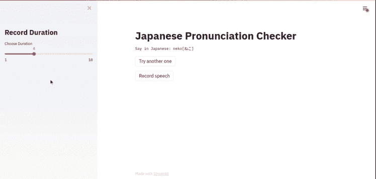

# 如何用 Python 和 Wit.ai 搭建日语发音检查器

> 原文：<https://betterprogramming.pub/how-to-build-a-japanese-pronunciation-checker-with-python-and-wit-ai-7f25d63c896d>

## 测试外语发音技巧的简单方法


照片由 [Unsplash](https://unsplash.com?utm_source=medium&utm_medium=referral) 上的 [Dmitry Ratushny](https://unsplash.com/@ratushny?utm_source=medium&utm_medium=referral) 拍摄

作为一名外语爱好者，我一直想从基础层面学习日语。我认为日语发音可能有点难，尤其是对欧洲人来说。如果有一个可以为学习者提供反馈的发音检查器就好了。有很多有用的资源，比如 Duolingo，非常适合自学，但它们并不关注语音。

在本文中，我很高兴向您展示如何在 Python 和 [Wit.ai 的帮助下实现日语发音检查器。该模型可以很容易地修改，以适应几乎任何其他语言。](https://wit.ai/)

作为可选步骤，我们将了解如何使用 [Streamlit](https://streamlit.io/) 与世界分享我们的应用。

我们开始吧！

# 演讲评估法

首先，让我们了解我们的应用程序将如何工作。

评价发音的方法多种多样。例如，在像 [Praat](https://en.wikipedia.org/wiki/Praat) 这样的复杂语音软件的帮助下，你可以检查你的语音与母语有多少偏差。

虽然这样的工具更准确，但收集数据和分析语音结果很耗时。

诀窍是:Wit.ai 支持大约 140 种语言，所以没有必要收集数据。这是一个开源的 NLP 引擎，它允许你通过将人类语音或文本转换成结构化数据来构建对话式应用。

选择一种语言，然后说点什么。如果它能正确识别你说的话，那么你的发音是好的。

这种方法的优点是非常容易上手，几乎可以用于任何其他外语。有时，它可能不准确，但对于试图学习一门新语言的初学者来说，它仍然是有价值的。

计划是这样的:

*   我们将创建自己想要发音的日语单词列表。
*   我们会录一段录音，说一个选定的词。音频将被转换成文本。
*   Python 代码会将预期的单词与我们的输入进行比较。

# 在 Wit.ai 中创建新应用

我已经写了一篇关于 Wit.ai 的[教程](/create-your-own-book-recommendation-application-using-wit-ai-and-beautiful-soup-8d0343288d28)，这里就长话短说了:

1.  用你的脸书账号注册 Wit.ai。
2.  创建一个新的 Wit app。
3.  从语言下拉菜单中选择“日语”。

创建应用程序后，在应用程序的设置选项卡中记下您的访问令牌。

这就是我们需要从 Wit.ai 得到的一切！

# 用 Python 录制你的演讲

我推荐 P [yAudio](https://pypi.org/project/PyAudio/) 图书馆录制演讲。

安装库:

```
pip3 install pyaudio
```

创建一个 Python 文件，例如`recorder.py`，并粘贴以下代码:

录制音频

别担心，这只是用来录音的。我们将专注于更有趣的部分。

# 识别和评价日本人的演讲

让我们为语音识别创建一个新的 Python 文件。

我们需要一个库来将日语字符(*平假名*、*片假名*和*汉字)*转换为拉丁/罗马字符(*r maji*)。根据我的经验，P [ykakasi](https://pypi.org/project/pykakasi/) 是最好的选择之一。如果你知道更好的，请在评论中告诉我。

```
pip3 install pykakasi
```

添加必要的导入:

```
import requests
import json
import pykakasi
from recorder import record_audio, read_audio
```

然后，我们来补充一下 Wit.ai 的配置:

```
# Wit speech API endpoint
API_ENDPOINT = 'https://api.wit.ai/'
API_FUNCTION_SPEECH = 'speech'

# Wit API token
wit_access_token = 'VPEZHKEUXSSOGT4EVCO6JXCGTJLP'
```

编写一个函数来识别语音:

从音频中识别语音

然后我们需要将日文字符转换成*r maji*。这样，我们就能够将用户输入与用*r maji*编写的预期单词进行比较。

Pykakasi 的[文档](https://github.com/miurahr/pykakasi)非常清晰简洁。以下是如何使用该库:

将日本汉字转换为罗马字

现在，我们要评估结果。为此，我们将把预期的单词与用户的录音进行比较。如果它们相等，那么发音是正确的。

这是语音评估函数:

评估用户输入

最后，让我们编写`main`方法来启动程序:

主要方法

注意，我将日语单词“*neko”*(意为*猫*)硬编码为目标单词。这是为了更容易测试。稍后，我们将使用预定义的单词列表并选择一个随机单词。

我还将录制时间设置为 4 秒。简而言之，我们将使用 Streamlit 的小部件创建一个微调器来提供灵活的持续时间值。

## 测试原型

保存文件，并启动程序:

```
python3 japan.py
```

在“Listening”提示后说出“neko ”,并检查结果:

```
Listening...
Finished recording.
{'entities': {}, 'intents': [], 'text': '猫', 'traits': {}}

You said: 猫
**************************************
猫[Neko]
You said: neko which is: Correct
```

*   Wit.ai 识别该单词并产生一个汉字字符输出(参见'*文本*'栏)。
*   由于 Pykakasi，音频输入已转换为罗马吉语。
*   我们的输入匹配预期的单词" *neko。*”

现在，说一些不同的话来测试行为:

```
Listening...
Finished recording.
{'entities': {}, 'intents': [], 'text': 'テスト', 'traits': {}}

You said: テスト
**************************************
テスト[Tesuto]
You said: tesuto which is: Incorrect
```

太好了！我们的原型正在工作。是时候构建更多功能了。

# 使用 Streamlit 定制程序

到目前为止，我们有一个在命令行工作的程序。在浏览器中看到用户界面会更有互动性。

我们将使用 Streamlit 和 [Bokeh](https://docs.bokeh.org/en/latest/docs/reference/models.html) 小部件来实现这一点。

安装必要的库:

```
pip3 install bokeh
pip3 install streamlit
```

导入这些新语句:

```
import streamlit as st
import random
from bokeh.models.widgets import Button
from bokeh.models import CustomJS
import SessionState
```

用一些用*r maji*写的日语单词创建一个新的文本文件。我更喜欢看到括号里的日本汉字和 rō maji。这是额外的锻炼。但是你可以不写。

下面是我的单词文件的一个例子:

```
sensei[せんせい]
neko[ねこ]
sushi[すし]
```

修改`evaluate_speech`函数，检查方括号前的目标单词:

评估用户输入

编写一个函数，从列表中随机选择一个日语单词:

从列表中选择一个随机单词

最后，让我们修改`main`方法，使用 Streamlit 和 Bokeh 创建 UI:

使用 Streamlit 的主要功能

我们在侧边栏上创建了一个微调器，用户可以选择 1 到 10 秒的持续时间。

我们还添加了两个按钮——一个开始录音，另一个从列表中随机选择一个单词。

请注意，每次与小部件交互时，Streamlit 都会从头到尾重新运行整个 Python 脚本。这就是为什么我们需要缓存所选单词的值。下面是 [SessionState](https://gist.github.com/tvst/036da038ab3e999a64497f42de966a92) 发挥作用的方式——它将值存储在缓存中。要使用它，只需下载要点，并将其放入您的项目目录中。

# 测试应用程序

要在浏览器中运行应用程序，请执行以下 Streamlit 命令:

```
streamlit run japan.py
```

它会自动在一个新标签页中打开。

最终结果如下所示:



展示完整的应用

太好了！我们的应用程序理解日语，并评估我们的讲话。

如果您想创建一个更高级的 UI，请查看 Streamlit 的 widget [指南](https://docs.streamlit.io/en/stable/api.html)。

# 与朋友分享你的应用

这是一个可选步骤。如果你想与你的朋友分享这个应用程序，你可以使用 Streamlit 通过几个步骤来完成。

1.  创建一个简化的`share.streamlit.io`账户。
2.  将应用程序推送到 GitHub 公共存储库。
3.  使用`pipreqs`向您的项目添加一个`requirements.txt`文件:

```
pip3 install pipreqs
pipreqs /home/project/location
```

4.从`share.streamlit.io`开始部署您的 GitHub 应用。

查看部署[指南](https://docs.streamlit.io/en/stable/deploy_streamlit_app.html)了解更多详细信息。

# 结论

恭喜你！您已经完成了本教程的学习。现在你知道怎么用 Wit.ai 和 Python 评价日语发音了吧。

通过跳过字符转换步骤并添加您自己的实现，您可以轻松地调整模型以支持另一种语言。请随意使用下面链接的 GitHub 库。

您还学习了如何向您的应用程序添加小部件，以及如何使用 Streamlit 在 web 上托管它。

我希望你今天学到了一些新东西，这篇教程给了你下一个项目的灵感。

如果你喜欢这篇文章，你可能也会喜欢这篇:

[](/create-your-own-book-recommendation-application-using-wit-ai-and-beautiful-soup-8d0343288d28) [## 使用 Wit.ai 和 Beautiful Soup 创建您自己的图书推荐应用程序

### 网页抓取加上一个 NLP 应用程序

better 编程. pub](/create-your-own-book-recommendation-application-using-wit-ai-and-beautiful-soup-8d0343288d28) 

感谢您的阅读和快乐编码！

# 参考

*   [https://github . com/kirshiyin 89/日语发音检查器](https://github.com/kirshiyin89/japanese-pronunciation-checker/tree/master)
*   https://docs.streamlit.io/en/stable/api.html
*   [https://docs . streamlit . io/en/stable/deploy _ streamlit _ app . html](https://docs.streamlit.io/en/stable/deploy_streamlit_app.html)
*   [https://pypi.org/project/PyAudio/](https://pypi.org/project/PyAudio/)
*   [https://github.com/miurahr/pykakasi](https://github.com/miurahr/pykakasi)
*   [https://gist . github . com/tvst/036 da 038 ab 3 e 999 a 64497 f 42 de 966 a 92](https://gist.github.com/tvst/036da038ab3e999a64497f42de966a92)