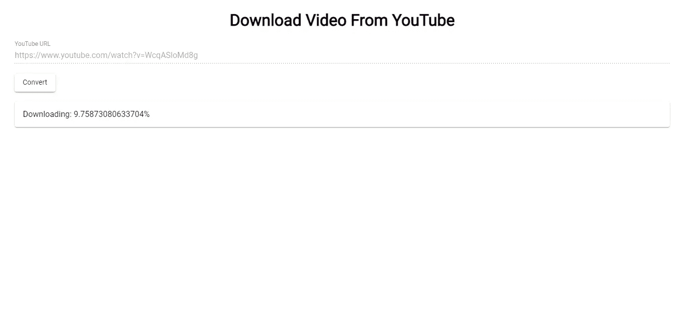

# 如何用 Node.js 构建作业队列

> 原文：<https://betterprogramming.pub/how-to-build-a-job-queue-with-node-js-ffadf7e66daf>

## 了解用于创建在后台运行的作业队列的库，没有太多的麻烦


由[克里斯蒂安·威迪格](https://unsplash.com/@christianw?utm_source=unsplash&utm_medium=referral&utm_content=creditCopyText)在 [Unsplash](https://unsplash.com/search/photos/youtube?utm_source=unsplash&utm_medium=referral&utm_content=creditCopyText) 上拍摄的照片

如果你想做一个处理长时间运行任务的 app，你需要一个后台运行的作业队列。否则，您的用户将一直等待请求，并且托管您的应用程序的服务器可能会挂起。这对任何人来说都不是愉快的用户体验。Node.js 有构建作业队列的库，这些库在后台运行，没有太多麻烦。

# 准备

在这篇文章中，我们将构建一个 YouTube 视频下载器，让用户输入来自 YouTube 的 URL。我们的应用程序会将视频下载到本地文件夹，一旦完成，就可以从 UI 自动下载。下载过程中会显示下载进度。在第一个视频完成之前，用户不能下载另一个视频。其工作方式是，当用户输入一个有效的 YouTube 视频 URL 时，该作业的数据库条目将被记录在数据库中。然后将创建一个后台作业，该作业将在后台下载。作业的进度将通过 [Socket.io](https://socket.io/) 报告回来，以便显示给用户。一旦作业完成，它将在作业的数据库条目中被标记为完成。如果失败，它将从队列中删除。视频的 URL 将被发送回给用户，然后它将被自动下载。

我们将用 [Express](https://expressjs.com/) 构建一个后端应用，用 [Angular](https://angular.io/) 构建一个前端应用。为此，我们使用[快速生成器](https://expressjs.com/en/starter/generator.html)。使用 Node.js 的最新版本，我们可以在为后端应用程序创建一个文件夹后运行`npx express-generator`。这将生成代码文件。接下来，我们需要安装一些包。我们通过在后端项目文件夹的根目录下运行`npm i`来实现这一点。

我们需要安装一些库，以便使用最新的 JavaScript 特性，构建我们的队列，存储我们的环境变量，并操作我们的数据库。我们通过运行`npm i sequelize @babel/register babel-polyfill body-parser bull cors dotenv pg pg-hstore uuid ytdl-core`来安装这些库。我们将使用[PostgreSQL](https://www.postgresql.org/)作为我们的数据库，这意味着我们需要`pg`和`pg-hstore`包。我们需要`uuid` [包](https://www.npmjs.com/package/uuid)来生成 UUIDs。`ytld-core`是 YouTube 下载库。`babel-polyfill`和`@babel/register`允许我们使用最新的 JavaScript 特性。我们还需要 [Sequelize CLI](https://github.com/sequelize/cli) 来创建我们的模型，并允许我们运行数据库迁移来改变我们的数据库结构。为此，我们运行`npm i -g sequelize-cli`。

现在，我们需要创建我们的数据库。首先，我们使用 [pgAdmin](https://www.pgadmin.org/) 3.x 创建一个空数据库，方法是连接到我们的服务器并双击。右键单击数据库项，然后单击“新建数据库”。之所以使用 pgAdmin 3.x，是因为它比 4.x 快得多，功能也更多。

最后，我们需要初始化我们的序列代码。我们在后端应用程序的项目文件夹中运行`npx sequelize-cli init`来完成这个任务。

# 代码

现在我们可以写一些代码了。

## 构建后端

在`bin/www`中，我们把:

```
#!/usr/bin/env node/**
 * Module dependencies.
 */const app = require('../app');
const debug = require('debug')('backend:server');
const http = require('http');
/**
 * Get port from environment and store in Express.
 */const port = normalizePort(process.env.PORT || '3000');
app.set('port', port);/**
 * Create HTTP server.
 */const server = http.createServer(app);
const io = require('socket.io')(server, { origins: '*:*' });
global.io = io;/**
 * Listen on provided port, on all network interfaces.
 */server.listen(port);
server.on('error', onError);
server.on('listening', onListening);
io.on('connection', (socket) => {
  socket.emit('connected', { message: 'connected' });
});/**
 * Normalize a port into a number, string, or false.
 */function normalizePort(val) {
  const port = parseInt(val, 10);if (isNaN(port)) {
    // named pipe
    return val;
  }if (port >= 0) {
    // port number
    return port;
  }return false;
}/**
 * Event listener for HTTP server "error" event.
 */function onError(error) {
  if (error.syscall !== 'listen') {
    throw error;
  }const bind = typeof port === 'string'
    ? 'Pipe ' + port
    : 'Port ' + port;// handle specific listen errors with friendly messages
  switch (error.code) {
    case 'EACCES':
      console.error(bind + ' requires elevated privileges');
      process.exit(1);
      break;
    case 'EADDRINUSE':
      console.error(bind + ' is already in use');
      process.exit(1);
      break;
    default:
      throw error;
  }
}/**
 * Event listener for HTTP server "listening" event.
 */function onListening() {
  const addr = server.address();
  const bind = typeof addr === 'string'
    ? 'pipe ' + addr
    : 'port ' + addr.port;
  debug('Listening on ' + bind);
}
```

这是我们 app 的切入点。我们在这里初始化 Socket.io，以允许我们监听来自客户端的消息。它还将全局设置`socket`对象，以便它可以在其他文件中使用。

接下来，在`config`文件夹中，我们将运行`npx sequelize-cli init`时生成的`config.json`重命名为`config.js`，并添加以下内容:

```
require('dotenv').config();
const dbHost = process.env.DB_HOST;
const dbName = process.env.DB_NAME;
const dbUsername = process.env.DB_USERNAME;
const dbPassword = process.env.DB_PASSWORD;
const dbPort = process.env.DB_PORT || 5432;module.exports = {
    development: {
        username: dbUsername,
        password: dbPassword,
        database: dbName,
        host: dbHost,
        port: dbPort,
        dialect: 'postgres'
    },
    test: {
        username: dbUsername,
        password: dbPassword,
        database: 'youtube_app_test',
        host: dbHost,
        port: dbPort,
        dialect: 'postgres'
    },
    production: {
        use_env_variable: 'DATABASE_URL',
        username: dbUsername,
        password: dbPassword,
        database: dbName,
        host: dbHost,
        port: dbPort,
        dialect: 'postgres'
    }
};
```

这允许我们使用环境变量，而不是将数据库凭证硬编码到我们的数据库中。然后，我们在根目录下创建一个`files`文件夹，并将一个空的`.gitkeep`文件放入其中，这样它就可以提交给 Git。

然后，我们使用 Sequelize 进行数据库迁移来构建我们的数据库。我们运行:

```
npx sequelize-cli model:generate --name Job --attributes status:enum,url:string,fileLocation:string
```

创建一个迁移文件及其对应的`model`文件。在`model`文件中，它应该被称为`models`文件夹中的`job.js`，我们把:

```
'use strict';
module.exports = (sequelize, DataTypes) => {
  const Job = sequelize.define('Job', {
    status: DataTypes.ENUM('started', 'cancelled', 'done'),
    url: DataTypes.STRING,
    fileLocation: DataTypes.STRING
  }, {});
  Job.associate = function(models) {
    // associations can be defined here
  };
  return Job;
};
```

而在`index.js`的`models`文件夹中，我们放入:

```
'use strict';const fs = require('fs');
const path = require('path');
const Sequelize = require('sequelize');
const basename = path.basename(__filename);
const env = process.env.NODE_ENV || 'development';
const config = require(__dirname + '/../config/config.js')[env];
const db = {};let sequelize;
if (config.use_env_variable) {
  sequelize = new Sequelize(process.env[config.use_env_variable], config);
} else {
  sequelize = new Sequelize(config.database, config.username, config.password, config);
}fs
  .readdirSync(__dirname)
  .filter(file => {
    return (file.indexOf('.') !== 0) && (file !== basename) && (file.slice(-3) === '.js');
  })
  .forEach(file => {
    const model = sequelize['import'](path.join(__dirname, file));
    db[model.name] = model;
  });Object.keys(db).forEach(modelName => {
  if (db[modelName].associate) {
    db[modelName].associate(db);
  }
});db.sequelize = sequelize;
db.Sequelize = Sequelize;module.exports = db;
```

最重要的部分是将`const config = require(__dirname + ‘/../config/config.js’)[env];`中的`config.json`更名为`config.js`。

接下来，我们用`bull` [包](https://www.npmjs.com/package/bull)构建我们的队列。我们在项目根文件夹中创建一个名为`queue`的文件夹，并添加`video.js`。在该文件中，我们放入:

```
const Queue = require('bull');
const fs = require('fs');
const models = require('../models');
const ytdl = require('ytdl-core');
const uuidv1 = require('uuid/v1');
const util = require('util');const createVideoQueue = () => {
    const videoQueue = new Queue('video transcoding', {
        redis: {
            port: process.env.REDIS_PORT,
            host: process.env.REDIS_URL
        }
    });videoQueue.process(async (job, done) => {
        const data = job.data;
        try {
            job.progress(0);
            global.io.emit('progress', { progress: 0, jobId: data.id });
            const uuid = uuidv1();
            const fileLocation = `./files/${uuid}.mp4`;
            await new Promise((resolve) => {
                ytdl(data.url)
                    .on('progress', (length, downloaded, totallength) => {
                        const progress = (downloaded / totallength) * 100;
                        global.io.emit('progress', { progress, jobId: data.id });
                        if (progress >= 100) {
                            global.io.emit('videoDone', { fileLocation: `${uuid}.mp4`, jobId: data.id });
                            global.io.emit('progress', { progress: 100, jobId: data.id });
                        }
                    })
                    .pipe(fs.createWriteStream(fileLocation))
                    .on('finish', () => {
                        resolve();
                    })
            })
            await models.Job.update({
                status: 'done',
                fileLocation: `${uuid}.mp4`
            }, {
                    where: {
                        id: data.id
                    }
                })
            done();
        }
        catch (ex) {
            console.log(ex);
            job.moveToFailed();
        }
    });
    return videoQueue;
}module.exports = { createVideoQueue };
```

请注意，我们传入了`socket`对象来将进度发送回客户端，并且我们将所有异步代码转换为承诺，以便可以顺序调用它们。我们用`ytdl`下载 YouTube 视频。它有一个报告下载进度的`progress`事件处理程序，我们通过 Socket.io 的`broadcast` 函数将下载进度发送回客户端。这会向所有客户端发送消息。我们会在客户端过滤掉无关的消息。任何失败的作业都将从队列中删除。

接下来，我们创建路线。在`routes`文件夹中，我们添加一个名为`jobs.js`的新文件，并将:

```
const express = require('express');
const models = require('../models');
const path = require('path');
const router = express.Router();
const ytdl = require('ytdl-core');
const { createVideoQueue } = require('../queue/video');router.post('/new', async (req, res) => {
  const url = req.body.url;
  try {
    const isValidUrl = ytdl.validateURL(url);
    if (!isValidUrl) {
      res.status(400);
      return res.send({ error: 'invalid URL' });
    }
    const job = await models.Job.create({
      url,
      status: 'started'
    })
    await createVideoQueue().add({ url, id: job.id });
    return res.send(job);
  }
  catch (ex) {
    console.log(ex);
    res.status(400);
    return res.send({ error: ex });
  }
});router.get('/file/:fileName', (req, res) => {
  const fileName = req.params.fileName;
  const file = path.resolve(__dirname, `../files/${fileName}`);
  res.download(file);
})module.exports = router;
```

我们需要一个路径来添加新的作业和下载生成的文件。我们在创建作业之前验证提交的 URL，以尽量减少错误。在这一行:

```
await createVideoQueue(global.socket).add({ url, id: job.id });
```

当客户端在`bin\www`中连接到这个应用程序时，我们传递我们创建的`global.socket`对象。注意，在返回响应之前，我们不会等待任务完成。这就是为什么我们需要 Socket.io 将结果反馈给客户端。

在`app.js`中，我们添加初始化代码。我们将以下代码添加到文件中:

```
require("[@babel/register](http://twitter.com/babel/register)");
require("babel-polyfill");
require('dotenv').config();
const createError = require('http-errors');
const express = require('express');
const path = require('path');
const cookieParser = require('cookie-parser');
const logger = require('morgan');
const bodyParser = require('body-parser')
const cors = require('cors')
const indexRouter = require('./routes/index');
const usersRouter = require('./routes/users');
const jobsRouter = require('./routes/jobs');
const app = express();// view engine setup
app.set('views', path.join(__dirname, 'views'));
app.set('view engine', 'jade');app.use(logger('dev'));
app.use(express.json());
app.use(express.urlencoded({ extended: false }));
app.use(cookieParser());
app.use(express.static(path.join(__dirname, 'public')));
app.use(express.static(path.join(__dirname, 'files')));
app.use(bodyParser.urlencoded({ extended: true }));
app.use(bodyParser.json())
app.use(cors())
app.use('/', indexRouter);
app.use('/users', usersRouter);
app.use('/jobs', jobsRouter);// catch 404 and forward to error handler
app.use((req, res, next) => {
  next(createError(404));
});// error handler
app.use((err, req, res, next) => {
  // set locals, only providing error in development
  res.locals.message = err.message;
  res.locals.error = req.app.get('env') === 'development' ? err : {};// render the error page
  res.status(err.status || 500);
  res.render('error');
});module.exports = app;
```

我们添加`app.use(express.static(path.join(__dirname, ‘files’)));`来公开我们创建的`files`文件夹，我们添加:

```
const jobsRouter = require('./routes/jobs');
```

和

```
app.use('/jobs', jobsRouter);
```

以便客户可以访问我们创建的路由。

最后，我们创建一个`.env`文件，并放入以下内容:

```
REDIS_URL='localhost'
REDIS_PORT='6379'
DB_HOST='localhost'
DB_NAME='youtube_app_development'
DB_USERNAME='postgres'
DB_PASSWORD='postgres'
```

`bull`包需要 [Redis](https://redis.io/) ，所以我们必须安装它。为此，我们在 Ubuntu 或相关的 Linux 发行版中运行以下程序:

```
$ sudo apt-get update
$ sudo apt-get upgrade
$ sudo apt-get install redis-server
$ sudo systemctl enable redis-server.service
$ sudo service redis-server restart
```

运行前两个命令来更新包存储库引用和更新我们的 Linux 包。我们运行`sudo apt-get install redis-server`来安装 Redis，我们运行第四行来在启动时启用 Redis。如果 Redis 没有启动或者需要重启，我们运行`sudo service redis-server restart`。

注意 Redis 没有最新的 Windows 版本，因此需要 Linux。现在我们有了运行后端所需的一切。

## 构建用户界面

后端已经完成，我们可以继续构建 UI 了。我们用棱角分明的材料[和](https://material.angular.io/)来建造它。首先，我们通过运行`npm i -g @angular/cli`来安装[角度 CLI](https://cli.angular.io/) 。然后我们运行顶层项目文件夹中的`ng new frontend`来创建应用程序。请务必选择包括路由和使用 SCSS 的样式时，出现提示。之后，我们运行`npm i @angular/cdk @angular/material file-saver socket.io-client`。前两个包是角材包。`file-saver`帮助我们下载文件，`socket.io-client`允许我们连接到后端获取下载进度和文件位置。

在`environment.ts`中，我们把:

```
export const environment = {
  production: false,
  apiUrl: '[http://localhost:3000'](http://localhost:3000'),
  socketIoUrl: '[http://localhost:3000'](http://localhost:3000')
};
```

然后我们创建我们的组件和服务。

我们运行`ng g component homePage`和`ng g service video`来创建代码文件。

在`video.service.ts`中，我们输入:

```
import { Injectable } from '[@angular/core](http://twitter.com/angular/core)';
import { HttpClient, HttpHeaders } from '[@angular/common](http://twitter.com/angular/common)/http';
import { environment } from 'src/environments/environment';[@Injectable](http://twitter.com/Injectable)({
  providedIn: 'root'
})
export class VideoService { constructor(
    private http: HttpClient
  ) { } addVideoToQueue(data) {
    return this.http.post(`${environment.apiUrl}/jobs/new`, data);
  } getVideo(videoUrl: string) {
    return this.http.get<Blob>(videoUrl, {
      headers: new HttpHeaders({
        'accept': 'application/octet-stream',
        'content-type': 'application/json'
      }),
      responseType: 'blob' as 'json'
    })
  }
}
```

让我们的应用程序请求将 YouTube 视频添加到下载队列中，我们调用`getVideo`来下载。请注意，我们将`accept`头设置为`‘application/octet-stream’`，以便我们可以下载视频文件。

接下来在`home-page.component.ts`中，我们输入:

```
import { Component, OnInit } from '[@angular/core](http://twitter.com/angular/core)';
import { VideoService } from '../video.service';
import { NgForm } from '[@angular/forms](http://twitter.com/angular/forms)';
import io from 'socket.io-client';
import { environment } from 'src/environments/environment';
import { saveAs } from 'file-saver';[@Component](http://twitter.com/Component)({
  selector: 'app-home-page',
  templateUrl: './home-page.component.html',
  styleUrls: ['./home-page.component.scss']
})
export class HomePageComponent implements OnInit {
  videoData: any = <any>{};
  progress: number = 0;
  fileLocation: string;
  downloaded: boolean = false;
  jobId: number;
  connected: boolean = false;
  socket;
  getVideoSub;constructor(
    private videoService: VideoService
  ) { }ngOnInit() {
      this.addConnectionHandlers();
  } addConnectionHandlers() {
    const manager = io.Manager(environment.socketIoUrl);
    manager.on('connect_error', () => {
      this.socket = io.connect(environment.socketIoUrl);
    }); this.socket = io.connect(environment.socketIoUrl);
    this.socket.on('connect', (data) => {
      this.socket.on('connected', (msg) => {}); this.socket.on('progress', (msg) => {
        if (this.jobId != msg.jobId) {
          return;
        }
        this.progress = msg.progress;
        if (msg.progress == 100) {
          this.progress = 0;
        }
      }); this.socket.on('videoDone', (msg) => {
        if (this.jobId != msg.jobId || this.downloaded) {
          return;
        }
        this.getVideoSub = this.videoService.getVideo(`${environment.apiUrl}/jobs/file/${msg.fileLocation}`)
          .subscribe(res => {
            if (!this.downloaded) {
              saveAs(res, `${msg.fileLocation}.mp4`);
              this.progress = 0;
              this.downloaded = true;
              this.getVideoSub.unsubscribe();
            }
          })
      });
    });
  } addVideoToQueue(videoForm: NgForm) {
    this.downloaded = false;
    if (videoForm.invalid) {
      return;
    }
    this.videoService.addVideoToQueue(this.videoData)
      .subscribe(res => {
        this.jobId = (res as any).id;
      }, err => {
        alert('Invalid URL');
      })
  }
}
```

这为 UI 提供了逻辑，让用户输入他们的 YouTube URLs，观看他们的视频下载进度，并在完成后下载。既然我们在后端用了`socket.broadcast.emit`，那就要在前端把它过滤掉。后端返回下载作业的`jobId`，所以我们可以通过`jobId`过滤掉。我们还需要添加重试功能，以防后端应用程序因`connect_error`处理程序中的`setTimeout`块而停止运行。我们用`this.downloaded`标志检查相同的文件是否已经下载过，这样它就不会再下载了。否则，它可能会尝试下载太多次，导致冻结和崩溃。

在`home-page.component.html`中，我们输入:

```
<div class="center">
    <h1>Download Video From YouTube</h1>
</div>
<div id='content'>
    <form #videoForm='ngForm' (ngSubmit)='addVideoToQueue(videoForm)'>
        <mat-form-field>
            <input matInput placeholder="YouTube URL" required #url='ngModel' name='url' [(ngModel)]='videoData.url'
                [disabled]='progress != 0'>
            <mat-error *ngIf="url.invalid && (url.dirty || url.touched)">
                <div *ngIf="url.errors.required">
                    URL is required.
                </div>
            </mat-error>
        </mat-form-field>
        <br>
        <button mat-raised-button type='submit'>Convert</button>
    </form>
    <br>
    <mat-card *ngIf='progress > 0'>
        Downloading: {{progress}}%
    </mat-card>
</div>
```

让用户输入他们的 YouTube URL 并显示进度。请注意，我们在下载视频时禁用了输入，这样用户就不能不断输入新的请求。

在`home-page.component.scss`中，我们放入:

```
#content {
  width: 95vw;
  margin: 0 auto;
}
```

向窗体添加一些填充。

在`app-routing.module.ts`中，我们把:

```
import { NgModule } from '[@angular/core](http://twitter.com/angular/core)';
import { Routes, RouterModule } from '[@angular/router](http://twitter.com/angular/router)';
import { HomePageComponent } from './home-page/home-page.component';const routes: Routes = [
  { path: '', component: HomePageComponent }
];[@NgModule](http://twitter.com/NgModule)({
  imports: [RouterModule.forRoot(routes)],
  exports: [RouterModule]
})
export class AppRoutingModule { }
```

以便用户可以看到我们的页面。

在`app.component.html`中，我们把:

```
<router-outlet></router-outlet>
```

以便显示我们的页面。在`app.module.ts`中，我们把:

```
import { BrowserModule } from '[@angular/platform-browser](http://twitter.com/angular/platform-browser)';
import { NgModule } from '[@angular/core](http://twitter.com/angular/core)';
import { BrowserAnimationsModule } from '[@angular/platform-browser](http://twitter.com/angular/platform-browser)/animations';
import {
  MatButtonModule,
  MatCheckboxModule,
  MatInputModule,
  MatMenuModule,
  MatSidenavModule,
  MatToolbarModule,
  MatTableModule,
  MatDialogModule,
  MAT_DIALOG_DEFAULT_OPTIONS,
  MatDatepickerModule,
  MatSelectModule,
  MatCardModule,
  MatFormFieldModule
} from '[@angular/material](http://twitter.com/angular/material)';
import { AppRoutingModule } from './app-routing.module';
import { AppComponent } from './app.component';
import { HomePageComponent } from './home-page/home-page.component';
import { FormsModule } from '[@angular/forms](http://twitter.com/angular/forms)';
import { HttpClientModule } from '[@angular/common](http://twitter.com/angular/common)/http';[@NgModule](http://twitter.com/NgModule)({
  declarations: [
    AppComponent,
    HomePageComponent
  ],
  imports: [
    BrowserModule,
    AppRoutingModule,
    MatButtonModule,
    BrowserAnimationsModule,
    MatButtonModule,
    MatCheckboxModule,
    MatFormFieldModule,
    MatInputModule,
    MatMenuModule,
    MatSidenavModule,
    MatToolbarModule,
    MatTableModule,
    FormsModule,
    HttpClientModule,
    MatDialogModule,
    MatDatepickerModule,
    MatSelectModule,
    MatCardModule
  ],
  providers: [],
  bootstrap: [AppComponent]
})
export class AppModule { }
```

这样我们就可以在应用程序中使用棱角分明的材质部件。

在`styles.scss`中，我们输入:

```
/* You can add global styles to this file, and also import other style files */
[@import](http://twitter.com/import) "~[@angular/material](http://twitter.com/angular/material)/prebuilt-themes/indigo-pink.css";
body {
  font-family: "Roboto", sans-serif;
  margin: 0;
}form {
  mat-form-field {
    width: 95vw;
    margin: 0 auto;
  }
}.center {
  text-align: center;
}
```

包括材料设计风格，并添加一些填充到我们的形式和居中文本的风格。

在`index.html`中，我们输入:

```
<!doctype html>
<html lang="en"><head>
  <meta charset="utf-8">
  <title>YouTube Download App</title>
  <base href="/">
  <link href="[https://fonts.googleapis.com/css?family=Roboto&display=swap](https://fonts.googleapis.com/css?family=Roboto&display=swap)" rel="stylesheet">
  <link href="[https://fonts.googleapis.com/icon?family=Material+Icons](https://fonts.googleapis.com/icon?family=Material+Icons)" rel="stylesheet">
  <meta name="viewport" content="width=device-width, initial-scale=1">
  <link rel="icon" type="image/x-icon" href="favicon.ico">
</head><body>
  <app-root></app-root>
</body></html>
```

包括材料图标和机器人字体。



# 重要说明

下载 YouTube 视频是合法的。但是，它违反了 YouTube 的服务条款。所以，不要分发有版权的视频，记住，下载的视频仅供个人使用。