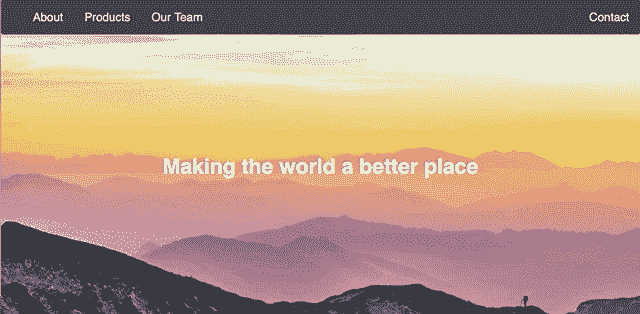

# 如何在十分钟内建立一个登陆页面

> 原文：<https://betterprogramming.pub/how-to-build-a-landing-page-in-ten-minutes-11931e7f01f7>

## 主要使用 CSS (Grid 和 Flex)构建一个响应式布局


**要跳过教程，请随意从我的** [**Github repo 这里**](https://github.com/assafelovic/Basic-Landing-Page-Layout) **下载源代码模板。**

有相当多的模板和教程可以用来构建登录页面。然而，大多数倾向于过度复杂或增加沉重的设计(如多个页面、表单等)，而在大多数情况下需要非常简单和精简的设计。此外，我将向您展示如何使用**主要是 CSS** ( [Grid](https://css-tricks.com/snippets/css/complete-guide-grid/) 和 [Flex](https://css-tricks.com/snippets/css/a-guide-to-flexbox/) )来创建一个**响应式** UI，而不是使用老式的 CSS 库(如 bootstrap)。所以让我们开始吧！

我们将构建一个基本的登录页面布局，主要关注基础知识，这样你就可以从那里进入你想要的登录页面。下面是结果的一个例子:



该页面将由四个主要组件构成:导航栏、封面图片、卡片网格，最后是页脚。

index.html 非常简单。它主要包含 div 标签和整个页面结构:

```
<body>
  <nav class="zone blue sticky">
      <ul class="main-nav">
          <li><a href="">About</a></li>
          <li><a href="">Products</a></li>
          <li><a href="">Our Team</a></li>
          <li class="push"><a href="">Contact</a></li>
  </ul>
  </nav>
  <div class="container">
      
      <div class="coverText"><h1>Making the world a better place</h1></div>
  </div>
  <div class="zone blue grid-wrapper">
      <div class="card zone">
          
          <div class="text">
              <h1>Team play</h1>
              <p>We work together to create impact</p>
              <button>Learn more</button>
          </div>
      </div>
    <div class="card zone">
        <div class="text">
            <h1>Strategy</h1>
            <p>Every goal is part of our strategy</p>
            <button>Learn more</button>
        </div>
    </div>
    <div class="card zone">
        <div class="text">
            <h1>Innovation</h1>
            <p>We're focused on thinking different</p>
            <button>Learn more</button>
        </div>
    </div>
  </div>
  <footer class="zone"><p>2019 Assaf Elovic All right reserved. For more articles visit <a href="www.assafelovic.com">www.assafelovic.com</a></p></footer>
</div>
</body>
```

因此，我们将严格关注样式(CSS)。如果你是 HTML 和页面结构的新手，[点击这里](https://www.w3schools.com/html/html_intro.asp)在前进之前学习基础知识。

# 使用网格和伸缩样式化布局

经验法则:当你需要表格、卡片、相册媒体等类似网格的视图时，使用 [**网格**](https://css-tricks.com/snippets/css/complete-guide-grid/) (就像在 Instagram 中一样)。在所有其他用例中，考虑使用 [**Flex**](https://css-tricks.com/snippets/css/a-guide-to-flexbox/) 。我强烈推荐深入研究这两者，因为一旦你掌握了它们，你就不需要太多其他的东西来创建漂亮的响应性网页。

## 导航栏

我们将使用 flex，这样我们就有了一个单向行，这是我们的导航栏所需要的。因为我们使用了一个

标签，所以我们想要去掉点(列表样式)。最后，我们想删除浏览器设置的任何默认边距，所以我们重置 margin: 0。

```
.main-nav {
    display: flex;
    list-style: none;
    margin: 0;
    font-size: 0.7em;
}
```

当改变我们浏览器的宽度时，我们可以看到一些导航条被切掉了，所以我们需要修改宽度变小时它的样子:

```
@media only screen and (max-width: 600px) {
    .main-nav {
        font-size: 0.5em;
        padding: 0;
    }
}
```

我们希望“联系人”选项保持在右边，所以我们将左边距设置为“自动”。这将自动设置超链接左侧的最大边距:

```
.push {
    margin-left: auto;
}
```

最后，我们希望导航栏保持粘性，并且总是出现在页面的顶部。此外，我们希望它出现在所有其他元素之上(z-index):

```
.sticky {
  position: fixed;
  z-index: 1;
  top: 0;
  width: 100%;
}
```

## 涉及

我们使用 Flex 是因为我们想让事情变得简单(只是中心内容)。将我们的显示设置为 flex 后，justify-content 在容器内水平居中(X 轴), align-items 垂直居中(Y 轴)。我们希望图像适合整个屏幕，因此我们将高度设置为 100vh，这意味着 100%的视图高度:

```
.container {
    height: 100vh;
    display: flex;
    align-items: center;
    justify-content: center;
}
```

此外，我们希望封面文字出现在图像上方和中央:

```
.coverText {
    position: absolute;
    left: 50%;
    top: 50%;
    transform: translate(-50%, -50%);
    color: white;
    font-weight: bold;
}
```

请参见[完整的 CSS 样式表](https://github.com/assafelovic/Basic-Landing-Page-Layout/blob/master/style.css)了解更多细微调整。

## 卡片网格

如上所述，我们想要创建一个卡片网格，所以这次我们将使用网格。grid-template-columns 设置每个列(或 div)的样式。仅供参考:如果我们只设置 1fr，我们将看到每列只有一个块。所以我们将它设置为重复(就像输入 1fr 1fr …)，并自动填充从最小 350px 到整个屏幕(1fr)的任何内容。最后，我们将网格间距(网格对象之间的填充)设置为 20px:

```
.grid-wrapper {
    display: grid;
    grid-template-columns: repeat(auto-fill, minmax(350px, 1fr));
    grid-gap: 10px;
}
```

接下来，我们将设计网格中每张*牌*的样式。正如您在下面看到的，这对于设置每张卡片的边距和背景颜色来说非常简单:

```
.card {
    background-color: #444;
    margin: 50px;
}
```

我们希望每张卡片都有一个适合整个顶部区域的图像，有标题和段落，下面有一个“阅读更多”的按钮。此外，我们只想在类别卡中操作图像、标题和段落，所以我们这样设置它:

```
.card > img {
    max-width: 100%;
    height: auto;
}.card h1 {
    font-size: 1.5rem;
}.card p {
    font-size: 1rem;
}
```

虽然图像完全适合卡片的宽度，但我们希望在卡片的文本区域添加一些漂亮的填充:

```
.card > .text {
    padding: 0 20px 20px;
}
```

最后，我们设置出现在每张卡片中的按钮设计。我们将边框设置为 0(因为默认显示有边框)，并添加一些填充、颜色等:

```
button {
    cursor: pointer;
    background: gray;
    border: 0;
    font-size: 1rem;
    color: white;
    padding: 10px;
    width: 100%;
}button:hover {
    background-color: #e0d27b;
}
```

## 页脚

最后但同样重要的是，我们的页脚非常简单。我们希望内部文本小于默认文本，并用一些颜色填充页脚:

```
footer {
    text-align: center;
    padding: 3px;
    background-color: #30336b;
}footer p {
    font-size: 1rem;
}
```

就是这样！遵循这个简单的响应式布局，你几乎可以创建任何你想要的登陆页面。通过一些令人惊叹的动画库将这种布局提升到一个新的水平——以下是我最喜欢的一些:

1.  [温馨提示](https://sweetalert2.github.io) —添加时尚提示
2.  [Typed.js](https://github.com/mattboldt/typed.js/) —给你的标题添加打字动画。
3.  极光 —添加动画渐变背景。
4.  Owl Carousel —为你的元素添加动画
5.  [Animate.css](https://daneden.github.io/animate.css/) —加载元素时添加样式动画。

要下载完整的源代码[点击这里](https://github.com/assafelovic/Basic-Landing-Page-Layout)！