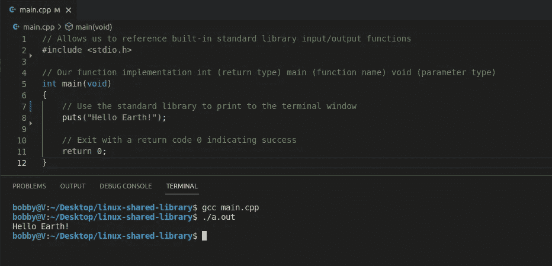
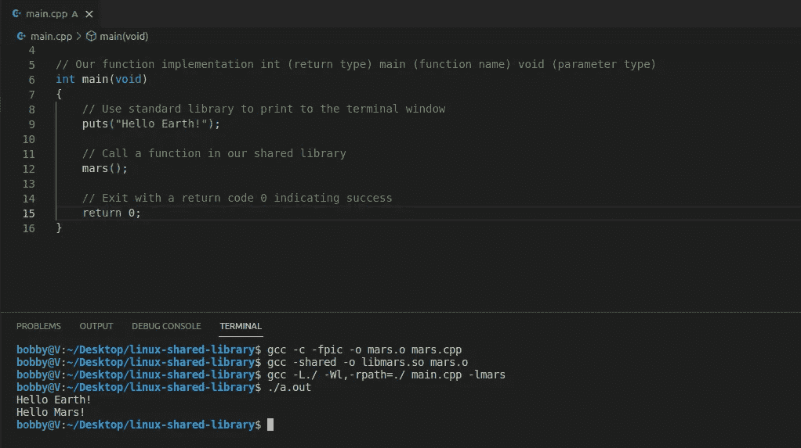

# 如何构建 Linux 共享库

> 原文：<https://betterprogramming.pub/how-to-build-a-linux-shared-library-f5b574b0c08e>

## 利用模块化 C++和开源的力量


照片由[亚历克斯·布洛克](https://unsplash.com/@alexblock?utm_source=medium&utm_medium=referral)在 [Unsplash](https://unsplash.com?utm_source=medium&utm_medium=referral) 上拍摄

# 定义

*“一个库是……一个行为实现的集合，用一种语言编写，它有一个定义良好的接口*[](https://en.wikipedia.org/wiki/Interface_(computing))**，通过这个接口行为被调用。例如，想要编写高级程序的人可以使用库来进行* [*系统调用*](https://en.wikipedia.org/wiki/System_call) *，而不是一遍又一遍地实现那些系统调用。此外，该行为还提供给多个独立的程序重用。*——[维基百科](https://en.wikipedia.org/wiki/Library_(computing))*

# *为什么*

*Linux 可以说是开源世界的老大。根据维基百科的说法，互联网上大约 80%的服务器运行某种形式的 Linux/Unix。越来越多的项目是在考虑 Linux 支持的情况下构建的。对开源项目的贡献和扩展是快速开发高性能软件应用程序的最强有力的方法。本文将涵盖 Linux C++共享库开发的基础知识，并为您提供一个起点，帮助您进入开源世界。*

*本文的配套报告可以在 [GitHub](https://github.com/bobbyg603/linux-shared-library) 上找到。*

# *怎么*

*要开始 Linux 开发，您需要选择一个[发行版](https://linuxhint.com/best-linux-distros-2022/)，并将其安装在[硬件](https://ubuntu.com/tutorials/install-ubuntu-desktop#1-overview)上，或者作为一个[虚拟机](https://ubuntu.com/tutorials/how-to-run-ubuntu-desktop-on-a-virtual-machine-using-virtualbox#1-overview)。对于本教程，我们将使用 Ubuntu Linux 22.04。我们还将使用通过 Ubuntu 的 [Snap Store](https://snapcraft.io/code) 安装的 [VS Code](https://code.visualstudio.com/) ，这使得下载和安装常用软件更加容易。不久以前，在 Ubuntu 上安装软件的唯一方法是通过终端命令手动安装！*

*尽管通过终端安装软件有点麻烦，但终端是软件开发人员的必备工具。将终端与热键结合使用，可以让您的手保持在键盘上，从而加快移动速度。*

## *用 VS 代码创建一个新项目*

*要快速打开终端，请按下 Mac 键盘上的`⊞ Win`键或`⌘ Cmd`，然后键入`terminal + Enter`。打开终端后，让我们开始在桌面上为我们的项目创建一个新目录，它是我们的`~` ( [Home](https://linuxhint.com/linux-home-directory/) )目录的子目录:*

```
*mkdir ~/Desktop/linux-shared-library*
```

*让我们使用终端在 VS 代码中打开我们的新项目目录。我们可以使用 [bang 命令](http://v)快捷键`!$`自动抓取上述命令的`~/Desktop/linux-shared-library`部分，并将其传递给代码。以下是如何做到这一点:*

```
*code !$*
```

*嘣！你现在应该有一个 VS 代码窗口，并准备好摇滚！*

*VS 代码内置了一个终端，方便访问；该端子可以通过`Ctrl + ~`自动切换。*

## *编写主程序*

*打开 VS 代码集成终端，创建一个新文件 C++文件:*

```
*code main.cpp*
```

*在新文件中编写以下代码:*

*将消耗我们共享库的程序*

*让我们编译并运行您刚刚编写的代码。我们将使用 Ubuntu 附带的 gcc 编译器。以下是安装方法:*

```
*gcc main.cpp*
```

*上面的命令将生成一个文件`a.out`，它将输出“Hello Earth！”通过在 VS 代码终端中键入`./a.out`,在运行时发送到终端:*

**

*编译和运行我们的程序*

*恭喜你！您刚刚成功编译并运行了一个 C++程序！接下来，让我们弄清楚如何编写可以与世界共享的代码！*

## *编写共享库*

*通过 VS 代码终端创建一个新文件:*

```
*code mars.cpp*
```

*在新文件中编写以下代码:*

*我们共享库的代码*

*让我们也创建一个 C++ [头文件](https://docs.microsoft.com/en-us/cpp/cpp/header-files-cpp?view=msvc-170)。头文件是我们定义共享库将向其消费者公开哪些函数的地方:*

```
*code mars.h*
```

*在`mars.h`中增加以下内容:*

*我们共享库的头文件*

*让我们将代码编译成一个共享库，这样就可以被`main.cpp`使用了！这可以分两步完成:首先，让我们将`mars.cpp`中的代码编译为[位置独立代码](http://www.microhowto.info/howto/build_a_shared_library_using_gcc.html)，这样它就可以被添加到共享库中:*

```
*gcc -c -fpic -o mars.o mars.cpp*
```

*这就创建了一个`mars.o` [目标文件](https://en.wikipedia.org/wiki/Object_file)。让我们用这个目标文件来创建我们的共享库:*

```
*gcc -shared -o libmars.so mars.o*
```

*不错！现在我们可以在主程序中使用它了！*

## *整合图书馆*

*让我们给`main.cpp`添加以下内容:*

*使用我们共享库中的 mars 函数*

*快到了！让我们编译我们的主程序，并告诉它与火星库链接。我们的编译器 gcc 假设共享库的文件名都以 lib 为前缀，所以我们将通过指定`-lmars`来指定我们想要与`libmars.so`链接:*

```
*gcc main.cpp -lmars*
```

*哎呀！我们必须告诉 gcc 在哪里可以找到`libmars.so`。让我们用指定我们库所在位置的`-L`参数再试一次。我们可以通过传递`./`来告诉 gcc 文件在当前目录中是可用的:*

```
*gcc -L./ main.cpp -lmars*
```

*最后冲刺！让我们运行编译后的程序:*

```
*./a.out*
```

*Ack！我们的程序无法加载我们创建的共享库！这是因为我们需要用`-Wl,-rpath`指定从哪里加载共享库:*

```
*gcc -L./ -Wl,-rpath=./ main.cpp -lmars*
```

*你做到了！运行编译后的程序，并验证您的输出是否与以下内容匹配:*

**

*编译和运行我们的共享库的完整输出*

*感谢您的阅读！*

# *参考*

*   *[https://en . Wikipedia . org/wiki/Library _(计算)](https://en.wikipedia.org/wiki/Library_(computing))*
*   *[https://www . c programming . com/tutorial/shared-libraries-Linux-gcc . html](https://www.cprogramming.com/tutorial/shared-libraries-linux-gcc.html)*
*   *[http://www . microhowto . info/howto/build _ a _ shared _ library _ using _ gcc . html](http://www.microhowto.info/howto/build_a_shared_library_using_gcc.html)*

```
***Want to Connect?**If you found the information in this tutorial useful, please follow me on [Twitter](https://twitter.com/bobbyg603) or visit my [YouTube](https://www.youtube.com/c/bobbyg603) channel.*
```