# 如何建立一个应用程序，用苹果的地图工具包显示地图和路线

> 原文：<https://betterprogramming.pub/how-to-build-a-maps-and-routes-app-with-mapkit-f7b1be8cfffb>

## 向你的用户展示如何到达某个地方

Sebastian Hietsch 在 [Unsplash](https://unsplash.com/s/photos/maps?utm_source=unsplash&utm_medium=referral&utm_content=creditCopyText) 上拍摄的照片

你有没有注意到有多少应用程序向我们展示了他们给我们定位的地图，指出附近有趣的地方，标记路线…？在本文中，我将解释如何用 [MapKit](https://developer.apple.com/documentation/mapkit) 构建一个地图和路线应用程序。

但是什么是地图工具包呢？MapKit 是一个 Apple 框架，其操作基于 API 和来自 Apple Maps 的数据，因此您可以轻松地将地图添加到为 iOS 开发的应用程序中。

这个项目可以在 [GitHub](https://github.com/raulferrerdev/MapKitTracker) 上找到全文:

 [## raulferrerdev/MapKitTracker

### 在 GitHub 上创建一个帐户，为 raulferrerdev/MapKitTracker 的开发做出贡献。

github.com](https://github.com/raulferrerdev/MapKitTracker) 

Swift Think 还有更多内容:

 [## Swift 中的博客思维

### 你有没有注意到有多少应用程序向我们展示了他们放置我们的地图，指出有趣的地方…

www.raulferrergarcia.com](https://www.raulferrergarcia.com/en/blog-2/) 

# UI 设计

这个项目将基本上由一个`MKMapView`组件组成，它将向我们显示地图，我们将根据我们想要添加到应用程序中的功能向它添加不同的组件。另外，在这个项目中，这一切都将通过代码来完成，不需要使用故事板或者`.xib`文件。

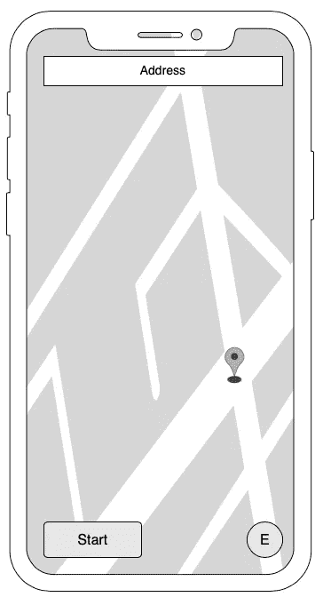

# 项目的创建

要在 Xcode 11 中建立项目时不使用故事板，我们必须在创建项目后执行一些步骤:

*   删除文件`Main.storyboard`。
*   在 General 选项卡(TARGETS)中，我们转到主界面选择器并删除“Main”，将该字段留空。

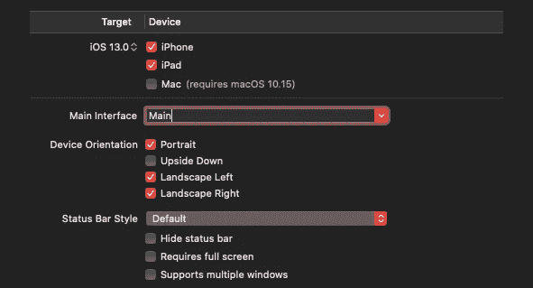

*   最后，在信息选项卡(目标)中，我们转到应用场景清单>场景配置>应用会话角色>项目 0(默认配置)并删除故事板名称字段。

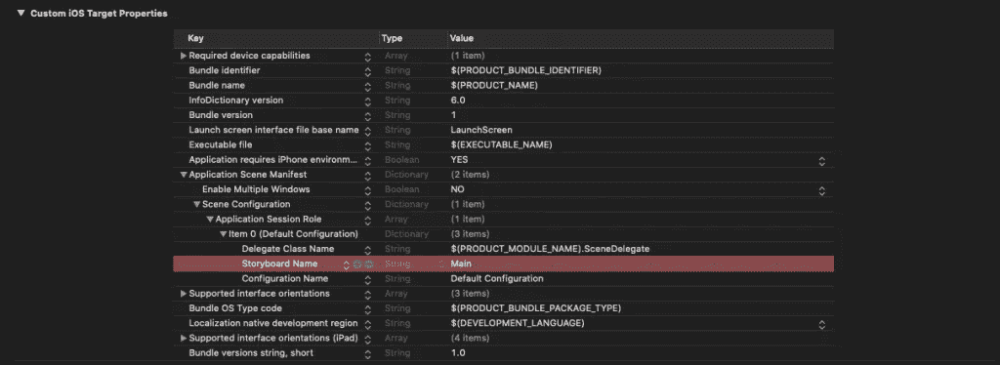

由于我们不再调用`Main.storyboard`来启动项目，我们转到`SceneDelegate.swift`文件，在函数`scene(_ scene: UIScene, willConnectTo session: UISceneSession, options connectionOptions: UIScene.ConnectionOptions)`中，用下面的代码替换它的内容:

# 向我们的应用程序添加地图

要将地图添加到屏幕上，只需创建一个`MKMapView` 实例并将其添加到屏幕视图中。为此，在`ViewController`类中，首先我们必须导入`MapKit`库，然后我们创建一个`MKMapView`的实例并呈现它:

如果我们运行该应用程序，我们将能够在屏幕上看到我们所在位置的大致地图。

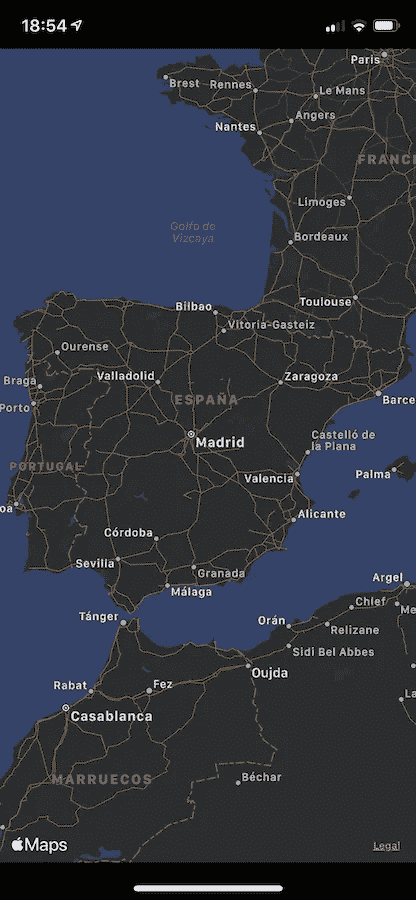

为了让这张地图向我们显示一个准确的位置，我们必须使用`[CLLocationManager](https://developer.apple.com/documentation/corelocation/cllocationmanager)`类，正如 Apple 所指出的，它允许我们开始和结束向我们的应用程序发送位置事件:

*   检测用户位置的变化
*   查看指南针方向的变化
*   监控感兴趣的区域
*   检测附近信标的位置

# 许可

请记住，要使用定位功能，我们必须首先征求用户的许可。为此，我们在`Info.plist`文件中添加了一系列参数(正如我也向[显示的使用通知](https://www.raulferrergarcia.com/en/how-to-test-push-notifications-in-xcode-11-4-simulator/)):

*   隐私—位置总是和使用时使用说明
*   隐私—位置总是用法描述
*   隐私—使用时的位置使用说明

我们将向用户显示的请求许可的消息作为一个值(在这个例子中，“允许位置访问以使用这个应用”)。

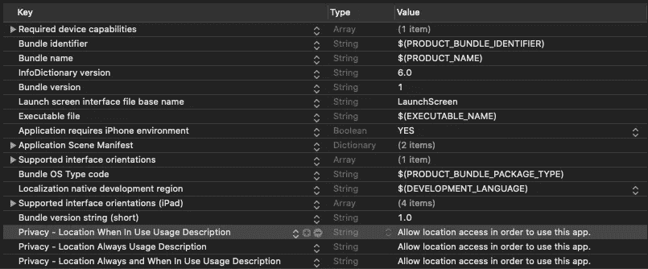

一旦修改了`Info.plist`文件，我们将首先让应用程序检查位置服务是否启用，然后检查用户是否给予了许可以及许可的类型。我们首先要做的是实例化`CLLocationManager`类:

然后，我们创建`checkLocationService`方法，在该方法中，我们将检查设备上是否启用了位置服务。如果是这样，我们将按照文档中的指示为此类设置委托，并指出我们希望位置工作的精度:

我们将从`viewDidLoad`方法中调用这个函数。在我们设置委托的同时，我们采用这个委托的几个方法，这些方法将允许我们知道用户给出的使用位置的许可是否改变(`[locationManager (: didChangeAuthorization:](https://developer.apple.com/documentation/corelocation/cllocationmanagerdelegate/1423701-locationmanager))` ) ，以及用户的位置何时改变( `[locationManager (: didUpdateLocations:](https://developer.apple.com/documentation/corelocation/cllocationmanagerdelegate/1423615-locationmanager))`)。(我们在`ViewController`类的扩展中这样做是为了组织代码。)

现在我们可以通过添加方法来继续完成`ViewController`类，该方法将查看应用程序是否有使用本地化的权限，以及权限的类型。在这个方法中，我们所做的是调用`CLLocationManager`类的`authorizationStatus`方法，并检查我们得到的值:

可以看出，关于[授权使用位置](https://developer.apple.com/documentation/corelocation/cllocationmanager/1423523-authorizationstatus)有不同的可能性:

*   `authorizedWhenInUse` ***。*** 用户授权应用程序在使用中启动定位服务。
*   `authorizedAlways`**。** 用户授权应用程序随时启动定位服务。
*   `denied` ***。*** 用户拒绝使用应用程序的定位服务，或者在设置中全局禁用。
*   `notDetermined` ***。*** 用户尚未选择应用程序是否可以使用位置服务。
*   `restricted` ***。***app 未被授权使用定位服务。

这个函数，`checkAuthorizationForLocation`，我们将在两点调用:

*   在`checkLocationServices()`方法中设置委托后，进入应用程序后
*   在`locationManager(_: didChangeAuthorization:)`方法中，如果用户授权在使用应用程序时发生变化

如果我们现在运行这个应用程序，我们将会看到一个警告，询问我们是否允许使用定位服务。

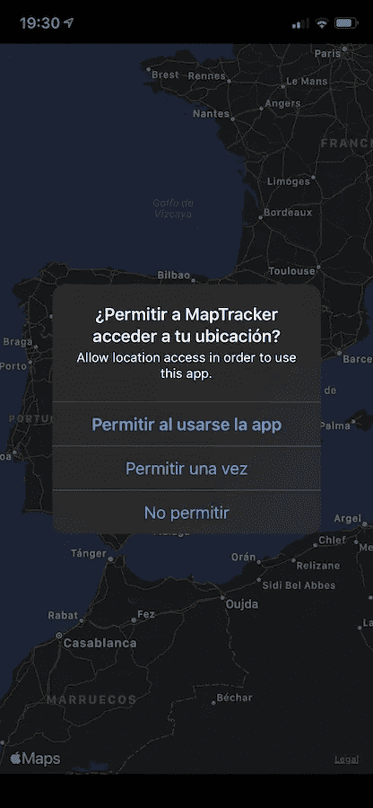

一旦我们允许应用程序使用定位服务，我们要做的就是告诉它现在可以激活设备的位置跟踪。为了在`checkAuthorizationForLocation()`方法中以及允许使用它的情况下做到这一点，我们添加了以下代码:

我们在这里做的是说`MKMapView`实例必须显示用户的位置(`mapView.showsUserLocation = true`)，将视图集中在用户上(使用我们现在将创建的方法)，并激活位置更新。

# 在地图上显示我们的位置

`centerViewOnUser()`方法的作用是确定用户的位置，并围绕这个点建立一个居中的矩形区域。为此我们使用`[MKCoordinateRegion](https://developer.apple.com/documentation/mapkit/mkcoordinateregion)`。

在这里，我们首先确定我们有用户的位置。然后我们建立一个以用户为中心的 10×10 公里的区域。最后，我们在地图上建立这个区域。这样，我们在设备上获得了以下图像。

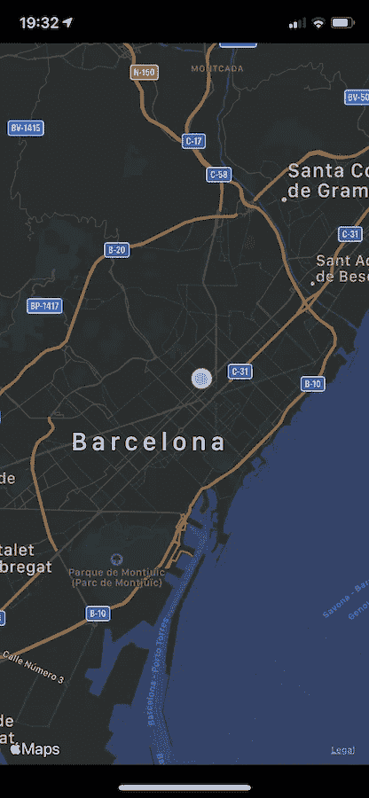

最后，为了更新用户在地图上的位置，在方法`locationManager(_: didUpdateLocations:)`中，我们做了一些类似于我们所做的事情来将视图聚焦在用户身上:

但是在这种情况下，位置是从方法返回的位置列表中的最后一个值获得的。

打开应用程序时，我们默认看到的地图是标准地图。MapKit 允许通过更改`MKMapView`实例的`[mapType](https://developer.apple.com/documentation/mapkit/mkmaptype)`参数值来显示不同类型的地图:

*   `standard`。显示所有道路位置和一些道路名称的街道地图
*   `satellite`。该地区的卫星图像
*   `hybrid`。带有道路信息及其名称的区域的卫星图像(在地图上方的图层中)
*   `satelliteFlyover`。该地区的卫星图像和该地区的数据(如果有的话)
*   `hybridFlyover`。来自该地区的数据的混合卫星图像(如果有的话)
*   `muteStandard`。地图详细信息中突出显示我们的数据的街道地图

在这种情况下，我们将只使用三种类型的地图:`standard`、`satellite`和`hybrid`。

我们希望在应用程序中显示的地图类型的选择将通过一个带有下拉菜单的按钮来完成，该按钮可以作为一个 Swift 包( [FABButton](https://www.raulferrergarcia.com/en/create-a-fab-button-with-swift/) )来下载。为此，我们遵循以下步骤:

*   从 Xcode File > Swift Package > Add Package dependency…菜单，我们添加 FABButton 组件。网址是:[https://github.com/raulferrerdev/FABButton.git](https://github.com/raulferrerdev/FABButton.git)
*   接下来，我们创建按钮及其配置的实例(所使用的图标已经包含在[项目](https://github.com/raulferrerdev/MapKitTracker)中):

*   正如你所看到的，我们已经为`FABView`类型设置了委托，所以我们必须让`ViewController`类符合这个协议。为此，我们在项目中添加了以下扩展:

最后，在`layoutUI`方法中，我们将按钮添加到视图中并指示其位置:

如果我们运行该应用程序，我们可以看到我们可以更改地图的类型:

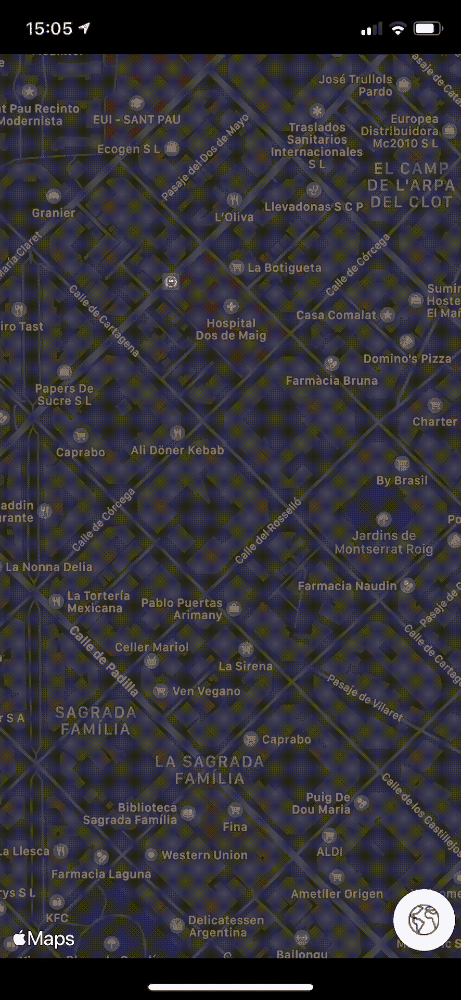

# 显示方向

现在我们要做的是在屏幕上显示地图上一个点(中心)的坐标地址，这将使用`[CLLocation](https://developer.apple.com/documentation/corelocation/cllocation)`类获得。为此，我们创建了一个`getCenterLocation`函数，并将我们拥有的`MKMapView`的实例传递给它。它将返回中心点的坐标:

为了确切地知道地图的中心是什么，我们将在地图的中心放置一个图标。我们将使用一个`UIImageView`元素和一个大头针的图像(我们将从苹果的 [SF Symbols](https://www.raulferrergarcia.com/en/use-the-new-apple-sf-symbols-in-your-applications/) 库中获得)来实现这一点。

为了使大头针的底部正好位于地图的中心，我们将该图标向上移动其高度的一半(-14.5px)。

此外，为了显示地址，我们将在屏幕顶部放置一个标签，如设计所示。为此，我们创建了一个`UILabel`实例，对其进行配置，并将其放在屏幕上:

# 获取地址

为了从坐标中获取一个地方的地址，我们将使用`[CLGeocoder](https://developer.apple.com/documentation/corelocation/clgeocoder)`类，如 Apple 文档所示，它允许我们从一个点的经度和纬度中获取该位置的用户友好的表示:

> “`CLGeododer`类提供了坐标(指定为纬度和经度)和该坐标的用户友好表示之间的转换服务。用户友好的坐标表示通常包含与给定位置相对应的街道、城市、州和国家信息，但也可能包含相关的兴趣点、地标或其他识别信息。”
> 
> 苹果文档(`*CLGeocoder*`)

为了知道地图中心点的坐标，我们将实现`MKMapView`委托和每次移动地图时它收集的方法。

在此方法中，我们执行以下操作:

*   首先，我们得到地图中心的坐标(感谢`getCenterLocation` 函数，我们之前已经看到了)。
*   下一步是知道是否有先前的位置(`previousLocation`，我们在开始时已经实例化了)，在这种情况下，检查到新位置的距离差是否更大，在这种情况下，25 米。如果满足这些条件，新坐标的值被分配给`previousLocation`变量。
*   接下来，我们取一个`CLGeocoder`函数的实例并调用`reverseGeocodeLocation`方法，我们将屏幕中心的坐标传递给它。
*   该函数返回一个带有两个参数的[块:](https://developer.apple.com/documentation/corelocation/clgeocodecompletionhandler)

*   在这两个值中，我们检查没有错误发生并且它返回了一个位置。`CLPlacemark`对象存储关于特定纬度和经度的数据(例如国家、州、城市和街道地址、poi 和地理相关数据)。
*   从这些信息中，我们对两个参数感兴趣:`thoroughfare`(与指定位置相关联的街道地址)和`subThoroughfare`(给出关于该地址的附加信息)。
*   最后，在主线程中，我们将这些信息添加到标签中。

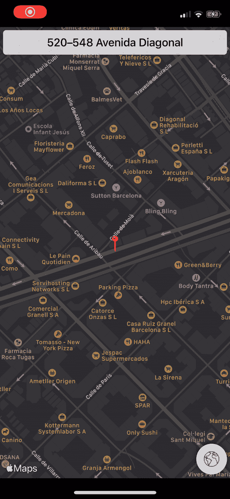

# 设置路线

现在我们在这个项目中剩下要做的就是实现一个路由系统。也就是说，从一个起点和另一个终点开始，建立路径的最佳路线。

多亏了 MapKit，我们可以用简单的方式做到这一点。在这种情况下，我们将使用`[MKDirections.Request](https://developer.apple.com/documentation/mapkit/mkdirections/request)`类，它允许我们建立一个请求，在这个请求中，我们指出起点、目的地、运输类型，以及我们是否希望显示替代路线。

*   `var source: MKMapItem?`。这是路线的起点。
*   `var destination: MKMapItem?`。它是路线的终点。
*   `var transportType: MKDirectionsTransportType`。这是适用于计算路线的运输类型。它可以是汽车，步行，交通，或任何其他。
*   `var requestsAlternateRoutes: Bool`。表示如果有替代路线，我们是否需要这些路线。
*   `var departureDate: Date?`。这是旅行的出发日期。
*   `var arrivalDate: Date?`。这是旅行的到达日期。

我们所做的是创建一个返回类型为`MKDirections.Request`的对象的方法:

在这种方法中，我们首先获得屏幕中心点的坐标。然后我们用原点(我们所在的点)和目标坐标创建`MKPlacemark`类型的对象。最后，我们创建了一个类型为`MKDirections.Request`的实例，指明了出发地、目的地、运输工具(汽车)的类型，以及我们想要的替代路线。

为了绘制路线，我们需要做的是用我们创建的请求启动一个 top `MKDirections`对象。如[苹果文档](https://developer.apple.com/documentation/mapkit/mkdirections)所示，该对象根据您提供的路线信息计算方向和旅行时间信息。

因此，我们将创建一个方法，从请求的创建中获取一个类型为`MKDirections`的对象，并表示路由:

在这个方法中，一旦获得了`MKDirections`对象，我们就使用方法`calculate(completionHandler: MKDirections.DirectionsHandler)`，它返回一个类型为`MKDirections.Response`的对象和一个可能的错误:

然后，我们检查答案是否有效，并接受 routes 参数，这是一个由`MKRoute`类型对象组成的数组，表示起点和终点之间的路线。

如果我们看一下[苹果文档](https://developer.apple.com/documentation/mapkit/mkroute),`MKRoute`对象提供了一个名为`polyline`的参数，其中包含了路线图。为了表示这个图，我们所做的是将这个参数传递给`MKMapView`对象的`addOverlay(_ overlay: MKOverlay)`方法。然后我们使用方法`setVisibleMapRect(_ mapRect: MKMapRect, animated animate: Bool)`改变地图的可见部分。

此外，我们必须添加一个`MKMapViewDelegate`协议的方法，以便绘制路由(用绿色和 5px 线宽绘制):

现在我们需要的是添加一个按钮，允许我们开始计算路线。从我们在开始展示的界面设计中，我们添加并配置了一个`UIButton`元素，我们将把`drawRoutes()`方法作为目标添加到该元素中:

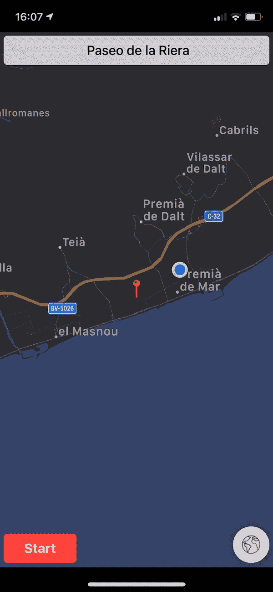

最终的路线图像:

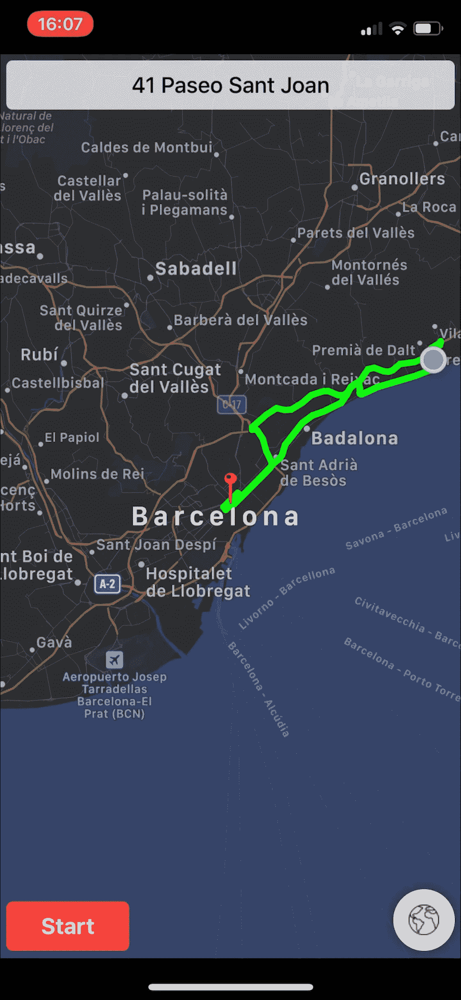

# 结论

Apple MapKit 库允许您轻松开发一个应用程序来显示地图，显示我们在地图上的位置，从地图上的一个选定点向我们显示方向，并显示到达该地址的路线。