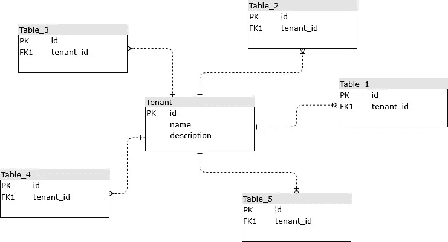
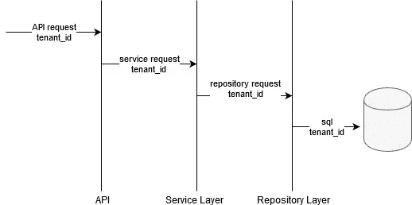
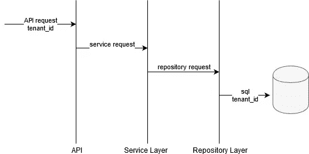

# 如何使用 Spring Boot 和 Hibernate 构建多租户应用程序

> 原文：<https://betterprogramming.pub/how-to-build-a-multi-tenant-application-using-spring-boot-and-hibernate-718e16bfd456>

## 构建一个应用程序，其中一个实例服务于多个租户或用户

在 [Unsplash](https://unsplash.com?utm_source=medium&utm_medium=referral) 上由 [Helloquence](https://unsplash.com/@helloquence?utm_source=medium&utm_medium=referral) 拍摄的照片

在本教程中，我们将学习如何使用 Spring Boot 和 Hibernate 构建一个多租户应用程序。我们将展示如何构建一个多租户应用程序，其中租户使用共享数据库和共享模式。

这个故事是一次成功尝试的结果，在对现有应用程序做尽可能少的更改的情况下，将一个普通应用程序转变为一个多租户应用程序。这个故事受下面的 [**教程**](https://medium.com/swlh/multi-tenancy-implementation-using-spring-boot-hibernate-6a8e3ecb251a) 的影响，旨在改进其提出的指定实现。我们将在拦截器方法中使用注释，而不是使用 HandlerInterceptorAdapter 并将自己局限于 HTTP 访问。这样我们就不会只局限于 HTTP 访问。

**缺点**中提出的 [***条***](https://medium.com/swlh/multi-tenancy-implementation-using-spring-boot-hibernate-6a8e3ecb251a) 的解决方案为共享数据库，共享模式方式:

*   该解决方案仅适用于 REST APIs。如果你在听一个卡夫卡的话题，或者在阅读 RabbitMQ 上的信息，这是行不通的。
*   使用 Hibernate 拦截器的共享数据库共享模式的解决方案太复杂了。我无法让它在现有的应用程序上工作。

**建议的解决方案:**

*   适用于所有界面。公开的 API 可以是 REST API、SOAP API、Kafka listener、Queue consumer 或者其他。
*   我们将采用一种更简单的方法，而不必使用 Hibernate Interceptor。

*故事伴随着一个正在工作的* [***项目***](https://github.com/ivlahek/multitenant-showcase)**在*[***GitHub***](https://github.com/ivlahek/multitenant-showcase)*上主持。**

# *多租户应用*

*多租户应用程序是指单个实例服务于多个租户的应用程序。当我们说租户时，最常见的是我们的应用程序所服务的多个公司或组织。*

*有三种方法可以构建多租户应用程序:*

*   *每个租户的数据库—每个租户都有自己的数据库。*
*   *共享数据库，独立模式—所有租户都使用同一个数据库，但是每个租户都有自己的模式。*
*   *共享数据库、共享模式—所有租户都使用相同的模式。数据库中的每个表都有一个名为 tenant_id 的鉴别器列，用于指定数据的所有者。*

# *数据库设计*

**

*用于共享数据库共享模式方法的数据库设计*

*设计多租户应用程序的最大挑战是确保租户可以访问他的数据，并且只能访问他的数据。设计这样一个应用程序的第一步是设计一个数据库。当用共享数据库为多租户应用程序设计数据库模式时，共享模式非常简单。您创建了一个表租户。向所有表添加一个列 tenant_id，向表 tenant 添加外键，就这样。您设计了一个多租户数据库。*

# *应用程序设计——一种幼稚的方法*

**

*最简单的方法—在整个应用程序中提取租户 id*

*但是在处理应用程序设计时，就比较棘手了。处理这种问题的最简单的方法是，整个应用程序知道它正在为多个租户服务。在这种方法中，您通过应用程序的所有层传递租户 id 或租户对象:*

*   *端口和适配器(API)——在这一层，我们识别我们当前服务的租户；*
*   *服务层——在这一层，我们只是将这些信息传递给存储库层；*
*   *存储库层—在这一层，我们需要说明我们正在为哪个租户访问数据库。*

*提议的幼稚方法并不好。所有层都知道租户。更糟糕的是，服务层只是将信息传递给存储库层。它不会处理这些信息。它只是传送到存储库层。*

# *应用设计——一种先进的方法*

**

*高级方法—提取第一层的租户 id，并对除数据库层之外的其他层隐藏。*

*在高级方法中，我们将使用 Hibernate 和 Spring 提供的好东西来创建一个应用程序设计，在这个设计中，只有端口和适配器知道我们在为多个租户服务。其他层不会意识到应用程序正在为多个租户服务。*

*我们将使用以下技术:*

*   ***Spring AOP***—我们要定义两个拦截器:一个拦截外部请求，一个拦截对存储库层的请求；**
*   ****Java 注释**—我们将定义两个注释:一个用于标记外部请求，一个用于标记方法签名中的租户 id；**
*   ****Hibernate 注释** @PrePersist 和@PreUpdate，用于将实体持久化到正确的租户；**
*   ****Hibernate filters** 确保我们只访问租户的数据。**

# **端口和适配器(公开的 API)**

**在这一层，我们需要确定我们当前服务的是哪个租户。为此，我们将创建以下注释:**

*   **@InboundRequest —通过这个注释，我们将对公开的方法进行注释。**
*   **@TenantId —通过这个注释，我们将在公开的方法中将参数注释为租户 Id。**

**例如，假设我们有一个 REST API 方法，定义为:**

**我们将添加前面提到的注释:**

**我们将创建一个方面来拦截对公开的 API 的方法的调用。**

**就是这样。在第一层，我们已经确定了租户，并将其放在其他层可以使用的地方。服务层呢？**

# **服务层**

**我们的服务层不会意识到它正在服务多个租户。服务层将在不指定租户的情况下查询并保存数据库中的数据。**

# **存储库层—获取和保存数据**

**在存储库层，我们有两件事要做:**

*   **在获取数据时，我们必须确保获取的是租户的数据；**
*   **保存数据时，我们必须确保将数据保存到正确的租户。**

## **获取数据**

**我们将使用休眠过滤器。我们将使用@Filter 和@FilterDef 注释在所有实体类上定义一个过滤器。使用这些过滤器，我们将添加条件来检查实体是否属于发出请求的租户。对于 MobileApplication 类，它看起来像:**

**同样，我们将使用 Spring AOP 来拦截对存储库的所有调用。在这个拦截器中，我们将对应用程序中定义的所有实体应用 tenant_id 过滤器。这个过滤器将在每次数据库调用之前应用:**

**JpaRepository 有一个问题。使用 *JpaRepository* 接口的 *findById* 方法时，不应用 hibernate 过滤器(*https://stack overflow . com/questions/45169783/hibernate-filter-is-not-applied-for-findone-crud-operation*)。我们将通过如下方式创建一个自定义存储库并创建应该用来代替 *findById* 方法的 *getById* 来绕过这个问题:**

**我们将使用 *CustomRepository* 而不是 *JPARepository* 来确保 hibernate 过滤器应用于我们所有的数据库查询。**

**涵盖了数据查询。在每次存储库调用数据库时，我们将自动应用上述过滤器。当查询数据库时，服务层不会意识到它正在添加这些条件。**

# **持久化数据**

**我们将使用 [@PrePersist](http://twitter.com/PrePersist) 和 [@PreUpdate](http://twitter.com/PreUpdate) 将实体持久化到正确的租户。对于每个已定义的实体类，我们将定义 *prePersist()* 方法。对于 MobileApplication 类，它看起来像:**

**Hibernate 会在将实体持久化到数据库之前调用这个方法。使用这种方法，您不需要在代码中显式设置租户。这个方法将从我们在应用程序入口填充的租户上下文中获取租户，并为实体设置它。同样，服务层永远不会显式填充租户字段。这将由 Hibernate 在事务提交之前完成。**

# **包扎**

****

# ****建议设计的优点:****

*   **数据库层设置一次，除非应用程序中添加了新表，否则不会更改。**
*   **在公开一个 API 时，需要用 [@InboundRequest](http://twitter.com/InboundRequest) 和 [@TenantId](http://twitter.com/TenantId) 对公开的方法进行注释。通过使用注释方法，您不会受限于 HTTP 访问的方法。**
*   **代码是干净的。只有第一层知道租户的情况。其他层不知道它们正在为多个租户服务。**

## ****建议设计的缺点:****

*   **缺点是您需要注释应用程序的每一个访问点，这样它才能工作。**

**这个被提议的设计简单得足以让人满意。主要优点是只有 API 层(或端口和适配器)知道 tenant_id。其他层正在工作，因为它们只为一个租户服务。代码非常简单。这是它的主要优势:代码简洁明了。**

**故事受以下 [**教程**](https://medium.com/swlh/multi-tenancy-implementation-using-spring-boot-hibernate-6a8e3ecb251a) 影响，旨在完善。**

**这个故事伴随着一个正在工作的 [**项目**](https://github.com/ivlahek/multitenant-showcase) 在 [**GitHub**](https://github.com/ivlahek/multitenant-showcase) 上主持。**