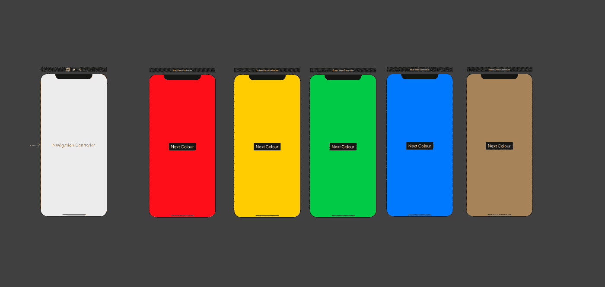
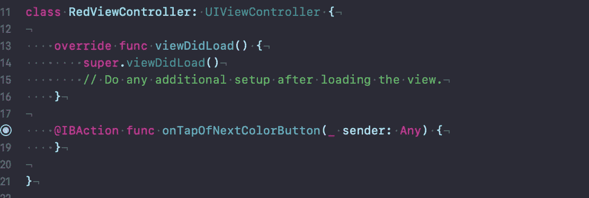
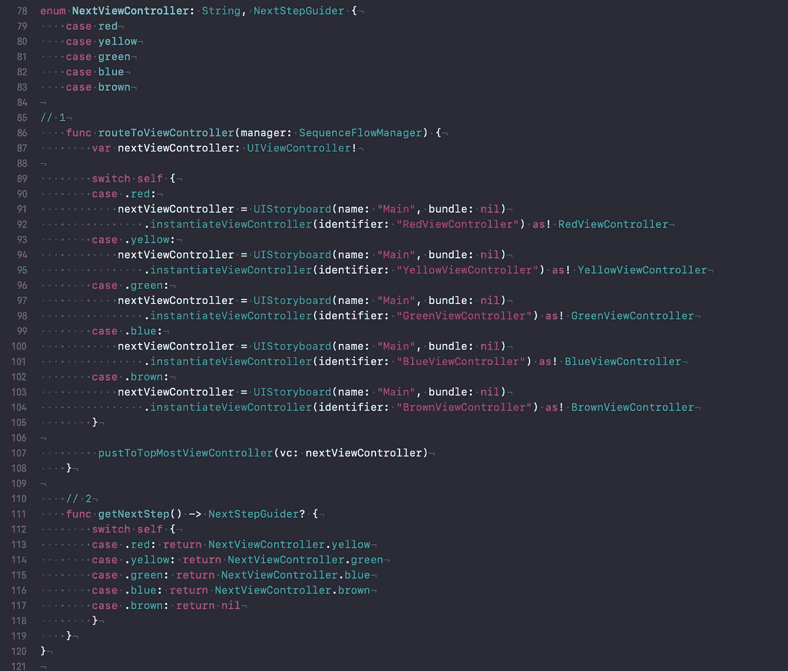
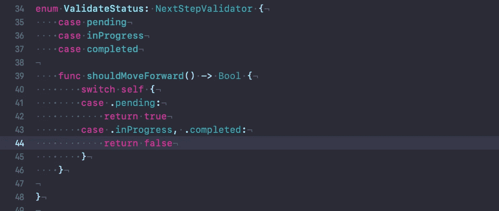
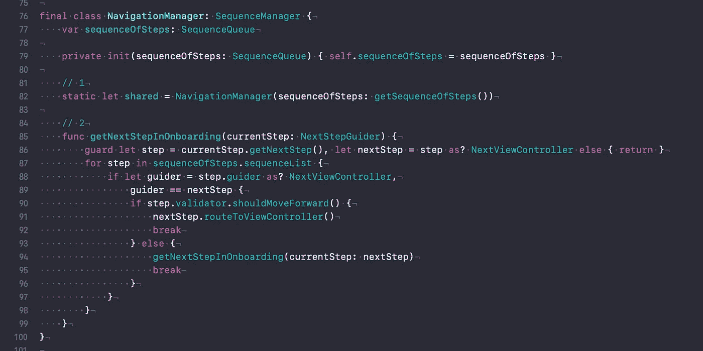
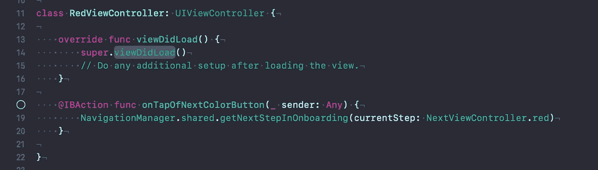
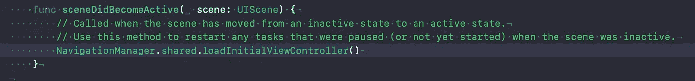
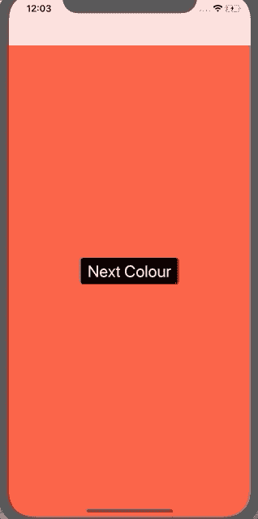
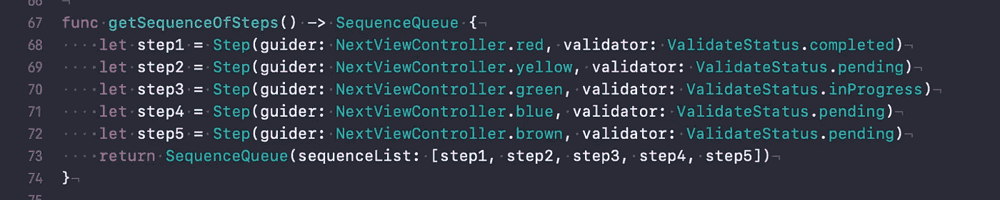
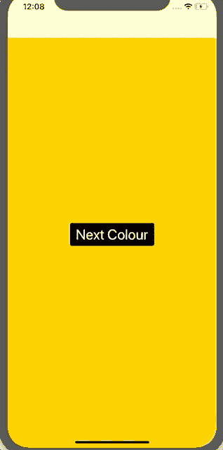

# 如何在 Swift 中构建导航器以转到您想要的任何页面

> 原文：<https://betterprogramming.pub/how-to-build-a-navigator-to-go-to-any-page-you-want-in-swift-ae14ef6ba4ee>

## 根据服务器数据或序列导航到不同的视图控制器


照片由[妮可·威尔科克斯](https://unsplash.com/@nicolerwilcox?utm_source=medium&utm_medium=referral)在 [Unsplash](https://unsplash.com?utm_source=medium&utm_medium=referral) 拍摄

# 概观

让我们试着构建一个导航管理器，它将帮助我们导航到任何一个视图控制器，其中所呈现的视图控制器没有下一步的具体实现。

这种类型的方法可用于新用户的入职流程或表单填写，用户必须完成一系列步骤。

此外，这种方法是面向未来的。如果您的流程发生变化或者产品需求发生变化，您只需要做一些改变就可以让它正常工作。

# 先决条件

Swift 的基础知识以及对`protocols`和`enums`的良好理解。

# 开始

从[这里](https://github.com/arjunbaru/AnyPageNavigation)下载启动项目。

让我们来探索一下起始项目。打开`Main.storyboard`。



图片来源:作者

我们有五个不同颜色的视图控制器和一个标题为“下一种颜色”的按钮。通过点击视图控制器中的按钮，我们应该推出一个新的视图控制器。

图案是未定义的，这意味着步骤中的下一种颜色将由第三方定义(就像我们从服务器接收完成特定流程的步骤一样)。

打开`AllColourViewController.swift`文件:



就像`RedViewController`一样，每一种颜色都有一个类，并有一个动作按钮。

让我们为顺序导航构建一个健壮且可伸缩的导航器。

# 让我们建造

从添加一个文件`CustomNavigator.swift`开始。

让我们来研究几个概念，它们将是这个实现的支柱。添加以下代码:

```
struct Step {let guider: NextStepGuider
let validator: NextStepValidator}
```

`**Step**`

`Step`是有两个属性的东西，`NextStepGuider`和`NextStepValidator`。`Step`有关于流程中当前步骤的信息，它验证是否执行它。

可以把它看作类似链表的东西，它包含下一个节点的地址和一个数据/值。

**导向器**

一个引导者应该是能给我们下一步指引的东西。此外，它应该能够路由到当前所选步骤的视图控制器。

```
protocol NextStepGuider {func routeToViewController()
func getNextStep() -> NextStepGuider?}
```

在我们的例子中，我使用 enum 作为向导。让我们理解下面的代码:



`//1`我们可以`switch`到 enum 来引导到特定的视图控制器。

`//2`该函数知道流程中的下一步，并将返回类型`NextStepGuider`(本身)，这样下一页应该能够通过调用`routeToViewController`函数来加载视图控制器。

这类似于链表，其中节点包含下一个节点的地址。

此外，我使用一个助手函数`pustToTopMostViewController`来获取`UINavigationController`并将`ViewController`推送到那个堆栈。

**验证器** `**NextStepValidator**`

```
public protocol NextStepValidator {
func shouldMoveForward() -> Bool
}
```

这将有助于我们基于一些验证来验证是否继续该步骤。考虑一个场景，如果该步骤的状态是`Pending`，那么您将只进入该页面。如果状态为`in Progress` / `Completed`，我们将看不到该页面。

我们的验证器看起来像这样:



太好了，现在我们有了向导和验证者。我们的下一站:一位经理。

# 序列管理器

```
protocol SequenceManager {
var sequenceOfSteps: SequenceQueue { get set }
func loadInitialViewController()
func getNextStepInOnboarding(currentStep: NextStepGuider)
}
```

序列管理器应该能够控制视图控制器请求。序列管理器将与视图控制器通信。

经理将通过`sequenceOfSteps`接受特定流程的所有步骤。让我们看看`SequenceQueue`应该是什么样子。

```
struct SequenceQueue {let sequenceList: [Step]func checkForNextStep() -> Step? {for step in sequenceList {
  if step.validator.shouldMoveForward() {
     return step
     }
   }return nil
  }
}
```

我们有函数`checkForNextStep`，它负责验证并返回要导航到的步骤。

让我们扩展`SequenceManager`并添加一个默认行为。

```
extension SequenceManager {func loadInitialViewController() {
  sequenceOfSteps.checkForNextStep()?.guider.routeToViewController()
 }}
```

在`loadInitialViewController`函数中，我们想要遍历每个步骤，检查并验证是否导航到该步骤，然后最终路由到它的视图控制器。

`func getNextStepInOnboarding`将是视图控制器调用的函数。该功能将让我们的经理知道我们目前处于哪一步，然后导航到下一步。该功能将根据不同的经理有明确的实现。

# 让我们创建一个流管理器类

让我们创建单例类`NavigationManager`。



`//1`我们通过将类标记为`final`，将其初始化为`private`，并使用`static`属性来访问整个生命周期中可用的单个实例，从而创建了一个 singleton。

`//2`这里我们正在和我们一起迭代`sequenceList`，并用视图控制器提供的向导来验证它。

如果引导符与列表中的匹配，通过调用`shouldMoveForward`检查有效性，然后路由到特定的视图控制器。

如果验证失败，递归地获取下一步，并对新步骤执行上述步骤。

让我们在`ViewController`中连接`getNextStepInOnboarding`步骤。



我们将在按钮动作中调用我们的 singleton。`viewController`负责告知当前引导步骤。类似地，其他视图控制器也会有这个实现。

让我们创建一个序列列表。

添加这个全局函数`getSequenceOfSteps`:

到目前为止，所有功能的状态都是待定的，因此应该显示所有视图。

在我们运行之前，我们必须在`sceneDelegate` (iOS 13)/ `AppDelegate` (较低版本)中增加一个步骤。



这将帮助我们得到我们的第一个/初始视图控制器。

我们来建吧！



太好了，让我们试着修改一下步骤。



现在步骤`1`和步骤`3`分别完成并正在进行中。我们应该只导航到步骤`2`、`4`和`5`(即黄色、蓝色和棕色)。)

我们来测试一下。



厉害！我们做了一个任意视角控制器路由器。如果需求发生变化，我们唯一要做的改变就是在管理器中。此外，视图控制器之间是松散耦合的。

这个导航器是在牢记步骤不会改变的情况下构建的。如果步骤流改变，我们必须以同样的方式改变我们的`NextStepGuider`。

# **另见:**

[](https://medium.com/better-programming/when-to-use-strong-references-over-weak-references-in-swift-6238bf8e58bf) [## 在 Swift 中何时使用强引用而非弱引用

### 让我们避免过度使用弱引用

medium.com](https://medium.com/better-programming/when-to-use-strong-references-over-weak-references-in-swift-6238bf8e58bf) [](https://medium.com/better-programming/building-a-custom-transitioning-for-viewcontroller-in-ios-13-cbf9b4de3d9b) [## 在 iOS 13+中为 ViewController 构建自定义过渡

### 让我们在应用程序中构建自定义过渡

medium.com](https://medium.com/better-programming/building-a-custom-transitioning-for-viewcontroller-in-ios-13-cbf9b4de3d9b)