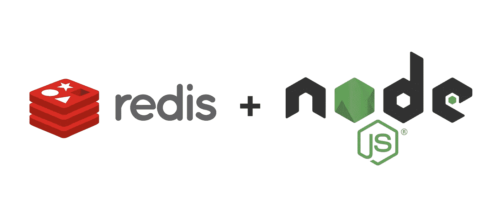

# 如何用 Redis 构建 Node.js API 缓存

> 原文：<https://betterprogramming.pub/how-to-build-a-node-js-api-cache-with-redis-ac0aa54dee48>

## API 调用是必不可少的，但也很昂贵。对于 Redis 和 Node，我们可以通过构建 API 缓存来优化它们



作者照片。

# 什么是 API 缓存，我们为什么要使用它？

我想大家应该已经知道什么是缓存了。它(主要)临时存储在不久的将来会再次需要的数据(例如，为了节省计算能力或网络使用)。

API 是一个应用程序编程接口，可以向其发送请求以获取数据。

那么我们如何将这两种技术结合起来使用呢？

让我们直接参考我们自己将要实现的例子:在我们的 web 应用程序中，用户输入数据，然后数据被发送到我们的服务器。在我们的服务器上，我们自己不处理发送的数据(一个数字)。我们只评估它。

因此，我们的服务器将从客户端接收到的数据发送到一个 API，在我们的代码示例中，该 API 执行一个计算(将值加倍)，然后将结果发送回我们的服务器。当然，服务器会将结果返回给用户。

到目前为止，没有问题，对不对？但是如果几个用户在很短的时间内发送同一个号码呢？由于我们的 API 只将数字乘以 2，这意味着如果同一个数字被传输几次，将会一次又一次地返回相同的结果——只是一次又一次地需要请求。

这就成了一个问题，因为它耗费了不必要的容量。API 通常不能免费使用，你需要为大量的请求付费。

此外，API 请求需要一定的时间，这取决于位置和容量，这对用户体验是不利的。

这就是 Redis 的用武之地。Redis 是一个非常非常快速的内存中数据结构存储，因此它非常适合小型和不复杂数据的易失性存储以及非常快速的检索。

如果想了解 Node.js 中 Redis 的更多信息，可以阅读我以前的一篇文章:

[](https://medium.com/javascript-in-plain-english/getting-started-with-redis-and-how-to-use-it-in-node-js-8d4f1a3f7369) [## Node.js & Redis。高性能缓存

### 该指南面向所有希望开始使用 Redis 或希望能够在 Node.js 中使用它的人

medium.com](https://medium.com/javascript-in-plain-english/getting-started-with-redis-and-how-to-use-it-in-node-js-8d4f1a3f7369) 

# 这是我们的做法

1.  客户端向我们的服务器发送一个号码。
2.  如果客户机发送给我们服务器的数字已经作为一个键存储在我们的缓存中(原则上类似于一个 ID，因为每个结果只能有一个原始数字)，那么使用这个键，我们加载最初由 API 生成的结果，并将结果直接发送给客户机——没有任何不必要的 API 请求。
3.  如果来自客户端的数字还没有作为一个键存储在我们的缓存中，我们就在请求中将它发送给 API。
4.  在这种情况下，客户端直接从 API 接收结果，但是我们也将密钥(来自用户的数字)和来自 API 的结果存储在缓存中。

这样，我们避免了不必要的 API 请求。如果一个值还没有被缓存，那么任何事情都有第一次。第二次，可以从缓存中读取。

为了证明这一点——因为在现实世界的例子中应该是这样——我们设置了一个缓存条目，在 60 秒后自动删除。在现实世界的项目中，我们应该这样做，以便从长远来看始终保证 API 的新鲜结果。

# 让我们实际一点

## 在你的机器上安装 Redis

Linux:

*   [https://redis.io/topics/quickstart](https://redis.io/topics/quickstart)
*   sudo 服务 redis 启动或sudo 服务 redis-服务器启动

macOS:

*   安装 brew。如果您还没有安装，[https://brew.sh/](https://brew.sh/)。
*   brew 安装 redis
*   brew 服务启动 redis

窗口:

*   使用 Windows 的 Linux 子系统。然后就像在 Linux 上一样安装它。

## 检查 Redis 是否在工作

一旦您已经启动了 Redis 服务，您应该能够通过`redis-cli`与它通信。试做`redis-cli ping`而 Redis 应该用`PONG`来回答。这意味着 Redis 正在工作。

## Node.js 中的 Redis 入门

首先，我们需要在 Node.js 项目中安装 Redis:

```
npm install redis
```

然后我们可以在代码中导入它，并连接到运行在我们机器上的`Redis`实例。`createClient`的参数将是我们机器上实例的地址(这就是为什么我们使用 localhost ),端口 6379 是 Redis 的默认端口。

```
const redis = require(‘redis’)
const client = redis.createClient(‘redis://localhost:6379’)
```

## 让我们安装其余的软件包

```
npm install axios body-parser cors express redis
```

## 最后，一些代码

server.js

# 解释最重要的部分

如果我们在浏览器中调用服务器的起始页(即客户端页面)，我们通过`/`路径(代码中的第 13 行)来完成。在此之上，我们得到一个表单，我们可以在其中输入一个数字，当提交时该数字被发送到服务器。

该号码作为 POST 请求发送到服务器，由于`body-parser`，服务器可以从第 72 行开始处理它。

使用 Redis 的`client.exists`函数，我们可以检查一个键(作为第一个参数(`number`)是否存储了相应的值。Redis 查询的结果作为`result`变量返回，或者是`true`或者是`false`。

如果客户端已经为我们的号码(`result = true`)存储了一个结果，我们调用`getResultFromCache`函数。如果没有，我们调用`getResultFromAPI`来查询 API。

`getResultFromCache`执行 Redis 的`client.get`函数，从一个键中读取相应的存储值。现在我们为客户端执行一个到结果页面的重定向，在这里我们将结果和提示作为`URL`参数传递，提示它是从缓存中读取的。

然而，如果我们检查数字及其结果是否已经被缓存，结果是`false`，我们运行`getResultFromAPI`并执行一个 API 请求。然后，我们向客户端提供 API 请求的结果，并使用`client.set`将密钥和 API 相乘的结果存储在 Redis 缓存中。
通过`client.expire`，我们还设置了 60 秒后自动删除条目。

在结果页面的第 86 行，如果生成了客户端，这里我们只给出从 API 缓存的两个主要函数传递的`URL`参数。出于验证目的，我们通过结果计算回原始值。

## 没那么壮观:我们的 API 服务器

# 让整个系统正常工作，并对其进行基准测试

基本上，我们的整个项目只包括`server.js`和`api.js`。你应该两者兼得。它们共享`node_modules`没有任何问题，所以在您按照上面的解释安装了依赖项之后，您可以同时运行两个服务器。在 [http://localhost:8080/](http://localhost:8080/) 可以找到起始页。

你可能已经注意到了，我用`Date.now`节省了两个主要函数的时间。此外，API 在`getResultFromAPI`中读取并从
`getResultFromCache` 中的缓存读取的过程开始。

在流程结束时，只需用成功执行后的当前时间减去存储的开始时间，就可以得到整个流程的持续时间。

为了获得最清晰、最真实的时间基准测试结果，您可以在不同的设备上运行两台服务器(例如，Raspberry Pi)。

# 结论

感谢阅读。欢迎对代码和文章本身留下反馈。因为我只有 19 岁，希望我还有很多东西要学。