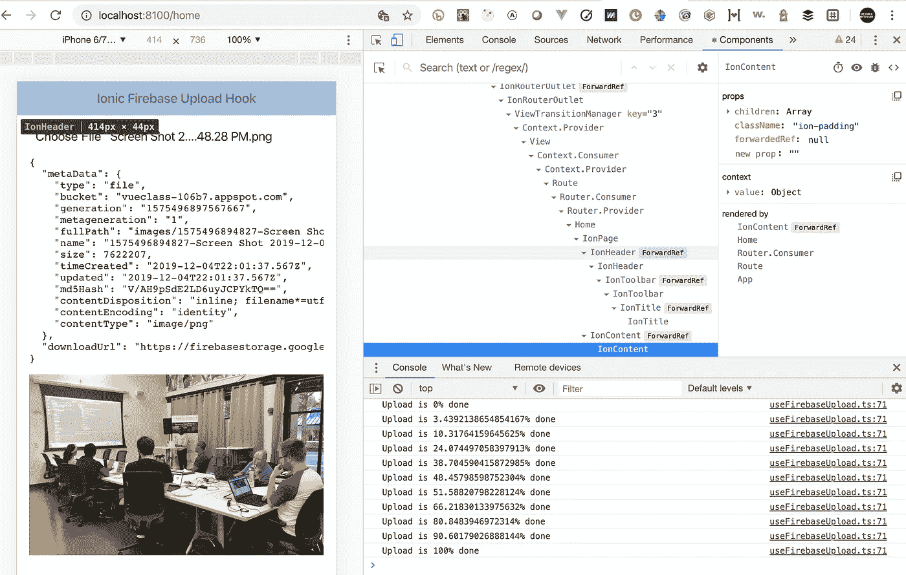

# 如何构建一个 React 钩子来上传文件到 Firebase

> 原文：<https://betterprogramming.pub/how-to-build-a-react-hook-to-upload-files-to-firebase-ac1ddee5cc3a>

## 使用离子框架、React 和 Firebase 系列的第 2 部分



图片来源:作者

# 概观

这是关于[离子框架](https://ionicframework.com/)、[反应钩子](https://reactjs.org/docs/hooks-intro.html)和[火基](https://firebase.google.com/)系列文章的第二篇。

在这篇文章中，我将介绍创建一个定制钩子来上传文件到 Firebase 的过程。

因为本文的重点是定制钩子，所以我将关注与钩子相关的代码，它是如何被调用和实现的，而不是周围的代码；然而，GitHub 上提供了整个项目的完整源代码。

# 设置父组件

```
// custom hook that will upload to firebase
import useFirebaseUpload from "../hooks/useFirebaseUpload";
```

我们需要确保通过初始化自定义文件上传挂钩`useFirebaseUpload`来进行设置，如下所示:

```
// setting up the hook to upload file and track its progress
  const [
    { data, isLoading, isError, progress },
    setFileData
  ] = useFirebaseUpload();
```

接下来，在父组件中，我们希望显示生成的任何错误，并在从定制文件上传挂钩`useFirebaseUpload`上传文件时获取进度信息。以下属性都是反应式的，由自定义钩子提供:`isError`、`isLoading`、`progress`。

```
<IonContent>
  {/* get error from hook and display if necessary */}
  {isError && <div>ERROR: {isError.message}</div>}

  {/* get loading info from hook & display progress if necessary */}
  {isLoading && progress && (
    <IonProgressBar value={progress.value}></IonProgressBar>
  ) }
</IonContent>
```

父组件缺少的最后一部分是选择文件，然后调用自定义 Firebase 挂钩上的方法来上传文件。我们用下面列出的代码来处理它。

调用该函数将在钩子中设置一个属性，该属性是我们设置的`useEffects`处理程序的依赖项，它实际上触发了 Firebase 上传的开始。

```
{/* user selects a file and returns the info required for upload */}
  <input
    type="file"
    onChange={(e: any) => {
      setFileData(e.target.files[0]);
    }}
```

# 内部自定义 Firebase 文件上传挂钩

## 设置事物

我们将在组件函数开始时初始化 Firebase，并定义一个在整个组件函数中使用的存储引用。

[将 Firebase 添加到您的 JavaScript 项目中](https://firebase.google.com/docs/web/setup)

```
var firebaseConfig = {
// ADD YOUR FIREBASE CONFIGURATION
};
// Initialize Firebase
firebase.initializeApp(firebaseConfig);// the firebase reference to storage
const storageRef = firebase.storage().ref();
```

由于我们正在使用`typescript`，我们需要定义一些在钩子中使用的接口，我们从钩子函数中定义返回类型。

```
interface UploadDataResponse { 
   metaData: firebase.storage.FullMetadata, 
   downloadUrl: any 
};
interface ProgressResponse { value: number }

function FirebaseFileUploadApi(): [{
    data: UploadDataResponse | undefined,
    isLoading: boolean,
    isError: any,
    progress: ProgressResponse | null
},
    Function
] { //additional code... }
```

接下来我们开始定义钩子需要的状态变量。

```
// the data from the firebase file upload response
const [data, setData] = useState<UploadDataResponse | undefined>();

// sets properties on the file to be uploaded, this is called
// by the parent component
const [fileData, setFileData] = useState<File | null>();

// if we are loading a file or not
const [isLoading, setIsLoading] = useState<boolean>(false);

// if an error happened during the process
const [isError, setIsError] = useState<any>(false);

// used for tracking the % of upload completed
const [progress, setProgress] = useState<ProgressResponse | null>(null);
```

## useEffect 处理程序

每次渲染组件后都会调用 useEffect。有一种方法可以通过提供一个依赖项数组作为第二个参数来控制呈现。

对于我们的钩子，我们只希望它在`fileData`属性改变时被调用，这意味着用户已经选择了一个要上传的文件，并通过调用`setData`方法来表明这一点。

```
// this function will be called when the any properties in the dependency array changes
useEffect(() => {
    const uploadData = async () => {
        // initialize upload information
        setIsError(false);
        setIsLoading(true);

        setProgress({ value: 0 });

        if (!fileData) return;

        // wrap in a try catch block to update the error state
        try {
            let fName = `${(new Date()).getTime()}-${fileData.name}`

            // setting the firebase properties for the file upload
            let ref = storageRef.child("images/" + fName);
            let uploadTask = ref.put(fileData);

            // tracking the state of the upload to update the
            // application UI
            //
            // method details covered in the next section...
            uploadTask.on(
                firebase.storage.TaskEvent.STATE_CHANGED,
                _progress => { },
                _error => { },
                async () => { }
            );
        } catch (_error) {
            setIsLoading(false);
            setIsError(_error);
        }
    };

    fileData && uploadData();
}, [fileData]); 
```

# 管理 Firebase 文件上传状态更改

对上传文件`ref.put(fileData)`的调用返回一个属性，我们可以用它来监控上传的状态，包括错误、进度更新以及上传完成的时间。

我们为每一个都包含了一个处理程序，并设置了适当的状态变量，可以从钩子中访问。我们将更深入地研究完成处理程序，因为我们需要再次调用 Firebase `uploadTask.snapshot.ref.getDownloadURL()`来获取`downloadUrl`，这是在应用程序中呈现图像所需要的。

```
// tracking the state of the upload to assist in updating the
// application UI

uploadTask.on(
    firebase.storage.TaskEvent.STATE_CHANGED,
    _progress => {
        var value =
            (_progress.bytesTransferred / _progress.totalBytes);
        console.log("Upload is " + value * 100 + "% done");
        setProgress({ value });
    },
    _error => {
        setIsLoading(false);
        setIsError(_error);
    },
    async () => {
        setIsError(false);
        setIsLoading(false);

        // need to get the url to download the file
        let downloadUrl = 
               await uploadTask.snapshot.ref.getDownloadURL();

        // set the data when upload has completed
        setData({
            metaData: uploadTask.snapshot.metadata,
            downloadUrl
        });

        // reset progress
        setProgress(null);
    }
);
```

# 包扎

## 基本示例

这是一个非常基本的使用 Firebase 的文件上传组件。我已经为这个项目创建了一个单独的 GitHub repo，其中我已经排除了登录、创建帐户和其他您可能会发现的功能；我觉得保持代码简单很重要。

[完整源代码](https://github.com/aaronksaunders/simple-file-upload-hook/)

## 离子定制挂钩和电容器示例

在我包装这篇文章的时候，我看到来自 [Ionic](https://ionicframework.com/) 的团队发布了一篇关于定制钩子[的博客文章，发布了 Ionic React 钩子](https://ionicframework.com/blog/announcing-ionic-react-hooks/)。要查看与 Ionic 框架和电容器集成的 Firebase 文件上传挂钩，请查看 GitHub repo 中的这个分支。

[集成电容定制挂钩](https://github.com/aaronksaunders/simple-file-upload-hook/tree/with-camera-hook)

## React 中的完整 Firebase 挂钩示例

这是一个示例应用程序，使用 React Hooks api 和 [React Firebase Hooks](https://github.com/CSFrequency/react-firebase-hooks) 将 Firebase 与 React 应用程序集成在一起，React Firebase Hooks 是一组可重用的 [React Hooks](https://reactjs.org/docs/hooks-intro.html) 用于 [Firebase](https://firebase.google.com/docs/web/setup?authuser=0) 。这篇文章中开发的定制钩子得到了增强，以支持额外的功能。

[认证、收集、文件上传、CRUD 操作的完整示例](https://github.com/aaronksaunders/react-custom-fb-upload-hooks)