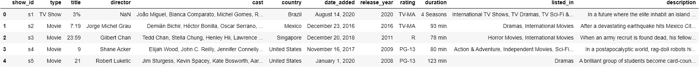
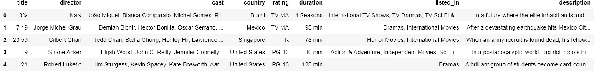
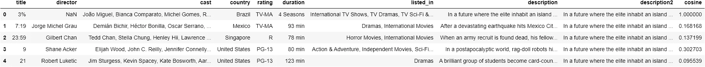
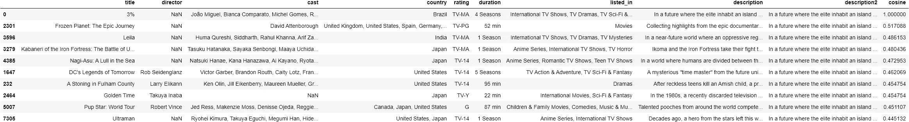

# 如何利用网飞数据构建推荐系统

> 原文：<https://betterprogramming.pub/how-to-build-a-recommender-system-using-netflix-data-562d1e04a2b9>

## 使用 Kaggle 数据集和一些 Python 库开始


莫丽·西瓦拉姆在 [Unsplash](https://unsplash.com?utm_source=medium&utm_medium=referral) 上拍摄的照片。

推荐系统被用于像网飞和 YouTube 这样的大型在线平台，根据你过去看过的内容推荐电影、节目或视频。推荐系统也常用于在线零售领域。一个常见的推荐系统统计数据是，亚马逊大约三分之一的销售额来自推荐的产品。想象一下比现在多赚 50%的钱。

如果你问我，学习如何实现推荐系统是非常值得的时间投入。

本文中描述的推荐系统将会很简单，但是会展示需要克服的基本问题，并提供一些解决方案。使用的数据是在 [Kaggle](https://www.kaggle.com/shivamb/netflix-shows) 上可获得的数据集。它由一个电影和电视节目的列表以及相应的元数据组成。

# 推荐系统的简要背景

一个基本的推荐系统应该能够基于短文本描述来识别相似的内容。从根本上说，这是一个自然语言处理(NLP)问题。它需要对自然语言进行矢量化(将文本转化为数字)，然后找到相似性得分高的向量。

做这件事有不同的方法。例如，您可以使用余弦距离来测量向量的散度，并最小化散度以找到最相似的内容。这种方法不限于识别文本片段之间的相似性。它可用于测量任何矢量化数据集的相似性。它通常用于[面部识别系统](https://www.researchgate.net/publication/220745463_Cosine_Similarity_Metric_Learning_for_Face_Verification)。

基本上，推荐系统可以根据使用的方法分为[几种不同的类型](https://www.ime.usp.br/~jstern/miscellanea/seminario/Melville1.pdf):

*   协同过滤系统
*   基于内容的过滤系统
*   混合技术

基于内容的系统只查看用户过去观看/阅读/购买的内容。这些系统提供了降低复杂性的好处，但是对于新客户来说是无效的。

协作系统查看用户的档案数据，并尝试将用户与相似用户进行匹配，以描述兴趣。这些系统可能不如基于内容的系统准确，因为它们依赖于用户的兴趣可以使用简档数据来预测的假设，但是它们对于新用户更有效。

顾名思义，混合技术试图将这两种方法结合起来，形成一个健壮的推荐系统。虽然网飞、亚马逊和 YouTube 等公司使用的实际推荐系统比我们在一个教程中构建的任何系统都要复杂得多，但我们将在下面讨论的三个步骤可以很好地介绍推荐系统领域的一些重要思想。

在我们开始之前，您需要安装以下 Python 库:

*   [熊猫](https://pandas.pydata.org/)
*   [数学](https://docs.python.org/3/library/math.html)
*   [回复](https://docs.python.org/3/library/re.html)
*   [收藏](https://docs.python.org/3/library/collections.html)

# 几个例子

## 步骤 1:初始数据探索

与任何机器学习问题一样，我们首先需要预处理数据集。让我们从导入数据开始:

```
import pandas as pddf = pd.read_csv('netflix_titles.csv')
```

我们可以使用 pandas `head()`方法来查看数据的结构:

```
df.head()
```



该数据集包含 12 列，仅限于关于网飞电影和节目的数据。没有客户数据，所以我们只能建立一个基于内容的推荐系统。

那么哪些栏目对我们有用呢？用户可能有一个喜欢的流派，所以描述栏会有所帮助。他们可能也有最喜欢的演员/导演，所以这些专栏也很有用。你可能想保留“发行年份”，因为有些人可能更喜欢更新的电影。然而，因为我们没有任何用户数据，所以我们将忽略日期。如果我们想在我们的推荐系统中包括持续时间，我们需要决定如何处理电影和电视节目，因为这两个类别的持续时间是不同的。

解决这一复杂编码问题的一种方法是将其分解成一个个递增的步骤。让我们从查看描述列开始。如果需要，我们可以在以后增加更多的复杂性。我们的第一步将是删除对我们来说很少或没有用的列。我将删除 show_id、date_added、release_year 和 type 列。

虽然删除数据不是完全必要的，但我选择删除这些列，因为它们不会被使用，这将减小数据集的大小。对于大型数据集，携带更多数据会浪费计算能力。

在 pandas 中放置列很简单:

```
df = df.drop(['show_id', 'date_added', 'release_year', 'type'], axis=1)df.head()
```



此时，我们已经将数据简化为八个特征:

```
df.isna().sum()title             0
director       2389
cast            718
country         507
rating            7
duration          0
listed_in         0
description       0
dtype: int64
```

上面显示的输出表明我们有相当多的空字段，尤其是在 director 字段中。在数值数据的情况下，这些空字段可以用平均值或中值填充，以减轻收敛问题。然而，在我们的例子中，我们有几个没有有效数据的文本字段。解决这个问题并不简单。如果缺少足够多的数据点，您可能需要删除条目或删除整个要素。

为了简化我们的讨论，让我们集中分析 description 列，因为它没有丢失信息。

## 步骤 2:非数字数据的矢量化

一旦理解了数据集，您将需要对非数字数据进行矢量化，以便进行自然语言处理。一种常见的文本矢量化方法是使用一种叫做*单词包*的技术。

这种方法忽略词序，只查看单词在一段文本中的出现情况。向量长度将是整个文本中唯一单词的数量。在我们的例子中，长度将是`DataFrame`的描述列中唯一单词的数量。为了更好地理解矢量化的过程，让我们从头开始快速构建一个矢量化工具。

首先，创建一个列表，其中每个元素都是一小段文本:

```
text_list = ["computers can not read natural language", "the natural language must be converted into numbers", "there are many different ways to do that"]
```

下面这段代码将列表中的文本标记化，将其转换为小写，并删除所有非字母的内容。然后将结果添加到一个名为`sentences`的新列表中。然后一个`for`循环遍历这个新列表，生成一个名为`vocab`的唯一单词列表:

输出表明`text_list`包含 20 个独特的单词。这将是每个向量的长度。

让我们创建一个单词字典，其中键是单词，值是从零开始的索引:

这篇[栈溢出](https://stackoverflow.com/questions/5900578/how-does-collections-defaultdict-work)的帖子解释了`collections.defaultdict`是如何工作的。

在`text_list`中传递第一个文本元素会产生以下向量:

```
vector = bag_of_words(sentences[0])
print(vector)[1 1 1 1 1 1 0 0 0 0 0 0 0 0 0 0 0 0 0 0]
```

现在你有了——你已经正式将你的句子矢量化了。以下是 BOW 方法的一些优点和缺点:

*   易于理解和使用。
*   它可以产生非常长的稀疏向量。在我们的推荐系统中，向量将包含数百个元素，其中大部分为零。
*   可能 BOW 最大的缺点是它不考虑词序。它只是在文本中寻找单词的存在。在自然语言中，词序很重要。

您可以使用的其他矢量化技术包括:

*   [word2vec](https://en.wikipedia.org/wiki/Word2vec)
*   [TFIDF](https://en.wikipedia.org/wiki/Tf%E2%80%93idf)

在下一节中，我们将使用上面的信息来构建一个基本的推荐系统。

## 第三步:建立推荐系统

我们的推荐系统将使用一个简短的电影/电视节目文本描述作为输入，并评估余弦相似性分数来挑选十部相似的电影。

在现实生活中，为了提高效率，我们会使用库来矢量化和测量相似性，但出于教育原因，我们将从头开始创建矢量器和余弦相似性代码。有时候从头开始写代码可以帮助学习过程。图书馆是伟大的，但是他们隐藏了实际发生的事情。

```
import math
import re
from collections import Counter

WORD = re.compile(r"\w+")
```

这是推荐器的工作方式:

*   熊猫将会有一个新的专栏。这一列中的每一行都是相同的。这是电影/电视节目描述。我们称之为输入描述。
*   然后，将该列与描述列逐行进行比较，以生成一个新列，其中每一行都有一个余弦相似性得分。
*   最后，`DataFrame`将在余弦列上排序(降序)并显示前十行。这些行将是与输入描述最相似的电影/电视节目。

在`DataFrame`中创建余弦列需要使用两个现有的列作为函数的输入，该函数将输出结果，这需要在`DataFrame`中的每一行上发生。通常，这意味着要写一个循环，但对熊猫来说这是不必要的。首先，我们将创建两个函数。第一个函数将生成向量，第二个函数将计算余弦相似性得分。

下一行是我们的输入描述。为了进行测试，我只使用了原始 CSV 数据文件中第一行的描述:

```
description2 = "In a future where the elite inhabit an island paradise far from the crowded slums, you get one chance to join the 3% saved from squalor."
```

下一个任务是基于输入描述创建一个新列。该列中的每一行都将是相同的值:

```
df['description2'] = description2
```

使用`.apply()`函数和 lambda 函数，我们可以将上述函数应用于数据帧中每一行的描述和说明 2 列:

```
df['cosine'] = df.apply(lambda x: get_cosine(x.description, x.description2), axis=1)
```

这在`DataFrame`中创建了一个新的余弦列:

```
df.head()
```



现在我们可以按照余弦值对`DataFrame`进行排序:

```
df_sorted = df.sort_values(by=['cosine'],ascending=False)
```

然后读十大电影:

```
df_sorted.head(10)
```



余弦值最高的是我用作输入描述的电视节目描述。当然，分数是 1。其他九行包括具有相似描述的其他电影/电视节目的标题，按相似性排序。

现在你知道了。如果你跟着做，你现在有一个工作的 NLP 推荐系统。

从这里开始，您可以尝试做一些事情来提高系统的性能。举例来说，如果我以这个教程为基础，我会在一个集合模型中使用多种相似性评分技术来提出更好的推荐。我会把这个任务作为家庭作业留给你。

# 对所学内容的快速回顾

在本文中，我们讨论了如何:

*   向量化文本数据。
*   使用余弦相似度技术测量文本的相似度。
*   使用一个或多个列作为输入的函数在 pandas `DataFrame`中生成新列。
*   建立一个简单的推荐模型。

如果您对改进本文有任何反馈或建议，我们很乐意听取您的意见。感谢您的支持！

# 参考

1.  Nguyen，h .和 Bai，l .，用于人脸验证的余弦相似性度量学习，检索日期:2021 年 3 月 22 日，[https://www . researchgate . net/profile/Li-Bai-14/publication/220745463 _ Cosine _ Similarity _ Metric _ Learning _ for _ Face _ Verification/links/54 DCD 4880 cf 25 b 09 b 912 D2 ed/Cosine-Similarity-Metric-Learning-for _ Face-Verification . pdf](https://www.researchgate.net/profile/Li-Bai-14/publication/220745463_Cosine_Similarity_Metric_Learning_for_Face_Verification/links/54dcd4880cf25b09b912d2ed/Cosine-Similarity-Metric-Learning-for-Face-Verification.pdf)
2.  Melville，p .和 Sindhwani，v .，推荐系统，检索日期:2021 年 3 月 22 日，[https://www . ime . USP . br/~ jstern/miscellanea/seminario/Melville 1 . pdf](https://www.ime.usp.br/~jstern/miscellanea/seminario/Melville1.pdf)