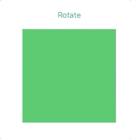
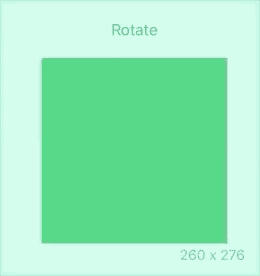
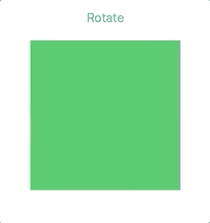
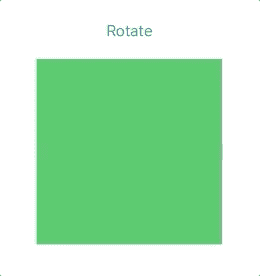
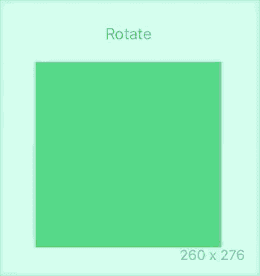
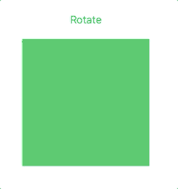
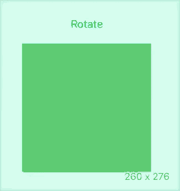

# 如何在 SwiftUI 中构建旋转动画

> 原文：<https://betterprogramming.pub/how-to-build-a-rotation-animation-in-swiftui-e8fb889ccf7e>

## 构建许多不同的旋转动画


由 [Karsten Würth](https://unsplash.com/@karsten_wuerth?utm_source=medium&utm_medium=referral) 在 [Unsplash](https://unsplash.com?utm_source=medium&utm_medium=referral) 上拍摄的照片。

由于苹果提供了如此多的支持，动画在 SwiftUI 中比在 UIKit 中更容易实现。我不知道这将是一件好事还是坏事，但不管怎样，我们需要好好利用所提供的东西。

在本教程中，您将学习如何在 SwiftUI 中执行旋转动画。

# 先决条件

要学习本教程，您需要了解以下方面的一些基本知识:

*   迅速发生的
*   至少 Xcode 11

# 设置视图

你会得到一个按钮，当你点击按钮时，你将动画。首先要做的是创建一个变量来知道按钮是否被点击:

```
@State private var isRotated = false
```

然后，您将创建另一个表示`Animation`的变量，这样就很容易从这里进行调整:

```
var animation: Animation {
    Animation.easeOut
}
```

如果你像我上面做的那样创建你的变量，你可以玩一会动画。您将创建一个按钮和一个矩形来模拟动画:

1.  当您点击按钮时，您将切换布尔值。
2.  创建一个矩形，并定义其属性。

# 旋转效应

您可以从这里通过替换动画来修改动画效果:

```
var animation: Animation {
    Animation.easeOut
}
```

让我们探索多个不同的动画。第一个是`easeOut`，它将在动画结束时减速:



下一个动画是`easeIn`，它将开始缓慢，然后加速:



下一个动画是`linear`，它将在整个动画期间保持恒定的速度:



最后一个是`easeInOut`，它会从慢开始，加速，最后在结尾慢下来:



# 不间断动画

现在，你需要不停地旋转矩形。我知道它看起来像个正方形——我应该给它更大的宽度。无论如何，让我们稍微调整一下动画。

您需要修改两行代码来实现这一点。使用`repeatForever`，它将不停地播放动画。通过包含`false`，它将不会复位，而是继续旋转:

```
var animation: Animation {
    Animation.linear
    .repeatForever(autoreverses: false)
}
```

下一行代码是将度数改为 360 度:

```
.rotationEffect(Angle.degrees(isRotated ? 360 : 0))
```

效果如下图所示:



# 3D 旋转动画

3D 旋转怎么样？接受挑战。在这里，您将取出`rotationEffect`并用`rotation3DEffect`替换它:

```
.rotation3DEffect(Angle.degrees(isRotated ? 180 : 0), axis: (x: 1, y: 0, z: 0))
```

180 度旋转效果呢？



让我们看看无限制的 3D 旋转:



SwiftUI 无疑将动画带到了一个全新的水平。我爱 SwiftUI！