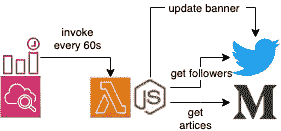
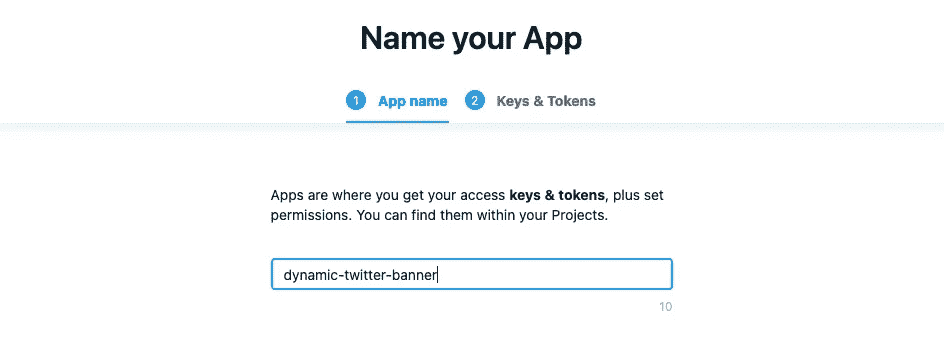
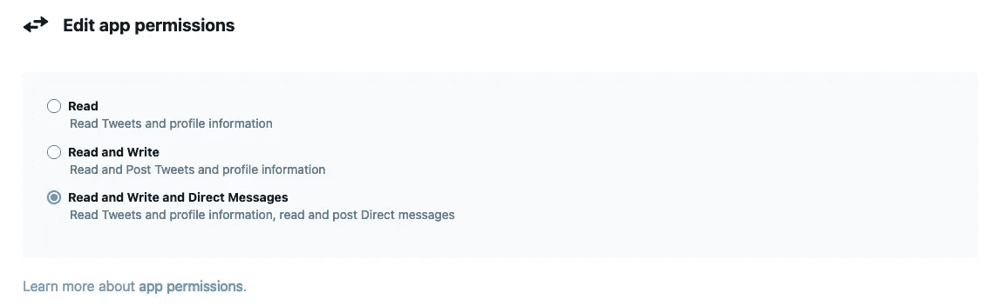
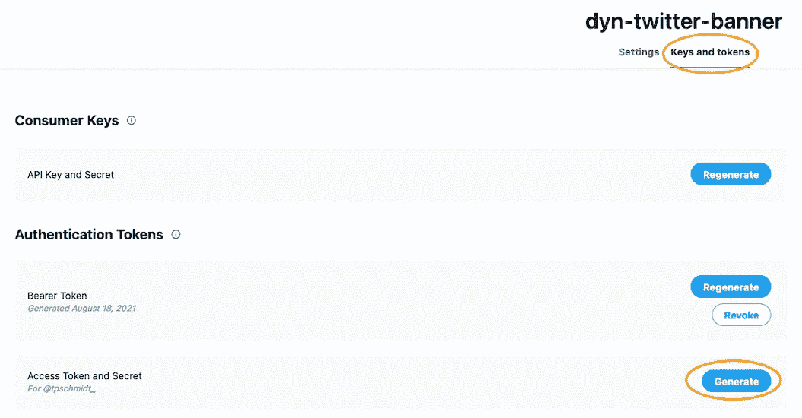
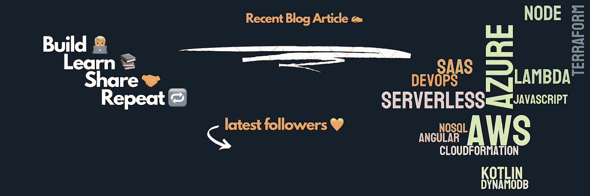
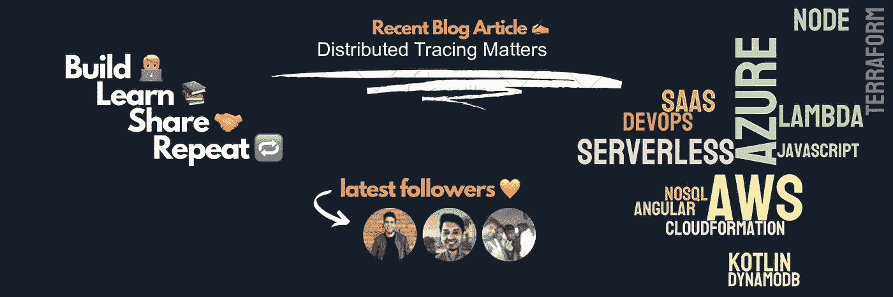

# 如何用动态内容建立一个自我更新的 Twitter 横幅

> 原文：<https://betterprogramming.pub/how-to-build-a-self-updating-twitter-banner-with-dynamic-content-7c3fedcfca25>

## 显示您最新的博客文章或您最近的关注者，无需支付一分钱


照片由[内森·杜姆劳](https://unsplash.com/@nate_dumlao?utm_source=unsplash&utm_medium=referral&utm_content=creditCopyText)在 [Unsplash](https://unsplash.com/s/photos/twitter?utm_source=unsplash&utm_medium=referral&utm_content=creditCopyText) 上拍摄

有人点击你的 Twitter 个人资料的第一印象将是你的头像。为什么不显示一些动态内容呢？实现这一点并不涉及火箭科学，而且可能性是无限的。

在本文中，我想向您展示如何使用一个简单的 Node.js 脚本、Twitter 和 Medium APIs 以及 AWS Lambda 来轻松构建它。

概述:

*   获取凭证，以便我们可以使用 Twitter API。
*   创建 Node.js 脚本来检索我们最新关注者的详细信息。
*   通过 Medium 的 RSS feed 检索我们最新的博客文章。
*   用我们的追随者的图像和我们的博客文章标题更新静态标题图像。
*   将所有内容放入 AWS 上的 Lambda 函数中，该函数每 60 秒执行一次。



💡尽管我们将在 AWS 上创建基础设施，但由于 AWS 的 Lambda 免费层，该解决方案不会产生任何成本。

**免责声明和致谢**:我在 [Tibo](https://twitter.com/tibo_maker) 的时间线上第一次看到这个，所以我肯定不是第一个提供这个问题解决方案的人，你也可以找到很多[其他教程](https://daily-dev-tips.com/posts/how-i-made-my-twitter-header-dynamic/)，当我自己在某个时候被困在这个旅程中时，它们给了我很大的帮助。

# 入门指南

让我们通过 npm 或 yarn 建立一个新项目，并添加我们需要的依赖项:

*   简单而强大的 HTTP 客户端
*   `jimp` —图像处理
*   `sharp` —将响应缓冲区转换为图像
*   `twitter-api-client` —与 Twitter API 通信
*   `rss-to-json` —用于将 XML(中型提要)翻译成 JSON
*   `serverless` —通过[无服务器框架](https://www.serverless.com/)供应我们的 AWS 基础设施。全球安装！

我们将只在`src/handler.js`创建一个包含所有我们需要的操作的脚本文件。

# 访问 Twitter API

我们需要的下一件事是访问 Twitter API。所以我们需要在 Twitter 的开发者门户[创建一个新的客户端应用程序](https://developer.twitter.com/en/portal/apps/new)。



创建应用程序后，确保复制 API 密钥和 API 密钥。回到概览屏幕后，选择您的新应用程序并点击右上角的编辑。请确保设置完全权限(`Read and Write and Direct Messages`)，以便我们稍后可以访问我们需要的所有信息并更新我们的横幅。



最后一步是创建我们的访问令牌和密码。你可以通过选择你的应用程序并切换到标题正下方的标签`Keys and token`来实现。



很有可能，Twitter 还会再次显示您的 API 密钥和 API 密钥，以及您的新访问令牌和访问令牌密钥。记下一切。不能再显示那些细节了！

## 初始化我们的 Twitter 客户端

现在我们已经获得了凭证，我们可以设置我们的客户端，这样我们就可以与 Twitter 的 API 进行通信。首先，让我们将所有的密钥、秘密和 Twitter & Medium 句柄放入根级别的`creds.json`中。

```
{
  "TWITTER_API_KEY": "5Hn9Z28...BW4lEzD",
  "TWITTER_API_SECRET_KEY": "yndh2s5sXLuh...33sbWsbbREZYp4",
  "TWITTER_API_ACCESS_TOKEN": "42399689...jQIBa3Ew4RDi5ed",
  "TWITTER_API_ACCESS_SECRET": "QgYTQoIueX5S...JHk44vVuty9ewwo",
  "TWITTER_HANDLE": "tpschmidt_",
  "MEDIUM_HANDLE": "tpschmidt"
}
```

现在，我们可以使用以下代码创建客户端:

对于本地测试，我们将直接返回到我们的`creds.json`文件，当部署到 AWS 时，我们将使用我们稍后将设置的环境变量。

# 检索我们最新的关注者

让我们使用 Twitter API 客户端来获取最新的关注者。响应由一个用户列表组成，每个用户都包含`profile_image_url_https`。

我们可以下载用户的头像，然后通过 sharp 调整图像大小，并将其保存到一个临时文件中。

# 使用 Medium 的个人 RSS 源

接下来，我们想从我们自己的媒体提要中获取最新的博客文章标题。如果你在 Medium 上运行博客，你所有的时间线元数据都可以在`[https://medium.com/feed/@username](https://medium.com/feed/@username.)` [获得。](https://medium.com/feed/@username.)

当我们使用 JavaScript 时，我们希望用`rss-to-json`将 XML 响应转换成 JSON。之后，我们可以很容易地提取我们的标题。根据标题的大小，在左右两边添加一点填充，可以确保我们的标题总是在页眉的某一点居中对齐。

当然，你不局限于媒体。此时，您可以获取任何内容，甚至是一个普通的 HTML 页面，并提取您想要显示的内容。

# 更新我们的横幅图像

棘手的部分现在已经完成了。我们已检索到我们的动态内容！现在我们只需要为我们的头添加一个基础图像到我们的项目中一个新的`assets`文件夹中。这是我的一个例子:



正如你所看到的，我留出了空间来填写博客标题以及最新关注者的照片。根据您的图像，您必须稍后调整我们为动态内容添加覆盖的坐标。

此外，我使用[另一个图像来遮盖](https://cloud.githubusercontent.com/assets/414918/11165709/051d10b0-8b0f-11e5-864a-20ef0bada8d6.png)我们的追随者的图像，使其具有圆形边框。它只是一个黑底白字的圆圈。请确保它的大小与我们的关注者的图像相同(在本例中，我们使用 90x90 像素)。如果你更喜欢正方形，只需移除`mask`调用。

这并不需要太多的魔法:

*   我们正在加载我们的资产和预先保存的关注者图像
*   我们正在设置文本的字体、颜色和大小
*   我们在横幅上添加我们的图片和标题

结果是在`/tmp`的`1500x500_final.png`文件中有一个新文件。



最后，我们只需要在 Twitter 上更新我们的新标题！

# 用 Lambda 和 Eventbridge 规则自动化一切

现在我们有了一些本地脚本来更新我们的横幅。但是我们希望在 Twitter API 允许的情况下，尽可能频繁地连续自动运行。

我们可以通过利用 AWS Lambda 轻松做到这一点。如果你还没有开始使用 AWS，就注册吧(它是免费的，第一年你会有额外的免费限额，尽管已经有很多像 Lambda 这样的免费服务)。

之后，你需要事先做几件事:

*   访问您的[安全凭证](https://console.aws.amazon.com/iam/home#security_credentials)以生成新的密钥和相应的秘密。
*   安装 AWS CLI(例如，通过自制软件)。
*   从第一步开始运行`aws configure`来设置您的凭证。

就是这样！你可以走了。

我们已经在全球范围内安装了[无服务器框架](https://www.serverless.com/)，因此我们可以通过运行`sls`或`serverless`来初始化新的模板文件。我们将最终得到一个新的`serverless.yml`模板文件，它定义了我们所有的基础设施。

我们最终想要的是:

*   运行我们脚本的 Lambda 函数。
*   包含我们的依赖关系的 Lambda 层。
*   每 60 秒触发我们函数的 EventBridge 规则。

使用无服务器框架，构建起来非常简单，只需要几行代码。

让我们来看看三个主要部分:

*   `provider` —定义我们希望使用 AWS，并设置一些基本条件，例如我们希望我们的日志在七天后过期，这样我们就不会在未来引入任何成本。
*   `layers` —定义包含所有 node_modules 依赖项的层。
*   `functions`——那是我们创建 Lambda 函数的地方。

通过`events`字段，我们定义 EventBridge 将定期调用我们的函数。

在打包文件之前，我们需要在脚本中添加一个代理函数，稍后 Lambda 会调用这个函数。

如果你再仔细看看，你会发现我们在`serverless.yml`中提到了`src/handler.handler`。在我们的例子中，可以在`src/handler.js`找到源。这告诉 Lambda 从哪里开始执行我们的节点脚本。

最后一部分:包装我们的功能和我们的层。

就是这样！我们现在可以通过`sls deploy`部署整个堆栈，一切就绪。如果有些事情没有解决，可以查看相应的 CloudWatch 日志流来找到潜在的问题。如果一切顺利，您将看到我们的调试日志:

```
INFO   Retrieving followers...
INFO   Retrieving avatar...
INFO   Retrieving avatar...
INFO   Retrieving avatar...
INFO   Retrieving headline...
INFO   Retrieved headline: Distributed Tracing Matters
INFO   Adding followers...
INFO   Appending image 0 with x=600
INFO   Appending image 1 with x=700
INFO   Appending image 2 with x=800
INFO   Adding headline...
INFO   Uploading to twitter...
```

如果你坚持到了这里，并且一切顺利:干得好！🎉

💡不要害怕你的代码会每 60 秒被调用一次，因为如前所述，AWS 上有一个 Lambda 的免费层，包括每月 100 万次执行和计算秒。因为我们的函数只需要几秒钟就能完成，所以无论如何我们都不会超过这个时间。

你可以在 [GitHub](https://github.com/tpschmidt/dynamic-twitter-banner) 找到所有的代码。如果有任何问题或者你被这些描述所困扰，不要犹豫，通过你选择的联系渠道给我发信息。

# 包裹

尽管这不再是一件独特的事情，但在你的 Twitter 时间线上享受一些动态内容的乐趣可以有助于培养你的受众。此外，你可能会学到一些新的东西，并享受这个过程。

除此之外，你可以做什么和添加什么基本上没有限制。你也可以自动更新你的简历或头像。

要有创意，并展示给世界。