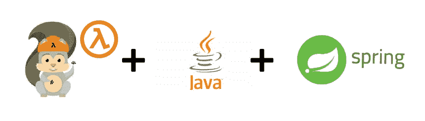

# 如何用 Java 和 Spring 构建无服务器 REST API

> 原文：<https://betterprogramming.pub/how-to-build-a-serverless-rest-api-with-java-and-spring-97e6beeccda9>

## 使用 Java、Spring 和 AWS SAM 实现无服务器化



作者提供的图片

继上一篇关于用 TypeScript 和 NestJS 构建[无服务器 REST API 的文章之后，我们现在将深入一些其他技术。在这个故事中，我们将使用 AWS SAM、Java 和 Spring 构建一个无服务器 REST API。作为一个构建工具，我们选择了](https://blog.devgenius.io/how-to-build-a-serverless-rest-api-with-nestjs-and-dynamodb-7b58b5b59bf6) [Gradle](https://gradle.org/) ，它是自动化构建过程最快的工具，并且在 Java 领域受到 ide 的广泛支持。

> 不确定无服务器技术能提供什么？阅读[我以前的文章](https://serverlesscorner.com/serverless-just-ship-the-code-c1214214a5f7)无服务器技术如何帮助你更快地构建。

API 将在 AWS Lambda 上运行，并与 API 网关相关联(见下图)。这种无服务器架构允许您以按请求付费的定价模式运行服务，只需最少的操作维护。


无服务器架构

让我们快速介绍一下所涉及的技术，让您更好地了解我们将在这里构建什么。

# AWS SAM

AWS 无服务器应用程序模型(AWS SAM)是 AWS 自己的技术，可以帮助您构建、测试和部署 AWS Lambda 功能。以前我使用无服务器框架，AWS SAM 更适合用 Java 完成的 Lambda 函数。

> 要使用 AWS SAM 在本地运行和测试您的 Lambda，您还需要安装 [Docker](https://docs.docker.com/get-docker/) 。

## 弹簧框架

Spring 框架是最流行的 Java 开源框架。它为 web、数据库、集成等提供了许多模块。Spring 允许开发者使用 POJOs 并隐藏了复杂性。开发人员使用 Spring 框架效率更高。Spring 框架的核心是控制模式的反转。Spring IoC 容器处理对象创建和依赖注入，允许类之间更松散的耦合，这提供了灵活性。

## 格拉德勒

与 Maven 相比，Gradle 是最快的 Java 构建工具，提高了您的工作效率。

# 设计选择

使用 AWS Lambda 构建 REST API 有很多方法。在这个故事中，我做了以下选择:

API 网关 Lambda 代理集成——您通常会将 API 网关中的每个 API 请求映射到一个 Lambda 函数，代理集成允许您将所有 API 请求映射到一个 Lambda 函数。这种与 API 网关的分离减轻了您在 API 网关中管理 API 配置的负担，并加快了开发过程。在一个服务中捆绑相同领域的功能非常适合微服务架构。

一个额外的效果是，捆绑功能降低了“冷启动”的几率

这确实需要您自己处理传入的请求。正如我们将看到的，Spring 框架不费吹灰之力就能做到这一点。

## 无服务器 Java 容器

用 Java 实现 AWS Lambda 可以考虑多种框架，比如 Spring Cloud。然而，我选择使用 AWS 实验室的“[无服务器 Java 容器](https://github.com/awslabs/aws-serverless-java-container)”框架。它由 AWS 维护，并在 Lambda 中提供一个运行 Spring 的非常薄的 Java 包装器。理:[少码，少冷启动](https://serverlesscorner.com/5-ways-to-deal-with-cold-starts-dcbb8967edf9)。

# 让我们开始建造吧

所以，现在我们知道了我们将使用的技术和我们前进的方向，让我们开始构建吧。我们将用 Java 和 Spring 构建一个在线图书馆服务作为运行在 AWS Lambda 上的 REST API。

> *本文的完整项目可以在 Github*[*https://github.com/cyberworkz/examples*](https://github.com/cyberworkz/examples)*的* `*online-library-java*` *文件夹中找到。*

## 先决条件

1.  AWS 帐户——查看此[故事](https://aws.plainenglish.io/get-your-serverless-api-in-the-cloud-77bd70b26788)以获得设置帮助。
2.  Java 和 Spring 的基础知识

## 安装 AWS SAM

AWS SAM CLI 使您可以轻松创建和管理无服务器应用程序。使用以下[链接](http://makes it easy for you to create and manage serverless applications)将其安装到您的操作系统上。

## 设置项目

现在 SAM 已经安装好了，我们将使用它来设置我们的无服务器项目。我们将使用预定义的模板立即投入使用。执行以下命令来生成项目:

```
sam init --location gh:cyberworkz/sam-templates
```

这将使用代理模式生成一个 Java Spring 项目，并带有所有必需的依赖项。生成的项目有一个 AWS SAM 模板文件，该文件严格遵循 AWS CloudFormation 的格式。`template.yml`文件应该如下所示:

SAM 模板文件

让我们讨论一下这个文件中最重要的参数。使用模板文件，您可以为您的 Lambda 定义以下参数:

*   运行时(java11)
*   内存大小(512)
*   CodeUri 和处理程序类。

另外，请注意 events 部分，在这里我们定义了代理与 API 网关的集成方式。

```
Events:        
  Service:          
    Type: Api 
    Properties:            
      Path: /{proxy+}            
      Method: any
```

`CodeUri`参数定义了作为 Lambda 代码部署的 java 包。Gradle 构建文件包含任务 shadowJar，它将构建代码，包括依赖项中的所有类，以便它可以运行。

Gradle 构建文件

# 请求处理程序

现在我们已经建立了项目。我们将查看处理来自 API 网关的传入请求的代码。`StreamLambdaHandler`类处理传入的请求。

请求处理程序

该类包含一个静态部分，它在初始化阶段被调用。使用它来建立与作为数据库的资源的连接。处理完请求后，这些资源会在下次调用时保留。

`handleRequest`方法将请求作为一个`Inputstream`来处理，并返回一个`OutputStream`作为响应。该方法代理对`SpringLambdaContainer`的调用，使我们能够应用 Spring 框架魔法。

## 语境方法

[上下文对象](https://docs.aws.amazon.com/lambda/latest/dg/java-context.html)包含获取请求信息的钩子。有关上下文对象可以提供的内容，请参见以下列表。

*   `getRemainingTimeInMillis()`–返回执行超时前剩余的毫秒数。
*   `getFunctionName()`–返回 Lambda 函数的名称。
*   `getFunctionVersion()`–返回函数的[版本](https://docs.aws.amazon.com/lambda/latest/dg/configuration-versions.html)。
*   `getInvokedFunctionArn()`–返回用于调用该函数的亚马逊资源名称(ARN)。指示调用程序是否指定了版本号或别名。
*   `getMemoryLimitInMB()`–返回分配给该函数的内存量。
*   `getAwsRequestId()`–返回调用请求的标识符。
*   `getLogGroupName()`–返回函数的日志组。
*   `getLogStreamName()`–返回函数实例的日志流。
*   `getIdentity()`–(移动应用程序)返回授权请求的 Amazon Cognito 身份的信息。
*   `getClientContext()`–(移动应用)返回客户端应用提供给 Lambda 的客户端上下文。
*   `getLogger()`–返回函数的[记录器对象](https://docs.aws.amazon.com/lambda/latest/dg/java-logging.html)。

## API 端点

现在，我们转向定义 API 端点。我们使用代理集成模式，其中 API 网关上的每个请求都被转发给 Lambda 代码。使用 Spring MVC，我们可以使用注释非常容易地定义端点。参见下面的`OnlineLibraryController.java`代码:

OnlineLibraryController.java

`EnableWebMvc`注释表明您将使用注释来配置请求映射。`RestController`注释表明该类是 Spring 框架中的托管组件，将在启动 Spring 容器时被初始化。

`RequestMapping`注释说明了控制器类方法将被映射到的路径。`GetMapping`注释是`RequestMapping`的专门化，将方法映射到 GET 请求。注释`GetMapping`的值添加到在类级别定义的`RequestMapping`中，并且可以包含路径变量。本例中的 URL `/books/author/tolkien/jrr`被映射到`getBooksByAuthor`方法。

用于映射传入 HTTP 请求的一些其他重要注释是:

*   `PostMapping`
*   `PutMapping`
*   `PathVariable`
*   `RequestParam`
*   `Headers`
*   `RequestBody`
*   `ResponseBody`

我希望这演示了使用 SpringMVC 注释将请求映射到不同的方法是多么容易，并且节省了您在 API 网关中管理映射的工作量。

所以，这就结束了。我希望这对你的无服务器之旅有所帮助。同样，这个项目的代码可以在 GitHub 上找到。[https://github.com/cyberworkz/examples](https://github.com/cyberworkz/examples)在`online-library-java`文件夹里。

感谢阅读！

# 海科·范德沙夫

*   ***如果你喜欢这个，请跟随 Serverlesscorner.com 上***[](https://serverlesscorner.com/about)****。****
*   ****爱情*** ❤️ ***阅读*** ***我的故事和其他关于媒？*** [***成为会员***](https://serverlesscorner.com/membership) ***如果你还不是会员。****
*   ****想阅读更多无服务器？报名参加我的*** [***月刊***](https://serverlessconsulting.org/newsletter) ***📬关于无服务器技术和使用案例的启发性和深刻的故事。****

# *参考*

1.  *[https://docs . AWS . Amazon . com/server less-application-model/latest/developer guide/what-is-Sam . html](https://docs.aws.amazon.com/serverless-application-model/latest/developerguide/what-is-sam.html)*
2.  *[https://en.wikipedia.org/wiki/Inversion_of_control](https://en.wikipedia.org/wiki/Inversion_of_control)*
3.  *[https://docs . AWS . Amazon . com/API gateway/latest/developer guide/set-up-lambda-proxy-integrations . html](https://docs.aws.amazon.com/apigateway/latest/developerguide/set-up-lambda-proxy-integrations.html)*