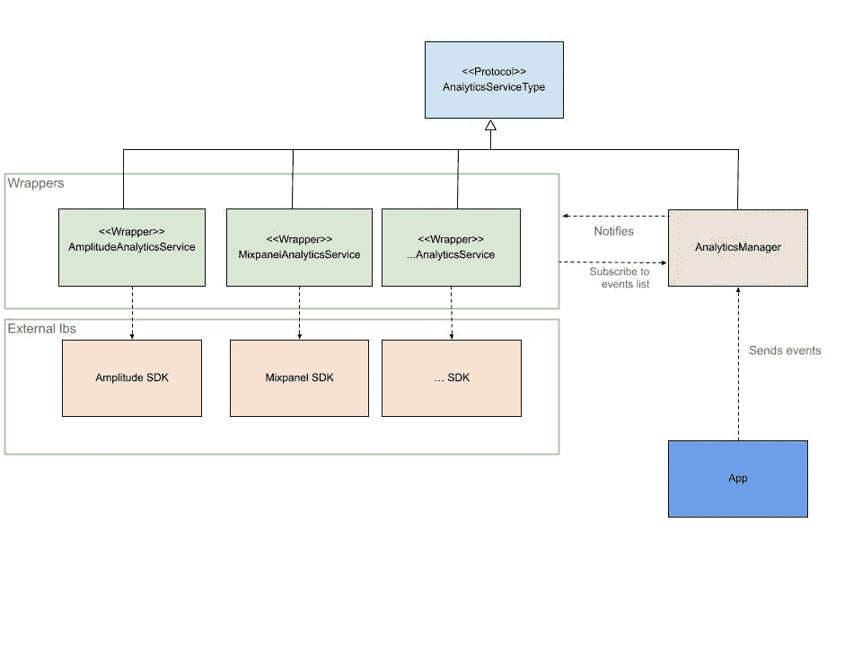

# 如何在您的 iOS 应用中构建一个与服务无关的分析层

> 原文：<https://betterprogramming.pub/how-to-build-a-service-agnostic-analytics-layer-into-your-ios-app-da533059c818>

## 无论您使用什么分析服务，触发一次事件并将其记录在正确的服务中

照片由[亨利&公司](https://unsplash.com/@hngstrm?utm_source=medium&utm_medium=referral)在 [Unsplash](https://unsplash.com?utm_source=medium&utm_medium=referral) 上拍摄。

假设我们为了分析的目的想要集成一个库。我们可以从按照指南设置库开始，然后跟踪事件。太棒了。一切正常。

但很快，我们可能会开始询问如何集成其他库进行分析，每个库可以负责跟踪应用程序中的不同事件。此时，一切都变得更加困难，我们到处都有分析代码，我们的应用程序需要处理所有的库。我们的代码不再可维护。

本文将有助于减少外部库和代码之间的耦合。这个解决方案也可以用于其他主题。最佳实践是不要直接依赖外部库。

这是我们可以用来解决问题的图表。

这个图有很多好处。我们有包装器层，它将抽象我们使用的不同 SDK 的接口。每当我们想要包含一个新的服务时，我们只需要创建一个新的包装器。此外，每个服务可以订阅它想要跟踪的事件列表，让我们可以自由地跟踪每个库中的不同事件。另一个目标涉及我们的应用程序，它不知道任何关于正在使用的服务的信息，因为它只知道`AnalyticsManager`。因此，当我们的应用程序想要跟踪某个东西时，它只需要调用`AnalyticsManager`。

我们已经有理论了，那就开始吧。

# AnalyticsServiceType 协议

在该协议中，我们有两个几乎所有分析软件开发套件都具备的主要功能:

*   初始化
*   跟踪

此外，我们还有一个额外的属性，那就是我们想要跟踪的事件列表。

# 事件和部分事件

我们可以在一个枚举上表示不同的事件，如下所示:

在`AnalyticsEvent`上，我们有一些其他的属性，比如`analyticsSection`。该属性允许我们将所有事件组织得更加有序，因为我们可以对共享相同上下文的事件进行分组(例如，入职、用户设置等)。

此外，我们使用`AnalyticsSection`来订阅每个服务。

# 包装材料

这是包装协议的[示例实现](https://gist.github.com/lucasPelizza/a3f126a7c15e423f5fb070601473bba5)。

# 分析经理

我们需要创建的最后一个类是我们的`AnalyticsManager`。在这种情况下，`AnalyticsManager`不是单例，因为我试图避免在代码中创建单例。还有，我用 DI。我并不是说使用单例是错误的——这取决于你。

# 加班

有了尽可能隔离我们的应用程序的想法，我们可以在不同的目标上创建所有的类和协议，实现我们的应用程序和分析材料之间的真正隔离。

这些是我们可以创建的一些附加文件。

## AnalyticsServiceIntegrationType

这个枚举用于`AnalyticsManager`的初始化，允许我们的应用程序不与任何外部库联系。

使用我们的分析层:

# 结论

每当我们的应用程序依赖于外部实现时，它都是未来的头痛问题。我们可以通过编写一些协议和包装库来减少耦合，从而避免这种情况。如果我们遵循这种模式，我们将能够灵活地更改/添加分析 SDK。

此外，我们可以遵循这种模式，同时进行一些小的修改，以便与其他库一起使用。