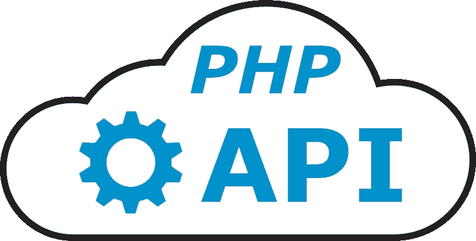
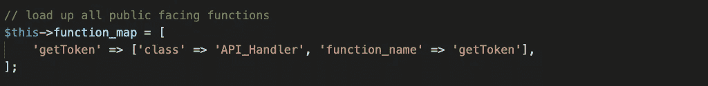

# 如何用 PHP 构建一个简单的 Restful API

> 原文：<https://betterprogramming.pub/how-to-build-a-simple-restful-api-in-php-c719f03cfa0a>

## 用 PHP 构建 restful API 的入门工具包，包含服务器端和客户端示例代码



如今，如果您想要一个可伸缩的 web 应用程序，在某个时候您将不得不考虑构建基于云的 API 服务，无论是微的还是其他的，它允许您的分布式应用程序能够共享公共功能。

本文将向您展示如何用 PHP 构建一个简单的 restful API。我们将构建一个服务器端 API，它从客户端接收 API 密钥，连接到 MySQL 数据库获取 API 密钥，然后返回一个用密钥保护的 JSON Web 令牌(JWT)。

客户端应用程序是一个简单的 PHP 页面，它调用 API 来检索令牌，然后在写出页面之前将其存储在 cookie 中。页面本身包含一些简单的 jQuery，允许您删除 cookie，然后通过 JavaScript 使用相同的 API 接口检索新的令牌。目标是为您提供一个页面，您可以在其中看到 PHP 和 JavaScript 代码调用相同的 API。

我还包含了一些 MySQL 脚本来构建我们的示例数据库。

当我们完成后，您将拥有一些坚实的基础代码，您可以扩展这些代码来创建自己的应用程序。事实上，我以后写的文章将会回来，在这个 API 项目的基础上进行改进和构建，以提供其他类型的真实服务。

我们开始吧！

# 示例代码

以下三个 GitHub 资源库中提供了所有的示例代码。请随意下载并以任何方式使用此代码，无需注明出处:

*   后端 API:[medium-PHP-API-starter](https://github.com/crmcmullen/medium-php-api-starter)
*   客户端前端:[中端-php-api-starter-client](https://github.com/crmcmullen/medium-php-api-starter-client)
*   数据库脚本:[medium-PHP-API-starter-db scripts](https://github.com/crmcmullen/medium-php-api-starter-dbscripts)

显然，我在我的`localhost`上构建了这个项目，后端 API 在一个项目中，客户端前端在一个单独的项目中。为了使这个简单的演示工作，有一些硬编码的引用(例如，数据库连接细节、API 主机 URL 等)。我将在以后的文章中回来，我们将通过将这些东西移动到 INI 文件和数据库表中来改进我们的项目，这样我们的代码中就没有这些东西了。但是现在，我们的想法是保持简单。

我决定为每样东西建立单独的存储库，因为我确实打算在以后的文章中回来构建这个项目。每个存储库中的`master`分支总是最新版本的代码，但是我会将每个特性分支留在存储库中，这样您可以在任何时候回滚并在任何阶段使用应用程序。也就是说，这些存储库中的每一个都包含一个名为`original`的分支，这将是我们在这里工作的代码的起点。

顺便提一下，我的开发环境完全是在 Docker 容器中使用我最近的文章《[如何在 macOS 上的 Docker 容器中运行整个开发环境](https://medium.com/better-programming/php-how-to-run-your-entire-development-environment-in-docker-containers-on-macos-787784e94f9a)》中的说明建立的

# 数据库脚本

让我们从运行 MySQL 数据库脚本开始。只有两个。一个创建了`api_starter`数据库，另一个创建了一个`app_api_key`表，该表将由 API 键索引，并为 API 后端提供一个相关的密钥，用于对 JWT 进行编码。

要将这个库克隆到您的机器上，请打开一个终端窗口并导航到您想要用于您的项目的位置(我个人在我的根用户文件夹中有一个`Sites`文件夹)。使用下面的命令来下拉这个库的`original`分支:

**注意:**下面的 Git 命令是一个已经换行的单行。确保复制并粘贴整个内容。

```
git clone -b original [https://github.com/crmcmullen/medium-php-api-starter-dbscripts.git](https://github.com/crmcmullen/medium-php-api-starter-dbscripts.git) phpapistarter_dbscripts
```

打开您最喜欢的 MySQL 工具(我使用 MySQL Workbench)并运行`apistarter.sql`。这将构建将在该项目中使用的数据库和数据库用户。

下一次运行`apistarter_app_api_key.sql`。这将构建`app_api_key`表，向其中插入一条我们将在示例中使用的记录，然后在表上构建一个视图。

数据库到此为止。很简单。

# 服务器端 API 后端

接下来，拉下 API 的后端代码。我再次打开终端，导航到我的`Sites`文件夹。在我的项目中，我为 API 服务器代码使用了一个名为`phpapistarter`的文件夹，您会看到它在代码中被引用为 API 主机。如果您使用不同的文件夹，请确保在代码中更新该文件夹。

```
git clone -b original [https://github.com/crmcmullen/medium-php-api-starter.git](https://github.com/crmcmullen/medium-php-api-starter.git) phpapistarter
```

API 服务包含以下文件:

## **index.php**

允许跨来源请求的简单页面。它预先要求所有必需的类，验证传入的 API 请求，并将函数请求交给 API 处理程序。

## **/src/api_handler.php**

这是 API 服务的核心。函数将所有面向公众的端点和它们所属的类预加载到一个数组中。如果需要，数组允许您在内部给函数起别名。例如，如果面向公众的端点是`getToken`，但是在你的代码内部，你将`function_name`称为`fnGetToken`，你可以这样做。在第一个版本中，唯一有效的终点是`getToken`。



未来的端点需要添加到此阵列中。如果终结点不在数组中，将向客户端引发无效的方法调用错误。

`validateRequest`函数评估请求以确保它包含 API 密钥和令牌，检索调用者的`app_api_key`记录并使用 API 密钥解码 JWT。然后，它确保所有内容都匹配，并且令牌没有过期。

`getCommand`函数从函数映射中检索类和内部函数名，`execCommand`将其转换成带有相关参数的函数调用。

当然,`getToken`命令是 API 处理程序中的核心 API 端点命令之一，也是本演示的重点。

## **/src/app _ auto loader . PHP**

这个文件预先注册了所有将被 API 引用的类，并将加速类的加载。

## /src/app_jwt.php

这个类建立在由 Neuman Vong 和 Anant Narayanan [提供的 JSON Web Token 编码器/解码器代码之上。](https://github.com/firebase/php-jwt)

## /src/app_response.php

一个简单的类库，提供标准的 HTML 响应代码和描述。

## /src/db _ class/data _ access . PHP

这个抽象类由其他数据库类扩展，通过`db_connect` 函数提供到 MySQL 数据库的连接，以及一个用`getResultSetArray`检索`ResultSet`数组的抽象函数。

注意`db_connect`有硬编码的连接变量。这些将在后面的项目中被替换，我们将把它们移动到一个 INI 文件中。

## /src/db _ classes/app _ API _ key . PHP

这是数据库表`app_api_key`的数据库类。目前，它只有一个方法，那就是为 API 密钥检索调用者的 API 记录，以便对令牌进行编码/解码。

这就是 API 服务。当然，它只有一个自己的终点。但是框架现在已经就绪，可以在将来添加其他 API 端点。

# 客户端应用程序

对于客户端应用程序，我使用了一个名为`phpapistarter_client`的文件夹。您可以通过导航到您的`Sites`文件夹并使用以下命令来获取代码:

```
git clone -b original [https://github.com/crmcmullen/medium-php-api-starter-client.git](https://github.com/crmcmullen/medium-php-api-starter-client.git) phpapistarter_client
```

如果你和我使用相同的项目文件夹(如`phpapistarter`和`phpapistarter_client`，你可以立即在`[http://localhost/phpapistarter_client](http://localhost/phpapistarter_client)`的浏览器中打开这个项目并开始玩它。

这个客户端应用程序真的不是火箭科学。这是一个包含两个 JavaScript 文件的页面。

## index.php

如果不存在 cookie，该页面将对`getToken`端点进行 API 调用以检索令牌。然后，它将令牌打包到一个 cookie 中。

您会注意到 API 键和 API 主机是硬编码的。后续文章将把这些值移到 INI 文件和数据库表中，这样它们就不会出现在源代码中。我只是想把事情简单化。

然而，从流程的角度来看，这将是您在生产中检索令牌的方式，因为整个事务将在写入页面之前发生在服务器端。

页面本身的 HTML 部分非常简单。它显示创建的令牌，并提供一个按钮来删除它，第二个按钮通过对完全相同的 API 的 JavaScript 调用来检索新的令牌。这为您提供了代码，展示了如何在 PHP 和 JavaScript 中进行相同的 API 调用。

我还使用 Bootstrap 来添加一些基本的 CSS。

## /js/API _ handle . js

这个 Javascript 文件是一个通用的 jQuery API 处理程序。给它传递一些变量，它会为您进行调用，然后执行回调。

通常，您不会将 API 键或 API 主机作为变量传递。取而代之的是，这个 JavaScript 将检索 cookie，获得这些变量和令牌，并在 API 调用中传递它们。然而，由于这个演示可能会在没有 cookie 的情况下进行 API 调用，所以我们需要做一些不同的事情。

同样，后面的文章将解决这个问题。PHP 代码将总是创建 cookie，这个 JavaScript 将从中提取它所需要的内容以供后续调用。

## /js/cookie_handler.js

一个 JavaScript 文件，具有非常基本和通用的 cookie 处理功能。

# 摘要

本文到此为止。有了这一小段演示代码，您就有了一个 PHP restful-API 服务的良好开端。我将撰写一些基于这个项目的文章，并向您展示如何在服务器上设置 API 处理程序，以调用其他真实类型的类，甚至连接其他服务，如 SendGrid 电子邮件或 Google reCAPTCHA 验证。

我希望这篇文章和支持代码对您的项目有所帮助。