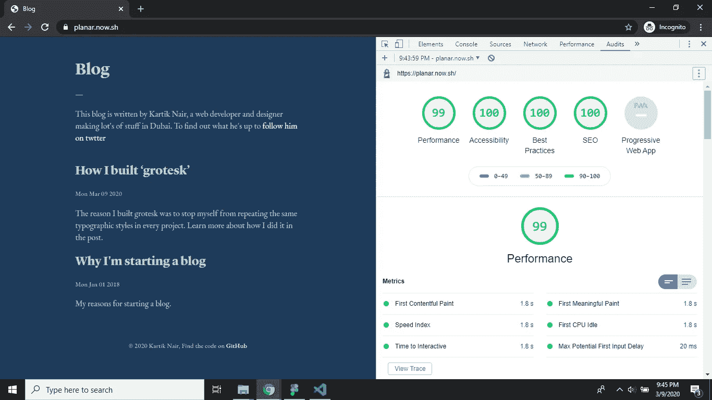
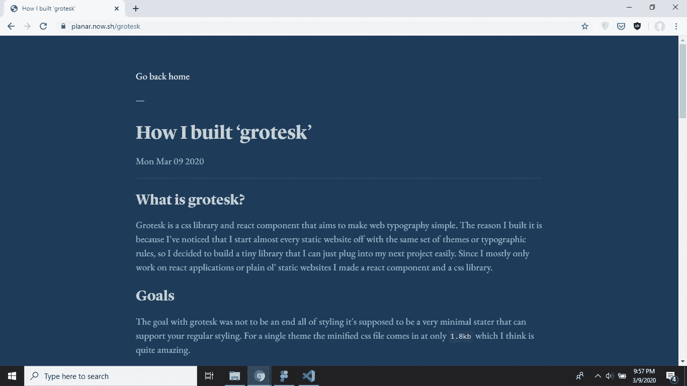

# 如何使用 Node.js 构建一个简单的静态站点生成器

> 原文：<https://betterprogramming.pub/how-to-build-a-simple-static-site-generator-using-node-js-6425b71272e0>

## 建立一个了不起的静态网站生成器和 Markdown-powered 博客


[黄福生](https://unsplash.com/@killerfvith?utm_source=medium&utm_medium=referral)在 [Unsplash](https://unsplash.com?utm_source=medium&utm_medium=referral) 上的照片。

我的博客是用 [GatsbyJS](https://gatsbyjs.org) 构建的，这是 React 的一个很棒的静态站点生成器。嗯，它是使用 Gatsby 构建的，但我最终切换到了这个项目，你会在最后发现这一点。《盖茨比》很容易上手，我所要做的就是定制《盖茨比博客首发》来获得一些好东西。

但是我很好奇生成器是如何工作的，所以我决定尝试使用 Node.js 构建一个简单的、基本的静态站点生成器。所以让我们开始吧。

# 为什么是简单的静态站点生成器？

我非常喜欢静态站点生成器，因为它们允许你使用任何你想要的沉重/臃肿的框架，但最终结果仍然只是简单和轻便的 HTML 和 CSS。这给了我们一种自由的感觉，例如，如果我们处理一个创建-反应-应用程序，我们通常不会有这种感觉。

就这个项目而言，请查看灯塔评分:



我知道，对吧？相当惊人。它没有获得 ace 的唯一原因是字体太大，但这没关系，因为它们增加了足够的审美价值，让我可以保留它们。

# **设置**

所以让我们开始吧！打开命令行，导航到您希望创建项目的位置，然后使用以下命令创建一个新的 Node.js 项目(这些是针对 Windows 的，但我相信您可以将它们转换到您的操作系统中):

```
mkdir node-ssg && cd node-ssgnpm init -y
```

现在，我们将安装一些软件包，这些软件包将使我们处理数据的工作变得非常简单。这些软件包是:

*   从我们的帖子中提取 YAML 前线的内容。
*   `marked`用于将 Markdown 转换为 HTML。
*   `highlight.js`用于代码中的语法高亮显示。

我们可以使用以下命令安装所有这些组件:

```
npm i front-matter marked highlight.js
```

好了，现在我们可以开始我们的项目了。

# **构建脚本**

让我们先想想我们想做什么。因此，我们需要一个构建脚本，它从内容目录中获取所有的 Markdown 帖子，并在公共目录中丢弃静态 HTML 文件。

首先，让我们创建调用`build`时将运行的脚本。我们将把所有的源代码放在`src`目录中，所以继续把它放在项目的根目录中。然后在您最喜欢的代码编辑器(我用的是 VS 代码)中打开项目，并添加一个名为`index.js`的 JavaScript 文件。现在我们可以简单地通过使用`node`运行我们的`index.js`文件，将我们的`build` 脚本添加到我们的`package.json`中。您的`package.json`现在应该是这样的:

太好了！现在我们可以在我们的项目中调用`npm run build`，它将运行我们的`index.js` 文件。唯一的问题是我们的文件还没有做任何事情。

出于测试目的，我将创建一个包含我自己的博客文章的内容文件夹。因为我当前的博客也是使用静态站点生成器构建的，所以我可以从那里复制我的内容文件夹。

# **做出决定**

好吧，在开始之前你应该做很多决定。比如帖子应该如何存储？它们应该存储在自己的文件夹中还是仅仅作为`.md`文件？你在哪里储存图像？还有很多。

但是由于这个项目的范围不是很大，我将使用一个非常简单的文件树。所有帖子将作为降价文件(`.md`)存储在内容目录中，其他资源(如图片)可以存储在`./public/assets/`。这些决定是为了使这个特定场景的文件读写更简单，但是您总是可以将它们更改为更适合您的项目的值。

# **config . js 文件**

我们可以把我们做出的决定放在一个`config.js`文件中，这样我们就可以从任何地方访问它。我将它们放在一个`dev`对象中，因为我们稍后将添加其他属性。这是它现在的样子:

# **获得职位**

好吧，让我们从获取内容目录中的所有帖子开始。我们可以使用 Node.js 提供的`fs` API 来完成这项工作。所以首先，我们导入`fs`并创建它的一个实例:

```
*const* fs = require(“fs”);
```

现在我们可以使用`fs`在这个语法中提供的方法:`fs.methodName()`。对于获取帖子，我们可以使用`fs`提供的`readdirSync()`方法。因此，让我们看看，如果我们获得所有的帖子并将它们记录到控制台，会是什么样子:

现在在你的控制台上运行`npm run build`,如果你做对了，你应该会看到一个帖子列表。我们在代码中使用`slice()`的原因是为了去掉`.md`扩展。你以后会明白为什么我们必须这样做。

# **解析帖子降价**

如果你还记得，在一开始，我们安装了一个名为`front-matter`的 NPM 包。这有助于我们从文件中提取 YAML 的内幕。YAML 前沿是什么？嗯，就是这个神奇的东西，让你添加额外的 YAML 数据到你的文件中，在它的前后使用 `— -`来把它和其余的内容分开。这里有一个使用 YAML 前沿话题的博客帖子的例子:

```
---title: Post Onedate: “1583826864020”description: My reasons for starting a blog.---**#** **This is an amazing blog post.**Really it’s just great
```

由于我们在前一步中获得了帖子，现在我们可以使用`front-matter`解析它们。我们将把所有与 post 相关的代码放在`posts.js`中，这样我们就有了一个更干净的工作环境。因此，让我们从获取文件内容开始。

我们可以使用提供的`fs.readFile()`方法来实现。下面是将文件内容记录到控制台的样子:

```
console.log(fs.readFileSync(“./foo.md”))
```

但是因为我们想要可重用的代码，可以用于循环中的每一篇文章，我们将把它放在一个名为`createPost()`的函数中。这个函数将使用`front-matter`获取文件的内容并给我们一个对象。这个对象将拥有我们在名为`attributes`的属性中设置的前台属性，其余的内容将在名为`body`的属性中。我们可以通过使用`require`为它创建一个实例来使用`front-matter`，然后在我们从文件中读取数据时调用它。

这看起来是这样的:

如果你检查代码，你会看到我在我们的文章主体上调用了`marked`。所有这些都是将 Markdown 转换成 HTML，这样我们以后就可以很容易地在我们的网站上显示它。我还添加了文章的路径作为额外的属性，因为我们以后会需要它。

现在让我们在`index.js`中使用这个方法，只记录输出:

# **配置标记和语法高亮**

因为我们想使用`highlight.js`来突出显示我们的代码，所以我们可以使用`marked`和它的配置对象。创建一个名为`marked.js`的文件，在这个文件中，我们将创建一个`marked`的实例，配置它，然后导出它。这是它的样子:

所以现在你每次使用`marked`，都要求它直接从这个文件中出来。

# **生成帖子 HTML 页面**

现在我们从实际的页面生成开始。首先，我们希望它创建公共文件夹。如果它还不存在，我们可以使用`fs.mkdirSync()`和`fs.existsSync()`函数来实现。让我们将它添加到我们的`index.js`文件中:

```
if (!fs.existsSync(config.dev.outdir)) fs.mkdirSync(config.dev.outdir);
```

现在，在我们的`posts.js`文件中，让我们创建一个`createPosts()`函数，它将创建 HTML 文件并将其写入公共目录。但在此之前，我们需要一个名为`posthtml`的助手函数，它将获取 post JSON 对象并返回一个完整的 HTML 页面，我们可以简单地将它写入一个文件。在这个函数中，我们将使用模板文字的力量来使我们的生活变得更容易。它看起来是这样的:

我在给文章添加日期时创建一个`new Date()`的原因是为了让所有的日期都有一致的格式。这是一种非常固执己见的做法，因为它要求前台提供的日期是一个“表示自 UNIX 纪元以来经过的毫秒数”然而，我不介意在我发帖之前在浏览器开发工具中运行一个快速的`Date.now()`来得到那个数字。如果你愿意，你可以在代码中修改它。

现在我们可以创建一个名为`createPosts()`的函数，它将接受`createPost()`函数的输出并生成一个 HTML 文件。它看起来是这样的:

如您所见，它没有生成一个名为`postname.html`的文件，而是创建了一个名为`postname`的目录，然后在该目录中添加了一个`index.html`，这样该文章在浏览器中的路径将是`yourwebsite/postname`而不是`yourwebsite/postname.html`。

现在让我们在`index.js`中调用它，看看它是否有效:

如果一切正常，您应该会看到一个公共目录弹出，其中有几个目录(基于您有多少帖子)。

# **关于第**节

这个博客还将在其主页上为作者提供一个小的“关于”部分，所以我们需要将这个信息添加到我们的`config.js`文件中。这是我们修改后的`config.js`文件:

# **首页**

主页将是公共目录中的`index.html`文件。它应该有一个标题与博客的名字和一个小的关于作者的部分。我们可以像以前一样使用模板文字来生成 HTML。让我们调用函数`homepage()`，并把它放在一个名为`homepage.js`的文件中。下面是该文件现在的样子:

现在我们需要实际创建文件，这样我们就可以向其中添加 HTML。我们可以创建一个名为`addHomepage()`的函数，并将它添加到同一个文件中。它看起来是这样的:

现在我们可以简单地使用`module.exports = addHomePage`将其导出，并在我们的`index.js`文件中调用它。这是我们修改后的`index.js`文件:

如你所见，我还按最新日期对帖子进行了排序，所以最新的帖子排在最前面。

# **资产目录**

我们可以在`./public/assets`中存储任何不想被生成器接触到的文件。例如，如果您想为这个博客添加样式，您可以将以下内容添加到您的`homepage`函数中:

```
<link rel=”stylesheet” href=”./assets/main.css” />
```

现在你可以随心所欲地设计你的博客了。图像也以同样的方式工作。例如，如果您想在 post Markdown 文件中添加图像，您可以执行以下操作:

```
Here’s an image:
```

# **让它看起来很漂亮**

啊！现在是我最喜欢的部分:是时候让它看起来更好了。我不知道你怎么想，但是看着那些默认的 HTML 样式对我伤害很大。为了简化我的工作，我将把 [grotesk](https://grotesk.now.sh) 插入到项目中，并对其进行定制。下面是`./public/assets/styles/main.css`文件:

正如你所看到的，我已经决定在这个项目中使用流体类型。我还引入了`grotesk.light.scss`并自定义了变量。这些变量现在是这样的:

我还定制了 grotesk 自带的`fonts.scss`文件。现在看起来是这样的:

如你所见，我为这个博客导入了两种字体:Lyon Display(本地托管)和 EB Garamond(一种 Google 字体)。

造型到此为止。它看起来比我预期的要好很多。你可以[现场查看](https://blog.kartikn.me/)，但如果你嫌麻烦，这里有一张图片:



# **主持**

我个人喜欢使用 [ZEIT Now](https://now.sh) 进行托管，但我也喜欢其他一些免费选项，如 [Netlify](https://netlify.com) 和 [GitHub Pages](https://github.io) 。由于现在与输出到公共目录的 NPM 构建脚本集成得如此之好，我所要做的就是在该目录的根目录下运行`now — prod`(当您第一次运行它时，它会问您一些配置问题，默认答案是“没问题”)。现在每次我想更新我的博客，我只需再次运行`now — prod`，它就会通过运行`npm run build`并托管它来更新我的博客。

# **最终想法**

感谢阅读这篇很长的文章。我希望你对 Node.js 有所了解。我个人对`fs` API 有很多了解，并且很喜欢做这个。我太喜欢它了，以至于最后我把我的个人博客从盖茨比换成了这个。那可能是一个糟糕的决定，但是我总是能在以后解决它。只是提醒一下:你可以在 [GitHub](https://github.com/kartiknair/blog) 上找到所有的源代码，所以如果你发现有什么不对的地方，请随意叉出来或者打开一个问题。

我将继续致力于此，根据我的需要对其进行微调，并可能尝试一些不同的东西，如用于模板的 [lit-html](https://github.com/polymer/lit-html) 或 [mustache](https://github.com/janl/mustache.js/) 。但是这篇文章到此为止。很快在另一部电影中再见。