# 如何在 2020 年打造一个 Slack Bot

> 原文：<https://betterprogramming.pub/how-to-build-a-slack-bot-in-2020-592ac92066d8>

## 使用 Node.js、Botkit、Botkit CMS 和 LUIS 构建一个 Slack bot


电影《战争游戏》(1983)的截图

自从我听到电脑 W.O.P.R .问马修·布罗德里克想不想玩游戏，我就迷上了和电脑聊天。W.O.P.R .是电影 Wargames 中的美国军用超级计算机。

我记得我试图在我的 Commodore 64 上创建一个 BASIC 程序。这个程序模拟了 W.O.P.R。它从命令行读取一个字符串，并在屏幕上的文本中生成一个响应。我像孔雀一样骄傲。

快进了将近 40 年。目前，开发一个能让你与电脑对话的应用程序从未如此简单。

在本文中，我将解释如何使用 Botkit、Botkit C.M.S .和 L.U.I.S .在 Node.js 中创建高级 Slack Bot。

我将从一个简单的请求-响应机器人开始。然后添加与 Botkit CMS 的对话，最后使用 L.U.I.S 集成机器学习。

# 用例，报告工作时间

我在一个大约八人的 scrum 团队中工作。我们使用故事和故事点来分配工作和跟踪进度。

为了跟踪每个故事的实际时间，我们使用一个叫做 [Standuply](https://standuply.com/) 的商业 Slack 机器人。这个机器人每天询问每个开发人员他们在哪个故事上工作了多少小时。

Standuply 会生成一份报告，供我们在回顾时使用。该报告包含每个故事的估计时间和实际时间。

我对机器人没有意见，但有时我就是忘了回答。此外，这些信息可以通过我们的 scrum 板以数字形式获得。我刚刚读了新版的[实用程序员](https://medium.com/better-programming/the-pragmatic-programmer-20th-anniversary-edition-15e19ca76e40)，其中 Andrew Thomas 和 Andy Hunt 说:

> 确保一致性和准确性的一个好方法是自动化团队所做的一切。

所以，我想自动向 Standuply 报告我的工作时间。我打算通过创建一个自动回答 Standuply 的个人 Slack 机器人来做到这一点。它应该通过报告来自我们的数字 scrum 板的信息来回应来自 Standuply 的问题。

# 创建和配置 Slack Bot

您可以从头开始构建 Slack Bot，但是使用 Bot 开发工具包要容易得多。我使用开源的[僵尸工具](https://botkit.ai/)框架。你可以使用僵尸工具在各种平台上创建僵尸工具，比如 Slack 和脸书。

最简单的开始方式是使用下面的命令安装 Botkit starter kit 和 Yeoman。

`npm install -g yo generator-botkit`

然后使用 Yeoman 生成一个标准的机器人，使用如下命令。

`yo botkit`

约曼问了很多关于你想创建的机器人的名字和类型的问题。我选择一个松弛的机器人。

如果您在启动 Yeoman 之前没有创建 Slack 应用程序，则无法回答所有问题。这不是问题，因为您可以稍后使用`.env`文件添加这些信息。

## 创建 Slack 应用程序

为了能够将 Slack 机器人连接到 Slack，我们需要通过 Slack 网站创建一个 Slack 应用程序。转到 [Slack API 站点](https://api.slack.com/)并创建一个新的应用。该站点显示了一个对话框，您可以在其中输入 Slack Bot 的名称，并将其连接到一个工作区。

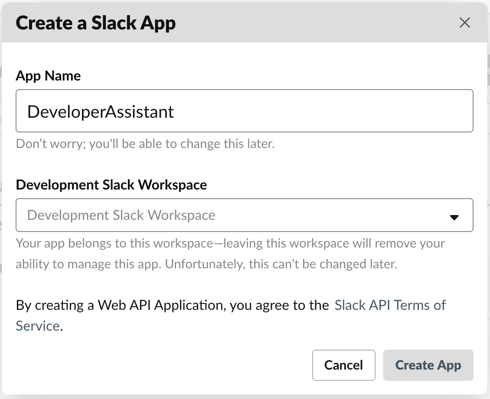

通过 Slack API 网站创建一个新的 Slack 应用

创建 Slack 应用程序后，我们可以配置 Slack Bot。

## 配置 Slack Bot

Slack Bot 的配置有点棘手。生成器生成了一个包含几个空条目的`.env`文件。您必须用 Slack API 网站上的信息填充这些条目。

`CLIENT_SIGNING_SECRET`和`BOT_TOKEN`是让机器人运行起来最重要的。

您可以从 Slack API 站点获取`CLIENT_SIGNING_SECRET`。它在“设置”选项卡下的“基本信息”中。该站点显示以下屏幕。

您需要将签名密码复制到您的`.env`文件中。

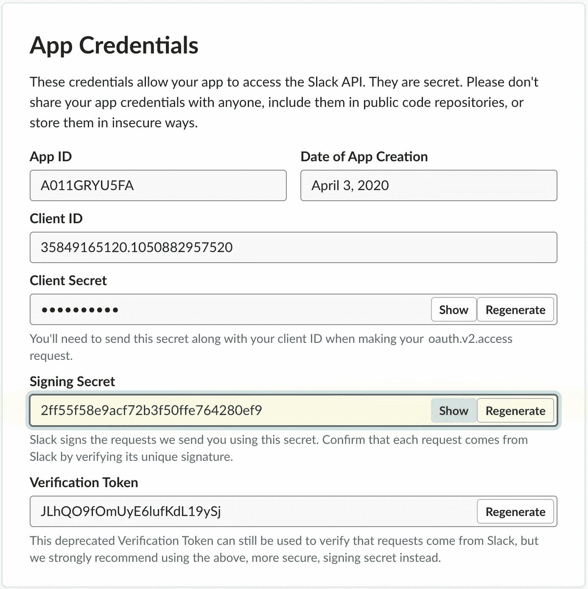

在您可以查看`BOT_TOKEN`之前，您必须添加一个 OAuth 范围。OAuth 范围可以在 **OAuth &权限**选项卡上的**功能**下找到。使用 OAuth 作用域，您可以确定 bot 的功能。

在下面的屏幕中，我给了机器人发送消息的权限。

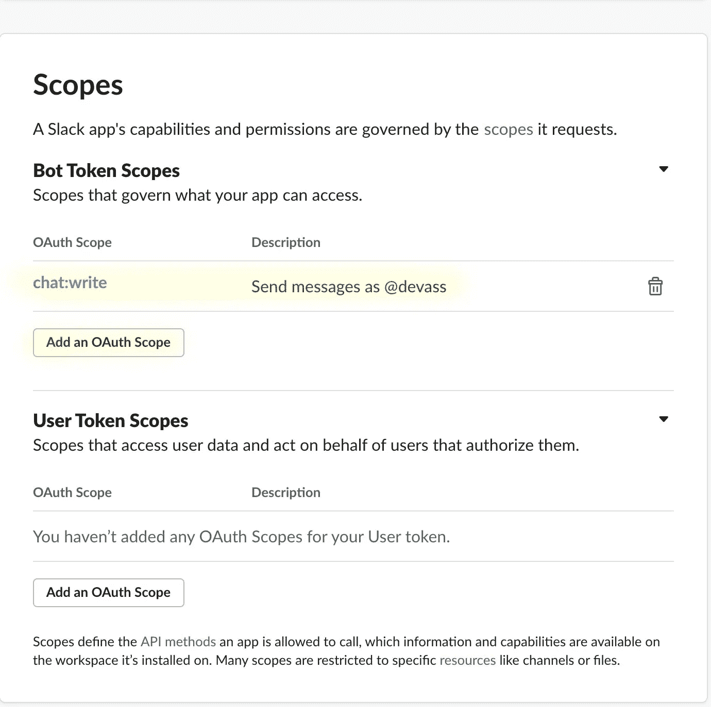

添加 Bot 令牌作用域

如果一切顺利，您现在可以访问 OAuth 令牌中的`BOT_TOKEN`重定向 URL，参见下面的屏幕。复制以 xoxb 开头的 Bot 用户 OAuth 访问令牌字段的值，并将其粘贴到您的`.env`文件中。

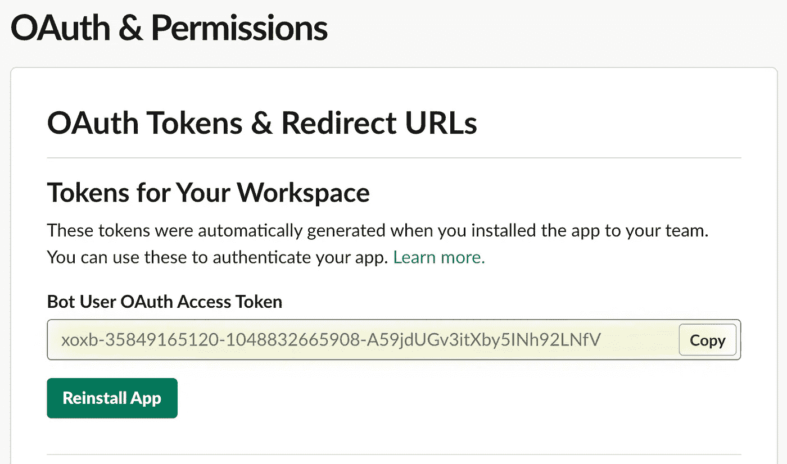

中使用的访问令牌。环境文件

完成所有配置后，我们可以开始运行 Slack Bot 了。

## 在本地运行 Slack Bot

Slack Bot 是一个 Node.js 应用程序，需要在某个地方运行，Slack 应该能够连接到它。在开发过程中，你可以使用 [ngrok](https://ngrok.com/) 来建立一个本地连接。Ngrok 通过安全隧道将您的本地 bot 暴露给公共互联网。

当您启动 Slack bot 时，它将监听端口 3000 上的消息。要通过 ngrok 公开 Slack Bot，我们可以使用以下命令。

`ngrok http 3000`

这将启动 ngrok 并创建一个可以用来访问 Slack Bot 的代理互联网地址。

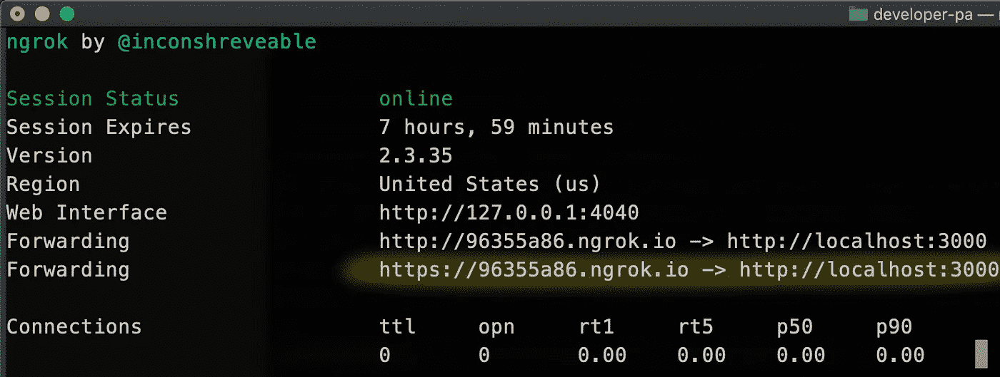

ngrok 正在运行

生成的代理 UR，`[https://96355a86.ngrok.io](https://96355a86.ngrok.io)`应该在 Slack API 网站上配置

在 Slack API 站点上，在 Event Subscriptions 选项卡上设置*请求 URL* 字段。一旦保存了请求 URL，请确保 ngrok 正在运行，因为 Slack 会直接验证它。

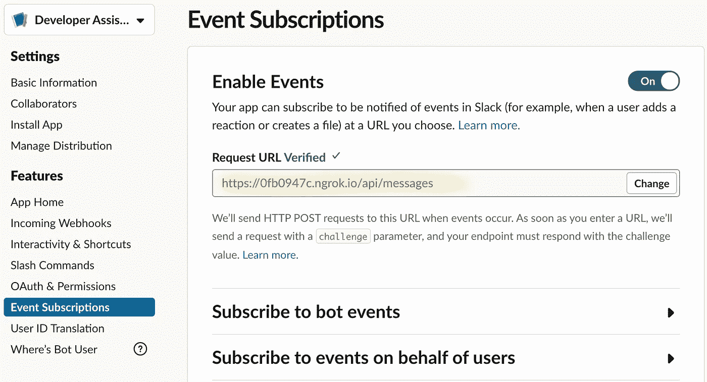

如果一切顺利，你的 Slack 机器人正在运行，你应该能够发送一个直接的消息，机器人将作出回应。

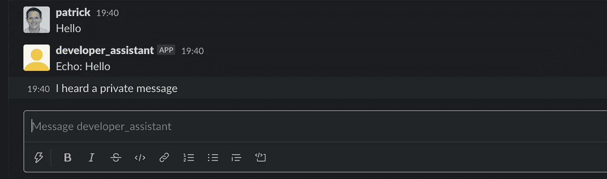

向 Slack Bot 发送第一条消息

需要记住的一点是，当您停止并重新启动 ngrok 时，它会生成一个不同的代理 URL。这意味着您必须在 Slack API 网站上重新配置请求 URL。Nrgok 也有一个商业服务，让你保持一个固定的网址。

# 阅读和回复邮件

您可以在控制器上使用`hears()`方法来指定 bot 在收到消息后应该做什么。

在下面第五行的例子中，我指定了当机器人收到消息`'Which story did you work on today?'`时应该做什么。`hears`的第二个参数指定了它应该对哪种类型的消息做出反应。在这种情况下，`'message,direct_message'`告诉机器人对通道中的任何消息或直接发送给机器人的消息做出反应。

当机器人听到“哪个故事……”时，它会回复正在进行的故事

如果消息匹配，它将执行一个查询来搜索正在进行的故事。当它返回故事时，它用故事中的信息生成一个字符串。我最后用`bot.reply`发送回复信息。

## 正则表达式

控制器上的`hears`方法也接受正则表达式。正则表达式使得匹配输入短语更加灵活。例如，请参见下面使用的正则表达式。

```
controller.hears(new RegExp(/^What story did(.*?)$/i), ‘message,direct_message’, async (bot, message) => {
```

这个控制器对类似于**“你在写什么故事？”**还要问**“你今天在写什么故事？”**。

## 对话

僵尸工具有一个定义对话框或对话的功能。通过创建一个`BotkitConversation`实例并向其添加消息和问题来定义一个对话框。下面是一个对话的例子。

在 Node.js 中定义僵尸工具对话

在第五行，我添加了一个问题，询问用户是否有什么要报告的。根据答案，我使用`convo.gotoThread`跳转到下一条消息。

`addMessage`的第二个参数指定应该在哪个线程上显示消息。因此，如果用户回答“*否”*，它继续线程`has_no_hours`并显示消息*“谢谢”*。

`reportHoursDialog.addMessage(‘Thank you’, ‘has_no_hours’);`

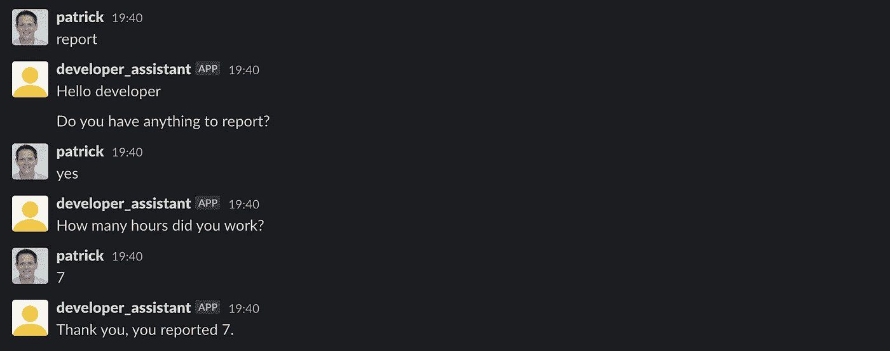

轻松的谈话

您已经看到了用代码定义对话是可能的。还有一种不同的可能性，使用僵尸工具 CMS 以可视化的方式定义对话。

# 使用僵尸工具 CMS 实现对话

Botkit CMS 是一个实现交互式对话系统的可视化工具。它是开源的，可以在您的工作站上本地运行。查看 [Github 库](https://github.com/howdyai/botkit-cms)了解如何安装僵尸工具 CMS 的信息。

使用该工具，您可以定义希望用户与您的机器人进行的交互。在下面的例子中，我创建了一个简单的对话。

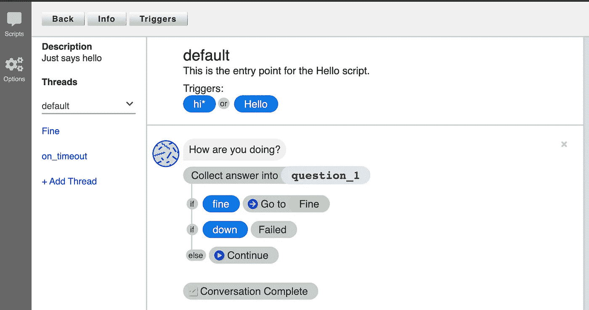

在僵尸工具 CMS 中建立对话模型

对话以一个触发器开始——在这种情况下，当你说“你好”或以“嗨”开头的信息时机器人会问:“你好吗？”。根据你的回答，机器人会有不同的反应。

您可以将 Botkit Node.js bot 连接到 Botkit CMS。这意味着您可以在 bot 运行时添加或更改对话，这对于开发和测试非常理想。

您可以将以下两个变量添加到。env 文件并重新启动您的机器人。Yomen 已经生成了将您的 bot 连接到 Botkit CMS 的源代码。

```
CMS_URI=http://localhost:4000/
CMS_TOKEN=your token
```

为了让你的机器人更加智能，你可以通过添加 LUIS 来添加自然语言机器学习。

# 路易斯(语言理解)

LUIS 是一个机器学习服务，将自然语言构建到你的机器人中。LUIS 与普通僵尸工具或僵尸工具 CMS 的主要区别在于，它使用意图和意图得分。

LUIS 是微软的一项商业服务。你每月可以免费获得 10，000 次查询。以上，每 1000 个问题支付 1.50 美元。每月 10，000 次免费查询对我的助手机器人来说绰绰有余。

你通过创建你想要你的机器人执行 LUIS 站点的所有意图来开始 LUIS。对于我的机器人，我使用一个名为 **ReportWorkHours** 的意图。创建意图后，您必须添加用户可能会就此意图提出的问题。

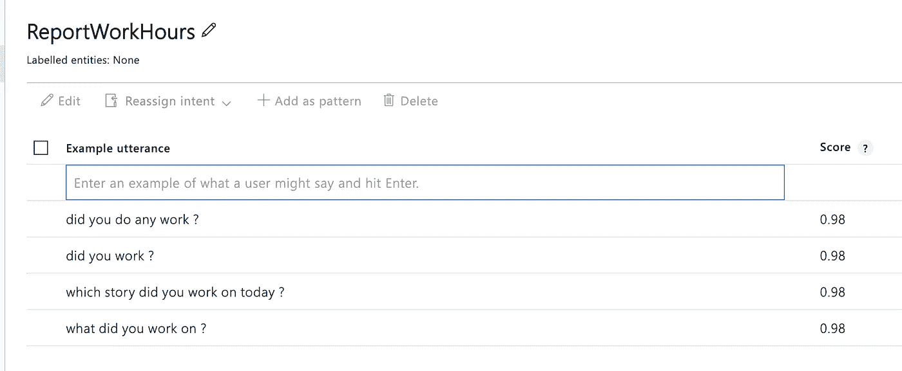

在 LUIS 中为您的意图添加示例

在您定义了可能的问题之后，您必须训练您的模型并发布结果。发布的结果将是一个 LUIS URL。通过向这个 URL 发送一个 HTTP GET，您可以提出您的问题。LUIS 会用几十个被认可的意图来回应。请参见下面的回复示例。

为了将 LUIS 连接到您的机器人，您安装了由 Steven Ickman 创建的用于机器人工具包的 LUIS 中间件。可以用`npm install botkit-middleware-luis`安装。安装后，添加以下代码来配置连接。

```
const luis = require(‘botkit-middleware-luis’);
const luisOptions = { serviceUri: process.env.LUIS_SERVICE_URI };controller.middleware.receive.use(luis.middleware.receive(luisOptions));
```

在您的`.env`文件中，您必须定义`LUIS_SERVICE_URI`并将其设置为您的 LUIS URL，该 URL 可以在您的 LUIS 仪表板中找到。

从那时起，机器人收到的每条信息都会发送给路易斯。识别的意图和分数将添加到您在控制器上的`hears`中收到的消息中。

在僵尸工具控制器中使用 LUIS 中间件

我使用正则表达式**，而不是监听特定的请求。*** 在一号线上。结果是我在控制器中接收所有消息。

在第五行，我使用了`message.topIntent`，它是由 LUIS 用公认的意图填充的。我检查这是否是 ReportWorkHours 的意图。此外，在第七行，我验证分数是否高于 0.7。这决定了它是否是`ReportWorkHours`的意图。如果是这样，我会检索正在进行的任务并对它们做出响应。

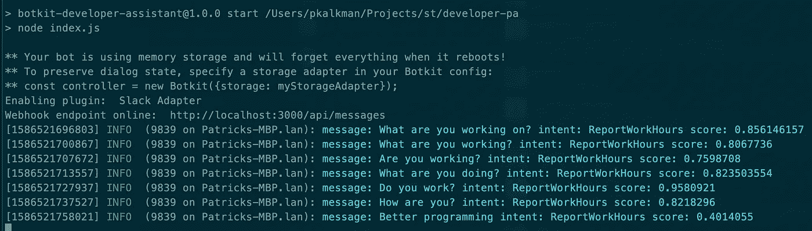

接收的消息和计算的分数

美妙的是，你可以在路易斯的意图中添加它不理解的短语。然后你可以训练和重新发布，而不必改变或重启你的机器人。

# 结论

有了目前可用的所有 bot 工具和框架，创建一个复杂的 bot 变得很容易。考虑如何创建和使用机器人来自动化开发工作流程的一部分。

在本文中，我解释了如何使用 BotKit 实现一个现代 SlackBot。我使用 Botkit CMS 为机器人添加了更复杂的对话框，并最终使用 LUIS 集成了自然语言机器学习。

该源代码可在 [Github](https://github.com/PatrickKalkman/developer-assistant) 上获得

感谢您的阅读。