# 如何在 Node.js 中使用 Facebook Messenger Bot 构建 Spotify 点唱机

> 原文：<https://betterprogramming.pub/how-to-build-a-spotify-jukebox-using-a-facebook-messenger-bot-in-node-js-70c863337331>

## 我是如何为社交活动打造一个派对点唱机的


当我的朋友们觉得可以一起喝几杯时，我经常自愿把我的房子作为聚会场所。天知道为什么——我一定是真的喜欢做回收利用之类的事情。无论如何，不久前我疯狂地将朋友的歌曲请求输入 Spotify，我有一个想法，要建立某种前端应用程序来自动化这个过程，让我不用整晚充当 DJ。

我开始思考哪些平台适合做这件事——用 Angular 编写的某种单页 web 应用程序？或者甚至是原生的 iOS/Android 应用程序。我担心对于那些只想把一首歌放入队列的人来说，一个应用程序会有多方便，所以我选择了一个几乎每个人都已经在手机上安装的平台——Facebook Messenger。

我创建的应用程序接受来自用户的消息，将查询输入 Spotify 的搜索引擎，然后将这些结果返回给用户，并带有接受或检索更多结果的按钮。

这篇文章将带你了解我是如何做到这一点的。附带的源代码可以在这里找到:

[](https://github.com/alexkitch/SpotifyJukebox) [## alexkitch/SpotifyJukebox

### 使用 Facebook Messenger bot 通过 Node.js 创建 Spotify“jukebox”的演示…

github.com](https://github.com/alexkitch/SpotifyJukebox) 

我鼓励你克隆它，跟随文章并注意代码注释，但是我必须强调，由于几个部署方面的考虑，这个*不是*的成品——它是一个概念验证，供你构建。

*这不是* *一本 JavaScript 或 Node 教程——你最好具备使用 npm、编写 JavaScript 代码和使用 Node.js 构建简单 web 服务器的基本知识。*

所以，事不宜迟…

# Node.js 应用程序️

该应用程序由三个 JavaScript 文件组成:

**index.js** 包含 Express web 服务器设置和路由配置。

**spotify.js** 导出一个 spotify 实用程序对象，可用于搜索曲目并将曲目添加到点唱机。这个应用程序的想法是在启动时创建一个自动点唱机播放列表，并将曲目添加到该播放列表中。当主持人点击播放列表上的播放时，Spotify 会自动将任何新曲目添加到播放队列中。这本质上是 Spotify 不发布 API 来修改播放队列本身这一事实的一个变通办法。

**messenger.js** 导出一个 messenger 实用程序对象，该对象封装了创建精美的列表模板、按钮、排序搜索结果以及在点击按钮时解读用户意图。

为了让这个例子尽可能简单明了，我没有在源代码中包含单元测试。我建议在构建真实世界的部署应用程序时，总是编写单元测试。

# Variables️环境部

这个应用程序附带了一组包含在`*.*env` 中的占位符环境变量，我将简要解释如何获得这些变量。

如果你使用 GitHub 这样的源代码控制库来管理你的项目，确保你的`.env`文件是*而不是*提交的，因为这些变量是高度敏感的信息，应该保密。

# 调试安全回调

为了让 Messenger 能够在您调试和测试应用程序时向其发送消息，您需要有一个可以访问该应用程序的安全 URL。

为了实现这一点，我使用了一个名为`ngrok` *的强大免费工具。*从[https://ngrok.com/](https://ngrok.com/)下载并安装/解压该工具

启动命令 shell，用下面的命令启动`ngrok`:

```
ngrok http 3000
```

*(如果你是 Windows 用户，你需要先浏览到你解压* `ngrok` *可执行文件的地方。我将* `ngrok` *解压到我的 Windows 目录中以避免这种情况)。*

使用这个命令，您将创建一个到本地机器端口 3000 的 HTTP 隧道。我在这里相当随意地选择了端口 3000——只要在`index.js` 中更新端口号(或者更好的是，在`.env` 文件中指定它)，您就可以自由使用您喜欢的任何端口。

如果一切顺利，`ngrok` 将初始化并显示您的安全网址:

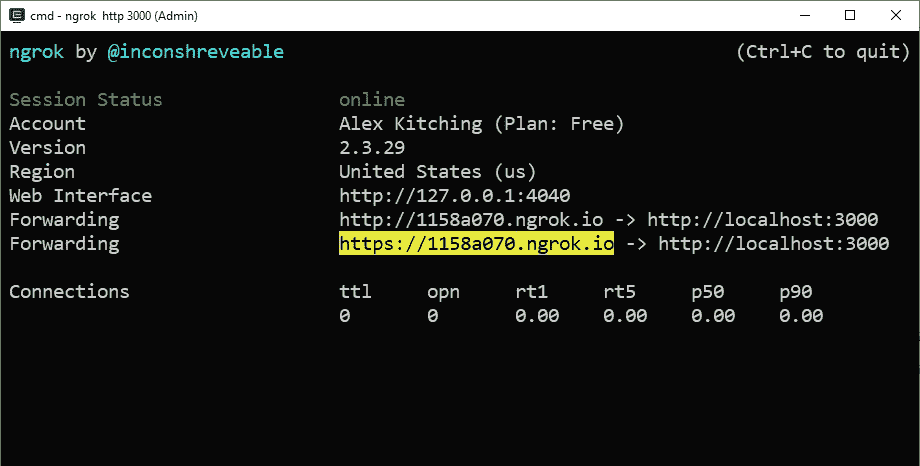

记下这个 URL —您将在下面的部分中用到它。

# 创建信使机器人

让这个应用程序工作的第一步是在脸书网站上创建一个机器人。这包括创建一个“应用”和一个支持“页面”——老实说，我觉得这个过程过于繁琐，但相对来说没有痛苦，也不会花太长时间。

登录 https://developers.facebook.com/的脸书，前往脸书开发者门户网站。如果你之前没有注册成为脸书的开发者，你可能会被要求先提供一些初始细节——如果是这种情况，请遵循脸书的指导。

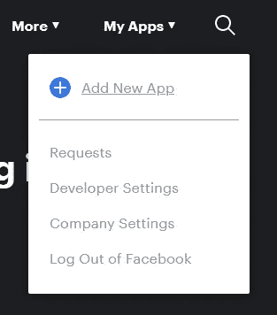

当您访问脸书开发者门户时，在页面左上角下拉“我的应用”菜单，选择**添加新应用**即可开始。

填写所需的详细信息，并在满意后点击**创建应用 ID** 。

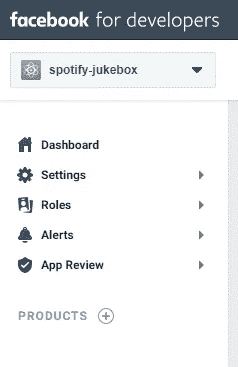

当你的应用程序已经创建，你应该登陆到它的仪表板。

要为应用程序添加 Messenger 功能，请单击左侧菜单上**产品**旁边的 **+** 按钮。在接下来的页面中，选择标题为“Messenger”的卡上的**设置**。

下面的 Messenger 设置页面上有几个部分。我们感兴趣的第一部分名为**访问令牌**:

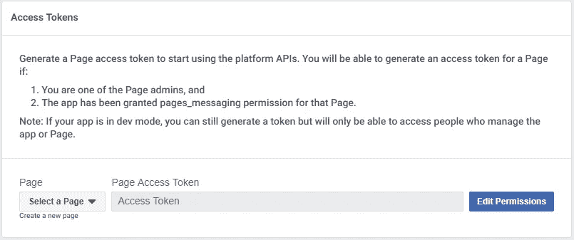

为了能够在 Messenger 上找到你的机器人，你需要为它创建一个脸书“页面”——这将作为机器人的身份。点击**创建新页面**(页面下拉菜单下的小链接)开始这个过程。

在接下来的向导页面中，您将被要求提供一些关于该机器人预期用途的基本信息，例如它是用于企业还是公众人物。为了写这篇文章，我选择了公众人物，但选择权真的在你。

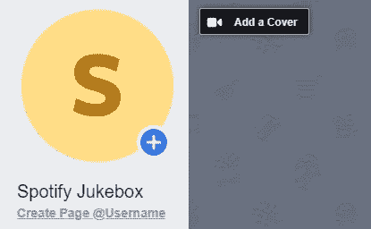

当您创建完页面后，我建议您选择一个合适的@Username，以便更容易被发现。如果你想给你的机器人一些个性，你可以选择添加一个显示图片和封面，但这完全是可选的。

回到访问令牌设置区域，刷新页面。现在，您应该能够从下拉列表中选择您的新页面，并将其与您的 bot 相关联:

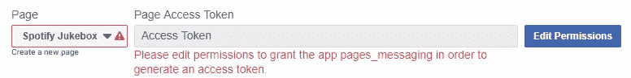

您可以看到，脸书希望获得此应用程序的权限，以链接到您的页面。点击**编辑权限**，完成向脸书授予权限的过程——这应该非常简单。完成后，页面访问令牌字段将被填充一个有效的令牌—将这个令牌复制到`.env`中的`**MESSENGER_ACCESS_TOKEN**` 变量中。我们向 Messenger api 发出的每个请求都会发送这个令牌。

我们感兴趣的下一部分叫做**网页挂钩:**

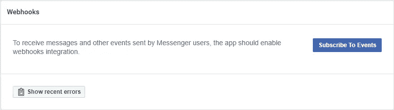

点击**订阅事件**配置 Messenger 如何联系您的 Node.js 应用程序:

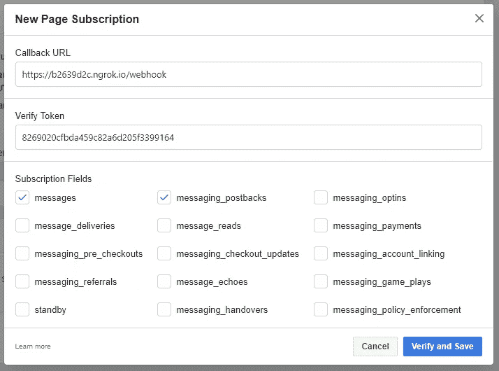

首先勾选**消息**和**messaging _ postback**来订阅 Messenger 的消息通知——非常重要！😉

**回调 URL** 定义了您的应用程序所在的安全主机名和您打算响应消息的端点。这应该设置为由`ngrok`提供给你的 URL，加上/webhook 端点。

**验证令牌**是一个任意值，脸书用它来确认回调 URL 上的应用程序确实是您的。它可以是任何东西——在这个例子中，我选择使用一个随机的 GUID。无论您选择什么，将这个值复制到`.env`中的`**MESSENGER_VERIFY_TOKEN**`变量中。当您单击**验证并保存**时，Messenger 将尝试将此验证令牌与“挑战”令牌一起发送到您指定的端点。端点只需要验证验证令牌，并在响应正文中返回一个状态 200 (OK)和质询令牌。你可以在 *index.js* 中的 **Webhook** GET 路径中看到这段代码。

运行您的应用程序，确认服务器准备就绪，并在您刚刚完成配置的订阅页面上点击**验证并保存**。

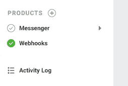

如果一切正常，对话框应该会关闭，一个绿色的勾号 **Webhooks** 会出现在页面的左侧，同时控制台窗口中会显示一条消息:

```
Server available on port 3000
Responded to Facebook verification request
```

如果您对此有问题，请确保您的安全 HTTP 隧道正在运行，并且 URL 和端点是正确的。此外，确保您的防火墙配置正确，允许 HTTP 访问。

最后，Messenger 设置页面的 Webhooks 部分现在应该提供为我们的 webhook 订阅页面事件的功能:

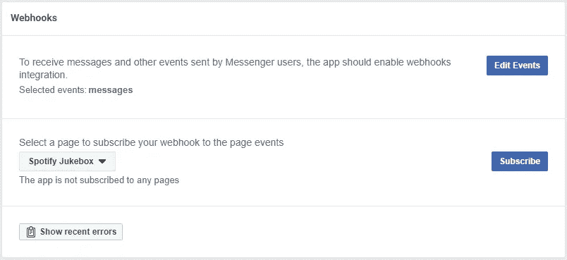

点击**‘订阅’**完成此过程。

# Spotify

为了将 Spotify 与应用程序挂钩，你需要在 Spotify 的开发者门户上创建一个“应用程序”。这将提供访问 Spotify 服务所需的凭证。

前往[https://developer.spotify.com/](https://developer.spotify.com/)并前往**仪表板**部分。如果系统提示您登录，请使用您的 Spotify 凭据登录。

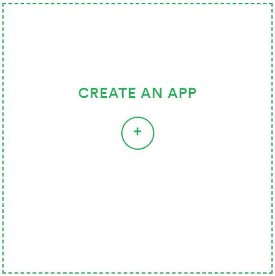

按照仪表盘上的指导创建应用程序——在接受 Spotify 的条款和条件之前，您将被要求提供一些基本信息，如名称、描述和应用程序的预期用途。

完成此过程后，您将进入新应用的仪表盘。本页有一些重要信息需要注意:

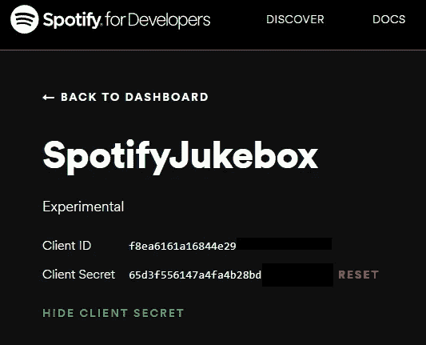

客户端 ID 和客户端机密(出于隐私原因，此处部分隐藏)

**客户端 ID** 和**客户端机密**都将用于向 Spotify 进行认证，并获得访问/刷新令牌——这些令牌应分别作为`**SPOTIFY_CLIENT_ID**`和`**SPOTIFY_CLIENT_SECRET**` 存储在 `.env`文件中。

Spotify 所需的最后一项设置是提供一个回调 URL。当应用程序完成登录 Spotify 的过程时，一个授权码将被发送到这个端点，我们需要这个授权码来获取访问/刷新令牌。您可以通过点击页面右上角的**编辑设置**来指定该端点:

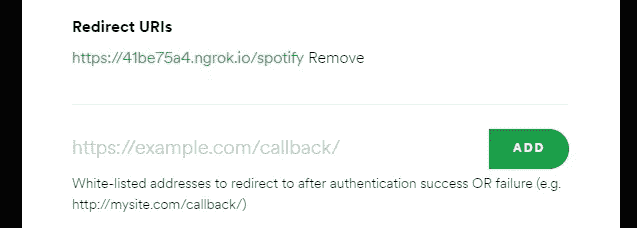

如您所见，我已经提供了来自`ngrok` 的安全 URL，并将 `/spotify`作为我的端点。另外，将此应用于`*.*env` *中的`**SPOTIFY_CALLBACK**` 变量。不要忘记点击页面底部的**保存**,否则什么都不会改变——这让我不知如何是好……*

在`*.*env`中设置的最后一个变量是`**SPOTIFY_USER_ID**`。这只是你的标准 Spotify 用户名。你可以通过访问 Spotify 网站并进入账户概述页面来找到它。

# 准备好了吗

就是这样！希望您已经获得并保存了应用程序运行所需的所有信息。通过运行`**npm start**`启动它，您会注意到控制台上打印了一个 URL:

```
Authorization required. Please visit https://accounts.spotify.com/authorize?client_id=f8ea6161a16844addfa&response_type=code&redirect_uri=https://41be75a4.ngrok.io/spotify&scope=playlist-read-private%20playlist-modify%20playlist-modify-private&state=default-state
```

按照此网址将应用程序登录到您的 Spotify 帐户。授权完成后，控制台中将出现一条后续消息:

```
Spotify is ready!
```

您还会注意到，您的 Spotify 帐户现在有了一个新的播放列表，其名称与环境变量`**SPOTIFY_PLAYLIST_NAME**`相匹配。这是自动点唱机将添加其曲目的播放列表。

剩下要做的就是在 Messenger 上找到你的机器人(或者用你之前选择的用户名访问[http://m.me/](http://m.me/SpotifyJukebox)用户名)，然后玩一玩😊

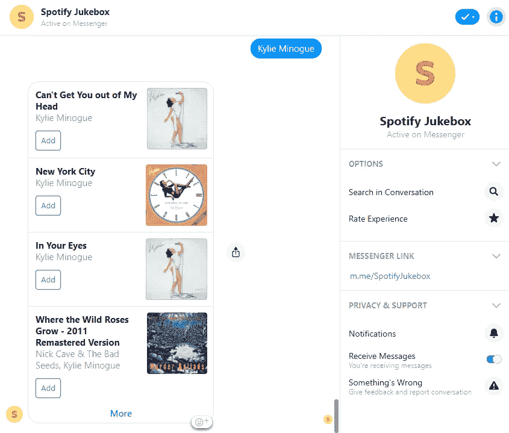

为了让你的 Messenger 机器人响应除你之外的其他人，你需要通过脸书的应用批准流程，你可以在你的应用的仪表板上找到链接。根据我自己的经验，这个过程只需要几个小时，而且似乎只需要一个审批团队向你的机器人发送一些消息，以确保它确实做了你所说的事情。

# 改进的余地

这个应用程序是这个想法如何工作的一个相当直接的例子，为了避免使本教程过于复杂，我故意把它保持得相当简单。当然，您可能会考虑实施一些改进:

**存储访问/刷新令牌**，无需在每次应用启动时点击认证链接。

**开始播放**如果曲目被添加到自动点唱机播放列表，但当前没有音乐播放。

**版主，**批准/拒绝歌曲请求，防止不守规矩的派对客人向你的点唱机发送垃圾音乐…

**开/关命令**，防止用户向点唱机添加更多曲目。

**部署** —如果你真的想定期运行这个应用程序，那么你肯定会考虑将它部署到一个虚拟主机提供商那里，并用更永久的东西来替换我们从 ngrok 获得的临时回调 URL。我已经成功地将这个应用程序的一个版本部署到 AWS ElasticBeanstalk 上，我想它也可以被重构以与 AWS Lambda 一起工作。然而，这超出了本教程的范围。

感谢阅读！我希望这篇教程对你有用，并能激发你去做一些很酷的东西。