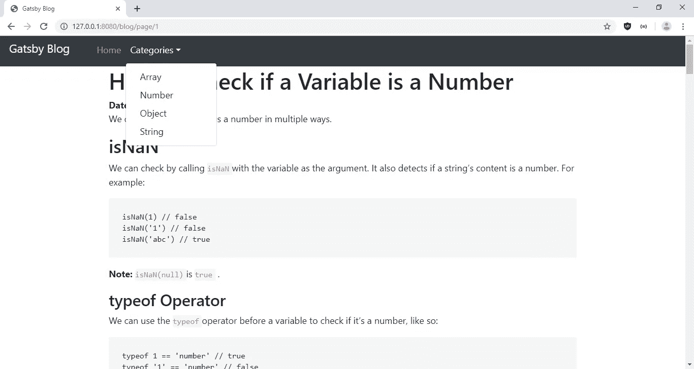
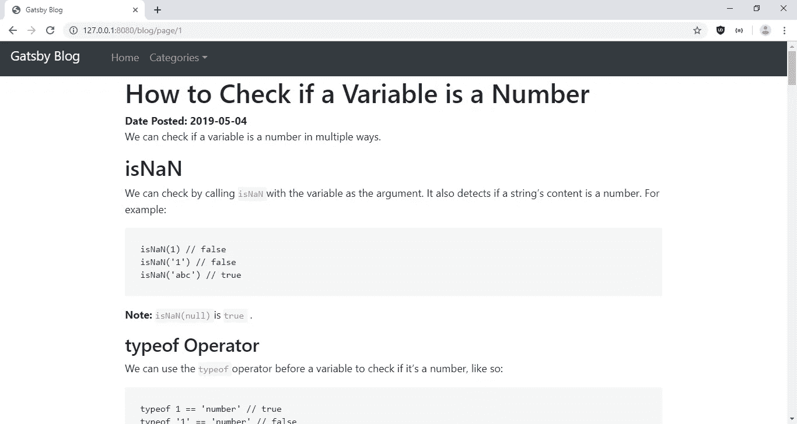
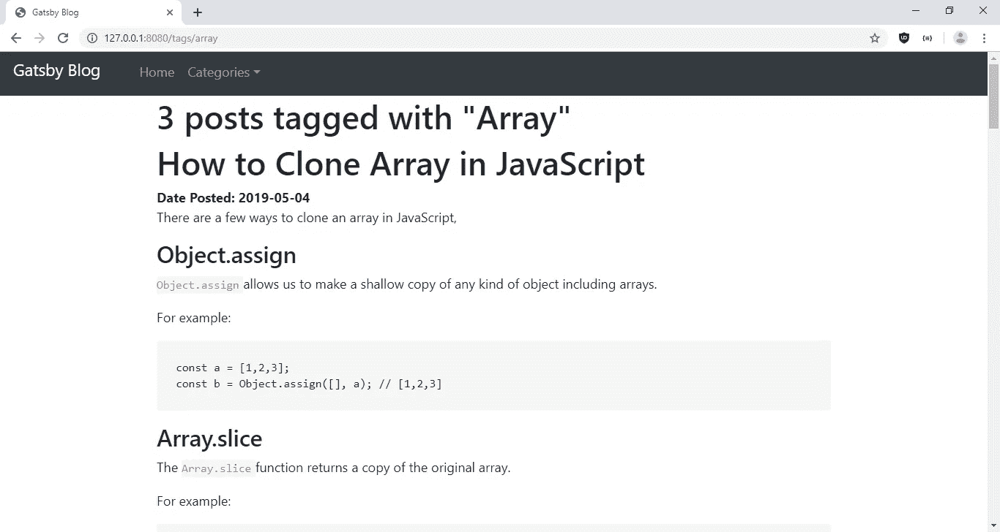

# 如何用 Gatsby.js 构建静态站点

> 原文：<https://betterprogramming.pub/how-to-build-a-static-site-with-gatsby-js-fefa39810b25>

## 使用 Gatsby 为博客文章创建一个带有分页的博客


[NeONBRAND](https://unsplash.com/@neonbrand?utm_source=unsplash&utm_medium=referral&utm_content=creditCopyText) 在 [Unsplash](https://unsplash.com/search/photos/blog?utm_source=unsplash&utm_medium=referral&utm_content=creditCopyText) 上的照片

如果你想建立一个静态网站或博客，并且你知道网络开发，你有很多静态网站生成器的选择。

如果你想用 React 来构建你的静态网站， [Gatsby](https://www.gatsbyjs.org/) 可能是一个适合你需求的选择。根据 Gatsby 网站，许多大公司都用它来建立自己的网站。

在这篇文章中，我们将使用 Gatsby 构建一个小博客，为博客文章分页，并提供一个菜单让读者进行分类。一旦读者点击了某个类别的链接，他们就会进入一个页面，上面列出了所有贴有这些类别标签的文章。

Gatsby 可以从文件和网络资源(如 API 端点)中获取内容。内容通过 [GraphQL](https://graphql.org/) 端点获取，您可以通过模板向其发送消息，以您想要的方式显示数据。

您还可以构建显示不变内容的静态页面文件。您编写代码来获取内容，并用模板显示它们。

然后，从您编写的代码中构建静态 web 页面。Gatsby 的插件将提供您想要的功能。

建立一个静态网站或博客需要经过几道关卡。此外，您不能在 Gatsby 中使用大多数第三方 React 组件，因为它们是动态的。

此外，命令行实用程序在 Windows 上存在区分大小写的路径问题，导致`RelayParser: Encountered duplicate definitions for one or more documents`在项目文件夹的不同部分中出现重复的不区分大小写的文件路径。

因此，Linux 或 Mac OS 可能是使用 Gatsby CLI 的最佳选择。此外，必须在一个文件中进行多个页面查询，并且将它们通过管道传输到同一个文件中的模板。

项目中的`gatsby-node.js`是查询内容的地方。

现在我们知道了注意事项，我们可以开始建立我们的网站了。我们将建立一个有一些博客条目的博客。博客的布局是顶部的标题和页面其余部分的内容。

我们将有一个模板来显示所有的博客条目，每个页面有五篇文章。此外，我们将有一个类别页面，显示带有给定标签的文章列表。我们将使用[引导](https://getbootstrap.com/)进行造型。

我们首先通过运行`npm install -g gatsby-cli`来安装 Gatsby CLI。安装完成后，我们运行 CLI 程序为网站添加初始代码。我们运行`gatsby new gatsby-blog`来建立一个新站点。

接下来，我们为 Gatsby 安装一些附加包来做一些事情，比如从 markdown 文件中获取内容和显示图像。

通过运行以下命令安装软件包:

```
npm i @mdx-js/mdx @mdx-js/react bootstrap gatsby-image gatsby-paginate gatsby-plugin-manifest gatsby-plugin-mdx gatsby-plugin-offline gatsby-plugin-react-helmet gatsby-plugin-sharp gatsby-remark-images gatsby-source-filesystem gatsby-transformer-remark gatsby-transformer-sharp jquery lodash popper.js react-helmet
```

这个列表中的主要包是用于显示图像的`gatsby-image`，用于获取降价文件并在我们的模板中显示它们的`gatsby-source-filesystem`。

`react-helmet`为我们的博客添加了一个`head`标签，用于包含外部 CSS 和脚本文件。`gatsby-transformer-remark`用于将 markdown 转换成 HTML 文本。`gatsby-transformer-sharp`用于转换各种来源的图像，以显示在我们的网站上。

包安装完成后，我们就可以开始编写代码了。在`components`文件夹中，我们首先处理`header.js`。

在那里，我们放上:

```
import { Link } from "gatsby"
import PropTypes from "prop-types"
import React from "react"
import { StaticQuery, graphql } from "gatsby"
import _ from "lodash"
import "./header.css"const Header = ({ siteTitle }) => (
  <nav className="navbar navbar-expand-md bg-dark navbar-dark">
    <a className="navbar-brand" href="#">
      {siteTitle}
    </a> <button
      className="navbar-toggler"
      type="button"
      data-toggle="collapse"
      data-target="#collapsibleNavbar"
    >
      <span className="navbar-toggler-icon"></span>
    </button>
    <div className="collapse navbar-collapse" id="collapsibleNavbar">
      <ul className="navbar-nav">
        <li className="nav-item">
          <Link to="blog/page/1" className="nav-link">
            Home
          </Link>
        </li>
        <li className="nav-item dropdown">
          <a
            className="nav-link dropdown-toggle"
            href="#"
            id="navbarDropdown"
            role="button"
            data-toggle="dropdown"
            aria-haspopup="true"
            aria-expanded="false"
          >
            Categories
          </a>
          <div className="dropdown-menu" aria-labelledby="navbarDropdown">
            <StaticQuery
              query={graphql`
                query CategoryQuery {
                  allMarkdownRemark(limit: 2000) {
                    group(field: frontmatter___tags) {
                      fieldValue
                    }
                  }
                }
              `}
              render={data => {
                return data.allMarkdownRemark.group.map(g => {
                  return (
                    <Link
                      to={`tags/${g.fieldValue}`}
                      className="dropdown-item"
                    >
                      {_.capitalize(g.fieldValue)}
                    </Link>
                  )
                })
              }}
            />
          </div>
        </li>
      </ul>
    </div>
  </nav>
)Header.propTypes = {
  siteTitle: PropTypes.string,
}Header.defaultProps = {
  siteTitle: ``,
}export default Header
```

这将引导导航栏添加到我们的应用程序中。我们获取所有帖子的标签，并在导航栏的下拉列表中显示它们。

在`header.css`中，我们把:

```
.navbar-brand {
  font-size: 20px;
  margin-top: -20px;
}nav.navbar {
  padding-bottom: 0px;
  height: 60px;
}
```

更改导航栏的高度以及字体大小和边距。

接下来，我们为博客设计通用布局。我们在`components`文件夹中创建一个名为`layout.js`的文件，如果它还不存在，并添加:

```
/**
 * Layout component that queries for data
 * with Gatsby's useStaticQuery component
 *
 * See: [https://www.gatsbyjs.org/docs/use-static-query/](https://www.gatsbyjs.org/docs/use-static-query/)
 */import React from "react"
import PropTypes from "prop-types"
import { useStaticQuery, graphql } from "gatsby"
import { Helmet } from "react-helmet"
import Header from "./header"
import "./layout.css"const Layout = ({ children }) => {
  const data = useStaticQuery(graphql`
    query SiteTitleQuery {
      site {
        siteMetadata {
          title
        }
      }
    }
  `) return (
    <>
      <Helmet>
        <title>Gatsby Blog</title>
        <script
          src="[https://code.jquery.com/jquery-3.3.1.slim.min.js](https://code.jquery.com/jquery-3.3.1.slim.min.js)"
          integrity="sha384-q8i/X+965DzO0rT7abK41JStQIAqVgRVzpbzo5smXKp4YfRvH+8abtTE1Pi6jizo"
          crossOrigin="anonymous"
        ></script>
        <script
          src="[https://cdnjs.cloudflare.com/ajax/libs/popper.js/1.14.7/umd/popper.min.js](https://cdnjs.cloudflare.com/ajax/libs/popper.js/1.14.7/umd/popper.min.js)"
          integrity="sha384-UO2eT0CpHqdSJQ6hJty5KVphtPhzWj9WO1clHTMGa3JDZwrnQq4sF86dIHNDz0W1"
          crossOrigin="anonymous"
        ></script>
        <script
          src="[https://stackpath.bootstrapcdn.com/bootstrap/4.3.1/js/bootstrap.min.js](https://stackpath.bootstrapcdn.com/bootstrap/4.3.1/js/bootstrap.min.js)"
          integrity="sha384-JjSmVgyd0p3pXB1rRibZUAYoIIy6OrQ6VrjIEaFf/nJGzIxFDsf4x0xIM+B07jRM"
          crossOrigin="anonymous"
        ></script>
        <link
          href="[https://maxcdn.bootstrapcdn.com/bootstrap/4.3.1/css/bootstrap.min.css](https://maxcdn.bootstrapcdn.com/bootstrap/4.3.1/css/bootstrap.min.css)"
          rel="stylesheet"
          integrity="sha384-ggOyR0iXCbMQv3Xipma34MD+dH/1fQ784/j6cY/iJTQUOhcWr7x9JvoRxT2MZw1T"
          crossOrigin="anonymous"
        />
      </Helmet>
      <Header siteTitle={data.site.siteMetadata.title} />
      <div
        style={{
          margin: `0 auto`,
          maxWidth: 960,
          padding: `0px 1.0875rem 1.45rem`,
          paddingTop: 0,
        }}
      >
        <main>{children}</main>
        <footer>
          © {new Date().getFullYear()}, Built with
          {` `}
          <a href="[https://www.gatsbyjs.org](https://www.gatsbyjs.org)">Gatsby</a>
        </footer>
      </div>
    </>
  )
}Layout.propTypes = {
  children: PropTypes.node.isRequired,
}export default Layout
```

在这个文件中，我们为 HTML 页面添加了`head`标签。我们在`Helmet`组件中包含了引导 CSS 和代码文件以及 [jQuery](https://jquery.com/) ，它们将被转换成页面中的`head`标签。

接下来，我们添加我们的内容，在`src`文件夹中创建一个`markdown-pages`文件夹。然后，我们创建一些降价文件。

我们将以下文件添加到`markdown-pages`文件夹中:

```
check-variable-number.md
clone-array.md
concat-array.md
exponentiation.md
get-length-obj.md
repeat-string.md
send-email.md
```

然后，在`check-variable-number.md`中，我们添加:

```
---
path: "/blog/check-variable-number"
date: "2019-05-04"
title: "How to Check if a Variable is a Number"
tags: ["number"]
---We can check if a variable is a number in multiple ways.## isNaNWe can check by calling `isNaN` with the variable as the argument. It also detects if a string’s content is a number. For example:```
isNaN(1) // false
isNaN('1') // false
isNaN('abc') // true
```Note:** `isNaN(null)` is `true` .### typeof OperatorWe can use the `typeof` operator before a variable to check if it’s a number, like so:```
typeof 1 == 'number' // true
typeof '1' == 'number' // false
```)
```

在`clone-array.md`中，我们添加:

```
---
path: "/blog/clone-array"
date: "2019-05-04"
title: "How to Clone Array in JavaScript"
tags: ["array"]
---There are a few ways to clone an array in JavaScript,### Object.assign`Object.assign` allows us to make a shallow copy of any kind of object including arrays.For example:<pre>const a = [1,2,3];
const b = Object.assign([], a); // [1,2,3]</pre>### Array.sliceThe `Array.slice` function returns a copy of the original array.For example:<pre>const a = [1,2,3];
const b = a.slice(0); // [1,2,3]</pre>### Array.fromThe `Array.slice` function returns a copy of the original array. It takes array like objects like `Set` and it also takes an array as an argument.<pre>const a = [1,2,3];
const b = Array.from(a); // [1,2,3]</pre>### Spread OperatorThe fastest way to copy an array, which is available with ES6 or later, is the spread operator.<pre>const a = [1,2,3];
const b = [...a]; // [1,2,3]</pre>### JSON.parse and JSON.stringifyThis allows for deep copy of an array and only works if the objects in the array are plain objects. It can be used like this:<pre>const a = [1,2,3];
const b = JSON.parse(JSON.stringify(a)); // [1,2,3]</pre>
```

接下来，在`concat-array.md`中，我们添加:

```
---
path: "/blog/concat-array"
date: "2019-05-04"
title: "How to Concatenate Array in JavaScript"
tags: ["array"]
---There are a few ways to concatenate arrays in JavaScript.## Array.concatWe can all `Array.concat` on an array to combine 2 arrays and return the new one. For example:```
const a = [1,2,3];
const b = [4,5];
const c = a.concat(b) // [1,2,3,4,5]
```## Array.pushWe can push elements of one array into another.```
const a = [1,2,3];
const b = [4,5];
let c = Object.assign([], a);
for (let i = 0; i < b.length; i++){
  c.push(b[i]);
}
console.log(c); // [1,2,3,4,5]
```What we did is make a copy of `a` and assigned it to `c` , then pushed the elements of `b` by looping through it and adding them to the end of `c` .## Spread OperatorWith ES6 or later, we can use the spread operator to spread the items from another array into a new array by doing the following:```
const a = [1,2,3];
const b = [4,5];
const c = [...a, ...b];
console.log(c); // [1,2,3,4,5]
```)
```

在`exponentiation.md`中，我们添加:

```
---
path: "/blog/exponentiation"
date: "2019-05-04"
title: "How to do Exponentiation in JavaScript"
tags: ["number"]
---There are multiple to compute exponents with JavaScript.The newest way is the exponentiation operator `**`, available with ES2016 or higher.For example, we can do this:```
const a = 2 ** 3; // 8
```It is right associative, so `a ** b ** c` is equal to `a ** (b ** c)`. This works with all exponents.For example:```
const a = 2 ** (3 ** 4);
const b = 2 ** 3 ** 4;
a == b // true, both are 2.4178516392292583e+24
```Detail browser compatibility is available at [[https://developer.mozilla.org/en-US/docs/Web/JavaScript/Reference/Operators/Arithmetic_Operators#Browser_compatibility](https://developer.mozilla.org/en-US/docs/Web/JavaScript/Reference/Operators/Arithmetic_Operators#Browser_compatibility)](https://developer.mozilla.org/en-US/docs/Web/JavaScript/Reference/Operators/Arithmetic_Operators#Browser_compatibility](https://developer.mozilla.org/en-US/docs/Web/JavaScript/Reference/Operators/Arithmetic_Operators#Browser_compatibility))We can also use the `Math.pow` function, like this:```
const a = Math.pow(2,3) // 8
```It takes 2 arguments, the first is the base and the second is the exponent. `Math.pow` works with all exponents.`Math.pow` is compatible with all recent browsers.)
```

在`get-length-obj.md`中，我们加上:

```
---
path: "/blog/get-length-obj"
date: "2019-05-04"
title: "How to Get the Length of An Object"
tags: ["object"]
---There are 2 ways to get the length of the list of keys of an object.## Object.keys`Object.keys` gets the top level list of keys of an object and returns an array of them. For example:```
const a = {foo: 1, bar: 2};
const length = Object.keys(a).length // 2
```## Object.getPropertyNames`Object.getPropertyNames` also gets a list of all top level of keys of an object and return them as an array. For example:```
const a = {foo: 1, bar: 2};
const length = Object.`getOwnPropertyNames`(a).length // 2
```## for…in LoopThere is a special loop for looping through the keys of an object. You can do the following:```
const a = {foo: 1, bar: 2};
let keysCount = 0;
for (let key in a) {
    keysCount++;
}
console.log(`keysCount) // 2
```)
```

在`repeat-strings.md`中，我们添加:

```
---
path: "/blog/repeat-strings"
date: "2019-05-04"
title: "How to Repeat Strings with JavaScript"
tags: ["string"]
---There are a few ways to repeat a string in JavaScript. JavaScript strings have a built in `repeat()` function. You can also use a loop to do the same thing.## String.repeat FunctionTo use the `repeat` function, you pass in the number of times you want to repeat the string as an argument. It returns a new stringFor example:
```
const hello = "hello";
const hello5 = A.repeat(5);
console.log(hello5); // "hellohellohellohellohello"
```## Use a loopYou can use `for` loop and `while` loop to do repeatedly concatenate strings.Using a `for` loop, you can do:```
const hello = "hello";
```With a `while` loop, you can do:```
const hello = "hello";
```They both involve increment indexes up to the maximum.)
```

在`send-email.md`中，我们加上:

```
---
path: "/blog/send-email"
date: "2019-05-04"
title: "How to Send Email with SendGrid in Node.js Apps"
tags: ["array"]
---SendGrid is a great service made by Twilio for sending emails. Rather than setting up your own email server for sending email with your apps, we use SendGrid to do the hard work for us. It also decrease the chance of email ending up in spam since it is a known trustworthy service.It also has very easy to use libraries for various platforms for sending emails. Node.js is one of the platforms that are supported.To send emails with SendGrid, install the SendGrid SDK package by running `npm i [@sendgrid/mail](http://twitter.com/sendgrid/mail)` . Then in your code, add `const sgMail = require(‘[@sendgrid/mail](http://twitter.com/sendgrid/mail)’);` to import the installed package.Then in your code, you send email by:```
sgMail.setApiKey(process.env.SENDGRID_API_KEY);
const msg = {
  to: email,
  from: '[email@example.com](mailto:email@example.com)',
  subject: 'Example Email',
  text: `
    Dear user,  Here is your email.`,
  html: `
    <p>Dear user,</p></pre>
        Here is your email.</p>`,
};
sgMail.send(msg);
```where `process.env.SENDGRID_API_KEY` is the SendGrid’s API, which should be stored as an environment variable since it is a secret.Testing is easy since you don’t need to set up a local development email server.Sending email is this simple and easy with SendGrid API. It is also free if you send small amounts of email, which is a great benefit.)
```

在每个文件中，虚线之间是元数据。它们将从 GraphQL 查询中获得，并可以显示在我们的页面上，我们将显示它们。

现在我们已经处理了内容，我们可以处理静态页面了。我们通过添加顶部导航栏来改变默认的 404 页面。

在`404.js`中，我们将现有代码替换为:

```
import React from "react"import Layout from "../components/layout"
import SEO from "../components/seo"
import Header from "../components/header";const NotFoundPage = () => (
  <Layout>
    <SEO title="404: Not found" />
    <h1>NOT FOUND</h1>
    <p>You just hit a route that doesn&#39;t exist... the sadness.</p>
  </Layout>
)export default NotFoundPage
```

组件中的所有东西都将被应用到这个页面，包括导航条和引导样式。

在`index.js`中，我们将现有代码替换为:

```
import React from "react"import Layout from "../components/layout"
import SEO from "../components/seo"
import { useEffect } from "react"
import { navigate } from "gatsby"const IndexPage = () => {
  useEffect(() => {
    navigate("/blog/page/1")
  }, []) return (
    <Layout>
      <SEO title="Home" />
    </Layout>
  )
}export default IndexPage
```

重定向到我们将创建的博客模板。

接下来，我们创建模板。我们在`src`文件夹中创建一个`templates`文件夹来存储我们的模板。

在那里，创建`blog-list-template.js`并添加:

```
import React from "react"
import { graphql, Link } from "gatsby"
import Layout from "../components/layout"
export default class BlogList extends React.Component {
  constructor(props) {
    super(props)
    this.state = { pageNumArray: [1] }
  } componentDidMount() {
    this.setPageArray()
  } componentWillReceiveProps() {
    this.setPageArray()
  } setPageArray() {
    const totalCount = this.props.data.allMarkdownRemark.totalCount
    const postsPerPage = this.props.data.allMarkdownRemark.pageInfo.perPage
    let pageNumArray = Array.from(
      { length: Math.ceil(totalCount / postsPerPage) },
      (v, i) => i + 1
    )
    this.setState({ pageNumArray })
  }render() {
    const posts = this.props.data.allMarkdownRemark.edges
    const pathNames = this.props.location.pathname.split("/")
    const page = pathNames[pathNames.length - 1]
    return (
      <Layout>
        {posts.map(({ node }) => {
          const title = node.frontmatter.title || node.fields.slug
          return (
            <div key={node.fields.slug}>
              <h1>{title}</h1>
              <b>Date Posted: {node.frontmatter.date}</b>
              <div dangerouslySetInnerHTML={{ __html: node.html }} />
            </div>
          )
        })}
        <nav aria-label="Page navigation example">
          <ul className="pagination">
            {this.state.pageNumArray.map(p => (
              <li className={`page-item ${page == p ? "active" : ""}`} key={p}>
                <Link className={`page-link`} to={`blog/page/${p}`}>
                  {p}
                </Link>
              </li>
            ))}
          </ul>
        </nav>
      </Layout>
    )
  }
}
export const blogListQuery = graphql`
  query blogListQuery($skip: Int!, $limit: Int!) {
    allMarkdownRemark(
      sort: { fields: [frontmatter___date], order: DESC }
      limit: $limit
      skip: $skip
    ) {
      edges {
        node {
          fields {
            slug
          }
          frontmatter {
            title
            date
          }
          html
        }
      }
      pageInfo {
        perPage
      }
      totalCount
    }
  }
`
```

在这里，显示提供我们将在`gatsby-node.js`中添加的查询的内容。

`blogListQuery`通过运行查询并返回结果来过滤内容。然后，结果将显示在上面的组件中。

`setPageArray`函数通过获取总页数来获取页码，然后将其设置为组件状态，这样我们就可以链接到该页面，其呈现方式如下:

```
{this.state.pageNumArray.map(p => (
   <li className={`page-item ${page == p ? "active" : ""}`} key={p}>
     <Link className={`page-link`} to={`blog/page/${p}`}>
     {p}
     </Link>
   </li>
))}
```

博客帖子由以下人员呈现:

```
{posts.map(({ node }) => {
  const title = node.frontmatter.title || node.fields.slug
  return (
    <div key={node.fields.slug}>
      <h1>{title}</h1>
      <b>Date Posted: {node.frontmatter.date}</b>
      <div dangerouslySetInnerHTML={{ __html: node.html }} />
      </div>
  )
})}
```

Gatsby 对 HTML 进行了净化，因此我们可以通过直接用`dangerouslySetInnerHTML`设置它来显示它。接下来，我们制作一个模板来显示带有特定标签的帖子。

为此，我们在`templates`文件夹中创建`tags.js`并添加:

```
import React from "react"
import PropTypes from "prop-types"
import Layout from "../components/layout"
import _ from "lodash"
// Components
import { Link, graphql } from "gatsby"const Tags = ({ pageContext, data }) => {
  const { tag } = pageContext
  const { edges, totalCount } = data.allMarkdownRemark
  const tagHeader = `${totalCount} post${
    totalCount === 1 ? "" : "s"
  } tagged with "${_.capitalize(tag)}"` return (
    <Layout>
      <h1>{tagHeader}</h1>
      {edges.map(({ node }) => {
        const { slug } = node.fields
        const { title, date } = node.frontmatter
        return (
          <div key={slug}>
            <h1>{title}</h1>
            <b>Date Posted: {date}</b>
            <div dangerouslySetInnerHTML={{ __html: node.html }} />
          </div>
        )
      })}
    </Layout>
  )
}Tags.propTypes = {
  pageContext: PropTypes.shape({
    tag: PropTypes.string.isRequired,
  }),
  data: PropTypes.shape({
    allMarkdownRemark: PropTypes.shape({
      totalCount: PropTypes.number.isRequired,
      edges: PropTypes.arrayOf(
        PropTypes.shape({
          node: PropTypes.shape({
            frontmatter: PropTypes.shape({
              title: PropTypes.string.isRequired,
            }),
            fields: PropTypes.shape({
              slug: PropTypes.string.isRequired,
            }),
          }),
        }).isRequired
      ),
    }),
  }),
}export default Tagsexport const pageQuery = graphql`
  query($tag: String) {
    allMarkdownRemark(
      limit: 2000
      sort: { fields: [frontmatter___date], order: DESC }
      filter: { frontmatter: { tags: { in: [$tag] } } }
    ) {
      totalCount
      edges {
        node {
          fields {
            slug
          }
          frontmatter {
            title
            date
          }
          html
        }
      }
    }
  }
`
```

其工作原理与`blog-list-template.js`类似。底部的 GraphQL 查询获取用给定标签标记的文章，然后通过运行上面的组件代码显示它们。

我们页面的元数据在每个条目的`frontmatter`对象中。

接下来，在`gatsby-config.js`中，我们将现有代码替换为:

```
module.exports = {
  siteMetadata: {
    title: `Gatsby Blog`,
    description: `Gatsby Blog`,
    author: `[@gatsbyjs](http://twitter.com/gatsbyjs)`,
  },
  plugins: [
    `gatsby-plugin-react-helmet`,
    {
      resolve: `gatsby-source-filesystem`,
      options: {
        name: `images`,
        path: `${__dirname}/src/images`,
      },
    },
    `gatsby-transformer-sharp`,
    `gatsby-plugin-sharp`,
    {
      resolve: `gatsby-plugin-mdx`,
      options: {
        gatsbyRemarkPlugins: [
          {
            resolve: `gatsby-remark-images`,
            options: {
              maxWidth: 1200,
            },
          },
        ],
      },
    },
    {
      resolve: `gatsby-plugin-manifest`,
      options: {
        name: `gatsby-starter-default`,
        short_name: `starter`,
        start_url: `/blog/page/1`,
      },
    },
    // this (optional) plugin enables Progressive Web App + Offline functionality
    // To learn more, visit: [https://gatsby.dev/offline](https://gatsby.dev/offline)
    // `gatsby-plugin-offline`,
    {
      resolve: `gatsby-source-filesystem`,
      options: {
        name: `markdown-pages`,
        path: `${__dirname}/src/markdown-pages`,
      },
    },
    `gatsby-plugin-react-helmet`,
    {
      resolve: `gatsby-transformer-remark`,
      options: {
        plugins: [
          {
            resolve: `gatsby-remark-images`,
            options: {
              // It's important to specify the maxWidth (in pixels) of
              // the content container as this plugin uses this as the
              // base for generating different widths of each image.
              maxWidth: 590,
            },
          },
        ],
      },
    },
  ],
}
```

以便我们安装的所有软件包都能运行。

最后，在`gatsby-node.js`中，我们将现有代码替换为:

```
const _ = require("lodash")
const path = require("path")
const { createFilePath } = require("gatsby-source-filesystem")exports.createPages = async ({ graphql, actions, reporter }) => {
  const { createPage } = actions
  const result = await graphql(
    `
      {
        postRemark: allMarkdownRemark(
          sort: { fields: [frontmatter___date], order: DESC }
          limit: 1000
        ) {
          edges {
            node {
              fields {
                slug
              }
            }
          }
        }
        tagsGroup: allMarkdownRemark(limit: 2000) {
          group(field: frontmatter___tags) {
            fieldValue
          }
        }
      }
    `
  )
  if (result.errors) {
    reporter.panicOnBuild(`Error while running GraphQL query.`)
    return
  }
  // ...
  // Create blog-list pages
  const posts = result.data.postRemark.edges
  const postsPerPage = 5
  const numPages = Math.ceil(posts.length / postsPerPage)
  Array.from({ length: numPages }).forEach((_, i) => {
    createPage({
      path: `/blog/page/${i + 1}`,
      component: path.resolve("./src/templates/blog-list-template.js"),
      context: {
        limit: postsPerPage,
        skip: i * postsPerPage,
        numPages,
        currentPage: i + 1,
      },
    })
  })const tags = result.data.tagsGroup.group
  tags.forEach(tag => {
    createPage({
      path: `/tags/${_.kebabCase(tag.fieldValue)}/`,
      component: path.resolve("./src/templates/tags.js"),
      context: {
        tag: tag.fieldValue,
      },
    })
  })
}
exports.onCreateNode = ({ node, actions, getNode }) => {
  const { createNodeField } = actions
  if (node.internal.type === `MarkdownRemark`) {
    const value = createFilePath({ node, getNode })
    createNodeField({
      name: `slug`,
      node,
      value,
    })
  }
}
```

在上面的文件中，我们有一个获取所有帖子的查询，然后使用下面的`postRemark`查询创建页面来分组显示它们:

```
postRemark: allMarkdownRemark(
  sort: { fields: [frontmatter___date], order: DESC }
    limit: 1000
  ) {
  edges {
    node {
      fields {
        slug
      }
  }
}
```

我们使用以下内容创建页面文件:

```
const posts = result.data.postRemark.edges
  const postsPerPage = 5
  const numPages = Math.ceil(posts.length / postsPerPage)
  Array.from({ length: numPages }).forEach((_, i) => {
    createPage({
      path: `/blog/page/${i + 1}`,
      component: path.resolve("./src/templates/blog-list-template.js"),
      context: {
        limit: postsPerPage,
        skip: i * postsPerPage,
        numPages,
        currentPage: i + 1,
      },
    })
  })
```

它查看返回的结果，并将结果条目通过管道传输到模板，以便在构建时生成页面。

下面的`tagsGroup`查询:

```
tagsGroup: allMarkdownRemark(limit: 2000) {
    group(field: frontmatter___tags) {
      fieldValue
    }
}
```

获取所有的标签，然后将标签传输到`tags.js`模板中，在那里获取页面内容，并在构建期间创建页面，在每个页面上为给定的标签发布内容。

现在我们准备运行`gatsby build`来构建静态网站。文件应该建立在`public`文件夹中。

之后，我们安装一个 HTTP 服务器来服务构建的静态文件。我们将安装`http-server` Node.js 包。运行`npm i -g http-server`。然后，运行`http-server /path/to/gatsby-blog/public`。

完成所有这些后，我们得到:

