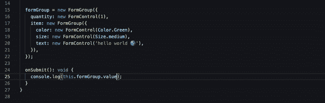
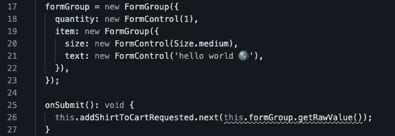
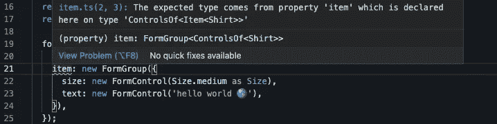

# 如何构建强类型的 Angular 14 超形式

> 原文：<https://betterprogramming.pub/how-to-build-a-strongly-typed-angular-14-super-form-86837965a0e5>

## 通过您的数据模型实施表单控件类型


在角度 14 创造你的第一个超级形态(📷: [Admec](https://www.admecindia.co.in/web-design/why-angular-superheroic-web-framework/)

# 键入的表单

> ["类型化表单](https://angular.io/guide/typed-forms)确保表单控件、组和数组内部的值在整个 API 表面上是类型安全的。这支持更安全的表单，尤其是对于深度嵌套的复杂情况。*——*[*棱角分明的博客*](https://blog.angular.io/angular-v14-is-now-available-391a6db736af)

现在，`FormControls`和`FormGroups`是强类型的:

强类型表单示例

注意上面的例子，我们可以通过`addShirtToCartRequested`直接发出`this.formGroup.getRawValue()`的值，因为返回值的类型与我们的`Item<Shirt>`接口匹配。在 Angular 形式中添加强类型使我们能够更快地编写代码，并且错误更少。

此外，编辑器现在可以为我们的表单的`value`属性提供预输入建议:



带角度 14 表单的提前输入建议

当我们访问不存在的属性或以与其类型定义冲突的方式使用属性时，类型安全的形式值将导致编译器发出错误。

我们上面的例子中缺少了一部分。如果我们想在声明`formGroup`时强制`formGroup`匹配`Item<Shirt>`接口，该怎么办？



哎呀！我们忘记了一个表单控件！

如果我们能够在声明时显式地键入`formGroup`来匹配我们的`Item<Shirt>`接口，那不是很好吗？不要害怕，超级形态在这里！

# 超级表单

超级表单是一个虚构的术语，用来描述与数据模型接口相匹配的[表单组](https://angular.io/guide/typed-forms#formgroup-and-formrecord)接口。多亏了这个来自 [Netanel Basel](https://netbasal.com/typed-reactive-forms-in-angular-no-longer-a-type-dream-bf6982b0af28) 的“附加”片段，在 Angular 14 中输入和输出表单可以通过引入一个漂亮的`ControlsOf`类型来完成:

表单组声明的类型控件

现在，您可以在声明时强制使用`formGroup`的类型，并通过使用`ControlsOf`赋予您的`FormGroup`超能力，如下所示:

超级表单实现

现在，如果您忘记在`formGroup`中包含一个属性，您将在声明时得到一个错误。该错误可能是这样的:



声明时出错

# 堆栈闪电战

下面的嵌入式 Stack Blitz 中提供了一个完整的示例，展示了一个 14°角的超级表单:

堆栈闪电战超级表单示例

如果你想了解更多关于 Angular 14 类型的表单，请查看 Angular 14 发布的[博客文章](https://blog.angular.io/angular-v14-is-now-available-391a6db736af)。祝你好运！

```
**Want to connect?**If you found the information in this tutorial valuable, follow me on [Twitter](https://twitter.com/bobbyg603).
```